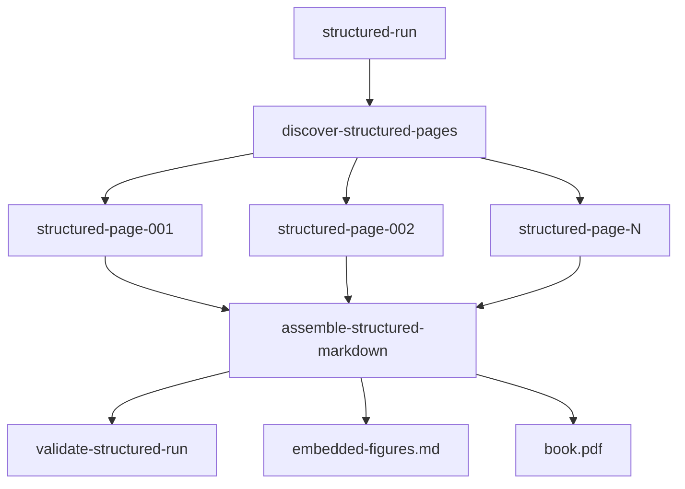

# Book OCR

Book OCR is a workflow-backed OCR application for scanned technical books. It was built around MIT Report 794, *Presentation Based User Interfaces*, and is designed for books that contain prose, tables, diagrams, screenshots, figure captions, and Common Lisp / Lisp Machine Lisp code listings.

The project turns page images into durable review artifacts:

- per-page raw model responses,
- structured page JSON,
- deterministic Markdown,
- validation reports,
- extracted figure crops and sidecars,
- persisted Geppetto/Pinocchio turns,
- workflow engine state,
- assembled full-book Markdown,
- rendered review PDFs.

The current production path is the **structured OCR workflow**. It performs primary OCR with exactly one target page image per model call, asks the model for structured JSON, and lets Go render final Markdown and PDF artifacts deterministically.

## Why this exists

A scanned technical book is not only a sequence of text images. It contains several kinds of information that need different output forms:

| Source content | Desired output |
|---|---|
| Body prose | Wrapped Markdown paragraphs |
| Section headings | Markdown headings |
| Spreadsheet-like figures | Markdown tables when legible |
| Common Lisp listings | Fenced `common-lisp` code blocks |
| Diagrams and screenshots | Figure image links with captions and sidecars |
| Page footers | Tracked metadata, not rendered by default |
| Blank pages | Explicit blank-page marker |

The project originally used freeform Markdown OCR. That path worked well enough to complete a 202-page book, but it exposed a critical page-provenance failure: when neighboring page PNGs were sent as visual context, the model sometimes copied adjacent page content into the target page output. The structured pipeline fixes that by making the primary page OCR call target-page-only.

The core rule is:

```text
Primary production OCR sees exactly one target page image.
Neighboring page images may be used for diagnostics, not for final page text.
```

## Repository layout

```text
cmd/book-ocr/              CLI entry point
internal/ocrpipeline/      Structured OCR contracts, client, renderer, workflow package
internal/ocrvalidation/    Deterministic validation helpers
internal/ocrquality/       Normalization, QA, figure extraction, sidecars, reports
internal/ocrmvp/           Original freeform OCR workflow path
internal/bookprofile/      Book profile, discovery, and profile patch support
internal/vlmseparation/    Diagnostic VLM separation benchmark
pkg/                       Public package placeholder
```

This repository imports the generic workflow runtime from the sibling `scraper` repository:

```text
github.com/go-go-golems/scraper/pkg/workflow
```

The intended boundary is strict:

- `scraper/pkg/workflow` owns durable workflow execution.
- `book-ocr` owns OCR-specific prompts, page processing, validation, and book artifacts.

## Main concepts

### Structured page OCR

The model returns `StructuredPageOCR` JSON instead of final Markdown. The important block types are:

```text
heading
paragraph
list
table
code
figure
footnote
page_footer
blank
```

The renderer converts these blocks into deterministic Markdown. Tables are rendered as Markdown tables. Code blocks are rendered as fenced Common Lisp blocks. Figures become image markers or image links only when they are genuinely visual content rather than already-transcribed tables or code listings.

### Workflow-backed execution

A structured book run is a workflow graph:



Page OCR steps are independent and can run in parallel. Assembly and validation run after page dependencies succeed. The runtime persists step state, retries, results, and artifacts in SQLite.

### Artifacts

A successful page writes:

```text
pages/page_NNN/01-turn-input.yaml
pages/page_NNN/02-turn-final.yaml
pages/page_NNN/03-raw-response.json
pages/page_NNN/04-structured.json
pages/page_NNN/05-rendered.md
pages/page_NNN/06-validation.json
```

A full run writes:

```text
engine.db
turns.db
projections/book_ocr_structured.db
assembled.md
embedded-figures.md
book.pdf
validation-report.json
figures/page_NNN_figure_MM.png
figures/page_NNN_figure_MM.json
figures/page_NNN_figure_MM.debug.png
```

## Installation and setup

Build the CLI:

```bash
go build -o book-ocr ./cmd/book-ocr
```

Or run directly during development:

```bash
go run ./cmd/book-ocr help
```

Run tests:

```bash
go test ./... -count=1
```

Live OCR uses Geppetto and Pinocchio profile resolution. The project has often used a cleaned profile registry to avoid local duplicate-profile issues:

```text
/tmp/book-ocr-hq-001/profiles-clean.yaml
```

PDF rendering requires Pandoc and XeLaTeX:

```bash
pandoc --version
xelatex --version
```

## Quick start: dry-run structured OCR

Dry-run mode uses deterministic fake structured OCR and does not call a model.

```bash
go run ./cmd/book-ocr structured-run \
  --book-id report-794-dry \
  --image-dir /home/manuel/code/wesen/claw-stuff/output/books/presentation-based-uis/pages \
  --start-page 1 \
  --end-page 3 \
  --work-dir /tmp/book-ocr-structured-dry \
  --dry-run \
  --expected-pages 3 \
  --embed-figures \
  --render-pdf \
  --max-workers 2 \
  --log-level warn
```

Outputs:

```text
/tmp/book-ocr-structured-dry/assembled.md
/tmp/book-ocr-structured-dry/embedded-figures.md
/tmp/book-ocr-structured-dry/book.pdf
/tmp/book-ocr-structured-dry/validation-report.json
```

## Live structured OCR

A live run calls the configured model through Geppetto.

```bash
go run ./cmd/book-ocr structured-run \
  --book-id report-794-structured-live \
  --image-dir /home/manuel/code/wesen/claw-stuff/output/books/presentation-based-uis/pages \
  --start-page 1 \
  --end-page 50 \
  --work-dir /tmp/book-ocr-structured-live-50 \
  --profile gpt-5-mini-low \
  --profile-registries /tmp/book-ocr-hq-001/profiles-clean.yaml \
  --dry-run=false \
  --expected-pages 50 \
  --max-workers 4 \
  --embed-figures \
  --render-pdf \
  --min-rendered-bytes 200 \
  --log-level warn
```

Important flags:

| Flag | Purpose |
|---|---|
| `--image-dir` | Directory containing `page_*.png` source images |
| `--start-page`, `--end-page` | Page range to process |
| `--profile` | Pinocchio/Geppetto profile slug for live OCR |
| `--profile-registries` | Registry path(s) for profile resolution |
| `--dry-run=false` | Enable live model calls |
| `--max-workers` | Concurrent workflow workers; page OCR is the main parallel unit |
| `--expected-pages` | Validate assembled page marker count |
| `--embed-figures` | Extract figure crops and write Markdown image links |
| `--render-pdf` | Render the final Markdown to `book.pdf` with Pandoc |
| `--min-rendered-bytes` | Warn on suspiciously short successful pages |

## Full-book Report 794 run

The current full-book review run used this shape:

```bash
book-ocr structured-run \
  --book-id report-794-structured-workflow-full-live-w4-figures \
  --image-dir /home/manuel/code/wesen/claw-stuff/output/books/presentation-based-uis/pages \
  --start-page 1 \
  --end-page 202 \
  --work-dir /tmp/book-ocr-structured-workflow-full-live-w4-figures \
  --profile gpt-5-mini-low \
  --profile-registries /tmp/book-ocr-hq-001/profiles-clean.yaml \
  --dry-run=false \
  --expected-pages 202 \
  --max-workers 4 \
  --embed-figures \
  --render-pdf \
  --min-rendered-bytes 200 \
  --log-level warn
```

Current review artifacts:

```text
/tmp/book-ocr-structured-workflow-full-live-w4-figures/embedded-figures.md
/tmp/book-ocr-structured-workflow-full-live-w4-figures/book.pdf
/tmp/book-ocr-structured-workflow-full-live-w4-figures/validation-report.json
```

Open the PDF for manual review:

```bash
okular /tmp/book-ocr-structured-workflow-full-live-w4-figures/book.pdf
```

## Inspecting and operating runs

Show workflow status:

```bash
book-ocr status \
  --work-dir /tmp/book-ocr-structured-workflow-full-live-w4-figures \
  --run-id book-ocr/structured-499f1718-bfb6-4135-a52f-56d35001d0bd
```

List structured page projection rows:

```bash
book-ocr structured-pages \
  --work-dir /tmp/book-ocr-structured-workflow-full-live-w4-figures \
  --book-id report-794-structured-workflow-full-live-w4-figures \
  --limit 20
```

Retry a failed step:

```bash
book-ocr retry \
  --work-dir /tmp/book-ocr-structured-workflow-full-live-w4-figures \
  --run-id book-ocr/structured-499f1718-bfb6-4135-a52f-56d35001d0bd \
  --step-id structured-page-084
```

Resume workers for an existing run:

```bash
book-ocr resume \
  --work-dir /tmp/book-ocr-structured-workflow-full-live-w4-figures \
  --run-id book-ocr/structured-499f1718-bfb6-4135-a52f-56d35001d0bd \
  --max-workers 2 \
  --log-level warn
```

Cancel a run:

```bash
book-ocr cancel \
  --work-dir DIR \
  --run-id RUN_ID
```

## Targeted page repair

Manual PDF review usually finds localized defects. Do not rerun a full book when only a few source pages need repair. Use `structured-rerun-pages` to reprocess selected page steps, reassemble, validate, and optionally rerender the PDF.

```bash
book-ocr structured-rerun-pages \
  --work-dir /tmp/book-ocr-structured-workflow-full-live-w4-figures \
  --run-id book-ocr/structured-499f1718-bfb6-4135-a52f-56d35001d0bd \
  --pages 132,140,179,181,182 \
  --render-pdf \
  --max-workers 2 \
  --log-level warn
```

The operator resets selected `structured-page-NNN` ops to `ready`, resets downstream assembly/validation to `pending`, marks the workflow running again, and resumes workers. Downstream ops are set to `pending` so they wait for the rerun page dependencies to complete before rebuilding final artifacts.

Use this for:

- pages where code was recognized as prose,
- pages where a table-like figure became an image,
- pages where a screenshot should be transcribed as text,
- pages where prompt changes need to be applied without rerunning the whole book.

## Manual validation workflow

A practical review loop is:

1. Open `book.pdf` in Okular.
2. When a page looks wrong, identify the source page marker if possible.
3. Inspect the corresponding page artifacts:

   ```text
   pages/page_NNN/03-raw-response.json
   pages/page_NNN/04-structured.json
   pages/page_NNN/05-rendered.md
   pages/page_NNN/06-validation.json
   ```

4. Determine the failure layer:

   | If this is wrong | Fix this layer |
   |---|---|
   | `04-structured.json` | Prompt/model/page rerun |
   | `05-rendered.md` | Renderer |
   | `embedded-figures.md` | Figure embedding/post-processing |
   | `book.pdf` only | Pandoc/LaTeX rendering |

5. Rerun selected source pages with `structured-rerun-pages`.
6. Reopen the regenerated PDF.
7. Convert repeated manual findings into validation/audit rules.

## Useful audits

Find table-like images that probably should be rendered as tables:

```bash
rg '^!\[.*(Spreadsheet|spreadsheet|columns A B C|PPSCalc|table|grid)' \
  /tmp/book-ocr-structured-workflow-full-live-w4-figures/embedded-figures.md
```

Find code-like images that probably should be rendered as Common Lisp code:

```bash
rg '^!\[.*(Code|code|Lisp|definition|presentation style|recognition|def)' \
  /tmp/book-ocr-structured-workflow-full-live-w4-figures/embedded-figures.md
```

Find Lisp-looking definitions in final Markdown:

```bash
rg '^\s*\(def|defmethod|defvar|def-template|def-graphics|def-open-close|def-move' \
  /tmp/book-ocr-structured-workflow-full-live-w4-figures/embedded-figures.md
```

Find Common Lisp fences:

```bash
rg '```common-lisp' \
  /tmp/book-ocr-structured-workflow-full-live-w4-figures/embedded-figures.md
```

Extract PDF text for spot checks:

```bash
pdftotext /tmp/book-ocr-structured-workflow-full-live-w4-figures/book.pdf - | rg 'defmethod|def-template|PPSCalc'
```

List images embedded in selected physical PDF pages:

```bash
pdfimages -f 30 -l 31 -list /tmp/book-ocr-structured-workflow-full-live-w4-figures/book.pdf
```

## VLM separation benchmark

The VLM separation benchmark is diagnostic. It tests whether models can separate target page images from context images under different prompt/block layouts. It should not be used to write production page Markdown.

Commands:

```bash
book-ocr vlm-separation benchmark [flags]
book-ocr vlm-separation rescore [flags]
book-ocr vlm-separation report [flags]
```

The benchmark preserves turns and writes replayable analytics. Its results can inform prompt design, but production OCR remains target-page-only.

## Important design rules

1. **Primary OCR uses exactly one target page image.** This prevents neighboring-page context bleed.
2. **The model returns structured JSON, not final Markdown.** Go owns rendering.
3. **Raw responses are preserved before parsing.** Failed parses remain inspectable.
4. **Tables and code should be searchable text when legible.** Do not keep spreadsheet or Common Lisp examples as images unless they are truly unreadable or visual.
5. **Figures are for visual content.** Captions, tables, and code inside figure-like regions should be transcribed when possible.
6. **Manual findings should become validation rules.** Repeated defects should be detectable before the next PDF review pass.
7. **Targeted reruns are preferred over full reruns.** Repair selected pages and rebuild downstream artifacts.

## Development notes

Run all tests:

```bash
go test ./... -count=1
```

Build:

```bash
go build -o /tmp/book-ocr ./cmd/book-ocr
```

The latest full-book work has generated several local runtime artifacts under `/tmp`. These are not intended for Git. The durable code and documentation are committed in the repository and under `ttmp/` ticket workspaces.

## Documentation and reports

Key project docs live under `ttmp/`:

```text
ttmp/2026/05/25/BOOK-OCR-PIPELINE-REDESIGN-001--redesign-book-ocr-pipeline-after-full-book-context-bleed/
ttmp/2026/05/25/BOOK-OCR-STRUCTURED-WORKFLOW-001--promote-structured-ocr-to-workflow-runtime/
```

The structured workflow diary is especially useful for understanding the implementation sequence:

```text
ttmp/2026/05/25/BOOK-OCR-STRUCTURED-WORKFLOW-001--promote-structured-ocr-to-workflow-runtime/reference/01-diary.md
```

A long-form Obsidian report was also written in the parc vault:

```text
/home/manuel/code/wesen/go-go-golems/go-go-parc/Projects/2026/05/26/ARTICLE - Book OCR Project Report - Structured Workflow Runtime and Manual PDF Repair.md
```

## Current limitations

- The targeted rerun operator currently performs direct SQLite state updates. It should eventually become a first-class workflow runtime API.
- Source page markers are HTML comments and do not appear in the PDF. A review PDF mode should render visible source page markers.
- Code-fence auditing is still manual. A future command should report Lisp-looking lines outside `common-lisp` fences.
- Page completeness validation is byte-threshold based and should become page-type-aware.
- Common Lisp OCR fidelity still needs manual review for parentheses, quotes, package prefixes, keyword colons, and `*earmuff*` variable names.

## License

See `LICENSE`.
