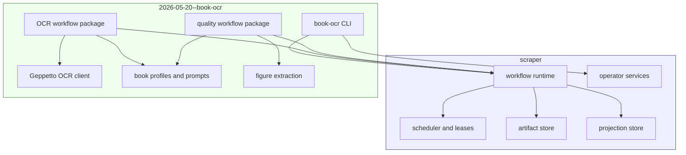

# Extracting OCR Functionality from Scraper Design and Implementation Guide

## Executive Summary

The corrected goal is to move **all OCR and book-OCR functionality** out of `scraper/`, not only Report 794-specific policy. `scraper/` should keep the workflow management and job execution mechanisms: durable workflow runs, step scheduling, queues, leases, retries, artifact storage, projection storage, dependency handling, and operator controls. The sibling repository `2026-05-20--book-ocr/` should own the OCR application: page OCR workflows, Geppetto OCR client code, prompt rendering, quality workers, figure extraction, book profiles, discovery files, patch proposals, experiments, and OCR-specific CLI commands.

The corrected dependency direction is:

```text
2026-05-20--book-ocr imports scraper/pkg/workflow
scraper does not import or contain OCR packages
```

This makes `scraper` a reusable workflow/job runtime and makes Book OCR a workflow application built on top of that runtime.

## Corrected Scope

The previous design separated generic OCR policy from Report 794-specific policy. That was still too narrow. The user clarified that `scraper` should not be a generic OCR framework. It should be a generic workflow/job framework.

The migration target is therefore:

| Repository | Target responsibility |
|---|---|
| `scraper/` | Workflow runtime, job queue, scheduler, durable steps, artifacts, projections, retries, runtime/operator APIs. |
| `2026-05-20--book-ocr/` | All OCR workflow code, OCR clients, prompt rendering, quality checks, normalization, figure extraction, crop sidecars, book profiles, discovery/patch files, experiments, and OCR CLI. |

## What Remains in `scraper`

These APIs and mechanisms should remain:

```text
scraper/pkg/workflow
scraper/pkg/engine/model
scraper/pkg/engine/scheduler
scraper/pkg/engine/store
scraper/pkg/services/engineview
```

The public surface needed by external workflow applications is:

```go
type Runtime struct { ... }
type Config struct { ... }
type Package struct { ... }
type RunBuilder struct { ... }
type StepContext struct { ... }
type Executor interface { ... }

type ArtifactStore interface { ... }
type ProjectionStore interface { ... }

func NewTypedExecutor[I any](kind string, fn func(context.Context, *StepContext, I) error) Executor
func NewPackage(name string) *PackageBuilder
func NewRuntime(ctx context.Context, cfg Config) (*Runtime, error)
```

If external Book OCR code needs an unexported `scraper` internal, promote that capability into `pkg/workflow` instead of keeping OCR in `scraper`.

## What Moves Out of `scraper`

Move these packages and commands into `2026-05-20--book-ocr/`:

| Current location | Target location |
|---|---|
| `scraper/pkg/workflows/ocrmvp` | `2026-05-20--book-ocr/internal/ocr/workflow` |
| `scraper/pkg/workflows/ocrquality` | `2026-05-20--book-ocr/internal/ocr/quality` |
| `scraper/pkg/workflows/bookprofile` | `2026-05-20--book-ocr/internal/bookprofile` |
| `scraper/cmd/ocr-mvp` | `2026-05-20--book-ocr/cmd/book-ocr` |
| `ocrmvp/geppetto_ocr.go` | `2026-05-20--book-ocr/internal/ocr/geppetto/client.go` |
| `ocrmvp/prompt.go` | `2026-05-20--book-ocr/internal/ocr/prompts` plus `books/*/prompts` |
| `ocrquality/figures.go` | `2026-05-20--book-ocr/internal/ocr/figures` |

`scraper` should no longer contain package names like `ocrmvp`, `ocrquality`, or `bookprofile` once the migration is complete.

## Target Repository Layout

```text
2026-05-20--book-ocr/
├── go.mod
├── cmd/
│   └── book-ocr/
│       └── main.go
├── internal/
│   ├── ocr/
│   │   ├── workflow/
│   │   ├── geppetto/
│   │   ├── prompts/
│   │   ├── quality/
│   │   └── figures/
│   └── bookprofile/
└── books/
    └── report-794/
        ├── book.profile.yaml
        ├── book.discovery.yaml
        ├── book.profile.patch.yaml
        ├── prompts/
        ├── qa/
        └── manifests/
```

The `internal/` packages implement the OCR application. The `books/` tree stores book-specific configuration and evidence.

## Runtime Architecture After Extraction



The external application registers workflow packages with the runtime. The runtime schedules and executes steps. The runtime does not know what OCR means.

## Why This Boundary Is Correct

OCR is a workload, not a runtime feature. It needs the runtime because it has page-level fan-out, dependency barriers, artifacts, retries, and operator inspection. But those needs are exactly what a workflow runtime should provide to many applications.

The corrected design teaches a clean separation:

- `scraper` answers execution questions: what is ready, what is leased, what succeeded, what failed, what artifact was stored.
- `book-ocr` answers OCR questions: what page images exist, what prompt should be used, what model should run, what terms are protected, what figures were extracted, what quality checks passed.

## Implementation Phases

### Phase 1: Create `2026-05-20--book-ocr` Go module

Add `go.mod` to the book OCR repository:

```bash
cd /home/manuel/workspaces/2026-05-20/book-ocr/2026-05-20--book-ocr
go mod init github.com/go-go-golems/book-ocr
go mod edit -replace github.com/go-go-golems/scraper=../scraper
```

Create a minimal `cmd/book-ocr` that imports `github.com/go-go-golems/scraper/pkg/workflow`.

### Phase 2: Move OCR page workflow

Move `scraper/pkg/workflows/ocrmvp` to `2026-05-20--book-ocr/internal/ocr/workflow`. Rename the package from `ocrmvp` to `ocrworkflow` or `pageocr`.

Keep behavior unchanged. The goal is compile parity.

### Phase 3: Move Geppetto OCR client

Move `geppetto_ocr.go` and related tests to `internal/ocr/geppetto`. `scraper` should not import Geppetto after this phase.

### Phase 4: Move quality workflow

Move `scraper/pkg/workflows/ocrquality` to `internal/ocr/quality`. This includes QA, normalization, log import, figure extraction, crop sidecars, debug overlays, discovery writing, and quality report assembly.

### Phase 5: Move book profile and discovery code

Move `scraper/pkg/workflows/bookprofile` to `internal/bookprofile`. Profiles and discoveries are OCR-domain policy/state, not runtime concepts.

### Phase 6: Move CLI

Move `scraper/cmd/ocr-mvp` to `2026-05-20--book-ocr/cmd/book-ocr`. The CLI should construct a `workflow.Runtime`, register the external OCR packages, and expose OCR commands.

### Phase 7: Delete OCR packages from `scraper`

Delete:

```text
scraper/pkg/workflows/ocrmvp
scraper/pkg/workflows/ocrquality
scraper/pkg/workflows/bookprofile
scraper/cmd/ocr-mvp
```

Then run full tests in both repositories.

### Phase 8: Stabilize workflow API gaps

If Book OCR needs to import `scraper/pkg/engine/...` directly, pause and expose a proper API through `scraper/pkg/workflow`. External workflow applications should not depend on runtime internals.

## Smoke Test Target

After migration, this should work from the book OCR repo:

```bash
go run ./cmd/book-ocr quality-pass \
  --book-profile ./books/report-794/book.profile.yaml \
  --markdown ./ttmp/2026/05/24/BOOK-OCR-HQ-001--high-quality-book-ocr-experiment-system/experiments/007-quality-v4-mini-pages-001-030/outputs/01-final-quality-v4-mini-pages-001-030.md \
  --output-dir /tmp/book-ocr-external/out \
  --work-dir /tmp/book-ocr-external/work \
  --image-dir /home/manuel/code/wesen/claw-stuff/output/books/presentation-based-uis/pages \
  --embed-figures
```

Expected outputs:

```text
/tmp/book-ocr-external/out/normalized.md
/tmp/book-ocr-external/out/embedded-figures.md
/tmp/book-ocr-external/out/book.discovery.yaml
/tmp/book-ocr-external/out/book.profile.patch.yaml
/tmp/book-ocr-external/out/figures/*.png
/tmp/book-ocr-external/out/figures/*.json
/tmp/book-ocr-external/out/figures/*.debug.png
```

## Intern Checklist

1. Start by making `2026-05-20--book-ocr` compile as a Go module importing `scraper/pkg/workflow`.
2. Move one package at a time; do not redesign behavior while moving.
3. Keep tests with the moved package.
4. Keep old smoke-test artifacts as comparison fixtures.
5. Remove OCR code from `scraper` only after the external command passes smoke tests.
6. If import cycles or internal package access appear, fix the workflow runtime API rather than moving OCR back into `scraper`.

## Current Status

The full OCR extraction has now been implemented at the repository-boundary level. The OCR page workflow, OCR quality workflow, book profile/discovery code, and OCR CLI were copied into `2026-05-20--book-ocr`, tested there, smoke-tested against the Report 794 artifacts, and then removed from `scraper`.

Current boundary:

```text
scraper/                  workflow runtime and job queue mechanisms
2026-05-20--book-ocr/     OCR application, profiles, prompts, QA, figures, experiments
```

Important commits:

```text
54fa0be Set up book OCR Go module
04785a5 Move OCR workflows into book OCR repo
cd01992 Move OCR workflows out of scraper
1fb1cd3 Docs: record OCR workflow extraction
```

Validation performed:

```text
cd 2026-05-20--book-ocr && go test ./... -count=1
cd scraper && go test ./... -count=1
go run ./cmd/book-ocr quality-pass ... --embed-figures
```

The next cleanup step is naming and productization, not extraction. The moved packages still use behavior-preserving names such as `ocrmvp` and workflow package strings such as `ocr-mvp`; those should be renamed in follow-up work once the repository boundary has settled.
