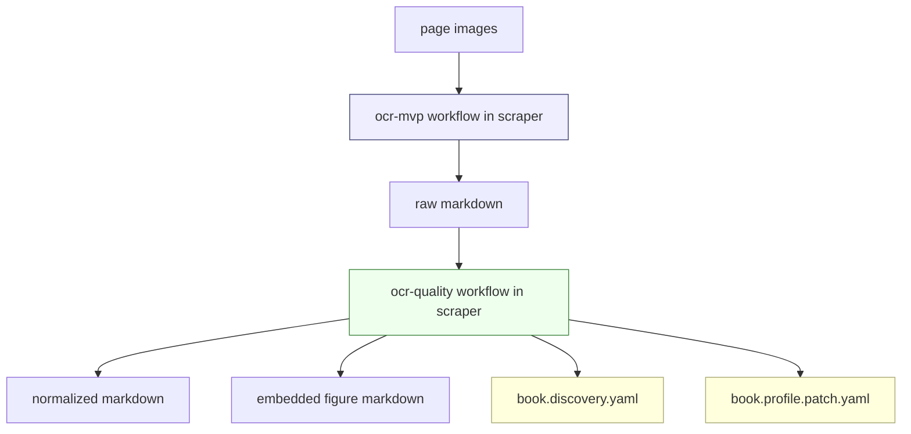
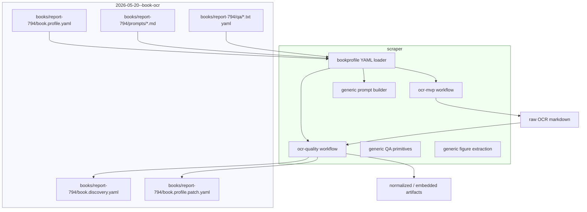

# Externalizing Book OCR Policy from Scraper Design and Implementation Guide

## Executive Summary

The current OCR system has proven that `scraper/` can host a generic workflow runtime, a generic page OCR workflow, and a generic quality-pass workflow. During the Report 794 quality lab, however, book-specific knowledge gradually entered `scraper/`: Report 794 vocabulary, expected strings, list-page ranges, diagram page numbers, prompt versions named after Report 794, and a built-in `Report794()` profile. That was acceptable while building a vertical slice, but it is the wrong long-term boundary.

The next architectural move is to keep `scraper/` as the reusable engine and move **book-specific OCR policy** into the sibling repository:

```text
/home/manuel/workspaces/2026-05-20/book-ocr/2026-05-20--book-ocr
```

The `2026-05-20--book-ocr` repository should own concrete book projects, profiles, prompt packs, QA policies, discovery files, experiment manifests, and final review artifacts. The `scraper/` repository should own generic runtime capabilities: workflow execution, page discovery, OCR execution, artifact storage, quality-pass orchestration, generic QA primitives, generic figure extraction, and generic profile loading.

This guide explains what is currently book-specific, where it should move, what API boundaries are needed, and how an intern should implement the migration safely.

The guiding rule is:

> `scraper/` may define schemas, loaders, generic algorithms, and extension points. It should not contain Report 794 facts.

## Problem Statement

`BOOK-OCR-HQ-001` and `OCR-QUALITY-WORKERS-001` produced excellent first-30-page OCR artifacts for MIT Technical Report 794. The work also produced reusable infrastructure. But because we optimized against one real book, several book-specific decisions became hard-coded in generic Go packages.

Examples include:

- Report 794 title and author in prompt code.
- Report 794 vocabulary: `PSBase`, `PPS`, `PPSCalc`, `Dired`, `Steamer`, `Zmacs`, `Xerox Star`.
- Known OCR mistakes: `DiRed`, `Streamer`, `PPSBase`, `Ciccarrelli`.
- Expected strings from the first 30 pages.
- List pages `[6, 7, 8, 9]`.
- Diagram pages `[13, 15, 17, 21]`.
- Required first-30-page figure captions.
- Built-in `Report794()` profile in `scraper/pkg/workflows/bookprofile/profile.go`.
- Prompt versions `ocr-quality-v4-report794-lexicon` and `ocr-quality-v5-figure-aware` that combine generic prompt improvements with Report 794 vocabulary.

The risk is that `scraper/` becomes a collection of ad hoc book policies. If every new book adds constants and prompt branches to `scraper/`, then the generic runtime becomes harder to test, harder to reuse, and harder to reason about.

The goal is not to delete the Report 794 work. The goal is to move it to the correct repository and make `scraper/` consume it through generic file-based APIs.

## Current Repository Boundary

The workspace has two important repositories:

```text
/home/manuel/workspaces/2026-05-20/book-ocr/scraper
/home/manuel/workspaces/2026-05-20/book-ocr/2026-05-20--book-ocr
```

The desired responsibility split is:

| Repository | Responsibility |
|---|---|
| `scraper/` | Generic workflow runtime, OCR package, quality package, artifact store, projection store, profile/discovery schemas, generic prompt builder, generic segmentation algorithms, CLI/operator plumbing. |
| `2026-05-20--book-ocr/` | Concrete book projects, Report 794 profile, prompt packs, expected strings, known bad terms, page-type maps, experiment manifests, discovery state, profile patch proposals, final OCR artifacts, diaries, analysis reports. |

The dependency direction should be one-way at runtime:

```text
scraper CLI/workflow loads YAML/text policy files from 2026-05-20--book-ocr
```

`2026-05-20--book-ocr` should not need to be imported as a Go module by `scraper`. The simplest and safest boundary is a **file contract**, not a Go package dependency.

## Current Architecture Recap

The current system has two workflow packages:



The generic runtime is good. The current problem is that `scraper` also contains concrete Report 794 facts.

## What Is Already Generic

These parts should stay in `scraper/`:

| Component | File(s) | Why it stays generic |
|---|---|---|
| Workflow runtime facade | `scraper/pkg/workflow/*.go` | Runs arbitrary workflow packages and typed executors. |
| OCR workflow graph | `scraper/pkg/workflows/ocrmvp/package.go` | Discover pages, OCR pages, assemble markdown is generic. |
| OCR client interface | `scraper/pkg/workflows/ocrmvp/types.go` | `OCRClient` abstracts the provider/model. |
| Geppetto OCR client | `scraper/pkg/workflows/ocrmvp/geppetto_ocr.go` | Generic multimodal inference path. |
| Quality workflow graph | `scraper/pkg/workflows/ocrquality/package.go` | QA/normalize/embed/discovery/report graph is generic. |
| Log import | `scraper/pkg/workflows/ocrquality/logimport.go` | Any book run can produce noisy logs. |
| Artifact store | `scraper/pkg/workflow/artifact_store.go` | Stores markdown/images/sidecars generically. |
| Discovery schema | `scraper/pkg/workflows/bookprofile/discovery.go` | Schema is generic, contents are book-specific. |
| Profile schema/loader | `scraper/pkg/workflows/bookprofile/profile.go` | Types and YAML loader are generic. |
| Figure crop algorithm | `scraper/pkg/workflows/ocrquality/figures.go` | Algorithm is generic, but configuration/expectations should be external. |

The generic code should be parameterized by policy, not rewritten per book.

## What Must Move Out of `scraper/`

### Built-in Report 794 profile

Current file:

```text
scraper/pkg/workflows/bookprofile/profile.go
```

Current function:

```go
func Report794() Profile
```

This function contains the largest cluster of book-specific policy. It should move to a YAML profile in `2026-05-20--book-ocr`.

Target path:

```text
2026-05-20--book-ocr/books/report-794/book.profile.yaml
```

`bookprofile.Profile` stays in `scraper`; `Report794()` data moves out.

### Report 794-specific prompt versions

Current file:

```text
scraper/pkg/workflows/ocrmvp/prompt.go
```

Current prompt versions:

```text
ocr-quality-v4-report794-lexicon
ocr-quality-v5-figure-aware
```

There are two kinds of content mixed together:

1. Generic prompt policy improvements:
   - page-type rules;
   - list-page diplomatic transcription;
   - context policy;
   - full-page figure marker contract.
2. Report 794 vocabulary and observed errors:
   - `PSBase`, `PPS`, `Dired`, `Steamer`, etc.

The generic policy should stay in `scraper` as a prompt template or builder. The Report 794 vocabulary should move to:

```text
2026-05-20--book-ocr/books/report-794/prompts/ocr-page.md
2026-05-20--book-ocr/books/report-794/book.profile.yaml
```

### QA defaults

Current file:

```text
scraper/pkg/workflows/ocrquality/markdown.go
```

Current functions:

```go
func defaultKnownBadTerms() []string
func defaultExpectedStrings() []string
func defaultListPages() []int
```

These functions are Report 794-specific. They should not exist as generic defaults. Instead:

- `scraper` should use empty generic defaults or family-level defaults.
- `quality-pass --book-profile books/report-794/book.profile.yaml` should supply these values.

### Required figure expectations

Current location:

```text
scraper/pkg/workflows/bookprofile/profile.go:Report794().QA.RequiredFigureCaptions
```

Target location:

```text
2026-05-20--book-ocr/books/report-794/book.profile.yaml
```

### Experiment outputs and discoveries

These already belong in the docs/project repository and should remain there:

```text
2026-05-20--book-ocr/ttmp/2026/05/24/.../experiments
```

The new target project layout should include long-lived book data outside tickets too:

```text
2026-05-20--book-ocr/books/report-794/
├── book.profile.yaml
├── book.discovery.yaml
├── book.profile.patch.yaml
├── prompts/
├── qa/
├── figures/
└── README.md
```

Tickets remain for work history; `books/report-794/` becomes the durable project configuration.

## Proposed Target Layout

Create this structure in `2026-05-20--book-ocr`:

```text
books/
└── report-794/
    ├── README.md
    ├── book.profile.yaml
    ├── book.discovery.yaml
    ├── book.profile.patch.yaml
    ├── prompts/
    │   ├── ocr-page.md
    │   ├── ocr-page-figure-aware.md
    │   └── continuity-pass.md
    ├── qa/
    │   ├── expected-strings.txt
    │   ├── known-bad-terms.txt
    │   └── required-figures.yaml
    ├── manifests/
    │   └── first-30-pages.yaml
    └── experiments/
        └── README.md
```

The profile can either inline all policy or reference supporting files. The recommended first implementation is hybrid:

- keep small lists inline;
- use file references when a list or prompt becomes long.

Example:

```yaml
id: report-794
family: technical-report
display_name: "MIT Technical Report 794 - Presentation Based User Interfaces"

prompt:
  base_template: technical-report-v1
  template_path: prompts/ocr-page-figure-aware.md
  figure_marker_contract: true

vocabulary:
  protected_terms:
    - Presentation Based User Interfaces
    - Eugene C. Ciccarelli IV
    - PSBase
    - PPS
    - PPSCalc
    - Dired
    - Steamer
    - Zmacs
    - Xerox Star
  known_bad_terms_path: qa/known-bad-terms.txt

qa:
  expected_pages: 30
  expected_strings_path: qa/expected-strings.txt
  list_pages: [6, 7, 8, 9]
  expected_figure_count: 4
  required_figures_path: qa/required-figures.yaml
```

This requires extending the `Profile` schema to support `*_path` fields. The paths should be resolved relative to the profile file directory.

## Proposed Runtime Boundary

The runtime should be file-driven:

```bash
ocr-mvp run \
  --book-profile /home/manuel/workspaces/2026-05-20/book-ocr/2026-05-20--book-ocr/books/report-794/book.profile.yaml \
  --image-dir /home/manuel/code/wesen/claw-stuff/output/books/presentation-based-uis/pages \
  --start-page 1 \
  --end-page 30 \
  --profile gpt-5-mini-low
```

```bash
ocr-mvp quality-pass \
  --book-profile /home/manuel/workspaces/2026-05-20/book-ocr/2026-05-20--book-ocr/books/report-794/book.profile.yaml \
  --markdown RAW.md \
  --output-dir OUT \
  --image-dir /home/manuel/code/wesen/claw-stuff/output/books/presentation-based-uis/pages \
  --embed-figures
```

`bookprofile.Resolve(bookID, profilePath)` should eventually stop recognizing `report-794` as a built-in. A convenience `--book-profile` path is explicit enough.

## Data Flow After Externalization



The book repository provides policy. `scraper` provides execution.

## Implementation Plan

### Phase 1: Add external Report 794 book folder

Create:

```text
2026-05-20--book-ocr/books/report-794/
```

Add:

```text
book.profile.yaml
prompts/ocr-page-figure-aware.md
qa/known-bad-terms.txt
qa/expected-strings.txt
qa/required-figures.yaml
README.md
```

The first `book.profile.yaml` should be equivalent to the current `Report794()` Go function. Do not change behavior yet.

### Phase 2: Extend profile schema for relative file references

Current `bookprofile.Profile` supports inline values. Add optional path fields:

```go
type PromptPolicy struct {
    BaseTemplate string `yaml:"base_template,omitempty"`
    TemplatePath string `yaml:"template_path,omitempty"`
    FigureMarkerContract bool `yaml:"figure_marker_contract,omitempty"`
}

type VocabularyPolicy struct {
    KnownBadTerms []string `yaml:"known_bad_terms,omitempty"`
    KnownBadTermsPath string `yaml:"known_bad_terms_path,omitempty"`
    ProtectedTerms []string `yaml:"protected_terms,omitempty"`
    ProtectedTermsPath string `yaml:"protected_terms_path,omitempty"`
}

type QAPolicy struct {
    ExpectedStrings []string `yaml:"expected_strings,omitempty"`
    ExpectedStringsPath string `yaml:"expected_strings_path,omitempty"`
    RequiredFigureCaptions []string `yaml:"required_figure_captions,omitempty"`
    RequiredFiguresPath string `yaml:"required_figures_path,omitempty"`
}
```

Add loader expansion:

```go
func Load(path string) (Profile, error) {
    body := readYAML(path)
    profile := unmarshal(body)
    baseDir := filepath.Dir(path)
    expandProfilePaths(&profile, baseDir)
    return profile, nil
}
```

### Phase 3: Remove built-in Report 794 resolution

Change:

```go
func Resolve(bookID, profilePath string) (Profile, bool, error)
```

From:

```go
switch bookID {
case "report-794":
    return Report794(), true, nil
}
```

To:

```go
if profilePath != "" {
    return Load(profilePath)
}
return Profile{}, false, nil
```

For a short transition, tests can keep a fixture helper named `Report794Fixture()` in `_test.go`, but production code should not embed the profile.

### Phase 4: Make prompt rendering profile-driven

The most important cleanup is moving Report 794 prompt content out of `prompt.go`.

Target API:

```go
type PromptRenderInput struct {
    BookID string
    PageNumber int
    PageType bookprofile.PageType
    Profile bookprofile.Profile
    ContextBefore []PageContextImage
    ContextAfter []PageContextImage
}

func RenderPagePromptFromProfile(input PromptRenderInput) string
```

If `profile.Prompt.TemplatePath` is set, the loaded template should be used. The renderer should inject:

- book ID;
- page number;
- protected vocabulary;
- historical spellings;
- known bad terms;
- page-type policy;
- context policy;
- figure marker contract.

Pseudocode:

```go
func RenderPagePromptFromProfile(input PromptRenderInput) string {
    tmpl := input.Profile.Prompt.Template
    data := PromptData{
        BookID: input.BookID,
        PageNumber: fmt.Sprintf("%03d", input.PageNumber),
        Vocabulary: input.Profile.Vocabulary,
        PageType: input.PageType,
        FigureMarkerContract: input.Profile.Prompt.FigureMarkerContract,
        HasContext: len(input.ContextBefore)+len(input.ContextAfter) > 0,
    }
    return executeTemplate(tmpl, data)
}
```

During migration, keep old prompt versions for compatibility, but stop adding new book-specific prompt versions to `scraper`.

### Phase 5: Make quality defaults profile-only

Remove these Report 794 defaults from generic code:

```go
func defaultKnownBadTerms() []string
func defaultExpectedStrings() []string
func defaultListPages() []int
```

Replace with generic empty defaults:

```go
func defaultKnownBadTerms() []string { return nil }
func defaultExpectedStrings() []string { return nil }
func defaultListPages() []int { return nil }
```

Then require `--book-profile` for high-quality book-specific QA. Generic `quality-pass` can still run page-count and duplicate-line checks without a profile.

### Phase 6: Move discovery and patches next to book profile

If the caller passes `--book-profile books/report-794/book.profile.yaml` and does not pass explicit discovery paths, default discovery outputs should go next to the profile, not next to a temp output directory:

```text
books/report-794/book.discovery.yaml
books/report-794/book.profile.patch.yaml
```

But experiment-specific outputs should still be copied into ticket experiment folders for provenance. The stable book folder is the current state; tickets are historical evidence.

### Phase 7: Update docs and examples

Update:

```text
OCR-QUALITY-WORKERS-001 design guide
BOOK-OCR-EXTERNALIZE-001 design guide
Obsidian project report if implementation proceeds
```

Add examples:

```bash
ocr-mvp run --book-profile 2026-05-20--book-ocr/books/report-794/book.profile.yaml ...
ocr-mvp quality-pass --book-profile 2026-05-20--book-ocr/books/report-794/book.profile.yaml ...
```

## Intern Implementation Checklist

### First files to read

```text
scraper/pkg/workflows/bookprofile/profile.go
scraper/pkg/workflows/bookprofile/discovery.go
scraper/pkg/workflows/ocrmvp/prompt.go
scraper/pkg/workflows/ocrquality/markdown.go
scraper/pkg/workflows/ocrquality/package.go
scraper/cmd/ocr-mvp/main.go
```

### First change to make

Create the external book folder and YAML profile. Do not change Go behavior first. The first PR/commit should only add data files and docs.

### Second change to make

Teach `bookprofile.Load()` to expand path references. Add tests with a temporary profile folder:

```text
tmp/book.profile.yaml
tmp/qa/known-bad-terms.txt
tmp/qa/expected-strings.txt
```

Test pseudocode:

```go
func TestLoadProfileExpandsRelativeFiles(t *testing.T) {
    write("book.profile.yaml", `qa: { expected_strings_path: qa/expected.txt }`)
    write("qa/expected.txt", "Chapter One\nChapter Two\n")
    profile := Load("book.profile.yaml")
    assert.Equal([]string{"Chapter One", "Chapter Two"}, profile.QA.ExpectedStrings)
}
```

### Third change to make

Switch the smoke test to use `--book-profile` instead of built-in `report-794`.

Expected command:

```bash
go run ./cmd/ocr-mvp quality-pass \
  --book-profile /home/manuel/workspaces/2026-05-20/book-ocr/2026-05-20--book-ocr/books/report-794/book.profile.yaml \
  --markdown /home/manuel/workspaces/2026-05-20/book-ocr/2026-05-20--book-ocr/ttmp/2026/05/24/BOOK-OCR-HQ-001--high-quality-book-ocr-experiment-system/experiments/007-quality-v4-mini-pages-001-030/outputs/01-final-quality-v4-mini-pages-001-030.md \
  --output-dir /tmp/ocr-quality-external-profile/out \
  --work-dir /tmp/ocr-quality-external-profile/work \
  --image-dir /home/manuel/code/wesen/claw-stuff/output/books/presentation-based-uis/pages \
  --embed-figures
```

Expected outputs:

```text
/tmp/ocr-quality-external-profile/out/embedded-figures.md
/tmp/ocr-quality-external-profile/out/book.discovery.yaml
/tmp/ocr-quality-external-profile/out/book.profile.patch.yaml
```

### Fourth change to make

Remove production built-in `Report794()` resolution. Keep any test helper in `_test.go` if needed.

### Fifth change to make

Move Report 794 prompt text out of Go code. This is the hardest phase and should be done after profile loading is stable.

## API Boundary Summary

### `scraper` accepts profile paths

CLI:

```text
ocr-mvp run --book-profile PATH
ocr-mvp quality-pass --book-profile PATH
```

Go input structs should include:

```go
type RunInput struct {
    BookProfilePath string `json:"book_profile_path,omitempty"`
}
```

### `scraper` writes discovery paths

CLI:

```text
ocr-mvp quality-pass --discovery PATH --profile-patch PATH
```

Default behavior:

- if explicit paths are provided, write there;
- if a profile path is provided, default next to the profile;
- otherwise default into `output-dir`.

### `2026-05-20--book-ocr` owns profile content

Book profile files can be edited, reviewed, committed, and related to tickets through docmgr. They can also be uploaded or bundled with final reports.

## Design Decisions

### Use file contracts instead of Go imports

A YAML/text file boundary keeps `scraper` generic and avoids making the docs/project repository a Go module dependency.

### Keep schemas in `scraper`

The schema types belong in `scraper` because the generic runtime must understand how to load and apply profiles. The data belongs in `2026-05-20--book-ocr`.

### Keep raw discovery separate from stable profiles

Discovery files are machine-updated and may be noisy. Stable profiles should change only after review.

### Do not delete old prompt versions immediately

Keep old prompt versions for reproducibility. Mark Report 794-specific prompt versions as legacy once profile-driven prompts exist.

### Preserve ticket experiment folders

The durable book folder is current configuration. Ticket experiment folders are historical evidence. Both are needed.

## Risks and Mitigations

| Risk | Mitigation |
|---|---|
| External profile path breaks reproducibility | Commit profiles and prompt packs in `2026-05-20--book-ocr`; record exact paths in manifests. |
| Too much logic moves into YAML | Keep algorithms in `scraper`; only move policy/data/templates. |
| Prompt templates become untyped string soup | Use typed prompt data structs and tests that render key profile prompts. |
| Discovery overwrites curated profile data | Never auto-apply patches; require operator review. |
| Generic defaults become too weak | Ship family-level default profiles in `2026-05-20--book-ocr` or as generic non-book-specific templates. |

## Recommended Migration Commits

1. `Docs: plan book OCR policy externalization`
2. `Data: add Report 794 external book profile`
3. `Add profile relative file expansion`
4. `Use external book profile in quality pass smoke tests`
5. `Remove Report 794 built-in profile from scraper`
6. `Add profile-driven OCR prompt rendering`
7. `Move Report 794 prompt pack out of scraper`
8. `Docs: record book OCR externalization diary`

Each commit should be small enough to review independently.

## Open Questions

1. Should `books/report-794/` live at repository root, or under `projects/report-794/`?
2. Should generic family profiles live in `scraper` as examples or in `2026-05-20--book-ocr/books/_templates/`?
3. Should prompt templates use Go `text/template`, a simpler placeholder syntax, or structured prompt builders?
4. Should discovery files default next to `book.profile.yaml` or inside each experiment output directory?
5. Should `ocr-mvp` be renamed once it is clearly not MVP-only?

## References

Current generic code:

```text
/home/manuel/workspaces/2026-05-20/book-ocr/scraper/pkg/workflows/bookprofile/profile.go
/home/manuel/workspaces/2026-05-20/book-ocr/scraper/pkg/workflows/bookprofile/discovery.go
/home/manuel/workspaces/2026-05-20/book-ocr/scraper/pkg/workflows/ocrmvp/prompt.go
/home/manuel/workspaces/2026-05-20/book-ocr/scraper/pkg/workflows/ocrquality/markdown.go
/home/manuel/workspaces/2026-05-20/book-ocr/scraper/pkg/workflows/ocrquality/package.go
/home/manuel/workspaces/2026-05-20/book-ocr/scraper/cmd/ocr-mvp/main.go
```

Current project docs:

```text
/home/manuel/workspaces/2026-05-20/book-ocr/2026-05-20--book-ocr/ttmp/2026/05/24/OCR-QUALITY-WORKERS-001--port-ocr-qa-and-cleanup-scripts-to-go-workflow-workers/design-doc/02-generic-book-ocr-system-analysis-and-implementation-guide.md
/home/manuel/workspaces/2026-05-20/book-ocr/2026-05-20--book-ocr/ttmp/2026/05/24/OCR-QUALITY-WORKERS-001--port-ocr-qa-and-cleanup-scripts-to-go-workflow-workers/reference/01-diary.md
```

Current best Report 794 artifact:

```text
/home/manuel/workspaces/2026-05-20/book-ocr/2026-05-20--book-ocr/ttmp/2026/05/24/OCR-QUALITY-WORKERS-001--port-ocr-qa-and-cleanup-scripts-to-go-workflow-workers/experiments/002-figure-aware-marker-recovery/outputs/02-embedded-figures.md
```
