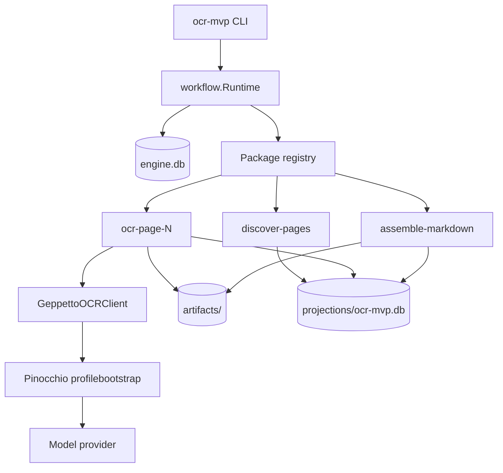
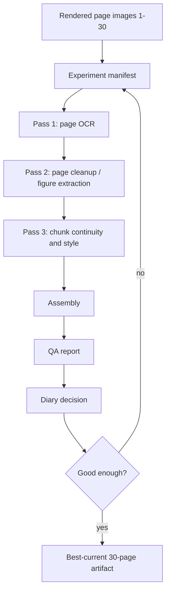

# High Quality Book OCR Experiment System

## Executive Summary

This ticket builds a high-quality OCR experimentation system for the first 30 pages of `presentation-based-uis`, using the new scraper workflow runtime and OCR MVP package as the starting point. The immediate goal is not merely to run OCR. The goal is to learn how to produce a faithful, readable, inspectable book transcription by iterating on prompts, context windows, page chunking, figure extraction, continuity passes, and quality checks.

The work should proceed as a laboratory, not as an ad hoc script. Every experiment gets its own folder, manifest, prompts, logs, raw outputs, final outputs, and review notes. The diary records what was tried, what worked, what failed, and why the next experiment changes direction. The intended reader is a new intern who needs to understand both the implemented runtime and the quality problem.

The current OCR MVP already provides a useful substrate:

- durable workflow execution through `scraper/pkg/workflow`;
- page discovery and per-page OCR steps through `scraper/pkg/workflows/ocrmvp`;
- Geppetto/Pinocchio-backed live model calls;
- file artifacts for page markdown and final markdown;
- SQLite projections for page status;
- CLI operator commands for run/status/pages/retry/cancel.

This ticket extends that foundation into a quality-focused process for pages 1-30.

## Problem Statement

The existing OCR MVP can process pages independently and concatenate the outputs. That is enough to prove the workflow runtime, but it is not enough for high-quality book OCR.

A book transcription has continuity requirements that single-page OCR does not naturally satisfy:

- paragraphs may continue across page boundaries;
- section heading hierarchy must remain consistent;
- running headers, footers, and page numbers should be suppressed consistently;
- title pages should be transcribed as text, not misclassified as figures;
- blank pages need a stable policy;
- figures need structured extraction rather than vague prose;
- tables, captions, footnotes, and references need consistent markdown conventions;
- prompt/model choices must be recorded so results are comparable.

The first live provider smoke test succeeded technically, but showed a quality signal: page 1 was emitted as an image marker describing the title page rather than exact title-page text. That is precisely the kind of failure this ticket is designed to expose and fix.

## Scope

### In scope

- First 30 pages from:
  - `/home/manuel/code/wesen/claw-stuff/output/books/presentation-based-uis/pages`
- Prompt iteration using `gpt-5-mini-low` and/or `gpt-5-nano-low` profiles.
- Page-level OCR experiments.
- Multi-page context/window experiments.
- Chunk-level continuity and style passes.
- Figure/caption extraction experiments.
- Logging, artifact collection, and review notes.
- A best-current 30-page markdown artifact and QA report.

### Out of scope for the first pass

- Rendering PDFs into page images; the input is already rendered pages.
- A full web UI for OCR campaigns.
- Processing the full 202-page book before pages 1-30 are good.
- Building a permanent generalized OCR product API before learning the quality patterns.

## Current System Architecture

### Repository map

```text
/home/manuel/workspaces/2026-05-20/book-ocr/
├── scraper/
│   ├── pkg/workflow/                 # embeddable workflow runtime facade
│   ├── pkg/workflows/ocrmvp/          # OCR MVP workflow package
│   └── cmd/ocr-mvp/                   # OCR MVP CLI and operator commands
├── geppetto/                          # inference engine and turns APIs
├── pinocchio/                         # profile resolution and engine bootstrap
└── 2026-05-20--book-ocr/ttmp/...      # docmgr tickets and experiment docs
```

The OCR MVP package is the code path under test. It defines a workflow package named `ocr-mvp` and a projection named `ocr-mvp`.

### Runtime components



The runtime has three durable storage roles:

1. `engine.db` stores workflow and step state.
2. `artifacts/` stores page markdown and final markdown.
3. `projections/ocr-mvp.db` stores operator-facing page/run summaries.

This separation should be preserved in quality experiments. Raw and intermediate outputs should go into experiment folders as copies or summaries, but the canonical execution artifacts come from the work directory.

### Key API references

#### Workflow runtime

Files:

- `/home/manuel/workspaces/2026-05-20/book-ocr/scraper/pkg/workflow/runtime.go`
- `/home/manuel/workspaces/2026-05-20/book-ocr/scraper/pkg/workflow/package.go`
- `/home/manuel/workspaces/2026-05-20/book-ocr/scraper/pkg/workflow/context.go`
- `/home/manuel/workspaces/2026-05-20/book-ocr/scraper/pkg/workflow/artifact_store.go`
- `/home/manuel/workspaces/2026-05-20/book-ocr/scraper/pkg/workflow/projection_store.go`
- `/home/manuel/workspaces/2026-05-20/book-ocr/scraper/pkg/workflow/operators.go`

Essential concepts:

```go
rt, err := workflow.NewRuntime(ctx, workflow.Config{
    Store:           workflow.SQLiteStore("/tmp/work/engine.db"),
    ArtifactStore:   workflow.NewFileArtifactStore("/tmp/work/artifacts"),
    ProjectionStore: workflow.NewSQLiteProjectionStore("/tmp/work/projections"),
})

err = ocrmvp.Register(rt, ocrmvp.Config{Client: ocrmvp.NewGeppettoOCRClient()})
handle, err := rt.StartRun(ctx, ocrmvp.PackageName, ocrmvp.RunInput{...})
```

#### OCR MVP workflow package

Files:

- `/home/manuel/workspaces/2026-05-20/book-ocr/scraper/pkg/workflows/ocrmvp/types.go`
- `/home/manuel/workspaces/2026-05-20/book-ocr/scraper/pkg/workflows/ocrmvp/package.go`
- `/home/manuel/workspaces/2026-05-20/book-ocr/scraper/pkg/workflows/ocrmvp/discover.go`
- `/home/manuel/workspaces/2026-05-20/book-ocr/scraper/pkg/workflows/ocrmvp/executors.go`
- `/home/manuel/workspaces/2026-05-20/book-ocr/scraper/pkg/workflows/ocrmvp/geppetto_ocr.go`
- `/home/manuel/workspaces/2026-05-20/book-ocr/scraper/pkg/workflows/ocrmvp/prompt.go`
- `/home/manuel/workspaces/2026-05-20/book-ocr/scraper/cmd/ocr-mvp/main.go`

Current run input:

```go
type RunInput struct {
    BookID            string
    ImageDir          string
    PageGlob          string
    StartPage         int
    EndPage           int
    Profile           string
    ProfileRegistries []string
    PromptVersion     string
    DryRun            bool
}
```

Current CLI:

```bash
go run ./cmd/ocr-mvp run \
  --book-id presentation-based-uis \
  --image-dir /home/manuel/code/wesen/claw-stuff/output/books/presentation-based-uis/pages \
  --work-dir /tmp/book-ocr-hq-001/001-baseline-single-page \
  --start-page 1 \
  --end-page 30 \
  --profile gpt-5-mini-low \
  --max-workers 1
```

Operator commands:

```bash
go run ./cmd/ocr-mvp status --work-dir /tmp/work --run-id RUN_ID
go run ./cmd/ocr-mvp pages  --work-dir /tmp/work --book-id BOOK_ID
go run ./cmd/ocr-mvp retry  --work-dir /tmp/work --run-id RUN_ID --step-id ocr-page-017
go run ./cmd/ocr-mvp cancel --work-dir /tmp/work --run-id RUN_ID
```

## Experiment Directory Contract

Every experiment must be inspectable after the fact. Use this layout:

```text
experiments/NNN-name/
├── manifest.yaml       # exact configuration and hypothesis
├── prompts/            # prompt text, versions, style guides, chunk prompts
├── outputs/            # copied final markdown, projection summaries, QA reports
├── logs/               # terminal logs, model traces, command outputs
└── notes.md            # human review notes and next-step decision
```

A manifest should answer:

- Which page range was processed?
- Which profile was used?
- How many model calls per page or chunk?
- Which prompt versions were used?
- What artifacts were generated?
- What quality hypothesis is being tested?

Example:

```yaml
experiment_id: 002-context-window
book_id: presentation-based-uis-hq-002-context
page_range: 1-30
profile: gpt-5-mini-low
strategy:
  page_pass: image_plus_previous_tail
  previous_tail_chars: 800
  chunk_pass: none
  figure_extraction: inline_marker_plus_structured_notes
hypothesis: |
  Giving each page the previous accepted page tail will reduce broken paragraphs
  and improve heading continuity without causing hallucinated carry-over text.
```

## Proposed Quality Pipeline

The final target is a multi-pass process. We should start small, but the design should point toward this structure.



### Pass 1: Page OCR

Input:

- one page image;
- page number;
- book ID;
- prompt version;
- optional profile.

Output:

- raw page markdown;
- basic figure markers;
- provenance metadata.

Pseudocode:

```go
for page in pages[1:30] {
    result := OCRPage(image=page.Image, prompt=PagePromptVn)
    StoreArtifact("page_XXX.raw.md", result.Text)
    UpdateProjection(page, status="done", prompt_version=Vn)
}
```

### Pass 2: Page cleanup and structured figures

This pass should turn a raw page transcription into a more structured page object:

```json
{
  "page": 12,
  "markdown": "...",
  "figures": [
    {
      "figure_id": "page-012-figure-01",
      "kind": "diagram",
      "caption": "Figure 2: ...",
      "description": "..."
    }
  ],
  "warnings": ["possible_running_header"]
}
```

The main purpose is to separate transcription from interpretation. A figure is not just a bracketed sentence in the markdown; it is a reviewable object.

### Pass 3: Chunk continuity and style

This pass works over small chunks, for example five pages at a time. The model sees the page markdown drafts and a style guide. It repairs continuity while preserving page boundaries.

Important invariant:

> A continuity pass may move or merge text across page boundaries only when the source page markers remain visible and the change is recorded.

Pseudocode:

```go
chunks := Window(pages, size=5, overlap=1)
for chunk in chunks {
    improved := RunContinuityPass(chunk.Markdown, styleGuide)
    StoreArtifact("chunk_001.continuity.md", improved)
}
final := MergeChunks(chunks, preservePageMarkers=true)
```

## Prompt Iteration Strategy

### Baseline prompt

The current prompt is `ocr-mvp-universal-v1` in `prompt.go`. It is useful as a baseline because it is simple and already wired into the runtime.

Known issue from the live smoke test:

- title page became `[IMAGE: ...]` instead of exact visible text.

### Prompt v2 goals

Prompt v2 should add explicit title-page and blank-page policy:

```text
If the page is a title page, transcribe the visible title, author, institution,
and date as markdown text. Do not describe the title page as an image unless
there is a separate non-text figure.

If the page is intentionally blank except for pagination, output exactly:
[BLANK PAGE]
```

Whether blank pages should be empty or `[BLANK PAGE]` is a product decision. For experiment inspection, `[BLANK PAGE]` is easier to review. A final publication pass can remove or normalize it.

### Prompt v3 goals

Prompt v3 should introduce page role classification:

```json
{
  "page_role": "title|blank|toc|body|figure|index|bibliography|unknown",
  "markdown": "...",
  "figures": [],
  "warnings": []
}
```

This may require a different executor or a new output parser. It is fair game for this ticket if the baseline output is not good enough.

## Quality Checks

Quality checks should be cheap and visible. Start with scripts before building runtime features.

Checks for pages 1-30:

- Are all page markers present exactly once?
- Are any pages suspiciously short?
- Did blank pages produce verbose commentary?
- Did title pages become image descriptions?
- Are running headers repeated many times?
- Are there unclosed code fences or tables?
- Are figure markers present where expected?
- Are page numbers leaking into output?

A simple QA report can be generated from markdown and projection rows:

```text
Page 001: WARN title_page_as_image_description, chars=179
Page 002: OK blank_page_policy, chars=52
Page 003: WARN suspicious_short_page, chars=80
...
```

## Implementation Phases

### Phase 1: Setup and baseline

1. Create experiment folders.
2. Run pages 1-30 with `gpt-5-nano-low` or `gpt-5-mini-low`.
3. Save logs, final markdown, projection rows, artifacts list, and run ID.
4. Review the first output manually.

### Phase 2: Prompt repair

1. Add a new prompt variant that handles title pages and blank pages explicitly.
2. Rerun pages 1-30 or targeted failing pages.
3. Compare against baseline.
4. Record whether the prompt change improved or degraded output.

### Phase 3: Context window

1. Use previous page tail as context.
2. Keep source page output bounded to the current page.
3. Test whether broken paragraphs and heading continuity improve.

### Phase 4: Chunk continuity pass

1. Run a second pass over 5-page chunks.
2. Produce improved chunk markdown.
3. Preserve page markers.
4. Generate a final 30-page candidate.

### Phase 5: Figure extraction

1. Identify pages with figures or diagrams.
2. Prompt for structured figure objects.
3. Store figure metadata alongside markdown.
4. Decide final markdown convention for figures.

## API and Code Change Options

The first baseline can use the existing CLI unchanged. Later phases may need code changes.

Possible additions:

```go
type QualityRunInput struct {
    ocrmvp.RunInput
    Strategy string `json:"strategy"`
    ContextTailChars int `json:"context_tail_chars"`
    ChunkSize int `json:"chunk_size"`
    OutputSchema string `json:"output_schema"`
}
```

Or a separate package:

```text
scraper/pkg/workflows/bookocrhq/
├── types.go
├── prompts.go
├── package.go
├── page_ocr.go
├── figure_extract.go
├── chunk_continuity.go
├── qa.go
└── package_test.go
```

Do not add this package until the experiments show which abstractions are actually needed.

## Validation Plan

Baseline validation:

```bash
cd /home/manuel/workspaces/2026-05-20/book-ocr/scraper
go run ./cmd/ocr-mvp run \
  --book-id presentation-based-uis-hq-001-baseline \
  --image-dir /home/manuel/code/wesen/claw-stuff/output/books/presentation-based-uis/pages \
  --work-dir /tmp/book-ocr-hq-001/001-baseline-single-page \
  --start-page 1 \
  --end-page 30 \
  --profile gpt-5-nano-low \
  --max-workers 1
```

Capture status:

```bash
go run ./cmd/ocr-mvp status \
  --work-dir /tmp/book-ocr-hq-001/001-baseline-single-page \
  --run-id RUN_ID
```

Capture projection rows:

```bash
go run ./cmd/ocr-mvp pages \
  --work-dir /tmp/book-ocr-hq-001/001-baseline-single-page \
  --book-id presentation-based-uis-hq-001-baseline
```

Copy final markdown:

```bash
cp /tmp/book-ocr-hq-001/001-baseline-single-page/artifacts/assemble-markdown/artifact/001 \
  experiments/001-baseline-single-page/outputs/final.md
```

## Risks and Open Questions

- `gpt-5-nano-low` may be too weak for dense diagrams, but it is cheap enough for baseline iteration.
- `gpt-5-mini-low` may improve quality but increase latency and cost.
- The current OCR MVP prompt is embedded in Go code; rapid prompt iteration may be easier with external prompt files.
- Page-level artifacts currently include markdown in result JSON and external artifacts; future large-scale runs should prefer artifact dereferencing rather than duplicating large text.
- The right blank-page policy is not yet decided.
- Figure extraction may need a structured JSON output mode rather than markdown-only prompts.
- Chunk continuity can accidentally hallucinate connecting text; it must be constrained and reviewed.

## References

### Workflow and OCR implementation

- `/home/manuel/workspaces/2026-05-20/book-ocr/scraper/pkg/workflow/runtime.go`
- `/home/manuel/workspaces/2026-05-20/book-ocr/scraper/pkg/workflow/package.go`
- `/home/manuel/workspaces/2026-05-20/book-ocr/scraper/pkg/workflow/context.go`
- `/home/manuel/workspaces/2026-05-20/book-ocr/scraper/pkg/workflow/artifact_store.go`
- `/home/manuel/workspaces/2026-05-20/book-ocr/scraper/pkg/workflow/projection_store.go`
- `/home/manuel/workspaces/2026-05-20/book-ocr/scraper/pkg/workflow/operators.go`
- `/home/manuel/workspaces/2026-05-20/book-ocr/scraper/pkg/workflows/ocrmvp/types.go`
- `/home/manuel/workspaces/2026-05-20/book-ocr/scraper/pkg/workflows/ocrmvp/package.go`
- `/home/manuel/workspaces/2026-05-20/book-ocr/scraper/pkg/workflows/ocrmvp/discover.go`
- `/home/manuel/workspaces/2026-05-20/book-ocr/scraper/pkg/workflows/ocrmvp/executors.go`
- `/home/manuel/workspaces/2026-05-20/book-ocr/scraper/pkg/workflows/ocrmvp/geppetto_ocr.go`
- `/home/manuel/workspaces/2026-05-20/book-ocr/scraper/pkg/workflows/ocrmvp/prompt.go`
- `/home/manuel/workspaces/2026-05-20/book-ocr/scraper/cmd/ocr-mvp/main.go`

### Source pages

- `/home/manuel/code/wesen/claw-stuff/output/books/presentation-based-uis/pages/page_001.png`
- `/home/manuel/code/wesen/claw-stuff/output/books/presentation-based-uis/pages/page_002.png`

### Prior tickets

- `/home/manuel/workspaces/2026-05-20/book-ocr/2026-05-20--book-ocr/ttmp/2026/05/24/SCRAPER-JOBS-001--general-purpose-task-workflow-job-system-for-scraper`
- `/home/manuel/workspaces/2026-05-20/book-ocr/2026-05-20--book-ocr/ttmp/2026/05/24/OCR-MVP-001--implement-simple-mvp-ocr-workflow-with-new-workflow-api`
