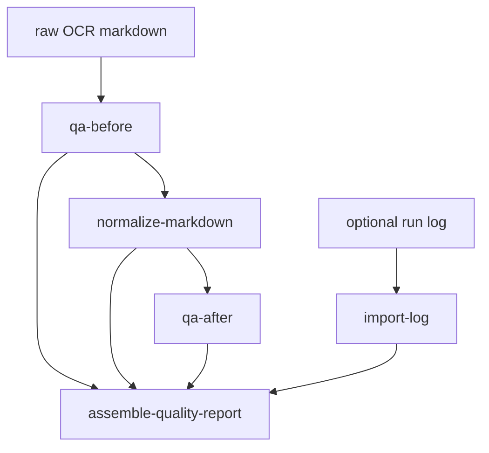

# OCR Quality Workers Implementation Guide

## Executive Summary

`OCR-QUALITY-WORKERS-001` promotes the Python OCR quality scripts from `BOOK-OCR-HQ-001` into workflow-native Go code. The Python scripts were good experiment prototypes, but the stable behavior now belongs inside `scraper` so it can be tested, run as durable workflow steps, exposed through CLI/operator commands, and eventually shown in UI projections.

The first implementation adds:

- `pkg/workflows/ocrquality`: a workflow package for OCR markdown QA, deterministic normalization, log import, and report assembly.
- `ocr-mvp quality-pass`: a CLI entry point that runs the quality workflow over an existing OCR markdown artifact.
- `--context-window` on `ocr-mvp run`: an exploratory context-aware OCR option that can include previous/next page images in a page OCR call for continuity.

The code commit is:

```text
eb19a4018ef5ebfbc89b730de597e686aeb5303f
Add OCR quality workflow workers
```

## Problem Statement

The high-quality OCR ticket ended with useful but ad hoc Python scripts:

```text
scripts/01-filter-ndjson-log-to-sqlite.py
scripts/02-run-ocr-capture-log.py
scripts/03-qa-ocr-markdown.py
scripts/04-normalize-ocr-markdown.py
```

They solved real problems:

- provider/SSE logs were too noisy for terminal inspection;
- OCR outputs needed repeatable page-marker and known-regression checks;
- Table of Contents / Table of Figures dot leaders needed deterministic review normalization;
- raw model output and normalized review output needed separate provenance.

But Python scripts under a ticket folder are not production workflow features. They are not naturally typed, projected, tested with Go workflow code, or available to operators as durable jobs.

The goal is to turn the stable parts of the experiment into Go workers without losing the provenance discipline that made the Python loop useful.

## Proposed Solution

Add a new workflow package:

```text
scraper/pkg/workflows/ocrquality/
├── types.go
├── markdown.go
├── qa.go
├── normalize.go
├── logimport.go
├── package.go
└── qa_test.go
```

The package contains four worker families:

1. **QA workers**: analyze OCR markdown and produce structured findings plus markdown reports.
2. **Normalize worker**: deterministically normalize list-page dot leaders and emit a diff.
3. **Log import worker**: parse existing logs into a SQLite summary shape and markdown report.
4. **Report worker**: assemble a small workflow-level report from QA and normalization results.

The package exposes a durable workflow:



The workflow is run from the CLI with:

```bash
ocr-mvp quality-pass \
  --markdown /path/to/01-final-quality-v4-mini-pages-001-030.md \
  --output-dir /tmp/ocr-quality-go-pass/out \
  --work-dir /tmp/ocr-quality-go-pass/work \
  --book-id presentation-based-uis-hq-007-v4-mini-30 \
  --expected-pages 30
```

## Design Decisions

### Decision 1: Keep raw and normalized outputs separate

The normalize worker never mutates the input file. It writes:

```text
normalized.md
cleanup.diff
```

and stores both as artifacts. This preserves the key rule from `BOOK-OCR-HQ-001`: deterministic cleanup is a review derivative, not a replacement for raw model output.

### Decision 2: QA findings are typed data, not just markdown

The Go QA worker produces `QAResult` with structured fields:

```go
type QAResult struct {
    PageMarkersFound   int
    ObservedPages      []int
    FigureMarkers      int
    KnownBadTermHits   map[string]int
    ExpectedStringHits map[string]bool
    DuplicateLines     []QAFinding
    ListPageChecks     []PageStyleCheck
    Findings           []QAFinding
    Passed             bool
    ReportMarkdown     string
}
```

The markdown report is still useful for humans, but the structured result is what future projections and UI should consume.

### Decision 3: QA checks are regression checks, not proof of correctness

The QA worker deliberately checks concrete known failure modes:

```go
KNOWN_BAD_TERMS = []string{
    "DiRed",
    "Streamer",
    "PPSBase",
    "Ciccarrelli",
    "[IMAGE:",
}
```

and expected strings from validated pages:

```go
"Presentation Based User Interfaces"
"This blank page was inserted to preserve pagination."
"Figure 4-1: Dired Model"
"Figure 4-9: Sample Steamer Schematic"
"Figure 5-1: PSBase Support of PPS Components"
"Chapter Two"
"The Primitive Presentation System (PPS) Model"
"2.1 PPSCalc"
```

Passing QA means the output passed the known regression checks. It does not mean every token is correct.

### Decision 4: Deterministic normalization is narrow

The normalization worker only transforms list-page rows with dot leaders or large spacing before a page number:

```text
Figure 4-1: Dired Model .................................................. 72
```

into:

```text
Figure 4-1: Dired Model ... 72
```

It does not rewrite prose, infer missing text, correct names, or modify non-list pages beyond page-boundary whitespace normalization.

### Decision 5: Context-aware OCR starts with image context, not text feedback

The `ocr-mvp` workflow now accepts:

```bash
--context-window N
```

with `N` capped to 0-2. When nonzero, each page OCR input includes previous and next page image paths where available. The Geppetto client sends the target image first and the surrounding images after it.

The v4 prompt now tells the model:

```text
The first image is always the target page. Any additional images are previous/next context pages.
Use surrounding context images only to maintain continuity of terminology, list style, page-boundary fragments, and figure/list conventions.
Do not transcribe text that appears only on a context page.
```

This is an exploratory first step. It may improve continuity, but it also increases cost and may increase the risk of context leakage. It must be tested on targeted pages before broad runs.

## Implementation Plan

### Phase 1: Port QA and normalization to Go

Implemented in commit `eb19a4018ef5ebfbc89b730de597e686aeb5303f`.

Files:

```text
scraper/pkg/workflows/ocrquality/markdown.go
scraper/pkg/workflows/ocrquality/qa.go
scraper/pkg/workflows/ocrquality/normalize.go
scraper/pkg/workflows/ocrquality/qa_test.go
```

Validation:

```bash
go test ./pkg/workflows/ocrquality -count=1
```

### Phase 2: Add workflow-native quality package

Implemented in:

```text
scraper/pkg/workflows/ocrquality/package.go
scraper/pkg/workflows/ocrquality/types.go
```

The package registers:

```text
ocr-quality/qa-before
ocr-quality/normalize-markdown
ocr-quality/qa-after
ocr-quality/import-log
ocr-quality/assemble-report
```

### Phase 3: Add CLI entry point

Implemented in:

```text
scraper/cmd/ocr-mvp/main.go
```

Command:

```bash
ocr-mvp quality-pass --markdown PATH --output-dir DIR --expected-pages 30
```

### Phase 4: Add context-window OCR input

Implemented in:

```text
scraper/pkg/workflows/ocrmvp/types.go
scraper/pkg/workflows/ocrmvp/discover.go
scraper/pkg/workflows/ocrmvp/geppetto_ocr.go
scraper/pkg/workflows/ocrmvp/prompt.go
scraper/cmd/ocr-mvp/main.go
```

Command:

```bash
ocr-mvp run ... --context-window 1
```

### Phase 5: Run quality pass against Experiment 007

Smoke command executed successfully:

```bash
go run ./cmd/ocr-mvp quality-pass \
  --markdown /home/manuel/workspaces/2026-05-20/book-ocr/2026-05-20--book-ocr/ttmp/2026/05/24/BOOK-OCR-HQ-001--high-quality-book-ocr-experiment-system/experiments/007-quality-v4-mini-pages-001-030/outputs/01-final-quality-v4-mini-pages-001-030.md \
  --output-dir /tmp/ocr-quality-go-pass/out \
  --work-dir /tmp/ocr-quality-go-pass/work \
  --book-id presentation-based-uis-hq-007-v4-mini-30 \
  --expected-pages 30
```

Result:

```text
workflow status: succeeded
quality output: /tmp/ocr-quality-go-pass/out/normalized.md
quality diff: /tmp/ocr-quality-go-pass/out/cleanup.diff
```

## Alternatives Considered

### Keep the Python scripts

Rejected as a long-term path. The scripts are useful for experiments, but the stable behavior should be typed, tested, and workflow-native.

### Add only a CLI, not a workflow package

Rejected. The user specifically asked for proper job workers. A CLI-only port would be easier, but it would not validate the workflow-native API or produce durable step artifacts.

### Use an LLM cleanup pass immediately

Deferred. The deterministic cleanup pass is safe because every change is explainable. An LLM cleanup pass may be valuable later, but it should run after QA/provenance is stable and should produce structured edit proposals rather than silently rewriting markdown.

## Testing Strategy

Current tests cover:

- page splitting and page marker counts;
- known bad term detection;
- adjacent duplicate line detection;
- list-page normalization;
- context-window page selection and caps.

Commands run by pre-commit:

```bash
go test ./... -count=1
pnpm test:unit -- --runInBand
golangci-lint run ./cmd/... ./pkg/...
gosec ... ./...
govulncheck ./...
```

## Remaining Work Toward Stellar OCR

This ticket starts the proper worker port. It does not yet make the full OCR result impeccable.

The next iterations should add:

1. Page-level QA projection tables.
2. A targeted re-OCR workflow for pages that fail QA.
3. Structured figure extraction that stores cropped embedded images as artifacts.
4. A continuity cleanup pass that uses neighboring page OCR text and QA findings.
5. A full first-30-page context-window experiment comparing `--context-window 0` vs `--context-window 1`.
6. Human/vision validation of context-window changes before full-book expansion.

## Review Instructions

Start with the code package:

```text
scraper/pkg/workflows/ocrquality
```

Then review the CLI integration:

```text
scraper/cmd/ocr-mvp/main.go
```

Then review context-aware OCR changes:

```text
scraper/pkg/workflows/ocrmvp/discover.go
scraper/pkg/workflows/ocrmvp/geppetto_ocr.go
scraper/pkg/workflows/ocrmvp/prompt.go
```

Run:

```bash
cd /home/manuel/workspaces/2026-05-20/book-ocr/scraper
go test ./cmd/ocr-mvp ./pkg/workflows/ocrmvp ./pkg/workflows/ocrquality -count=1
```
