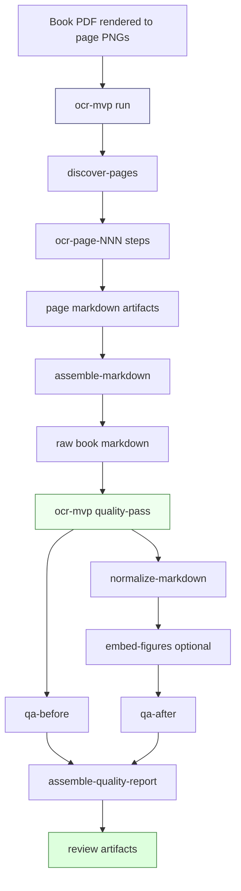
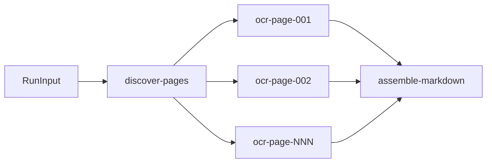
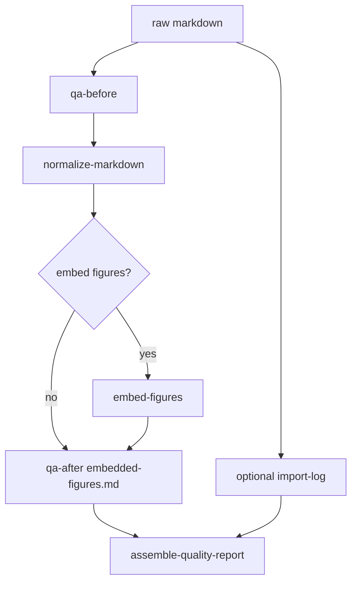
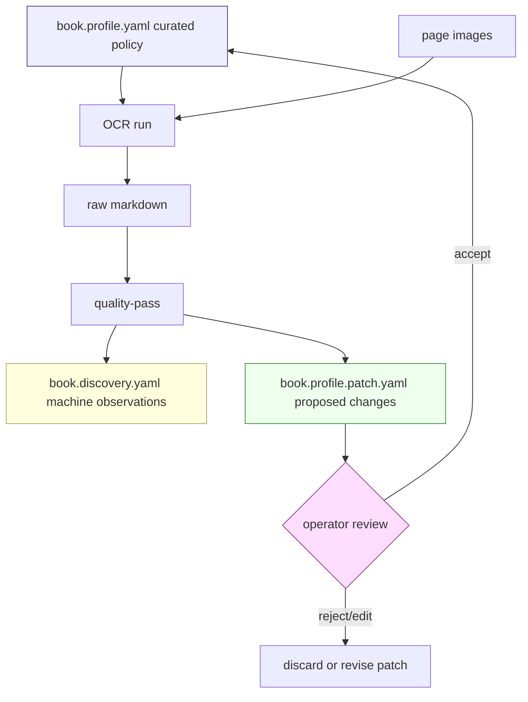

# Generic Book OCR System Analysis and Implementation Guide

## Executive Summary

The current OCR system is a working vertical slice for high-quality OCR of the first 30 pages of MIT Technical Report 794, *Presentation Based User Interfaces*. It combines a workflow-native OCR runtime, a Geppetto-backed multimodal OCR client, prompt versions tuned through experiments, deterministic markdown QA, deterministic cleanup, and first-pass figure extraction. It is already more general than a one-off script because it accepts an image directory, page range, profile, prompt version, and output workspace. However, several defaults and prompt rules are still specialized for Report 794 and for the first-30-page experiment.

This document explains the system for a new intern and separates three layers:

1. **Generic infrastructure** that should remain reusable for all books: workflow runtime, OCR package, quality package, artifact storage, projections, CLI/operator commands, log capture, QA result types, and deterministic normalization hooks.
2. **Book-family policy** that should be configurable: page types, prompt contract, figure policy, list-page formatting, normalization rules, expected pages, known-bad terms, expected strings, vocabulary, and segmentation strategy.
3. **Report 794 experiment configuration** that should move out of hard-coded defaults: `Presentation Based User Interfaces`, `Eugene C. Ciccarelli IV`, `PSBase`, `PPS`, `Dired`, `Steamer`, list pages 6-9, first-30-page expected strings, and Figure 1-x recovery assumptions.

The short answer to “how much is Report 794-specific?” is:

- **Workflow runtime:** not Report 794-specific.
- **OCR MVP package shape:** mostly generic, with book-specific prompt versions and model/profile choices.
- **Quality-pass package:** structurally generic, but its default checks are currently Report 794/first-30-pages-specific.
- **Prompt versions v2-v5:** increasingly Report 794-aware, especially v4/v5.
- **Figure extraction:** generic mechanism, but current marker synthesis and crop heuristics are tuned to the scanned Report 794 pages.
- **Experiment folders and diary/report process:** generic and should become the standard operating model for any book.

The next design goal is a **book profile system**: a typed configuration object that describes each book or book class and feeds the OCR prompt, QA checks, normalization, figure extraction, and continuity passes. The intern should not add more book-specific constants to `markdown.go`, `prompt.go`, or `figures.go`. Instead, add a `BookProfile` layer and make the existing Report 794 behavior the first profile.

> **Naming note:** the user prompt says `aitr-749`, but the current OCR experiment artifacts and code target MIT Technical Report 794, often referred to locally as AITR/Report 794. This guide uses **Report 794** for the implemented system and treats the typo as referring to the same current book OCR work.

## System Map

The project lives in three major repositories/directories:

```text
/home/manuel/workspaces/2026-05-20/book-ocr
├── scraper/                         # Go workflow runtime + OCR code
├── geppetto/                         # LLM/turn/inference library used directly by OCR
├── pinocchio/                        # Profile registry/default profile selection
└── 2026-05-20--book-ocr/ttmp/...     # docmgr tickets, experiments, diaries, reports
```

The OCR system is currently split across these packages:

```text
scraper/pkg/workflow/                 # generic workflow facade
scraper/pkg/workflows/ocrmvp/         # page OCR workflow
scraper/pkg/workflows/ocrquality/     # QA, cleanup, log import, embedded figures
scraper/cmd/ocr-mvp/main.go           # CLI/operator entry point
```

The most important docs/artifacts are:

```text
BOOK-OCR-HQ-001/analysis/01-final-ocr-quality-report.md
OCR-QUALITY-WORKERS-001/design-doc/01-ocr-quality-workers-implementation-guide.md
OCR-QUALITY-WORKERS-001/reference/01-diary.md
OCR-QUALITY-WORKERS-001/experiments/002-figure-aware-marker-recovery/outputs/02-embedded-figures.md
```

## High-Level Architecture

The system has two connected workflows:

1. **OCR workflow**: converts rendered page images into assembled markdown.
2. **Quality workflow**: checks, normalizes, enriches, and reports on existing OCR markdown.



The OCR workflow should be thought of as a **first-pass extraction system**. It should preserve what the model saw and produced. The quality workflow should be thought of as an **auditable transformation system**. It may normalize formatting or embed extracted images, but it must preserve raw output, diffs, QA-before, and QA-after artifacts so that no correction is hidden.

## Generic vs Report 794-Specific Inventory

### Generic pieces

These components are already suitable for any book, with minor polish:

| Component | File(s) | Generic? | Notes |
|---|---|---:|---|
| Workflow executor facade | `scraper/pkg/workflow/*.go` | Yes | Can run any typed workflow package. |
| Runtime/package API | `scraper/pkg/workflow/runtime.go`, `package.go` | Yes | Generic workflow graph builder, step handles, dependencies. |
| Artifact store | `scraper/pkg/workflow/artifact_store.go` | Yes | Stores external markdown/images/logs. |
| Projection store | `scraper/pkg/workflow/projection_store.go` | Yes | Read-model foundation. |
| OCR package graph | `scraper/pkg/workflows/ocrmvp/package.go` | Mostly | Generic page discovery/OCR/assembly shape. |
| OCR client interface | `scraper/pkg/workflows/ocrmvp/types.go` | Yes | `OCRClient` abstraction accepts page input + image bytes. |
| Geppetto OCR client | `scraper/pkg/workflows/ocrmvp/geppetto_ocr.go` | Mostly | Generic multimodal call, profile-specific not book-specific. |
| CLI run/status/pages/retry/cancel | `scraper/cmd/ocr-mvp/main.go` | Mostly | Generic enough, but command name still says MVP. |
| Quality workflow graph | `scraper/pkg/workflows/ocrquality/package.go` | Mostly | Generic graph, Report 794 defaults. |
| Log import | `scraper/pkg/workflows/ocrquality/logimport.go` | Yes | Useful for any noisy run logs. |
| Markdown page splitting | `scraper/pkg/workflows/ocrquality/markdown.go` | Mostly | Assumes `<!-- page:NNN -->` markers; good convention. |

### Report 794-specific pieces

These should be moved into a profile/configuration layer:

| Component | Current location | Specificity |
|---|---|---|
| Report title and author vocabulary | `ocrmvp/prompt.go` v4/v5 | Report 794-specific. |
| `PSBase`, `PPS`, `PPSCalc`, `Dired`, `Steamer`, `Zmacs`, `Xerox Star` | `ocrmvp/prompt.go`, `ocrquality/markdown.go` | Report 794-specific vocabulary and known errors. |
| Expected strings | `ocrquality/markdown.go:defaultExpectedStrings()` | First-30-pages/Report 794-specific. |
| Known bad terms | `ocrquality/markdown.go:defaultKnownBadTerms()` | Report 794-specific and experiment-specific. |
| List pages 6-9 | `ocrquality/markdown.go:defaultListPages()` | First-30-pages-specific. |
| Prompt v4/v5 | `ocrmvp/prompt.go` | Good for Report 794; not universal. |
| Figure marker recovery examples | `ocrquality/figures.go` | Mechanism is generic; heuristics are influenced by Report 794 diagram pages. |
| Experiment names and paths | `ttmp/.../BOOK-OCR-HQ-001`, `OCR-QUALITY-WORKERS-001` | Project-specific evidence, useful as template. |

### Configurable by book type

Some behavior is neither fully generic nor fully Report 794-specific. It depends on the **type of book**:

- technical report with prose + diagrams;
- textbook with equations and figures;
- novel with mostly prose;
- historical scan with marginalia;
- mathematical monograph;
- source-code-heavy manual;
- magazine/catalog with multi-column layout;
- table-heavy reference manual;
- handwritten or annotated scans.

These should become profile-driven knobs:

- prompt contract;
- vocabulary and spelling policy;
- page-type taxonomy;
- figure/table/list policy;
- page marker style;
- expected frontmatter structure;
- QA checks;
- normalization rules;
- segmentation and image enhancement settings;
- context-window policy.

## Current OCR Workflow Explained

### Run input API

The OCR workflow starts from `ocrmvp.RunInput`:

```go
type RunInput struct {
    BookID            string   `json:"book_id"`
    ImageDir          string   `json:"image_dir"`
    PageGlob          string   `json:"page_glob,omitempty"`
    StartPage         int      `json:"start_page,omitempty"`
    EndPage           int      `json:"end_page,omitempty"`
    Profile           string   `json:"profile,omitempty"`
    ProfileRegistries []string `json:"profile_registries,omitempty"`
    PromptVersion     string   `json:"prompt_version,omitempty"`
    ContextWindow     int      `json:"context_window,omitempty"`
    DryRun            bool     `json:"dry_run,omitempty"`
}
```

File reference:

```text
scraper/pkg/workflows/ocrmvp/types.go
```

The generic inputs are `BookID`, `ImageDir`, `PageGlob`, `StartPage`, and `EndPage`. The model/provider layer is controlled by `Profile` and `ProfileRegistries`. The OCR policy is currently controlled by `PromptVersion`; this is the part that should become `BookProfile` + optional prompt template.

### Workflow package registration

The package is registered through:

```go
func Register(rt *workflow.Runtime, cfg Config) error
```

File reference:

```text
scraper/pkg/workflows/ocrmvp/package.go
```

The package registers three executor kinds:

```text
ocr-mvp/discover-pages
ocr-mvp/ocr-page
ocr-mvp/assemble-markdown
```

The high-level graph is:



The `discover-pages` step discovers input page images and dynamically schedules one `ocr-page-NNN` step per page. The `assemble-markdown` step depends on all OCR page steps and writes final markdown.

### Page OCR input API

Each OCR step receives `PageOCRInput`:

```go
type PageOCRInput struct {
    BookID            string             `json:"book_id"`
    PageNumber        int                `json:"page_number"`
    ImagePath         string             `json:"image_path"`
    Profile           string             `json:"profile,omitempty"`
    ProfileRegistries []string           `json:"profile_registries,omitempty"`
    PromptVersion     string             `json:"prompt_version"`
    ContextBefore     []PageContextImage `json:"context_before,omitempty"`
    ContextAfter      []PageContextImage `json:"context_after,omitempty"`
    DryRun            bool               `json:"dry_run,omitempty"`
}
```

The generic design idea is important: page OCR is a pure operation over one target image plus optional context images. The first image is always the target page; context pages are allowed only to stabilize terminology and continuity.

### Geppetto-backed OCR

The live OCR client is implemented in:

```text
scraper/pkg/workflows/ocrmvp/geppetto_ocr.go
```

It does three important things:

1. Resolves Pinocchio profiles through `pinocchio/pkg/cmds/profilebootstrap`.
2. Builds a multimodal Geppetto turn with prompt text and image bytes.
3. Extracts the assistant/model text from the inference result.

This layer is not Report 794-specific. It should remain generic. The book-specific behavior should enter through the rendered prompt and profile configuration, not through Geppetto client code.

### Prompt versions

Prompt versions currently live in:

```text
scraper/pkg/workflows/ocrmvp/prompt.go
```

Important versions:

```text
ocr-mvp-universal-v1
ocr-quality-v2
ocr-quality-v3-list-diplomatic
ocr-quality-v4-report794-lexicon
ocr-quality-v5-figure-aware
```

The prompt evolution shows why a profile system is needed:

- v1 is generic but under-specified.
- v2 improves page-type policy.
- v3 improves diplomatic list-page transcription.
- v4 adds Report 794 vocabulary.
- v5 adds a graphical-page contract after Figure 1-2 and Figure 1-3 were missed by the embedding worker.

For a generic system, prompt versions should become **prompt policies** selected by book profile and page type.

## Current Quality Workflow Explained

The quality workflow is in:

```text
scraper/pkg/workflows/ocrquality
```

It runs over an existing markdown artifact and optionally the original page images. It is not responsible for calling the model. It is responsible for inspection, deterministic cleanup, and enrichment.

### Run input API

```go
type RunInput struct {
    BookID          string   `json:"book_id,omitempty"`
    MarkdownPath    string   `json:"markdown_path"`
    OutputDir       string   `json:"output_dir,omitempty"`
    ExpectedPages   int      `json:"expected_pages,omitempty"`
    KnownBadTerms   []string `json:"known_bad_terms,omitempty"`
    ExpectedStrings []string `json:"expected_strings,omitempty"`
    ListPages       []int    `json:"list_pages,omitempty"`
    LogPath         string   `json:"log_path,omitempty"`
    ImageDir        string   `json:"image_dir,omitempty"`
    EmbedFigures    bool     `json:"embed_figures,omitempty"`
}
```

File reference:

```text
scraper/pkg/workflows/ocrquality/types.go
```

The generic fields are `MarkdownPath`, `OutputDir`, `ExpectedPages`, `LogPath`, `ImageDir`, and `EmbedFigures`. The currently hard-coded Report 794 defaults are `KnownBadTerms`, `ExpectedStrings`, and `ListPages` when the caller does not override them.

### Quality graph



### QA worker

The QA worker is implemented in:

```text
scraper/pkg/workflows/ocrquality/qa.go
scraper/pkg/workflows/ocrquality/markdown.go
```

It currently checks:

- expected page marker count;
- observed page numbers;
- `[FIGURE:` marker count;
- known bad term hits;
- expected string hits;
- adjacent duplicate lines;
- list-page markdown bullet/heading drift.

The output is `QAResult`:

```go
type QAResult struct {
    MarkdownPath       string
    ExpectedPages      int
    PageMarkersFound   int
    ObservedPages      []int
    FigureMarkers      int
    KnownBadTermHits   map[string]int
    ExpectedStringHits map[string]bool
    DuplicateLines     []QAFinding
    ListPageChecks     []PageStyleCheck
    Findings           []QAFinding
    Passed             bool
    ReportMarkdown     string
    ReportRefID        string
    ReportRefURI       string
}
```

The structure is generic. The default data inside it is not. A novel does not need `Dired`, `PSBase`, or list pages 6-9. A mathematics book needs equation checks instead. A cookbook might need recipe-title and ingredient-list checks.

### Normalization worker

The normalizer is implemented in:

```text
scraper/pkg/workflows/ocrquality/normalize.go
```

It currently performs narrow deterministic cleanup for list pages, especially dot-leader alignment. It writes:

```text
normalized.md
cleanup.diff
```

The design rule is critical: normalization should be **narrow, deterministic, and diffable**. It must not silently rewrite prose. If a future book profile needs different cleanup, it should add explicit normalization rules rather than broad language-model rewriting.

### Figure embedding worker

The figure worker is implemented in:

```text
scraper/pkg/workflows/ocrquality/figures.go
```

Current behavior:

1. Scan markdown for page markers: `<!-- page:NNN -->`.
2. Scan for `[FIGURE: ...]` markers.
3. Synthesize missing markers for caption-only diagram pages when safe.
4. Load the corresponding source page image: `page_NNN.png`.
5. Crop likely figure region.
6. Write `figures/page_NNN_figure_MM.png`.
7. Replace the marker with ``.

The marker-recovery fallback was added because Figure 1-2 and Figure 1-3 were graphical pages but the OCR output had no markers. This is a useful generic capability, but the heuristic should become profile-aware before scaling to all books.

## How Specific Is the System to Report 794?

### Infrastructure: low specificity

The runtime, executor API, artifacts, projections, and Geppetto client are general. They can run any workflow with typed inputs and outputs. They do not know about Report 794.

### OCR prompt: medium to high specificity

The universal prompt is generic but not good enough for high-quality book OCR. The high-quality prompts encode increasingly specific rules. v4 and v5 are high-specificity because they include Report 794 vocabulary and observed error corrections.

The generic insight is not “use this exact prompt for every book.” The generic insight is “derive a prompt policy from the book profile and page type.”

### QA defaults: high specificity

These defaults are Report 794-specific:

```go
func defaultKnownBadTerms() []string {
    return []string{"DiRed", "Streamer", "PPSBase", "Ciccarrelli", "[IMAGE:"}
}

func defaultExpectedStrings() []string {
    return []string{
        "Presentation Based User Interfaces",
        "This blank page was inserted to preserve pagination.",
        "Figure 4-1: Dired Model",
        "Figure 4-9: Sample Steamer Schematic",
        "Figure 5-1: PSBase Support of PPS Components",
        "Chapter Two",
        "The Primitive Presentation System (PPS) Model",
        "2.1 PPSCalc",
    }
}

func defaultListPages() []int { return []int{6, 7, 8, 9} }
```

This is the highest-priority genericization target. These should move into a `BookProfile`.

### Figure extraction: medium specificity

The pipeline is generic: marker to page image to crop to markdown link. The first crop heuristic is tuned by the scan style and diagrams in Report 794. A generic system needs pluggable segmentation strategies.

### Experiment process: generic

The experiment folder contract is generic and should be reused:

```text
experiments/NNN-description/
├── manifest.yaml
├── prompts/
├── logs/
├── outputs/
└── notes.md
```

This is one of the most reusable parts of the work. Every new book should start with a baseline experiment and preserve evidence.

## Proposed Generic Design: Book Profiles

Introduce a `BookProfile` type that describes book-specific policy. The profile should be passed into both the OCR workflow and quality workflow.

### Core profile type

Proposed package:

```text
scraper/pkg/workflows/bookprofile
```

Proposed types:

```go
type BookProfile struct {
    ID          string
    DisplayName string
    Family      BookFamily

    PageImages PageImagePolicy
    Prompt     PromptPolicy
    Vocabulary VocabularyPolicy
    PageTypes  PageTypePolicy
    QA         QAPolicy
    Normalize  NormalizePolicy
    Figures    FigurePolicy
    Context    ContextPolicy
}

type BookFamily string

const (
    FamilyTechnicalReport BookFamily = "technical-report"
    FamilyTextbook        BookFamily = "textbook"
    FamilyNovel           BookFamily = "novel"
    FamilyManual          BookFamily = "manual"
    FamilyMath            BookFamily = "math"
    FamilyMagazine        BookFamily = "magazine"
    FamilyHistoricalScan  BookFamily = "historical-scan"
)
```

### Vocabulary policy

```go
type VocabularyPolicy struct {
    PreferredTerms map[string]string // wrong -> correct, or canonical aliases
    ProtectedTerms []string          // terms the model should preserve exactly
    HistoricalSpellings []string     // e.g. "data base"
    Names []string
}
```

For Report 794:

```yaml
vocabulary:
  protected_terms:
    - Presentation Based User Interfaces
    - Eugene C. Ciccarelli IV
    - PSBase
    - PPS
    - PPSCalc
    - Dired
    - Steamer
    - Zmacs
    - Xerox Star
  historical_spellings:
    - data base
  preferred_terms:
    DiRed: Dired
    Streamer: Steamer
    PPSBase: PSBase
    Ciccarrelli: Ciccarelli
```

For a novel, vocabulary might contain character names and place names. For a math book, it might contain theorem names and notation conventions. For a cookbook, it might contain ingredient names.

### Page type policy

```go
type PageType string

const (
    PageBlank          PageType = "blank"
    PageTitle          PageType = "title"
    PageCopyright      PageType = "copyright"
    PageTOC            PageType = "table-of-contents"
    PageFigureList     PageType = "table-of-figures"
    PageBody           PageType = "body"
    PageDiagram        PageType = "diagram"
    PageTable          PageType = "table"
    PageEquationDense  PageType = "equation-dense"
    PageIndex          PageType = "index"
    PageBibliography   PageType = "bibliography"
)

type PageTypePolicy struct {
    KnownPages map[int]PageType
    DetectionRules []PageTypeRule
}
```

For Report 794 first 30 pages:

```yaml
page_types:
  known_pages:
    1: title
    2: body
    6: table-of-contents
    7: table-of-contents
    8: table-of-figures
    9: table-of-figures
    13: diagram
    15: diagram
    17: diagram
    21: diagram
```

This avoids hard-coding list pages in `markdown.go` and allows different books to specify different page roles.

### Prompt policy

```go
type PromptPolicy struct {
    BaseTemplate string
    PageTypeInstructions map[PageType]string
    FigureMarkerContract bool
    PreserveLineBreaksFor []PageType
    MarkdownStyle MarkdownPolicy
}
```

The prompt renderer should not be a sequence of hard-coded Go functions forever. It should become:

```go
func RenderPagePrompt(input PageOCRInput, profile BookProfile, pageType PageType) string {
    b := NewPromptBuilder()
    b.System("You are a precise OCR transcription engine...")
    b.OutputContract(profile.Prompt.MarkdownStyle)
    b.Vocabulary(profile.Vocabulary)
    b.PageTypeRules(profile.Prompt.PageTypeInstructions)
    b.ContextPolicy(profile.Context)
    b.TargetPage(input.PageNumber)
    return b.String()
}
```

### QA policy

```go
type QAPolicy struct {
    ExpectedPages int
    KnownBadTerms []string
    ExpectedStrings []string
    ListPages []int
    RequiredFigureCaptions []string
    ExpectedFigureCount int
    PageTypeChecks map[PageType][]QACheckSpec
}
```

Report 794 can keep its current checks as data. A new book profile can choose a different set.

### Figure policy

```go
type FigurePolicy struct {
    Enabled bool
    MarkerSyntax string // default: [FIGURE: ...]
    CaptionPatterns []string
    SynthesizeMissingMarkers bool
    SegmentationStrategy string // ink-band, connected-components, layout-aware
    OutputRawCrop bool
    OutputEnhancedCrop bool
    OutputDebugOverlay bool
}
```

The current implementation is:

```yaml
figures:
  enabled: true
  marker_syntax: "[FIGURE: ...]"
  synthesize_missing_markers: true
  segmentation_strategy: ink-band-v1
  output_raw_crop: false
  output_enhanced_crop: false
  output_debug_overlay: false
```

The desired next implementation is:

```yaml
figures:
  segmentation_strategy: connected-components-v1
  output_raw_crop: true
  output_enhanced_crop: true
  output_debug_overlay: true
```

## Proposed Profile File Format

Profiles should be loadable from YAML so interns and operators do not need to edit Go code for every book.

Example:

```yaml
id: report-794
family: technical-report
display_name: "MIT Technical Report 794 - Presentation Based User Interfaces"

page_images:
  glob: "page_*.png"
  page_number_regex: "page_(\\d+)\\.png"

prompt:
  base: technical-report-v1
  figure_marker_contract: true
  markdown_style:
    body_prose: readable_markdown
    list_pages: diplomatic_plain_text
    tables: markdown_when_readable

vocabulary:
  protected_terms:
    - Presentation Based User Interfaces
    - Eugene C. Ciccarelli IV
    - PSBase
    - PPS
    - PPSCalc
    - Dired
    - Steamer
    - Zmacs
    - Xerox Star
  historical_spellings:
    - data base
  known_bad_terms:
    - DiRed
    - Streamer
    - PPSBase
    - Ciccarrelli
    - "[IMAGE:"

page_types:
  known_pages:
    6: table-of-contents
    7: table-of-contents
    8: table-of-figures
    9: table-of-figures
    13: diagram
    15: diagram
    17: diagram
    21: diagram

qa:
  expected_pages: 30
  expected_strings:
    - Presentation Based User Interfaces
    - This blank page was inserted to preserve pagination.
    - The Primitive Presentation System (PPS) Model
    - 2.1 PPSCalc
  expected_figure_count: 4

normalize:
  list_pages: [6, 7, 8, 9]
  dot_leaders: true

figures:
  enabled: true
  synthesize_missing_markers: true
  segmentation_strategy: ink-band-v1
```

## Stable Profile, Discovery State, and Patch Proposals

The proposed YAML profile should not be treated as a single mutable file that the OCR workflow rewrites in place. The OCR process does learn more about a book as it runs: it discovers page types, figure pages, recurring OCR errors, vocabulary candidates, list-page ranges, table-heavy sections, and pages that need retry or human review. That information should be captured, but it should not silently mutate the curated source-of-truth profile.

Use three layers instead:

```text
book.profile.yaml          # human-curated stable policy
book.discovery.yaml        # machine-updated observations from OCR/QA runs
book.profile.patch.yaml    # machine-proposed profile changes for operator review
```

The separation is important because book profiles are policy, while discovery files are evidence. A profile says what the system should believe and how it should behave. A discovery file says what the system observed in a particular run. A patch proposal says which observations might be worth promoting into policy.



### `book.profile.yaml`: stable source of truth

The stable profile is curated and versioned. It should change only when a human or an explicit operator action promotes a discovery into policy.

It contains:

- book identity and family;
- source image naming policy;
- stable vocabulary and protected terms;
- page-type rules known before the run;
- prompt policy;
- QA policy;
- normalization policy;
- figure extraction policy;
- context-window policy.

It should not contain every transient QA warning from every run. It should contain the durable rules that future runs should use.

### `book.discovery.yaml`: machine-updated observations

The discovery file is updated by OCR and quality workers. It is allowed to change during a run because it is not the policy source of truth.

It should contain:

```yaml
book_id: report-794
source_profile: report-794
run_id: ocr-quality-f29626cb-d734-4c0b-8ab1-e3874ad1fc8c
updated: 2026-05-24T21:33:55-04:00

observed_pages:
  - page: 15
    inferred_type: diagram
    confidence: 0.82
    evidence:
      - standalone Figure caption
      - diagram arrow lines
      - sparse short labels

figures:
  - page: 15
    caption: "Figure 1-2: The Representation Shift Model"
    marker_source: synthesized
    image_path: figures/page_015_figure_01.png
    warnings: []

vocabulary_candidates:
  - term: PPSCalc
    pages: [30]
    reason: repeated protected-looking mixed-case acronym

qa_findings:
  - code: known_bad_term
    page: 0
    message: "No known bad terms found"
```

Discovery files can be noisy. They are useful because they create a persistent memory of what the workflow learned without making that learning authoritative too early.

### `book.profile.patch.yaml`: proposed promotions

The patch file is a review artifact. It should be small and explain why each proposed profile change exists.

Example:

```yaml
source_profile: report-794
source_discovery: book.discovery.yaml
proposals:
  page_types:
    add:
      15: diagram
      17: diagram
  qa:
    expected_figure_count: 4
  vocabulary:
    protected_terms:
      add:
        - Representation Shift Model
        - Primitive Presentation System
reasons:
  - "Figure 1-2 and Figure 1-3 were recovered as full-page diagrams from caption-only OCR output."
  - "Vision validation confirmed the crops contain complete diagrams and no footer page numbers."
```

A future operator command can apply these patches:

```bash
ocr-mvp profile apply-patch \
  --profile book.profile.yaml \
  --patch book.profile.patch.yaml \
  --out book.profile.updated.yaml
```

Do not auto-apply patches during `ocr-mvp run` or `ocr-mvp quality-pass`. The safe default is to emit discoveries and proposed changes, then require review.

### Implementation rule

Every worker that learns something should write to discovery state rather than editing the profile directly.

Pseudocode:

```go
func RecordFigureDiscovery(state *DiscoveryState, fig FigureExtraction) {
    state.Figures = append(state.Figures, DiscoveredFigure{
        Page: fig.PageNumber,
        Description: fig.Description,
        ImagePath: fig.ImagePath,
        MarkerSource: fig.MarkerSource,
    })
}

func BuildProfilePatch(profile BookProfile, state DiscoveryState) ProfilePatch {
    patch := ProfilePatch{SourceProfile: profile.ID}
    for _, fig := range state.Figures {
        if fig.MarkerSource == "synthesized" {
            patch.PageTypes.Add[fig.Page] = PageDiagram
        }
    }
    return patch
}
```

This gives the OCR system memory and learning behavior while preserving auditability.

## Generic Book-Type Defaults

The system should ship default profiles for book families. A specific book can inherit and override.

### Technical report profile

Use for scanned reports like Report 794.

Default behavior:

- Preserve title, author, institution, report number, and dates.
- Preserve historical spelling.
- Use diplomatic plain text for TOC/list pages.
- Emit `[FIGURE: ...]` for diagrams and full-page figures.
- Prefer readable markdown for prose.
- Use context window only for continuation pages after validation.

### Textbook profile

Default behavior:

- Preserve chapter/section hierarchy.
- Preserve equations carefully; use LaTeX only when visible notation maps cleanly.
- Preserve examples, exercises, theorem labels, captions.
- Emit figure markers for diagrams, plots, geometry figures, and screenshots.
- QA should check theorem/exercise numbering continuity.

### Novel/prose profile

Default behavior:

- Do not emit figure markers unless illustrations are present.
- Preserve chapter titles and epigraphs.
- Join wrapped prose lines aggressively.
- QA should check page count, chapter headings, duplicate paragraphs, and OCR garbage.
- Figure extraction usually disabled.

### Manual/reference profile

Default behavior:

- Preserve command syntax, options, code blocks, tables, and cross-references.
- Use stricter code/table preservation rules.
- QA should check command names, option prefixes, and code block balance.

### Historical scan profile

Default behavior:

- Preserve spelling, typography, marginalia, stamps, handwritten notes if requested.
- Optionally include `[MARGINALIA: ...]`, `[STAMP: ...]`, `[HANDWRITING: ...]` markers.
- Use conservative normalization.
- QA should flag uncertain text rather than silently modernizing.

## Implementation Plan

### Phase 1: Extract current Report 794 defaults into profile data

Goal: remove hard-coded Report 794 defaults from generic quality code without changing behavior.

Steps:

1. Create package:

```text
scraper/pkg/workflows/bookprofile
```

2. Add `BookProfile`, `QAPolicy`, `PromptPolicy`, `FigurePolicy`, and `PageTypePolicy` types.
3. Add built-in profile `report-794` that exactly matches current defaults.
4. Change `ocrquality.normalizeRunInput` to load defaults from profile when `BookID` or `ProfileID` is known.
5. Keep current CLI behavior as fallback for backward compatibility.

Pseudocode:

```go
func normalizeRunInput(input RunInput) RunInput {
    profile := bookprofile.Resolve(input.BookID, input.ProfileID)

    if input.ExpectedPages == 0 {
        input.ExpectedPages = profile.QA.ExpectedPages
    }
    if len(input.KnownBadTerms) == 0 {
        input.KnownBadTerms = profile.QA.KnownBadTerms
    }
    if len(input.ExpectedStrings) == 0 {
        input.ExpectedStrings = profile.QA.ExpectedStrings
    }
    if len(input.ListPages) == 0 {
        input.ListPages = profile.Normalize.ListPages
    }
    return input
}
```

### Phase 2: Make prompt rendering profile-driven

Goal: replace hard-coded prompt versions with composable prompt policies.

Steps:

1. Keep prompt versions as named compatibility aliases.
2. Add `--book-profile` CLI flag.
3. Render prompt from profile + page type + context policy.
4. Add tests that `report-794` profile includes the v5 figure contract.

Pseudocode:

```go
func RenderPagePrompt(input PageOCRInput) string {
    profile := bookprofile.Resolve(input.BookID, input.BookProfile)
    pageType := profile.PageTypes.TypeFor(input.PageNumber)
    return promptbuilder.Render(promptbuilder.Input{
        BookID: input.BookID,
        PageNumber: input.PageNumber,
        PageType: pageType,
        Vocabulary: profile.Vocabulary,
        Policy: profile.Prompt,
        ContextWindow: len(input.ContextBefore) + len(input.ContextAfter),
    })
}
```

### Phase 3: Add figure QA and crop sidecars

Goal: make embedded image extraction inspectable and auditable.

Steps:

1. Add `FigureQAResult` with expected/actual counts.
2. Add sidecar JSON per crop:

```json
{
  "page": 15,
  "figure_index": 1,
  "caption": "Figure 1-2: The Representation Shift Model",
  "description": "Full-page diagram showing The Representation Shift Model",
  "source_image": "page_015.png",
  "crop_rect": { "x": 120, "y": 300, "width": 1450, "height": 1100 },
  "method": "ink-band-v1",
  "warnings": []
}
```

3. Add debug overlay PNGs showing selected crop rectangles.
4. Add QA warnings for suspicious crops:
   - too small;
   - too large;
   - likely contains footer;
   - excessive blank margin;
   - marker count differs from crop count.

### Phase 4: Add connected-component segmentation

Goal: move beyond page-level ink-band crops.

Current segmentation is good enough for simple full-page diagrams but will fail on pages with multiple figures or mixed prose/figures. The next algorithm should:

1. Threshold page image into foreground/background.
2. Remove recurring page furniture zones.
3. Find connected components.
4. Merge nearby components into candidate regions.
5. Score candidate regions.
6. Match captions/markers to candidates.
7. Emit one crop per figure.

Pseudocode:

```go
func SegmentFigures(page image.Image, markers []FigureMarker, policy FigurePolicy) []FigureCandidate {
    mask := Threshold(page)
    mask = SuppressPageFurniture(mask, policy.PageFurniture)
    components := ConnectedComponents(mask)
    regions := MergeNearbyComponents(components)
    candidates := ScoreRegions(regions)
    return MatchMarkersToCandidates(markers, candidates)
}
```

### Phase 5: Add book-family starter profiles

Goal: make it easy to start a new book without writing code.

Add built-ins:

```text
technical-report-default
textbook-default
novel-default
manual-default
math-default
historical-scan-default
```

Then allow a specific book profile to inherit:

```yaml
id: my-linear-algebra-book
extends: textbook-default
vocabulary:
  protected_terms:
    - eigenvalue
    - eigenvector
    - Gram-Schmidt
qa:
  expected_strings:
    - Chapter 1
    - Index
figures:
  enabled: true
```

## API References

### Workflow API

Files:

```text
scraper/pkg/workflow/package.go
scraper/pkg/workflow/runtime.go
scraper/pkg/workflow/context.go
scraper/pkg/workflow/artifact_store.go
```

Key concepts:

- `workflow.Package`: declares a workflow package and entrypoint.
- `workflow.RunBuilder`: schedules steps.
- `workflow.StepOpts`: sets kind, queue, retry policy, dependencies.
- `workflow.NewTypedExecutor[I]`: registers typed Go executors.
- `workflow.StepContext.Result`: stores typed result JSON.
- `workflow.StepContext.StoreArtifact`: stores external artifacts.

Example:

```go
_, err := run.Step("qa-before", QAInput{MarkdownPath: input.MarkdownPath}, workflow.StepOpts{
    Kind:  KindQABefore,
    Queue: QueueQuality,
    Retry: model.RetryPolicy{MaxAttempts: 1},
})
```

### OCR workflow API

Files:

```text
scraper/pkg/workflows/ocrmvp/types.go
scraper/pkg/workflows/ocrmvp/package.go
scraper/pkg/workflows/ocrmvp/discover.go
scraper/pkg/workflows/ocrmvp/executors.go
scraper/pkg/workflows/ocrmvp/geppetto_ocr.go
scraper/pkg/workflows/ocrmvp/prompt.go
```

CLI examples:

```bash
go run ./cmd/ocr-mvp run \
  --book-id my-book \
  --image-dir /path/to/pages \
  --start-page 1 \
  --end-page 30 \
  --profile gpt-5-mini-low \
  --prompt-version ocr-quality-v5-figure-aware \
  --context-window 0
```

```bash
go run ./cmd/ocr-mvp status --work-dir /tmp/my-book-work --run-id RUN_ID
```

### Quality workflow API

Files:

```text
scraper/pkg/workflows/ocrquality/types.go
scraper/pkg/workflows/ocrquality/package.go
scraper/pkg/workflows/ocrquality/qa.go
scraper/pkg/workflows/ocrquality/normalize.go
scraper/pkg/workflows/ocrquality/figures.go
scraper/pkg/workflows/ocrquality/logimport.go
```

CLI example:

```bash
go run ./cmd/ocr-mvp quality-pass \
  --markdown raw.md \
  --output-dir out \
  --work-dir work \
  --book-id my-book \
  --expected-pages 300 \
  --image-dir /path/to/pages \
  --embed-figures
```

## Intern Onboarding Guide

### What to read first

1. `scraper/pkg/workflows/ocrmvp/types.go` — understand the OCR input/output contracts.
2. `scraper/pkg/workflows/ocrmvp/package.go` — understand the workflow graph.
3. `scraper/pkg/workflows/ocrmvp/prompt.go` — understand why prompt policy evolved.
4. `scraper/pkg/workflows/ocrquality/types.go` — understand quality results.
5. `scraper/pkg/workflows/ocrquality/package.go` — understand quality-pass graph.
6. `scraper/pkg/workflows/ocrquality/figures.go` — understand figure marker/crop flow.
7. `OCR-QUALITY-WORKERS-001/reference/01-diary.md` — understand what was tried and why.

### How to add a new book today

Before the profile system exists, use CLI overrides:

```bash
go run ./cmd/ocr-mvp run \
  --book-id new-book \
  --image-dir /path/to/new-book/pages \
  --start-page 1 \
  --end-page 20 \
  --profile gpt-5-mini-low \
  --prompt-version ocr-quality-v5-figure-aware \
  --log-level warn
```

Then run quality pass with custom expectations:

```bash
go run ./cmd/ocr-mvp quality-pass \
  --markdown /path/to/raw.md \
  --output-dir /tmp/new-book-quality/out \
  --work-dir /tmp/new-book-quality/work \
  --book-id new-book \
  --expected-pages 20
```

If the book has figures and source page images:

```bash
go run ./cmd/ocr-mvp quality-pass \
  --markdown /path/to/raw.md \
  --output-dir /tmp/new-book-quality/out \
  --work-dir /tmp/new-book-quality/work \
  --book-id new-book \
  --expected-pages 20 \
  --image-dir /path/to/new-book/pages \
  --embed-figures
```

### How to add a new book after profiles

The desired flow is:

```bash
go run ./cmd/ocr-mvp run \
  --book-profile /path/to/new-book.profile.yaml \
  --image-dir /path/to/new-book/pages \
  --start-page 1 \
  --end-page 20 \
  --profile gpt-5-mini-low
```

Then:

```bash
go run ./cmd/ocr-mvp quality-pass \
  --book-profile /path/to/new-book.profile.yaml \
  --markdown /path/to/raw.md \
  --output-dir /tmp/new-book-quality/out \
  --work-dir /tmp/new-book-quality/work \
  --embed-figures
```

The intern should implement toward this target.

## Design Decisions

### Keep raw OCR immutable

Raw model output is provenance. Never overwrite it. All cleanup must produce a new file and a diff.

### Keep book knowledge out of generic workers

A generic worker may accept known terms, expected strings, and page-type rules. It should not know that `Dired` is correct or that page 8 is a Table of Figures.

### Use deterministic cleanup before model-based cleanup

Deterministic cleanup is reviewable and testable. Model-based cleanup can be added later as a continuity pass, but it must emit patches/warnings rather than silently rewriting text.

### Treat prompt design as configuration

Prompt versions were useful during experimentation. Long-term, prompt policy should be assembled from book family, page type, vocabulary, and operator preferences.

### Make figure extraction inspectable

A crop without a sidecar is hard to debug. Future figure extraction should store crop rectangle, method, confidence, warnings, and debug overlays.

## Alternatives Considered

### One universal prompt for all books

Rejected. The baseline proved that a universal prompt can produce plausible but inconsistent output. Different book types require different policies for figures, tables, lists, equations, footnotes, and historical spelling.

### Put all book-specific logic in Go constants

Rejected. That was acceptable for a fast Report 794 experiment, but it does not scale. It forces code changes for every new book.

### Let the model do all cleanup

Rejected for now. Model cleanup is useful, but it can hide changes. Deterministic normalization plus diff artifacts should remain the first cleanup layer.

### Depend only on `[FIGURE: ...]` markers for image extraction

Rejected after Figure 1-2 and Figure 1-3 were missed. The prompt should emit markers, but the quality pass also needs marker recovery and figure QA.

## Open Questions

1. Should `ocr-mvp` be renamed once the workflow is no longer an MVP?
2. Should book profiles live under `scraper/pkg/workflows/bookprofile` or a more general `scraper/pkg/books` package?
3. Should prompt templates be YAML/text files, Go templates, or typed Go builders?
4. Should segmentation depend only on deterministic image processing or optionally use model-assisted crop selection for ambiguous pages?
5. Should profile files be stored in the ticket workspace, the source repo, or next to rendered page images?

## Recommended Next Tasks

1. Create `scraper/pkg/workflows/bookprofile` with typed profile structs.
2. Move Report 794 defaults from `ocrquality/markdown.go` and `ocrmvp/prompt.go` into a built-in `report-794` profile.
3. Add `--book-profile` to `ocr-mvp run` and `ocr-mvp quality-pass`.
4. Add generic family profiles: technical report, textbook, novel, manual, math, historical scan.
5. Add figure QA counts and warnings to `QAResult` or a new `FigureQAResult`.
6. Add crop sidecar JSON and debug overlay PNGs.
7. Add connected-component segmentation as `connected-components-v1` while preserving `ink-band-v1` fallback.
8. Run a targeted live OCR experiment with `ocr-quality-v5-figure-aware` on pages 13, 15, 17, and 21 to verify marker emission.
9. Update the Obsidian project report once profile extraction begins.

## References

Ticket docs:

```text
/home/manuel/workspaces/2026-05-20/book-ocr/2026-05-20--book-ocr/ttmp/2026/05/24/BOOK-OCR-HQ-001--high-quality-book-ocr-experiment-system/analysis/01-final-ocr-quality-report.md
/home/manuel/workspaces/2026-05-20/book-ocr/2026-05-20--book-ocr/ttmp/2026/05/24/OCR-QUALITY-WORKERS-001--port-ocr-qa-and-cleanup-scripts-to-go-workflow-workers/reference/01-diary.md
/home/manuel/workspaces/2026-05-20/book-ocr/2026-05-20--book-ocr/ttmp/2026/05/24/OCR-QUALITY-WORKERS-001--port-ocr-qa-and-cleanup-scripts-to-go-workflow-workers/design-doc/01-ocr-quality-workers-implementation-guide.md
```

Current best artifacts:

```text
/home/manuel/workspaces/2026-05-20/book-ocr/2026-05-20--book-ocr/ttmp/2026/05/24/OCR-QUALITY-WORKERS-001--port-ocr-qa-and-cleanup-scripts-to-go-workflow-workers/experiments/002-figure-aware-marker-recovery/outputs/02-embedded-figures.md
```

Source files:

```text
/home/manuel/workspaces/2026-05-20/book-ocr/scraper/pkg/workflow/package.go
/home/manuel/workspaces/2026-05-20/book-ocr/scraper/pkg/workflow/runtime.go
/home/manuel/workspaces/2026-05-20/book-ocr/scraper/pkg/workflow/context.go
/home/manuel/workspaces/2026-05-20/book-ocr/scraper/pkg/workflows/ocrmvp/types.go
/home/manuel/workspaces/2026-05-20/book-ocr/scraper/pkg/workflows/ocrmvp/package.go
/home/manuel/workspaces/2026-05-20/book-ocr/scraper/pkg/workflows/ocrmvp/prompt.go
/home/manuel/workspaces/2026-05-20/book-ocr/scraper/pkg/workflows/ocrmvp/geppetto_ocr.go
/home/manuel/workspaces/2026-05-20/book-ocr/scraper/pkg/workflows/ocrquality/types.go
/home/manuel/workspaces/2026-05-20/book-ocr/scraper/pkg/workflows/ocrquality/package.go
/home/manuel/workspaces/2026-05-20/book-ocr/scraper/pkg/workflows/ocrquality/qa.go
/home/manuel/workspaces/2026-05-20/book-ocr/scraper/pkg/workflows/ocrquality/normalize.go
/home/manuel/workspaces/2026-05-20/book-ocr/scraper/pkg/workflows/ocrquality/figures.go
/home/manuel/workspaces/2026-05-20/book-ocr/scraper/cmd/ocr-mvp/main.go
```
