<!-- page:001 -->

Technical Report 794

Presentation Based User Interfaces

Eugene C. Ciccarelli IV

MIT Artificial Intelligence Laboratory

<!-- page:002 -->

This blank page was inserted to preserve pagination.

<!-- page:003 -->

PRESENTATION BASED USER INTERFACES

by

Eugene Charles Ciccarelli IV

B.S., Massachusetts Institute of Technology
(1975)
M.S., Massachusetts Institute of Technology
(1978)

Artificial Intelligence Laboratory
Massachusetts Institute of Technology

August 1984

(C) Massachusetts Institute of Technology 1984

This is a revised version of a thesis submitted to the Department of Electrical Engineering
and Computer Science on August 27, 1984, in partial fulfillment of the requirements for the
degree of Doctor of Philosophy.

<!-- page:004 -->

PRESENTATION BASED USER INTERFACES

by

Eugene Charles Ciccarelli IV

Abstract

A prototype presentation system base is described. It offers mechanisms, tools, and ready-
made parts for building user interfaces. A general user interface model underlies the base,
organized around the concept of a presentation: a visible text or graphic form conveying
information. The base and model emphasize domain independence and style
independence, to apply to the widest possible range of interfaces.

The primitive presentation system model treats the interface as a system of processes
maintaining a semantic relation between an application data base and a presentation data
base, the symbolic screen description containing presentations. A presenter continually
updates the presentation data base from the application data base. The user manipulates
presentations with a presentation editor. A recognizer translates the user's presentation
manipulation into application data base commands. The primitive presentation system can
be extended to model more complex systems by attaching additional presentation systems.
In order to illustrate the model's generality and descriptive capabilities, extended model
structures for several existing user interfaces are discussed.

The base provides support for building the application and presentation data bases,
linked together into a single, uniform network, including descriptions of classes of objects as
well as the objects themselves. The base provides an initial presentation data base network,
graphics to continuously display it, and editing functions. A variety of tools and
mechanisms help create and control presenters and recognizers. To demonstrate the base's
utility, three interfaces to an operating system were constructed, embodying different styles:
icon, menu, and graphical annotation.

Thesis Supervisor: Professor Carl Hewitt
Title: Associate Professor of Electrical Engineering and Computer Science

Thesis Supervisor: Dr. Richard Waters
Title: Principal Research Scientist, Artificial Intelligence Laboratory

<!-- page:005 -->

Acknowledgments

My thesis committee, Carl Hewitt, Dick Waters, and Hal Abelson, have been helpful and encouraging. They have all aided significantly in shaping this thesis and improving its quality.

Norton Greenfeld and Martin Yonke introduced me to the world of the presentation concept. It was while working in their group at BBN that I began to think that the concept could serve to explain what was going on in various user interfaces.

Several people have helped with discussions and suggestions at various stages in the development of the ideas, including Lee Blaine, Ron Brachman, Charles Davis, Jeff Gibbons, Earl Killian, Henry Lieberman, Fanya Montalvo, Chuck Rich, Jan Walker, Bill Woods, and Frank Zdybel.

Dan Halbert and Bruce Roberts provided information and the sample screen images for the Xerox Star and Steamer systems, respectively.

<!-- page:006 -->

Table of Contents

Chapter One: Introduction and Overview ... 8
1.1 The Primitive Presentation System Model ... 9
1.2 Constructing Larger Presentation System Models ... 16
1.3 Describing Presentation Systems ... 17
1.4 PSBase: A Presentation System Base ... 18
1.5 Constructing User Interfaces ... 20
1.6 Related Work ... 21

Chapter Two: The Primitive Presentation System (PPS) Model ... 28
2.1 PPSCalc ... 28
2.2 The Application Data Base ... 32
2.3 The Presentation Data Base ... 35
2.4 The Presentation Editor ... 39
2.5 The Presenter ... 39
2.6 The Recognizer ... 43
2.7 The Representation Shift Model and Direct Manipulation ... 48

Chapter Three: Constructing Larger Presentation System Models ... 54
3.1 Adding a Planned Data Base ... 54
3.2 Adding a Data Base of Commands ... 58
3.3 Adding Interfaces to PPS Components ... 60
3.4 Shared Screen Space and Presentation Structure ... 62
3.5 Concluding Remarks ... 66

Chapter Four: Describing Presentation Systems ... 67
4.1 Emacs Dired ... 68
4.2 Zmacs ... 74
4.3 Xerox Star ... 80
4.4 Steamer ... 90
4.5 Summary of Structural Features ... 97

Chapter Five: PSBase: A Presentation System Base ... 100
5.1 Data Base Mechanisms ... 103
5.2 Graphics Redisplay ... 114
5.3 Presentation Editor Functions ... 115
5.4 Presenter Support ... 115
5.5 Recognizer Support ... 124
5.6 Basic Style Packages ... 127
5.7 Summary ... 141

Chapter Six: Constructing Presentation Systems ... 142
6.1 The User's View of the Three Interfaces ... 142
6.2 Common Implementation Details ... 167
6.3 Icon-Style Interface Implementation ... 173
6.4 Menu-Style Interface Implementation ... 178
6.5 Annotation-Style Interface Implementation ... 181
6.6 Other Style Possibilities ... 183
6.7 Summary ... 184

Chapter Seven: Areas for Further Research ... 187
7.1 PSBase Limitations ... 187

<!-- page:007 -->

5.6 Basic Style Packages ... 127
5.7 Summary ... 141

Chapter Six: Constructing Presentation Systems ... 142

6.1 The User's View of the Three Interfaces ... 142
6.2 Common Implementation Details ... 167
6.3 Icon-Style Interface Implementation ... 173
6.4 Menu-Style Interface Implementation ... 178
6.5 Annotation-Style Interface Implementation ... 181
6.6 Other Style Possibilities ... 183
6.7 Summary ... 184

Chapter Seven: Areas for Further Research ... 187

7.1 PSBase Limitations ... 187

<!-- page:008 -->

Table of Figures

Figure 1-1: A Rudimentary User Interface 11
Figure 1-2: The Representation Shift Model 13
Figure 1-3: The Primitive Presentation System (PPS) Model 15
Figure 1-4: Structure of PSBase 19
Figure 2-1: The Primitive Presentation System (PPS) Model 29
Figure 2-2: PPSCalc -- Formula Display 30
Figure 2-3: PPSCalc -- Value Display 30
Figure 2-4: PPSCalc -- After Editing 31
Figure 2-5: PPSCalc -- After Recalculation 31
Figure 2-6: PPSCalc -- New Formulas 31
Figure 2-7: PPSCalc -- Values of New Formulas 32
Figure 2-8: World Model 34
Figure 2-9: Presenter Parts 40
Figure 2-10: Recognizer Parts 44
Figure 2-11: PPSCalc -- Value Moved 45
Figure 2-12: PPSCalc -- Formula Moved 46
Figure 2-13: PPSCalc -- Preparing to Copy Formula 46
Figure 2-14: Representation Shift Model 49
Figure 2-15: Functional Mapping in the PPS Model 52
Figure 3-1: Planned Data Base Extension 56
Figure 3-2: Extension with Both Planning and Immediate Changes 57
Figure 3-3: Command Data Base Extension 59
Figure 3-4: Presenter Interface Extension 61
Figure 3-5: Presenter Commands Extension 63
Figure 4-1: Dired Model 72
Figure 4-2: Zmacs Model 75
Figure 4-3: Zmacs Scroll Bar 81
Figure 4-4: Xerox Star -- Desktop Display 83
Figure 4-5: Xerox Star -- Opened Folder 84
Figure 4-6: Xerox Star -- Property Sheet 86
Figure 4-7: Xerox Star -- Delete Confirmation 87
Figure 4-8: Xerox Star Model 88
Figure 4-9: Sample Steamer Schematic 91
Figure 4-10: Steamer Menu Console 93
Figure 4-11: Steamer Model 94
Figure 4-12: Sample of Steamer Icons 95
Figure 5-1: PSBase Support of PPS Components 101
Figure 5-2: Structure of PSBase 102
Figure 5-3: A Class Description Network 105

<!-- page:009 -->

Figure 5-4: Sample Presentation Data Base Structure ... 107
Figure 5-5: Inter-Presentation Relationships ... 108
Figure 5-6: Command Description Support ... 110
Figure 5-7: Reference Resolution ... 113
Figure 5-8: Result of a Presentation Style ... 122
Figure 5-9: Result of Phrasal Presenter ... 131
Figure 5-10: Before Curve Recognition ... 133
Figure 5-11: After Curve Recognition ... 134
Figure 6-1: Icon-Style Interface ... 144
Figure 6-2: Icon-Style Interface ... 145
Figure 6-3: Icon-Style Interface ... 147
Figure 6-4: Icon-Style Interface ... 148
Figure 6-5: Icon-Style Interface ... 149
Figure 6-6: Icon-Style Interface ... 151
Figure 6-7: Icon-Style Interface ... 152
Figure 6-8: Icon-Style Interface ... 153
Figure 6-9: Menu-Style Interface ... 155
Figure 6-10: Menu-Style Interface ... 156
Figure 6-11: Menu-Style Interface ... 158
Figure 6-12: Menu-Style Interface ... 159
Figure 6-13: Menu-Style Interface ... 160
Figure 6-14: Menu-Style Interface ... 161
Figure 6-15: Menu-Style Interface ... 163
Figure 6-16: Annotation-Style Interface ... 165
Figure 6-17: Annotation-Style Interface ... 166
Figure 6-18: Annotation-Style Interface ... 168
Figure 6-19: Application Data Base Management ... 171

<!-- page:010 -->

Chapter One

Introduction and Overview

Building good user interfaces is a slow and difficult process. Good user interfaces are generally large, complex, and hard to understand, and these characteristics tend to be exacerbated when the interface is modified. All too often, interfaces are built that lack flexibility in their use, lack some functionality, or lack uniformity with interfaces to different applications.

The primary result of this research is the development of a prototype presentation system base, called PSBase. PSBase contains tools, mechanisms, and ready-made parts for the construction of user interfaces. Independence of particular interface styles and application domains is emphasized, in order to maximize the generality and utility of the base. PSBase also provides a conceptual framework for user interfaces. Underlying the base is a general model of user interfaces, called the presentation system model. The report claims that, with a presentation base, interface construction is easier and quicker, and the results are better.

To demonstrate the utility of PSBase, a user interface was constructed on top of it, and three different styles were implemented for this interface. A presentation system base should be independent of any particular application domain or any particular interface style. It should support the construction of (and experimentation with) many different kinds of applications and styles.

For example, consider the following spectrum of styles. At one end is direct manipulation [Shneiderman 83]: the object of interest is continually displayed, and the user's actions appear to be manipulating the object with no intervening command language. An alternative style is preparing a desired future version. (This style looks the same as direct manipulation, but the object of interest is not continually changing -- the specification of the future version is.). Another style is annotating the current view with commands for how to change the object. At the other extreme from direct manipulation is a separate command language for describing the manipulation. Examples of these alternative styles can be seen when readers request changes in a draft paper: sometimes the original file is edited, sometimes a new file is created, sometimes the (paper) draft is annotated, and sometimes the changes are discussed separately.

Another result of this research is the presentation system model itself. This is a general model of user interfaces, and it is the foundation of PSBase. Even by itself, however, it has benefits. It aids the understanding of user interfaces in general by providing a unifying set of concepts for thinking about user interfaces. There are two ways that it helps someone building a user interface in the absence of a presentation system base. It serves as a checklist of the possible kinds of functionality in a user interface. The structure of the model serves as an architectural framework for the interface.

The model may also be of aid to people studying interface styles in general. One problem in such a study is the large number and diversity of possible styles. The model defines various classes of general parameters for interfaces. One can define styles as patterns of these parameter specifications.

The following five sections provide an overview of the five major chapters in this report. These chapters divide into two groups. The first group, comprising chapters two, three, and four, discusses the presentation system model that underlies the presentation system base. The second group, comprising chapters five and six, discusses the presentation system base and its application.

1.1 The Primitive Presentation System Model

This section introduces the primitive presentation system (PPS) model of user interfaces, which is discussed further in chapter two. Two simple models of a data base interface will first be introduced. They will be used to focus attention on certain aspects and to motivate the development of the full PPS model. The first model focuses on the data base, considering a rudimentary interface to it. The second model, the representation shift model,

<!-- page:011 -->

change the object.  At the other extreme from direct manipulation is a separate command
language for describing the manipulation.  Examples of these alternative styles can be seen
when readers request changes in a draft paper:  sometimes the original file is edited,
sometimes a new file is created, sometimes the (paper) draft is annotated, and sometimes the
changes are discussed separately.

Another result of this research is the presentation system model itself.  This is a general
model of user interfaces, and it is the foundation of PSBase.  Even by itself, however, it has
benefits.  It aids the understanding of user interfaces in general by providing a unifying set
of concepts for thinking about user interfaces.  There are two ways that it helps someone
building a user interface in the absence of a presentation system base.  It serves as a checklist
of the possible kinds of functionality in a user interface.  The structure of the model serves
as an architectural framework for the interface.

The model may also be of aid to people studying interface styles in general.  One problem
in such a study is the large number and diversity of possible styles.  The model defines
various classes of general parameters for interfaces.  One can define styles as patterns of
these parameter specifications.

The following five sections provide an overview of the five major chapters in this report.
These chapters divide into two groups.  The first group, comprising chapters two, three, and
four, discusses the presentation system model that underlies the presentation system base.
The second group, comprising chapters five and six, discusses the presentation system base
and its application.

1.1 The Primitive Presentation System Model

This section introduces the primitive presentation system (PPS) model of user interfaces,
which is discussed further in chapter two.  Two simple models of a data base interface will
first be introduced.  They will be used to focus attention on certain aspects and to motivate
the development of the full PPS model.  The first model focuses on the data base,
considering a rudimentary interface to it.  The second model, the representation shift model,

<!-- page:012 -->

focuses on the user's need for a more useful and coherent representation of the data base
information and commands. The representation shift model is also useful in itself, as it is a
special case of the full PPS model and applies to some common interface styles. The PPS
model extends the representation shift model to allow more flexibility in the relationship
between the screen and the data base.

A Rudimentary User Interface. Figure 1-1 shows the basic interface to an application data
base and a rudimentary user interface constructed from it. The data base has three external
inputs and outputs. Commands change the state of the data base (adding, changing, or
deleting information). Queries allow the state of the data base to be examined, producing
the relevant information at the observables output.

These inputs and outputs are not directly usable by a person -- they are in a format
designed for use by programs. (The user is not the only one using data bases, after all.) In
order to provide even a rudimentary user interface, some simple kind of transducers must be
placed on each input and output line.

The transducer on the command input, for example, might convert a text version of a
command to the binary form required by the data base. The transducers do not provide a
different overall model of data base use -- the user still must use the commands and queries
provided by the data base. The language used to express them has been changed slightly so
that it is printable and mnemonic, much the same kind of translation that a simple
assembler performs.

The rudimentary interface is usable, but suffers from two basic problems from the user's
point of view. First, the user must express the data base modification in terms of the data
base commands available. Second, the results of such modification, as well as any viewing
desired, must be explicitly requested via queries.

Representation Shift. Figure 1-2 shows an expanded user interface. Here, two data bases

Figure 1-1: A Rudimentary User Interface

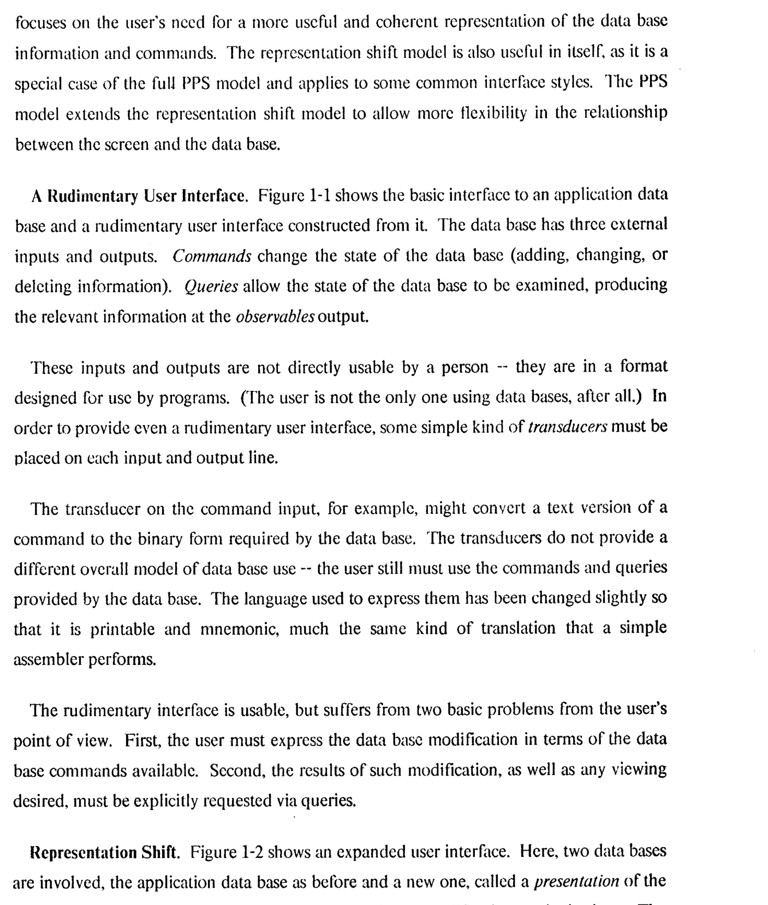

User
T
observables
queries -> Application
         Data
         Base
commands
T
User

<!-- page:013 -->

Figure 1-1: A Rudimentary User Interface

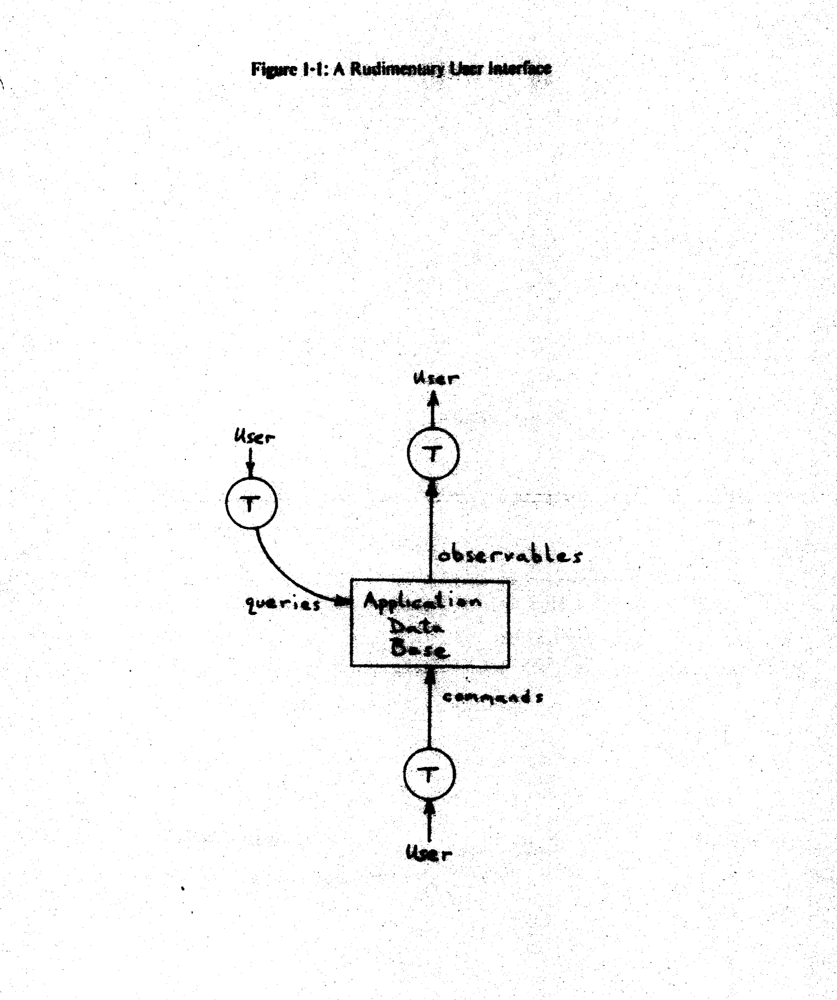

User
  ↑
 (T)

           User
             ↑
            (T)
             |
        observables
             |
      ┌────────────────────┐
      │ Application        │
      │ Data               │
      │ Base               │
      └────────────────────┘
          ← queries
             |
            (T)
             ↓
           User

<!-- page:014 -->

presentation data base contains the same information as the application data base, but it is represented in a way that is directly viewable, i.e., in terms of text and graphic forms. It is continuously displayed (on the user's terminal), so that the user does not have to explicitly request information to be viewed.

The presentation -- or, loosely speaking, the screen -- can be directly edited by the user, by means of the presentation editor. The editor allows the user to manipulate the forms on the screen, creating new forms or changing or deleting existing ones. Conceptually, it combines capabilities of a text editor with those of a graphics (diagram) editor. As these changes are made, their results are immediately visible.

In addition, the commands for presentation editing are chosen to be convenient for the user. For example, they might include a base of general text-editing and graphics-editing commands, so that the user does not have to learn a special language for each particular application data base.

The presenter creates the presentation data base from the application data base. At appropriate times as the user edits the presentations, the recognizer creates a new version of the application data base from the presentation data base. In the representation shift model the presentation contains all and only the information contained in the application data base. The presenter uses a single application data base query (labled get-db in the figure) to get a representation of the entire application data base, converts the representation, and then uses a single presentation data base command (labeled load-db) to load the entire presentation data base. Similarly, the recognizer gets the entire presentation contents, converts it, and loads the entire application data base.

In the representation shift model, the presenter relation must be invertible, since the recognizer must be able to specify the entire application data base from the presentation data base. In general the presenter relation is a subset of the recognizer relation, or in other words, the recognizer will recognize several different variants of the same presentation, allowing the user more latitude. For example, the recognizer might allow the user to create any of "12", "12.0", "12.000", etc., whereas the presenter might always choose "12.0".

<!-- page:015 -->

Figure 1-2: The Representation Shift Model

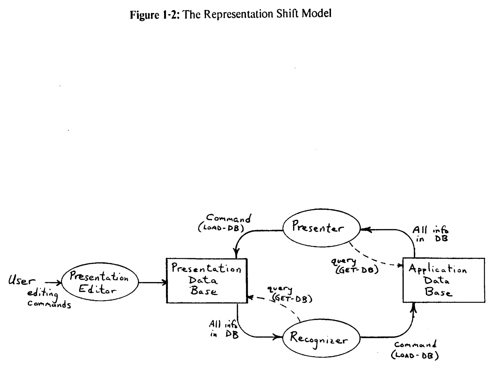

User -> Presentation Editor
editing commands

Presentation Editor -> Presentation Data Base

Presentation Data Base (box)
-> all info in DB -> Recognizer (oval)

Recognizer (oval)
-> command (LOAD-DB) -> Application Data Base (box)

Presenter (oval)
<- command (LOAD-DB) <- Presentation Data Base
Presenter -> query (GET-DB) (dashed) -> Application Data Base
Application Data Base (box)
All info in DB

<!-- page:016 -->

The representation shift model is a direct manipulation interface [Shneiderman 83]. The
screen continuously displays the data base. Whenever the data base changes, the screen is
updated. Similarly, the user manipulates the data base by manipulating the forms on the
screen, and the data base is continually updated from this.

The major restriction of the representation shift model is that the entire application data
base be viewed (and in an invertible presentation). This can lead to inefficiency. It can also
lead to the inconvenience of visual clutter -- the user cannot view just a relevant subset of a
complex data base. The ability to control the selection of information to be viewed and the
way it is to be viewed can be crucial to the successful use of the data base.

The Full PPS Model. The full PPS model, shown in figure 1-3, relaxes the restriction that
the entire application data base must be viewed. The presentation, i.e., the visual data base,
may convey only a small part of the information in the application data base. The screen
thus can no longer be recognized in a simple manner as specifying all the information in the
application data base. This necessitates a generalization in the recognizer from that in the
representation shift model: the recognizer translates editing actions into data base

The presenter is responsible for making the screen continually show the relevant part of
the data base. It creates the initial display and updates the display when the data base
changes. The presenter collects the relevant information from the application data base,
converts that information to text and/or graphics, and organizes the layout of this visual
information on the screen.

The recognizer causes the data base to change to reflect the user's editing of the
presentation. Specifically, in addition to affecting the screen, the user's editing operations
are recognized as -- i.e., translated into -- operations on the data base. Thus, the PPS model
is also a direct manipulation interface: the data base is continually presented on the screen,

<!-- page:017 -->

Figure 1-3: The Primitive Presentation System (PPS) Model

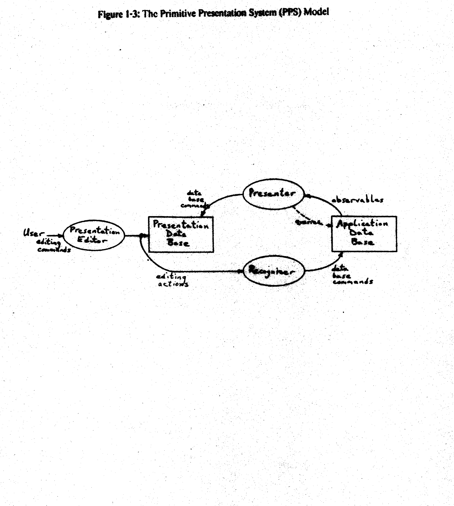

User -> Presentation Editor
User editing commands

Presentation Editor -> Presentation Data Base

Presentation Data Base (box)

Presentation Data Base -> Presenter
data base commands

Presenter (oval) -> Application Data Base (box)
observables

Presenter -> Application Data Base
sense

Presentation Data Base -> Recognizer
editing actions

Recognizer (oval) -> Application Data Base
data base commands

<!-- page:018 -->

with screen following data base changes (by presenter action) and data base following screen
changes (by recognizer action).

1.2 Constructing Larger Presentation System Models

The primitive presentation system model can be extended to model more complex
presentation systems as discussed in chapter three. The basic technique for extending the
presentation system model is to attach an additional presentation system to it, either
replacing or augmenting some part of it. The resulting presentation system may thus
contain several smaller presentation systems. The extensions discussed in this section are
suggested by examining the major limitations of the PPS model.

Adding a Planned Data Base. In the PPS model changes to the data base are immediate.
To avoid this, a second application data base can be added to a presentation system: a
future (i.e., planned) version of the original data base. The user can edit the planned
version's presentation, separate from the presentation of the current state of the data base.
When the planned version looks acceptable, the user gives a do it command that causes the
actual data base to be updated.

Adding a Data Base of Commands. In the PPS model the user cannot see a description of
the changes or the commands to effect them presented explicitly. (Only the data base that
results from these commands is seen.) Using a technique similar to the previous one of
adding a planned version of the data base, a data base of commands can be added. In this
extension, the planned changes are represented in the new data base explicitly, and can be
presented in a style different from the style for the application data base.

Adding Interfaces to PPS Components. In the PPS model the editor, presenter, and
recognizer are not presented; the user only has an interface of primitive signals to them
(e.g., keystrokes or a pointing device). To circumvent this limitation, presentation system
interfaces to these components can be added. One technique involves adding a data base
for the particular component's state, e.g., some options controlling the presenter's style, and
constructing presenters and recognizers for showing and manipulating it. Alternatively, a

<!-- page:019 -->

data base of commands for the component can be added, just as in the previous section a
command data base was added for the application data base.

1.3 Describing Presentation Systems

The presentation system model can be used as a descriptive tool. The model provides a
set of concepts for enumerating and categorizing basic functions and interactions in a user
interface, even when that interface was not designed with the model in mind.

In chapter four several user interfaces will be described using the presentation system
model. The selection exhibits a variety of interface styles in order to illustrate the model's
generality. In each example the focus will be on those presentation system mechanisms that
play the most important part in defining that particular style. Two interfaces, drawn from
those described in chapter four, are sketched below.

Xerox Star / Apple Lisa. The Xerox Star [Smith, Irby, Kimball, Verplank & Harslem 83]
and the Apple Lisa [Lisa 84] systems offer an interface using icons -- pictorial presentations
of commands and data. Some recognition is simple reference resolution such as pointing to
an icon that presents a particular command. Other recognition involves more complicated
inter-icon relations such as proximity. For example, in Lisa the user deletes a file by
moving the file's icon to a trash can icon. In both Star and Lisa the user prints the file by
moving its icon to the printer icon.

Emacs Dired. A subsystem of the Emacs editor [Stallman 81], Dired is used to perform
various directory operations. It is an example of an extended presentation system that
provides both direct manipulation of the data base (the directory being edited), e.g., when
certain file properties are changed, and planned operations, e.g., when files are marked for
later deletion. The planned deletions are presented as annotations to the presentation of the
current directory.

<!-- page:020 -->

1.4 PSBase: A Presentation System Base

Chapter five discusses PSBase, the prototype presentation system base that was implemented in the course of this research.

PSBase explicitly incorporates the presentation system model structure. It includes tools, mechanisms, and ready-made parts for building an interface consisting of an application data base, presentation data base, presenters, recognizers, and presentation editor. Domain-independent and style-independent mechanisms are provided and may be combined largely independently. These characteristics cause PSBase to be useful in constructing a wide range of interfaces.

Figure 1-4 shows the overall structure of PSBase. The data base mechanisms provide support for building application data bases structured in a network somewhat similar to knowledge representation networks. The network includes descriptions of the classes of objects as well as the objects themselves, and class inheritance is supported. An important point is that this network is used to build the presentation data base as well, and the presentation and application data bases are linked together into a large, uniformly structured data base. This uniformity is an important factor in the power of the PSBase mechanisms. PSBase predefines a large part of the presentation data base class network.

PSBase also provides mechanisms that accompany the presentation data base: Graphics redisplay ensures that the presentation data base is continuously displayed on the terminal.

Several presentation editor functions are provided; the interface builder may select these, as desired.

The presenter support and recognizer support modules provide a variety of tools and mechanisms for creating and controlling presenters and recognizers. Most important among these mechanisms is a language for describing presentation styles and general presenters that interpret these languages. The interface builder need only describe how the presentation structure relates to the application data base structure, and the presenters perform the actual creation and updating of the presentations.

<!-- page:021 -->

Figure 1-4: Structure of PSBase

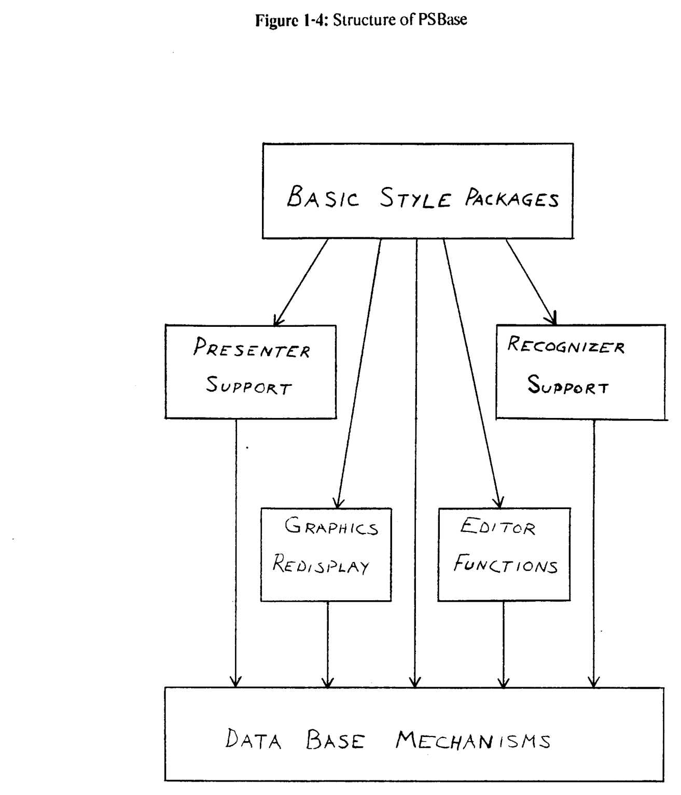

BASIC STYLE PACKAGES

PRESENTER
SUPPORT

RECOGNIZER
SUPPORT

GRAPHICS
REDISPLAY

EDITOR
FUNCTIONS

DATA BASE MECHANISMS

<!-- page:022 -->

A number of basic style packages offer specific components of domain-independent interface styles that the interface builder may choose to include. Some general presenters and recognizers are provided. For example, a presenter is provided to produce command menus. As another example, a recognizer is provided to interpret simple rule descriptions in order to recognize icon movement, similar to the Xerox Star and Apple Lisa systems (see section 1.3).

No claim is made that PSBase would serve as a production presentation system base. It is a prototype, and needs more and improved features of many kinds. It provides only a part of the presentation editor functions that would be needed. Many more domain-independent presenters and recognizers could be included. The presentation style description language could be improved and used to drive recognition as well. This would result in more uniformity in what the system can present and what it can recognize, providing the user with increased consistency and power.

1.5 Constructing User Interfaces

In order to demonstrate the utility of PSBase, three interfaces were constructed using the PSBase mechanisms and tools. The three interfaces share the same application data base, but embody different styles. The first style uses icons, similar to the Xerox Star and Apple Lisa system described in section 1.3. The second style uses text displays with accompanying command menus. The third style is a graphical annotation style, an extension of the Dired style described in section 1.3.

Some of the work was done once and shared between the three implementations, namely, the style-independent development of the application data base. Once that work was completed, implementing a particular style was largely a matter of writing a few small pieces using PSBase tools and choosing some standard PSBase ready-made parts from the basic style packages module.

<!-- page:023 -->

1.6 Related Work

This report discusses two developments, a domain-independent, style-independent presentation system base for building user interfaces, and its underlying model of user interfaces. This section discusses characteristics of the base and the model that distinguish it from other research. Two characteristics of both the base and the model are particularly important:

First, the model and the base attempt to concentrate on general mechanisms, independent of any particular domain and independent of any particular style. The intent has been that they should be free of value judgments concerning styles. Discussing what constitutes a good style or developing new styles are separate efforts; this research offers a conceptual vocabulary in which such a discussion can be phrased and offers a base for experimenting with or combining alternative styles.

Second, the model and the base center about the high-level concept of the presentation. This concept considers the semantic connection between the screen and the application. The model is structured to show how the presentation is used as a medium for communication between the user and the application. The emphasis in both the model and the presentation system base has been on the system aspects: how the system of processes and data bases are structured and interact regarding the presentation relationship. This research has not emphasized any one particular part of this system: several other studies emphasize the application data base, or the presentation data base, or presenters, or recognizers.

Other research that this work resembles can be classed into three broad areas: human factors, systems and techniques, and presentation systems. Although this research is related to these areas, the author knows of no other research that directly addresses the same goals of studying and providing support for a system of general user interfaces mechanisms. Rather than being an alternative approach, this work complements the others that are mentioned. The third area, presentation systems, is the closest to this research, in that its includes systems for aiding user interface construction, based on concepts similar to the presentation concept used here.

A number of basic style packages offer specific components of domain-independent interface styles that the interface builder may choose to include. Some general presenters and recognizers are provided. For example, a presenter is provided to produce command menus. As another example, a recognizer is provided to interpret simple rule descriptions in order to recognize icon movement, similar to the Xerox Star and Apple Lisa systems (see section 1.3).

No claim is made that PSBase would serve as a production presentation system base. It is a prototype, and needs more and improved features of many kinds. It provides only a part of the presentation editor functions that would be needed. Many more domain-independent presenters and recognizers could be included. The presentation style description language could be improved and used to drive recognition as well. This would result in more uniformity in what the system can present and what it can recognize, providing the user with increased consistency and power.

<!-- page:024 -->

presentation concept used here.

Human Factors.  At the psychological end of the spectrum, there have been several
efforts to which this research is somewhat related.  Two major kinds of work is described,
first, user modeling and, second, interface specification techniques and guidelines.  Some
representative research is mentioned.

There have been efforts to develop models of user behavior, user performance, and user
understanding of systems.  Often these studies concentrate on particular classes of users or
interface styles.  Shneiderman, for example, has examined a class of interface styles that he
terms direct manipulation [Shneiderman 83].  These interfaces are marked by "visibility of
the object of interest; rapid, reversible, incremental actions; and replacement of complex
command language syntax by direct manipulation of the object of interest."  He discusses
direct manipulation style, and its affect on and acceptance by different kinds of users, in
terms of a semantic/syntactic model of user behavior [Shneiderman & Mayer 79]
[Shneiderman 80].  According to this model, two kinds of knowledge about user interfaces
reside in long-term memory, syntactic and semantic.  Syntactic knowledge includes details
of command syntax; it has an arbitrary character and is easily forgotten unless frequently
used.  Semantic knowledge includes the hierarchically-structured concepts of functionality
and processes for performing various tasks.  Semantic knowledge is largely independent of
particular systems and is more easily retained.  The success of the direct manipulation style
follows from the fact that "the object of interest is displayed so that actions are directly in
the high-level problem domain," requiring little need for syntactic knowledge.

Modeling the user can be a tool for evaluating the behavioral style of an interface, by
studying the match between the interface behavior and the user behavior.  The presentation
system model, on the other hand, complements the user model by approaching the problem
from the other end, discussing the kinds and internal structures of interface mechanisms
that will by their interaction produce the particular overall behavior as seen by the user.

Some guidelines and formal techniques have been developed for specifying user interface
dialogs, a part of the user interface style.  Formal grammars (or, equivalently, state transition

<!-- page:025 -->

networks) are one technique for describing and designing the dialog between user and
computer [Reisner 81][Reisner 82][Bleser & Foley 82][Jacob 82][Brown 82]. Formal
grammars describe the interaction between user actions and system responses. Some
grammars include cognitive information, describing what a user has to learn and remember.
A grammar can be used as a design tool, evaluating designs for consistency and simplicity.
Problems users might have and mistakes they might make can be predicted.

As with user models, dialog descriptions are complemented by the work reported here.
One may identify three layers of study, all requiring models and description techniques:
general user interface mechanisms (presentation system model), overall user interface style
(dialog specifications), and the user (user models).

Systems and Techniques. The second area of related work is the building of systems,
from cooperative user interfaces to graphics systems, and the development of techniques to
use in such systems. Some of these projects tend to concentrate on one side or the other of
the presentation relation: on representing the knowledge in the application data base or on
manipulating and displaying the presentation data base. Others tend to concentrate on the
development of particular interface styles.

Research into cooperative user interfaces, such as the Cousin effort at CMU [Hayes 84]
and the Consul/Cue effort at Information Sciences Institute [Kaczmarek, Mark &
Wilczynski 83][Mark 81], study various ways that user interface can be more easily
constructed to actively aid the user. An important part of such systems is the provision of a
uniform view of the applications and a helpful assistant, based on an extensive description
of those applications or the interface styles. Such an assistant might try to understand why
the user is having difficulty or try to understand requests made in an unexpected form.

presentation concept used here.

Human Factors. At the psychological end of the spectrum, there have been several
efforts to which this research is somewhat related. Two major kinds of work is described,
first, user modeling and, second, interface specification techniques and guidelines. Some
representative research is mentioned.

There have been efforts to develop models of user behavior, user performance, and user
understanding of systems. Often these studies concentrate on particular classes of users or
interface styles. Shneiderman, for example, has examined a class of interface styles that he
terms direct manipulation [Shneiderman 83]. These interfaces are marked by "visibility of
the object of interest; rapid, reversible, incremental actions; and replacement of complex
command language syntax by direct manipulation of the object of interest." He discusses
direct manipulation style, and its affect on and acceptance by different kinds of users, in
terms of a semantic/syntactic model of user behavior [Shneiderman & Mayer 79]
[Shneiderman 80]. According to this model, two kinds of knowledge about user interfaces
reside in long-term memory, syntactic and semantic. Syntactic knowledge includes details
of command syntax; it has an arbitrary character and is easily forgotten unless frequently
used. Semantic knowledge includes the hierarchically-structured concepts of functionality
and processes for performing various tasks. Semantic knowledge is largely independent of
particular systems and is more easily retained. The success of the direct manipulation style

expla nations, flexible recovery from command language errors, and assistance in using
several different applications by understanding their functionality.

The research reported here is closer to the Cousin project. The Cousin project does not
concentrate on incorporating knowledge about application semantics, but rather on
developing a uniform interface style to support a user interface assistant. The assistant
corrects erroneous or abbreviated input, interacts with the user to resolve errors, and offers
integral and automatically generated on-line help and documentation. The Cousin system
provides a common interface base, separate from the application, that interprets an interface
definition provided by the application builder. This definition expresses the user interface
as a set of forms, with fields that convey information between the user and the application.

There is an emphasis in these research efforts on developing cooperative styles,
developing techniques for them (such as more intelligent recognizers), and for Consul/Cue,
investigating the problems of representing knowledge about the application's functionality.
The work reported in this report also relies heavily on the separation and uniformity of the
application data base mechanism. But this work has not studied the issues of knowledge
representation involved. Nor has it been involved with developing particular styles. And
unlike the cooperative systems projects, this work attempts to be able to model and support
arbitrary existing interface styles.

<!-- page:026 -->

explanations, flexible recovery from command language errors, and assistance in using
several different applications by understanding their functionality.

The research reported here is closer to the Cousin project. The Cousin project does not
concentrate on incorporating knowledge about application semantics, but rather on
developing a uniform interface style to support a user interface assistant. The assistant
corrects erroneous or abbreviated input, interacts with the user to resolve errors, and offers
integral and automatically generated on-line help and documentation. The Cousin system
provides a common interface base, separate from the application, that interprets an interface
definition provided by the application builder. This definition expresses the user interface
as a set of forms, with fields that convey information between the user and the application.

There is an emphasis in these research efforts on developing cooperative styles,
developing techniques for them (such as more intelligent recognizers), and for Consul/Cue,
investigating the problems of representing knowledge about the application's functionality.
The work reported in this report also relies heavily on the separation and uniformity of the
application data base mechanism. But this work has not studied the issues of knowledge
representation involved. Nor has it been involved with developing particular styles. And
unlike the cooperative systems projects, this work attempts to be able to model and support
arbitrary existing interface styles.

There are several research efforts studying different uniform styles of information
presentation and interaction, and several efforts at developing presentation and interaction
techniques for specific domains. For example, spatial data base management systems
[Herot 80] [Donelson 78], the Boxer system [diSessa 85], the Xerox Star [Purvy, Farrell &
Klose 83] [Smith, Irby, Kimball, Verplank & Harslem 83], and the Query-by-Example-
based office systems [Zloof 82] [Zloof & de Jong 77] all offer the user a consistent way of
interacting with a variety of applications. In a spatial data base management system, the
user accesses information by "moving through" the data base -- information from many
different domains is organized spatially, with related information nearby. Retrieval is

networks) are one technique for describing and designing the dialog between user and
computer [Reisner 81] [Reisner 82] [Bleser & Foley 82] [Jacob 82] [Brown 82]. Formal
grammars describe the interaction between user actions and system responses. Some
grammars include cognitive information, describing what a user has to learn and remember.
A grammar can be used as a design tool, evaluating designs for consistency and simplicity.
Problems users might have and mistakes they might make can be predicted.

As with user models, dialog descriptions are complemented by the work reported here.
One may identify three layers of study, all requiring models and description techniques:
general user interface mechanisms (presentation system model), overall user interface style
(dialog specifications), and the user (user models).

Systems and Techniques. The second area of related work is the building of systems,
from cooperative user interfaces to graphics systems, and the development of techniques to
use in such systems. Some of these projects tend to concentrate on one side or the other of
the presentation relation: on representing the knowledge in the application data base or on
manipulating and displaying the presentation data base. Others tend to concentrate on the
development of particular interface styles.

detail is controlled by zooming. In the Query-by-Example systems, on the other hand, the
user accesses different kinds of information by providing an example of the kind of
information desired. Several systems have been developed that offer complex presentation
techniques and styles for particular domains. Simulators are perhaps the most widely
known; the Steamer system [Stevens, Roberts & Stead 83], discussed in chapter four, is one
example. Another area of increasing interest is the presentation of the organization and
execution of programs, such as the Computer Corporation of America's program
visualization system [CCA 79], Henry Lieberman's Tinker system [Lieberman 84]
[Lieberman 83], and the Brown University system for program animation [Brown &
Sedgewick 84a] [Brown & Sedgewick 84b] [Brown & Sedgewick 84c]. The intent of the
work reported in this report is to develop a model and system that can be used to describe
and build any of these kinds of styles.

<!-- page:027 -->

detail is controlled by zooming. In the Query-by-Example systems, on the other hand, the user accesses different kinds of information by providing an example of the kind of information desired. Several systems have been developed that offer complex presentation techniques and styles for particular domains. Simulators are perhaps the most widely known; the Steamer system [Stevens, Roberts & Stead 83], discussed in chapter four, is one example. Another area of increasing interest is the presentation of the organization and execution of programs, such as the Computer Corporation of America's program visualization system [CCA 79], Henry Lieberman's Tinker system [Lieberman 84] [Lieberman 83], and the Brown University system for program animation [Brown & Sedgewick 84a][Brown & Sedgewick 84b][Brown & Sedgewick 84c]. The intent of the work reported in this report is to develop a model and system that can be used to describe and build any of these kinds of styles.

The books by Newman and Sproull [Newman & Sproull 79] and Foley and Van Dam [Foley & Van Dam 82] primarily discuss low-level drawing and interaction techniques for graphics systems. For the most part, they are concerned with only one kind of application data base -- geometric models of solids, surfaces, etc. Within the framework of the model of this report, their books discuss detailed techniques for building presentation editors and presentation data bases. However, concerning the presentation data base, their emphasis is more on representation at a low level, suitable for display processors, and does not attempt to offer a general representation technique. This is in contrast to the presentation system base of chapter five, for example, which uses a general description mechanism for both the presentation data base and the application data base. The standard graphics systems are less in need of such a scheme, as they are not involved with any sort of "reasoning" about the data bases, and instead need to perform computations efficiently. Thus, the graphics system should be viewed as a low-level component of a presentation data base as described in this report.

Information Presentation Systems. The research reported in this report most closely resembles research developing what have been called information presentation systems or systems for automatically synthesizing graphics environments, for example the Bharat system explanations, flexible recovery from command language errors, and assistance in using several different applications by understanding their functionality.

The research reported here is closer to the Cousin project. The Cousin project does not concentrate on incorporating knowledge about application semantics, but rather on developing a uniform interface style to support a user interface assistant. The assistant corrects erroneous or abbreviated input, interacts with the user to resolve errors, and offers integral and automatically generated on-line help and documentation. The Cousin system provides a common interface base, separate from the application, that interprets an interface definition provided by the application builder. This definition expresses the user interface as a set of forms, with fields that convey information between the user and the application.

There is an emphasis in these research efforts on developing cooperative styles, developing techniques for them (such as more intelligent recognizers), and for Consul/Cue, investigating the problems of representing knowledge about the application's functionality. The work reported in this report also relies heavily on the separation and uniformity of the application data base mechanism. But this work has not studied the issues of knowledge representation involved. Nor has it been involved with developing particular styles. And unlike the cooperative systems projects, this work attempts to be able to model and support arbitrary existing interface styles.

<!-- page:028 -->

[Gnanamgari 81], the View system [Friedell 83], and the AIPS system [Zdybel, Gibbons, Greenfeld & Yonke 81][Zdybel, Greenfeld, Yonke & Gibbons 81]. These systems all emphasize a knowledge-based approach to creating what this report would call intelligent presenters. The systems explicitly incorporate concepts similar to the presentation concept used here, particularly the AIPS system. All three systems have interesting and individual aspects, but from the point of view of this research, it will suffice to discuss the AIPS work as representative. (It was while working with the AIPS group that the author first started thinking about the presentation's use as an organizing concept for modeling user interfaces.)

The goal of AIPS as an information presentation system is to provide an interface to a large knowledge base or knowledge-based system. The system automatically generates displays from content-oriented (i.e., domain) specifications. (E.g., "display the ships in the Mediterranean.") AIPS is itself a knowledge-based system. Using a large knowledge base describing how structures of domain information can be related to structures of graphical displays, the system automatically selects or constructs an appropriate presentation style. A full information presentation system would include knowledge about the user, general domains, a wide variety of presentation styles, and human factors decisions involved in graphical display.

There are three aspects in which the work reported in this report differs from the AIPS research. First, this report addresses a more general class of interfaces than information presentation systems. Information presentation systems currently exist only in prototype form; there are many other kinds of interfaces to be supported now and, presumably, even when full information presentation systems are available. Most interfaces do not have intelligent or automatic presenters. One reflection of this difference is seen in the general model of interfaces developed in this report.

Second, this report emphasizes the system aspects of the interface, rather than concentrating on any one component of the system. This is one reason why this research and the others are complementary: the AIPS work considers presenters in detail; this work considers the relationship between presenters and the rest of the user interface system.

<!-- page:029 -->

Third, the most distinguishing characteristic of the AIPS work is its emphasis on issues of knowledge representation. This report does not address those issues, again because the emphasis here is not on intelligent presenters or on techniques of describing presentation styles. Relatively simple description techniques suffice for the PSBase system. However, the results of research into the representation of knowledge about graphical display could be incorporated into a production version of a presentation system base to great effect.

<!-- page:030 -->

Chapter Two

The Primitive Presentation System (PPS) Model

This chapter discusses the PPS model in detail. Figure 2-1 reproduces figure 1-3 of chapter one, except that here two new primitive-signal inputs are added, controls for the presenter and recognizer. Each of the components of the PPS model will be discussed in turn in sections below.

2.1 PPSCalc

The sections in this chapter use an example program called PPSCalc. This is a simple spreadsheet program, a trivial version of VisiCalc [Beil 82]. PPSCalc was designed specifically for this explanation -- its behavior strictly follows the PPS model. PPSCalc is illustrated in figures 2-2 and 2-3.

The spreadsheet consists of cells, organized in rows and columns. Each cell may be empty, contain just a numeric value, or contain a formula and a numeric value. In a cell with a formula, the numeric value is computed by the formula from the values in other cells. Cells which just have a numeric value -- no formula -- are called independent cells. Their values are set by the user. Cells which have a formula are called dependent cells. Their values are recomputed periodically, as will be discussed below. Cells with neither a formula nor a value are empty.

PPSCalc has two display modes, formula display and value display, illustrated by the two figures. Figure 2-2 shows the mode that displays the dependent cells' formulas. Figure 2-3 shows the mode displaying the dependent cells' values computed by those formulas.

PPSCalc is shown in figure 2-2 with an assignment of cell formulas for computing a simple bill, based on the prices for two kinds of items and the numbers of the items

<!-- page:031 -->

Figure 2-2: PPSCalc -- Formula Display


Figure 2-3: PPSCalc -- Value Display

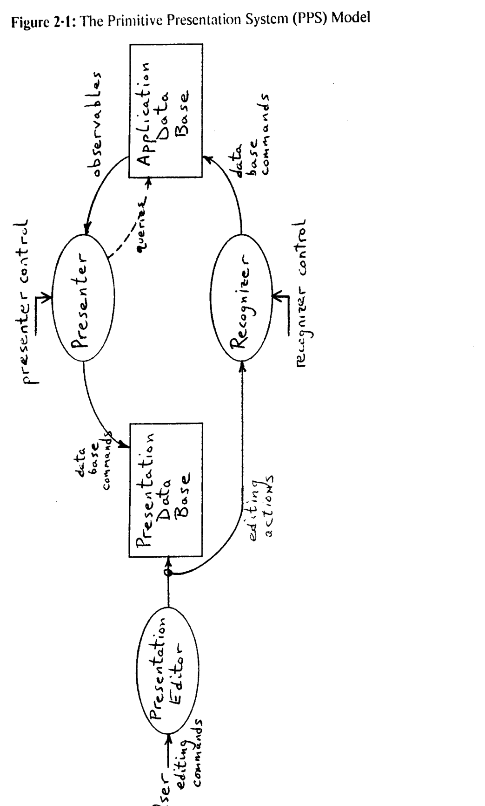

purchased.  The A1 and A2 independent cells specify the prices, and the B1 and B2
independent cells specify the number purchased.  Dependent cells C1 and C2 compute the
amount to be paid for the two items, and dependent cell C3 computes the total amount to
be paid.  Cells A3 and B3 are empty.

In both display modes, the visible contents of the cells can be edited, using the text editor
Emacs.  After a certain amount of editing, typically just changing the contents of one cell,
the user types the return key.  This signals PPSCalc to update the spreadsheet based on the
edits to the visible text.  Recalculation is then performed: each dependent cell, from left to
right, top to bottom, has its formula evaluated and its numeric value recalculated.  After
that, the visible text is updated to display any of the cells that changed.

For example, the user might edit the "5" in the B2 cell display to be "11", in order to
indicate that 11 items of the second kind are being purchased, instead of 5.  The display now
looks like figure 2-4.

The user types a return, and PPSCalc recalculates the dependent cells C1, C2, and C3.  C2

<!-- page:032 -->

Figure 2-2: PPSCalc -- Formula Display


A     B     C
1  100   20   A1*B1
2   75    5   A2*B2
3             C1+C2

Figure 2-3: PPSCalc -- Value Display

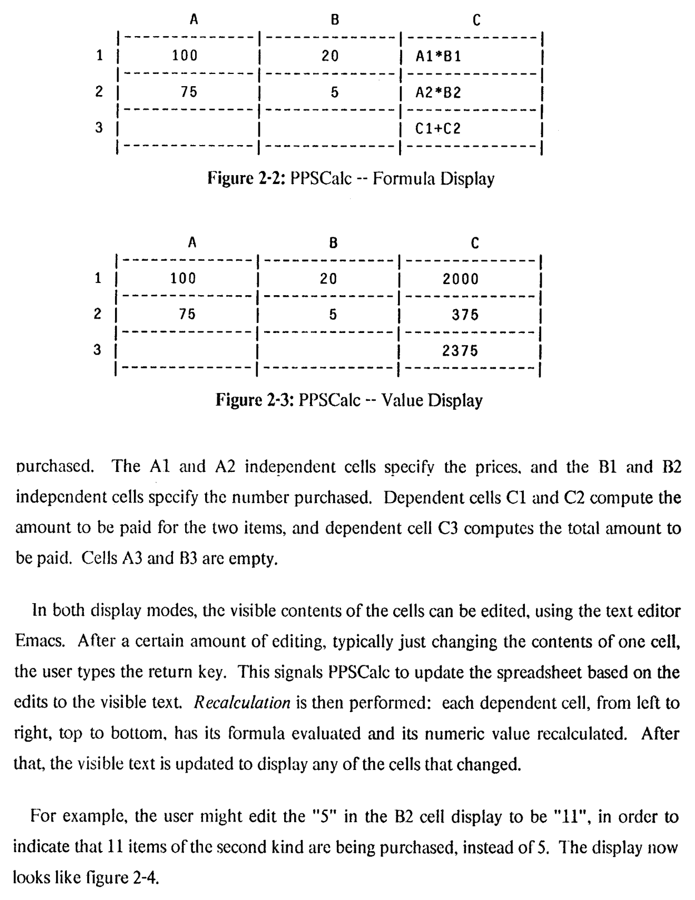

A     B     C
1  100   20   2000
2   75    5    375
3             2375

purchased. The A1 and A2 independent cells specify the prices, and the B1 and B2
independent cells specify the number purchased. Dependent cells C1 and C2 compute the
amount to be paid for the two items, and dependent cell C3 computes the total amount to
be paid. Cells A3 and B3 are empty.

In both display modes, the visible contents of the cells can be edited, using the text editor
Emacs. After a certain amount of editing, typically just changing the contents of one cell,
the user types the return key. This signals PPSCalc to update the spreadsheet based on the
edits to the visible text. Recalculation is then performed: each dependent cell, from left to
right, top to bottom, has its formula evaluated and its numeric value recalculated. After
that, the visible text is updated to display any of the cells that changed.

<!-- page:033 -->

Figure 2-4: PPSCalc -- After Editing


A   B   C
1 | 100 | 20  | 2000
2 |  75 | 11  |  375
3 |     |     | 2375

changes its value because of B2, and C3 because of C2. PPSCalc redisplays the spreadsheet,
showing the new bill, as in figure 2-5.

Figure 2-5: PPSCalc -- After Recalculation

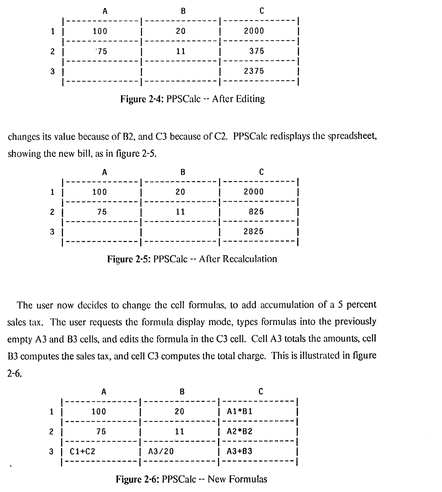
A   B   C
1 | 100 | 20  | 2000
2 |  75 | 11  |  825
3 |     |     | 2825

The user now decides to change the cell formulas, to add accumulation of a 5 percent
sales tax. The user requests the formula display mode, types formulas into the previously
empty A3 and B3 cells, and edits the formula in the C3 cell. Cell A3 totals the amounts, cell
B3 computes the sales tax, and cell C3 computes the total charge. This is illustrated in figure
2-6.

Figure 2-6: PPSCalc -- New Formulas


A       B      C
1 | 100 | 20  | A1*B1
2 |  75 | 11  | A2*B2
3 | C1+C2 | A3/20 | A3+B3

<!-- page:034 -->

When the user switches back to displaying the dependent values, these new formulas
result in the display shown in figure 2-7.

Figure 2-7: PPSCalc -- Values of New Formulas

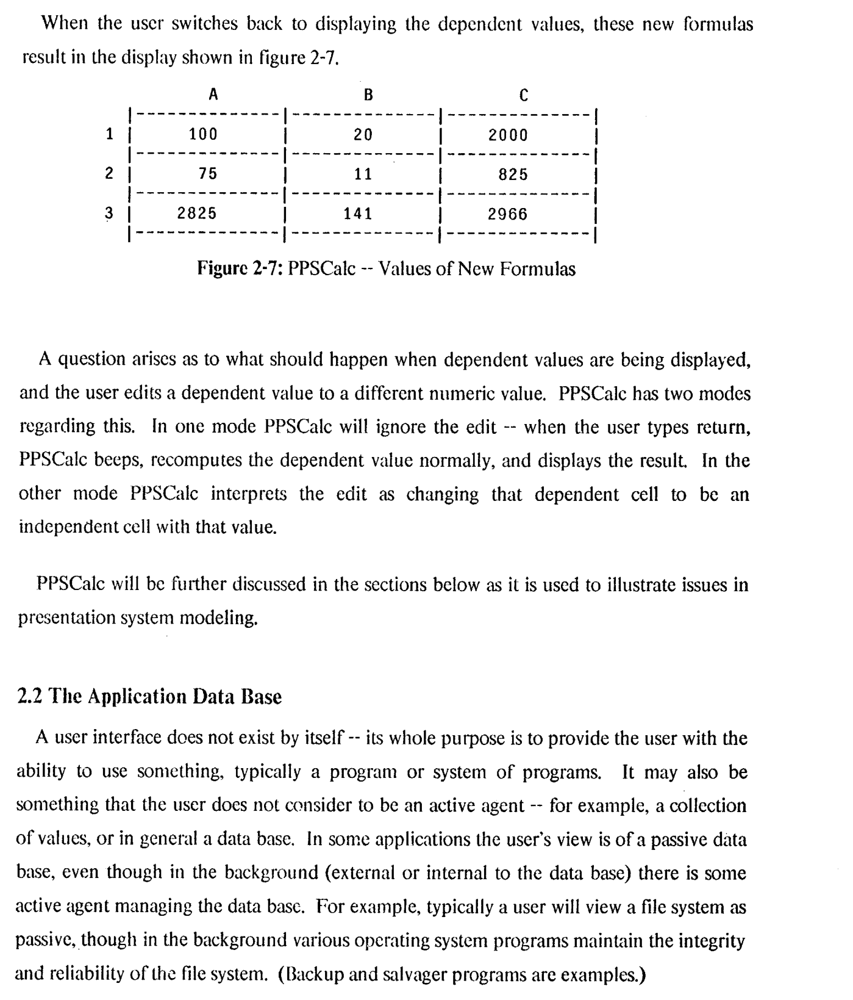

A       B       C
|-------|-------|-------|
1   100     20    2000
|-------|-------|-------|
2    75     11     825
|-------|-------|-------|
3  2825    141    2966
|-------|-------|-------|

A question arises as to what should happen when dependent values are being displayed,
and the user edits a dependent value to a different numeric value.  PPSCalc has two modes
regarding this.  In one mode PPSCalc will ignore the edit -- when the user types return,
PPSCalc beeps, recomputes the dependent value normally, and displays the result.  In the
other mode PPSCalc interprets the edit as changing that dependent cell to be an
independent cell with that value.

PPSCalc will be further discussed in the sections below as it is used to illustrate issues in
presentation system modeling.

2.2 The Application Data Base

A user interface does not exist by itself -- its whole purpose is to provide the user with the
ability to use something, typically a program or system of programs.  It may also be
something that the user does not consider to be an active agent -- for example, a collection
of values, or in general a data base.  In some applications the user's view is of a passive data
base, even though in the background (external or internal to the data base) there is some
active agent managing the data base.  For example, typically a user will view a file system as
passive, though in the background various operating system programs maintain the integrity
and reliability of the file system.  (Backup and salvager programs are examples.)

Any application can be viewed, from the perspective of the user interface, as a data base.

<!-- page:035 -->

In other words, interfacing to a data base, besides being an important case in itself, can
simulate the situation with other applications. For example, consider a user interface to an
application program where there is no obvious data base in the implementation. One such
example is a process control system, allowing the user to monitor and control the state of a
power generator, say. Here, much of the state is not in the program but in the physical
world: temperatures, pressures, etc. However, from the point of view of the user interface,
the behavior of the application program is similar to the behavior of a data base. The system
can thus be treated as a system that maintains a data base describing this world state and the
control options. In the model the job of the user interface system is to let the user view and
manipulate this world description.

Since any application can be viewed as a data base, for the model developed in this report
we will treat the user interface as providing the user with access to a data base. The user's
task will be to view and manipulate the contents of the data base.

The PPSCalc spreadsheet can be considered a data base. It has an active component,
namely recalculation, which determines the values of the dependent cells in the spreadsheet.

World Models. The basic data base model being used does not specify anything about
the internals of what is being called the application data base. It only matters that the data
base takes commands and queries and returns observables. Nothing is said about whether
the data base is implemented by information records, or by computation, or by connection
to the physical world. Its external behavior is that of a data base.

<!-- page:036 -->

Figure 2-8: World Model

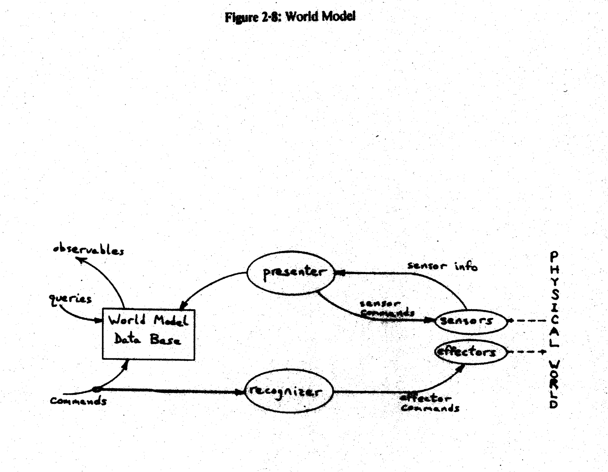

observables

queries

World Model
Data Base

commands

presenter

sensor info

sensor
observables

sensors

PHYSICAL
WORLD

effectors

recognizer

effector
commands

<!-- page:037 -->

presenter and recognizer perform the job of keeping the world model up to date and effecting changes to the physical world as the world model is manipulated. The interface to the physical world is much like an interface to another data base. Instead of queries, there are commands to sensors; instead of data base observables, there is the information returned by those sensors. Instead of data base commands, there are commands to effectors, the hardware that performs some physical-world action.

Cascaded Interfaces. This approach to modularizing a system can just as well apply to the case where there is another data base, instead of the physical world. In this case one set of programs (user interface programs in the special case) view and manipulate one data base, which is a representation of a second data base, viewed and manipulated by another set of programs.

This is not a symmetrical communication between two groups of programs. The second set of data base programs are generally unaware of the first set -- the first data base is intended to serve as an extended interface to the second, i.e., main, data base. In the special case of the user interface, ideally the application programs are unaware or at least not dependent on the structure, style, or operation of the presentation data base and its associated programs.

As a final note on this asymmetry, consider the presenter and recognizer in the user interface. They are not under shared responsibility of user and application program -- both are acting entirely for the user, under the user's control. The entire user interface subsystem is an internal agent of the user, not an impartial intermediary between two equal communicators.

2.3 The Presentation Data Base

We now consider the other components of the PPS, those strictly within the user interface system. The presentation data base is the symbolic description of the screen comprising presentations and their properties and relations; it conveys information about the data base. Though it is not the purpose of this research to study in detail such representation issues, this section will identify the basic properties of presentation structure that concern a presentation system.

<!-- page:038 -->

this section will identify the basic properties of presentation structure that concern a
presentation system.

The Simplicity of Two Data Bases.  An interface containing two data bases, the
presentation data base and the application data base, may at first seem to be more complex
for the user than the rudimentary data base user interface discussed in chapter one.
However, the situation for the user is actually much better in a PPS user interface.

Many of the details of the application data base's interface are hidden from the user.  The
application data base still has an interface of commands, queries, and observables, but the
user does not deal with that interface -- only the presenter, recognizer and any outside
programs do.  The user is no longer concerned with the access and organization of the
application data base -- the user deals only with the presentation data base.

The presentation data base has a more direct interface than the rudimentary data base
model did.  The presentation editor has taken the place of the command transducer.  The
commands for presentation editing are chosen to be convenient for the user.  For example,
they might include a base of general text-editing commands, so that the user does not have
to learn a special language for a particular application data base.

Also, as mentioned above, the presentation data base is in a form directly viewable by the
user.  There is essentially no need for queries to the presentation data base, since the
presentation is directly and continuously viewed.  There are only a few vestigial queries,
remaining in the form of viewing commands to scroll the screen, for example.

Name Presentations.  Name presentations are the most fundamental of presentations,
conveying no other information other than the identity of a data base object.  Complex,
structured presentations are built out of name presentations.  In PPSCalc, column names
(e.g., "A") are examples of name presentations presenting a particular column.  Single digits
are name presentations presenting the numbers 0 through 9.  Formula operation symbols
(e.g., "+") are name presentations presenting particular arithmetic operations.

<!-- page:039 -->

Name presentations do not have parts or properties that are also presentations. A name
presentation may have structure, e.g., smaller text or graphical forms that are part of it, but
any parts are not in themselves presenting domain information. For example, from the
point of view of a map, the letters in the name "Boston", while parts of the text string, do
not individually present information.

Composite Presentations.  Composite presentations, on the other hand, have graphical
structure in which a larger presentation is constructed from smaller presentations. The
composite presentation as a whole presents some domain information, and in addition some
of its parts or properties present domain information as well. Generally, the hierarchical
structuring of sub-presentations into a composite presentation follows a similar structure of
the information in the data base. For example, the entire PPSCalc text table is a
presentation of the spreadsheet. The presentation is composed of text string presentations
for the values and formulas of cells, and those cells in turn are parts of the spreadsheet.

In PPSCalc the presentation "A2" is composed of the name presentations "A" and "2",
presenting column and row. The presentation "A2" as a whole presents a particular cell or
the value contents of it. Similarly the numeral presentation "75" is composed of digit
presentations. However, the presentation "75" is generally not just a presentation of the
number 75 -- in figure 2-2 on page 30, for example, it is a presentation of the number in the
A2 cell, i.e., a presentation of a property of or fact about the A2 cell. It is the value of this
property that is the number 75. The presentation style here presents the property by
presenting its value. It is essentially a composite presentation composed of just one sub-
presentation.

Composite presentations, as well as name presentations, may have parts or properties that
are not in themselves presentations. For example, the overall PPSCalc presentation has the
grid as one of its parts. The grid, however, is not a presentation. It serves a purpose in the
overall presentation -- it makes the communication more effective -- but it is not itself
presenting anything in the data base. It is a kind of template, in which presentations are
placed. A common example of template presentations is a bibliographic reference, such as

<!-- page:040 -->

"[Carroll65]". The brackets are a part of the composite presentation, but do not present anything. The parts "Carroll" and "65", on the other hand, are presentations.

Relations and Properties. Relations between presentations and properties of presentations can themselves convey information. Presentation style frequently imposes strong conventions on such "non-object" presentations. A relation between two presentations, such as nearness, alignment, or comparative size, can be chosen to convey information, frequently reinforcing information presented in some other way. A property of a presentation, such as its size, color, font, position, or direction, can similarly present information. The information presented by the property is usually very closely related to the information presented by the presentation form, just as composite presentation structure generally follows domain structure.

PPSCalc as shown above has no example of property presentations. However, if it were to display dependent values in a manner different from independent values, e.g., in a different font, the font of the text would be a property presentation. Many examples of property presentations can be found in road maps. A line, for example, presents a particular road, and the line's color presents the class of road (highway, street, dirt road). Frequently, a property presentation presents a property of the object presented by the presentation form. For example, the color of an area of a map may present the amount of rainfall in the geographical area presented.

Name presentations do not have parts or properties that are also presentations. A name presentation may have structure, e.g., smaller text or graphical forms that are part of it, but any parts are not in themselves presenting domain information. For example, from the point of view of a map, the letters in the name "Boston", while parts of the text string, do not individually present information.

Composite Presentations. Composite presentations, on the other hand, have graphical structure in which a larger presentation is constructed from smaller presentations. The composite presentation as a whole presents some domain information, and in addition some of its parts or properties present domain information as well. Generally, the hierarchical structuring of sub-presentations into a composite presentation follows a similar structure of the information in the data base. For example, the entire PPSCalc text table is a presentation of the spreadsheet. The presentation is composed of text string presentations for the values and formulas of cells, and those cells in turn are parts of the spreadsheet.

<!-- page:041 -->

2.4 The Presentation Editor

The presentations can be directly edited by the user by means of the presentation editor. It allows the user to manipulate the forms on the screen, creating new forms or changing or deleting existing ones. It combines capabilities of a text editor with those of a graphics (diagram) editor. As changes are made, their results are immediately visible.

Graphics Redisplay. The screen is continually updated to reflect changes in the presentation data base, in a process called graphics redisplay. It is this process that involves traditional graphics (drawing) routines. Graphics redisplay is in effect another presentation system, taking the information in the presentation data base, expressed in terms of symbolic graphic forms (text, circles, lines, etc.), and converting it to a data base of pixels, for instance.

This report will not concentrate on this level of presentation system, for two reasons. First, it has been studied extensively elsewhere [Newman & Sproull 79] [Foley & Van Dam 82]. Second, it is usually not the level at which the user is interacting conceptually. The user typically does not think about or use commands that are defined in terms of pixels, but rather in terms of symbolic forms. These symbolic forms are the ones that present the application data base. A presentation style presents a number as text, for example, but it does not matter whether the graphics system chooses a bitmap or vector display technique to present that text on the screen.

2.5 The Presenter

The presenter process models the decisions and actions of constructing or updating a presentation. The presenter can be divided into three major parts, the domain collector, the semantic presenter, and the organizational presenter, as shown in figure 2-9.

<!-- page:042 -->

Figure 2-9: Presenter Parts

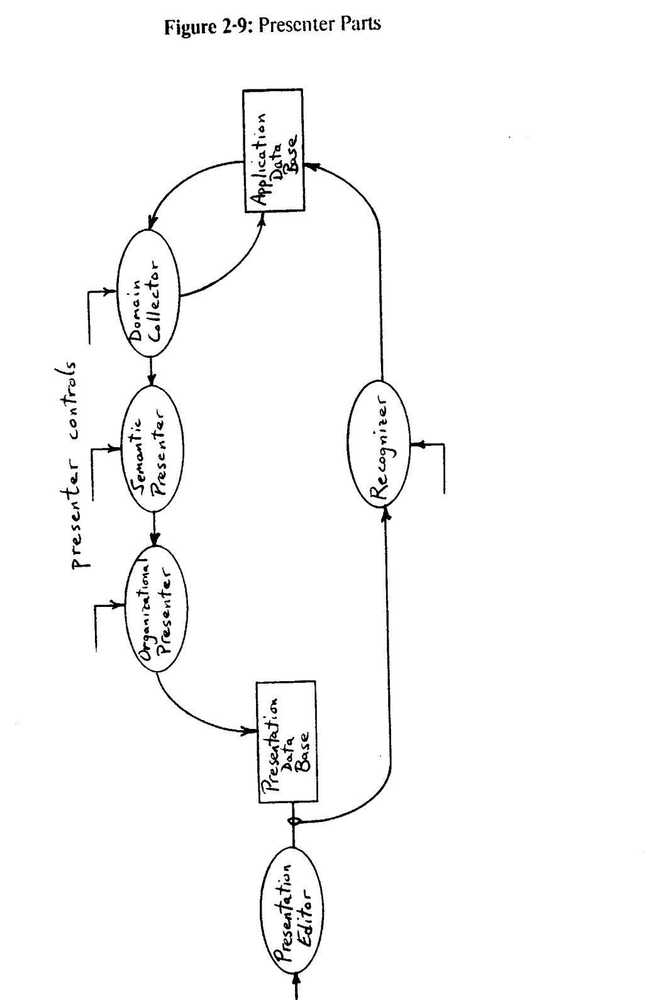

Application
Data
Base

Presentation
Data
Base

Presentation
Editor

Organizational
Presenter

Semantic
Presenter

Domain
Collector

Recognizer

presenter controls

2.4 The Presentation Editor

The presentations can be directly edited by the user by means of the presentation editor.

It allows the user to manipulate the forms on the screen, creating new forms or changing or
deleting existing ones.  It combines capabilities of a text editor with those of a graphics
(diagram) editor.  As changes are made, their results are immediately visible.

Graphics Redisplay.  The screen is continually updated to reflect changes in the
presentation data base, in a process called graphics redisplay.  It is this process that involves
traditional graphics (drawing) routines.  Graphics redisplay is in effect another presentation
system, taking the information in the presentation data base, expressed in terms of symbolic
graphic forms (text, circles, lines, etc.), and converting it to a data base of pixels, for
instance.

This report will not concentrate on this level of presentation system, for two reasons.

The domain collector finds and interprets the relevant part of the data base.  The domain
collector understands the organization of the application data base, the query language, and
the format of the observables.  It is the part of the presenter that connects with the data
base.  Given the specification of what is to be selected, it constructs the needed queries and
passes them to the data base.  The observables (or parts of them) are then assembled into
the information needed by the semantic presenter.

The domain collector thus has knowledge about the kind of domain information that will
be relevant for the user interface, and about the way that information is represented in the
application data base.  It does not, on the other hand, know anything about the way such
information will be presented to the user.  In PPSCalc the domain collector accesses the
internal variables that implement the data base cells, collecting the formulas or cell values
for use by the semantic presenter.

The semantic presenter embodies the primary mapping from data base domain to visual domain, the kind of mapping specified by a map legend, for example.  It specifies the particular visual elements (text strings, circles, lines, etc.) to be used, and those relationships between them that directly convey data base information.  It may partially specify some of these relationships, e.g., that some text string (a label) should be near some other object, leaving the organizational presenter to specify the exact position (taking into account purely spatial relationships, such as overlap and clutter).

<!-- page:043 -->

data base, and knowledge about purely visual considerations.

The domain collector finds and interprets the relevant part of the data base. The domain
collector understands the organization of the application data base, the query language, and
the format of the observables. It is the part of the presenter that connects with the data
base. Given the specification of what is to be selected, it constructs the needed queries and
passes them to the data base. The observables (or parts of them) are then assembled into
the information needed by the semantic presenter.

The domain collector thus has knowledge about the kind of domain information that will
be relevant for the user interface, and about the way that information is represented in the
application data base. It does not, on the other hand, know anything about the way such
information will be presented to the user. In PPSCalc the domain collector accesses the
internal variables that implement the data base cells, collecting the formulas or cell values
for use by the semantic presenter.

The semantic presenter embodies the primary mapping from data base domain to visual
domain, the kind of mapping specified by a map legend, for example. It specifies the
particular visual elements (text strings, circles, lines, etc.) to be used, and those relationships
between them that directly convey data base information. It may partially specify some of
these relationships, e.g., that some text string (a label) should be near some other object,
leaving the organizational presenter to specify the exact position (taking into account purely
spatial relationships, such as overlap and clutter).

In PPSCalc the semantic presenter converts the numeric values and formulas (formulas
are stored in the data base as small programs) to text strings. It also creates the text strings
that label the rows and columns.

Figure 2-9: Presenter Parts

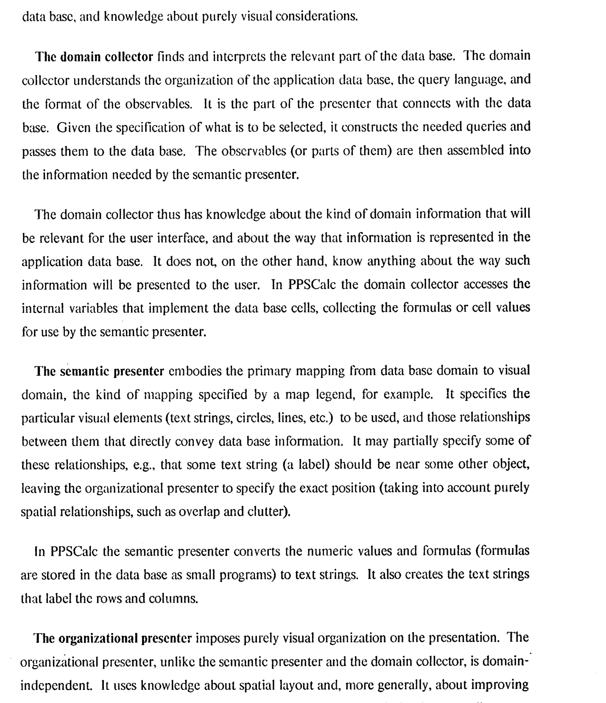

Application Data Base
  (rectangular box at top; arrow from Domain Collector to it and arrow from it down to Recognizer)

Domain Collector
  (oval; arrow down to Semantic Presenter; arrow right to Application Data Base)
  presenter controls (handwritten label along left side pointing to Domain Collector)

Semantic Presenter
  (oval; arrow down to Organizational Presenter)

Organizational Presenter
  (oval; arrow down to Presentation Data Base)

Presentation Data Base
  (rectangular box; arrow down to Presentation Editor)

Presentation Editor
  (oval at bottom; arrow up from User)

Recognizer
  (oval on right; arrow up to Application Data Base; arrow left toward other flow)

User
  (label at very bottom with arrow to Presentation Editor)

<!-- page:044 -->

positioning to avoid clutter, fonts, spacing, and highlighting. The semantic presenter might
sometimes partially specify some of these, e.g., specifying that some text or graphic form
should be highlighted. The organizational presenter, however, has the job of pinning down
these specifications. It typically takes into account the other forms that will be on the
screen. Once the semantic presenter has made its typically local decisions about visual
styles, the organizational presenter reasons about the larger groups of forms and their visual
interactions.

This view, that the presenter stages successively restrict the specification of the visual
presentation, can be extended into the presentation data base itself. Part of the job of the
presentation data base is to maintain a screen image reflecting the presentation information.
As discussed in section 2.4, this is a task of traditional graphics packages. They too restrict
the specification of the visual presentation, e.g., determining which pixels are to be set or
choosing fonts if not otherwise specified.

In PPSCalc the organizational presenter uses a tabular layout for the overall presentation.
The organizational presenter also is responsible for creating the table's grid. (Some much
more intelligent organizational presenter might decide whether or not to use a grid,
embodying various kinds of human factors knowledge. The decision is fixed in PPSCalc.)
Within the grid cells, numeric values are aligned in one style (right ends of the number
strings aligned), and formulas are aligned in another style (left justified in the cell).

One issue not discussed in chapter one is user control of the presenter and recognizer.
The presenter has an input, called presenter control. This is a primitive command signal
interface to the presenter that controls the style it uses and what it will present from the data
base. In PPSCalc there is just one such control, a key that toggles whether formulas or
dependent values are presented. In general, there may be different presenter control inputs,
affecting the three components of the presenter.

<!-- page:045 -->

2.6 The Recognizer

The recognizer process observes the user's editing of the screen presentations and interprets this as manipulation of the data base. As with presenters, recognizers are divided into three major parts, namely, the organizational recognizer, the semantic recognizer, and the domain changer, as shown in figure 2-10.

The organizational recognizer identifies the spatial relationships, presentations, and actions upon them that are relevant. It imposes a syntactic structure on these. Organizational recognition is generalized parsing. Text parsing is a special case; the more general organizational recognition works with text, graphical forms, visual properties and relationships, and editing actions. In general, the organizational recognizer is looking for changes to the presentation structure from the user's editing.

The semantic recognizer translates the syntactic structure into a semantic structure describing changes to the data base information. Generally this involves assigning interpretations to the text forms, graphic forms, spatial properties, spatial relationships, editing actions, and the syntactic relationships among these elements.

The separation of recognition of presentation structure from recognition of the semantic structure can be seen in the division of natural language parsers and compilers into syntactic and semantic modules.

The domain changer translates this description of changes into the actual data base commands necessary to effect those changes.

In PPSCalc the organizational recognizer, when considering the presentation structure for the presentation of the C2 cell's formula, for instance, starts by finding the position where this presentation is located within the grid presentation. It then parses the formula from the surrounding spaces and decomposes it into tokens (e.g., "A2", "*", and "B2"). The semantic recognizer converts this into the program required for the data base cell. The domain changer performs the actual modifications of the internal variables.

Figure 2-10: Recognizer Parts

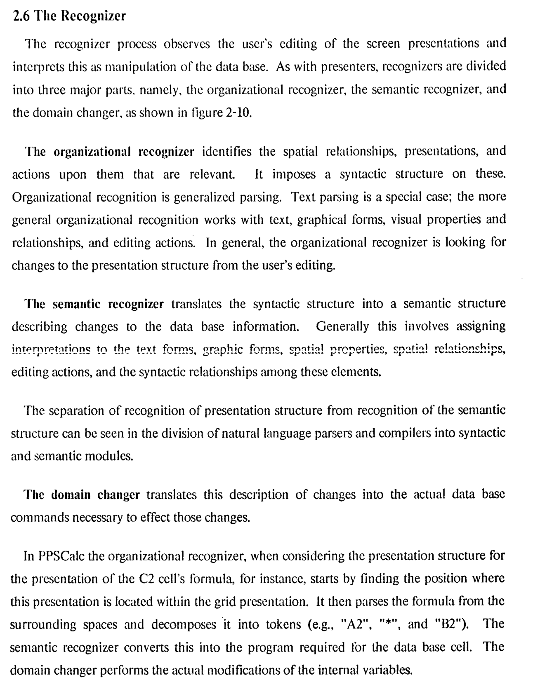

Presentation Editor
User editing commands

Presentation Data Base

Presenter

Organizational Recognizer

Semantic Recognizer

Domain Changer

Recognizer Controls

Application Data Base

<!-- page:046 -->

2.6 The Recognizer

The recognizer process observes the user's editing of the screen presentations and interprets this as manipulation of the data base. As with presenters, recognizers are divided into three major parts, namely, the organizational recognizer, the semantic recognizer, and the domain changer, as shown in figure 2-10.

The organizational recognizer identifies the spatial relationships, presentations, and actions upon them that are relevant. It imposes a syntactic structure on these. Organizational recognition is generalized parsing. Text parsing is a special case; the more general organizational recognition works with text, graphical forms, visual properties and relationships, and editing actions. In general, the organizational recognizer is looking for changes to the presentation structure from the user's editing.

The semantic recognizer translates the syntactic structure into a semantic structure describing changes to the data base information. Generally this involves assigning interpretations to the text forms, graphic forms, spatial properties, spatial relationships, editing actions, and the syntactic relationships among these elements.

The separation of recognition of presentation structure from recognition of the semantic structure can be seen in the division of natural language parsers and compilers into syntactic and semantic modules.

The domain changer translates this description of changes into the actual data base commands necessary to effect those changes.

In PPSCalc the organizational recognizer, when considering the presentation structure for the presentation of the C2 cell's formula, for instance, starts by finding the position where this presentation is located within the grid presentation. It then parses the formula from the surrounding spaces and decomposes it into tokens (e.g., "A2", "*", and "B2"). The semantic recognizer converts this into the program required for the data base cell. The domain changer performs the actual modifications of the internal variables.

<!-- page:047 -->

The PPSCalc example just given illustrates only a special case of recognition, namely
recognition based on just the visible presentations, the results of whatever editing took
place. This special case is very similar to the representation shift model discussed earlier,
and is an inverse operation to that of the presenter. However, the more general kind of
recognition takes account of the editing actions as well. Different edits that produce the
same result might be recognized as different changes to the data base. (Whether such
recognition is performed, or the extent to which it is performed, depends on the particular
application and user community. But a general model should be able to account for such
behavior.)

Consider some examples in PPSCalc. Suppose that the spreadsheet is currently in the
state corresponding to figures 2-2 and 2-3 on page 30. The user is viewing dependent
values, as in figure 2-3. Consider the possible recognition when the user moves the "2375"
in the C3 cell to the A3 cell, e.g., by deleting the text in the C3 cell, and undeleting it into
the A3 cell. The presentation that results is shown in figure 2-11.

Figure 2-11: PPSCalc -- Value Moved

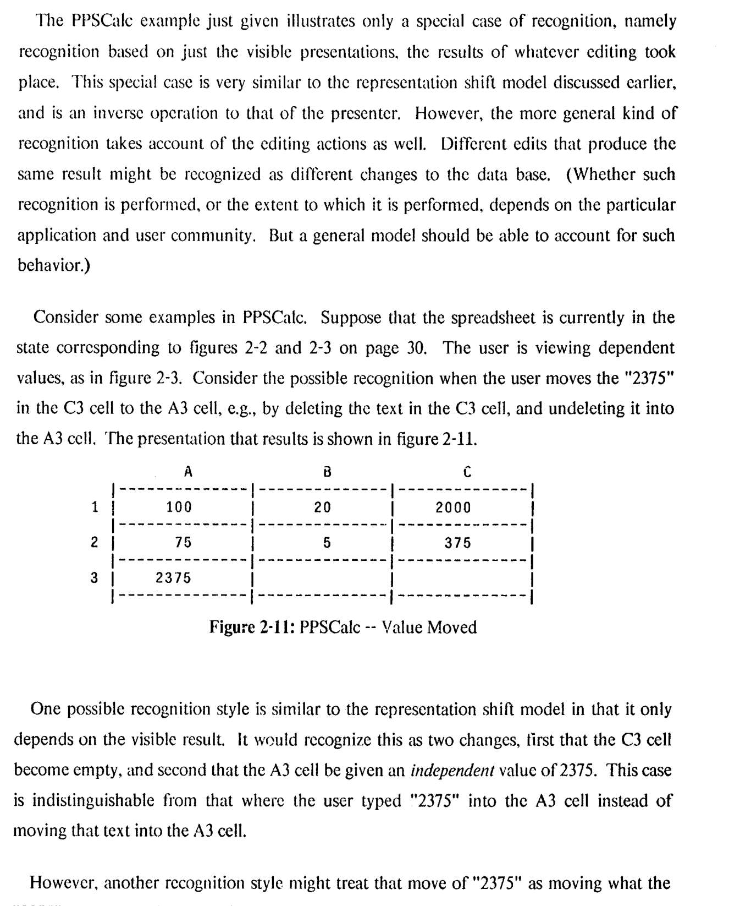

Table (visible presentation):
A | B | C
1 | 100 | 20 | 2000
2 | 75  | 5  | 375
3 | 2375 |    |

One possible recognition style is similar to the representation shift model in that it only
depends on the visible result. It would recognize this as two changes, first that the C3 cell
become empty, and second that the A3 cell be given an independent value of 2375. This case
is indistinguishable from that where the user typed "2375" into the A3 cell instead of
moving that text into the A3 cell.

However, another recognition style might treat that move of "2375" as moving what the
"2375" presents -- the dependent value computed by the formula C1+C2. Thus moving

<!-- page:048 -->

the "2375" from the C3 cell to the A3 cell might be recognized as the two actions, first that
the A3 cell be given the C3 cell's formula C1 + C2, and second that the C3 cell be emptied
(as before). The visible result is as in figure 2-11 above. However, switching into the mode
displaying formulas shows the different effect of the recognition:

A       B       C
|---------|---------|---------|
1 |   100   |   20    |   A1*B1  |
|---------|---------|---------|
2 |    75   |    5    |   A2*B2  |
|---------|---------|---------|
3 |  C1+C2  |         |         |
|---------|---------|---------|

Figure 2-12: PPSCalc -- Formula Moved

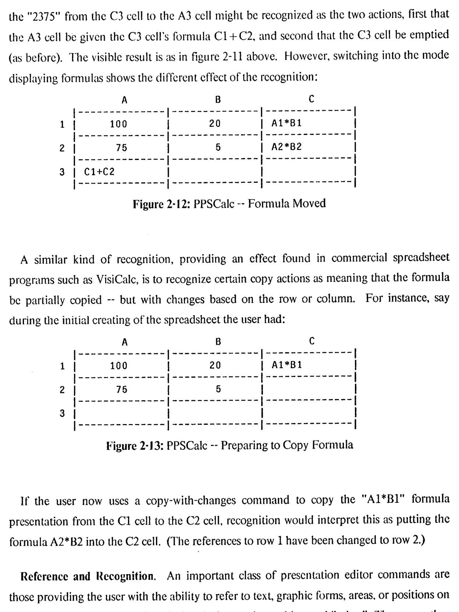

A similar kind of recognition, providing an effect found in commercial spreadsheet
programs such as VisiCalc, is to recognize certain copy actions as meaning that the formula
be partially copied -- but with changes based on the row or column. For instance, say
during the initial creating of the spreadsheet the user had:

A       B       C
|---------|---------|---------|
1 |   100   |   20    |   A1*B1  |
|---------|---------|---------|
2 |    75   |    5    |         |
|---------|---------|---------|
3 |  2375   |         |         |
|---------|---------|---------|

Figure 2-13: PPSCalc -- Preparing to Copy Formula


If the user now uses a copy-with-changes command to copy the "A1*B1" formula
presentation from the C1 cell to the C2 cell, recognition would interpret this as putting the
formula A2*B2 into the C2 cell. (The references to row 1 have been changed to row 2.)

Reference and Recognition. An important class of presentation editor commands are

<!-- page:049 -->

possibilities, such as using arrow keys to move a pointer around the screen, or keyboard commands that refer to positions, quadrants, etc. by name or coordinates. The reference capabilities provided by a pointing device can be extended by tracking the pointer, thus achieving the ability to refer to areas or groups of forms, for instance. Although reference does not change the visible presentations, it is an important editor action since it undergoes recognition.

PPSCalc could be extended to include reference recognition. For example, a reference to an independent value presentation could be recognized as a command to increment that value. As another example, a reference to a cell containing a formula and then to a blank cell could be recognized as a command to copy the formula to the second cell. (This could perhaps include changes to accommodate different columns and rows as mentioned earlier).

When Recognition Happens. In the PPS model recognition happens continually and is in effect over the entire screen (i.e., over the entire presentation data base). The intent is that the screen continually present the state of the data base, providing the user with direct manipulation of the data base by continual presenter and recognizer action. Some presentation editor command sets may allow such continuity at the granularity of single commands, i.e., allow recognition to happen after every single command. However, in general there may be groups of commands that, taken together, form a larger atomic unit from the recognizer's point of view.

For instance, in PPSCalc the recognizer is not be able to act upon a partially typed, syntactically incomplete formula such as ")+A2". (It would be possible, though, to have a more tolerant organizational recognizer -- in this case parser -- that allows this string and assigns some sort of interpretation to it, such as the interpretation for "(0)+A2".) In PPSCalc typing the return key signals the end of an atomic edit. After each return, the recognizer is invoked, the data base changed, the presenter invoked, and the presentation data base updated.

Recognizer Controls. Figure 2-10 on page 44 shows recognizer controls, a primitive command signal that affects the operation of the recognizer. In PPSCalc a single-key

<!-- page:050 -->

command toggles how the recognizer will treat edits of a dependent value (for the mode when dependent values, not formulas, are displayed). One choice is to treat the edit as an error and just ignore it. The other choice is to treat the edit as changing that cell to be an independent cell with that value. (The formula is erased.) In general, there may be recognizer control inputs for each of the recognizer components.

2.7 The Representation Shift Model and Direct Manipulation

The representation shift model, introduced in chapter one, is a special case of the PPS model. It is shown in figure 2-14. In the representation shift model, the presentation data base contains all and only the information in the application data base. As a result, the presenter and recognizer have simpler, more restricted tasks. The presenter gets a representation of the entire application data base, converts it, and loads the entire presentation data base. The recognizer has the opposite operation: the recognizer gets a representation of the entire presentation data base, converts it, and loads the entire application data base.

The representation shift model and the PPS model embody different metaphors. In the representation shift metaphor the presenter creates a picture of the data base. The user edits the picture. At the end of an atomic edit, the recognizer makes the data base be what is depicted. In the PPS metaphor the presenter creates a picture of typically a small view of a subset of the data base. The user edits the picture. The recognizer watches how the user makes the changes and changes the data base in the same way.

In the representation shift model, the presentation data base must contain all the information in the application data base. This is equivalent to saying that the entire application data base be viewed. (And because of this restriction, the converter can simply load the entire application data base from its translations of the presentation data base.) This restriction can be inefficient for large data bases or when rapid user interaction with the application is desired. The restriction is unacceptable when the size of the data base gets so large that the time to perform the translation cycle between the application and

possibilities, such as using arrow keys to move a pointer around the screen, or keyboard commands that refer to positions, quadrants, etc. by name or coordinates. The reference capabilities provided by a pointing device can be extended by tracking the pointer, thus achieving the ability to refer to areas or groups of forms, for instance. Although reference does not change the visible presentations, it is an important editor action since it undergoes recognition.

PPSCalc could be extended to include reference recognition. For example, a reference to an independent value presentation could be recognized as a command to increment that value. As another example, a reference to a cell containing a formula and then to a blank cell could be recognized as a command to copy the formula to the second cell. (This could perhaps include changes to accommodate different columns and rows as mentioned earlier).

When Recognition Happens. In the PPS model recognition happens continually and is in effect over the entire screen (i.e., over the entire presentation data base). The intent is that the screen continually present the state of the data base, providing the user with direct manipulation of the data base by continual presenter and recognizer action. Some presentation editor command sets may allow such continuity at the granularity of single commands, i.e., allow recognition to happen after every single command. However, in general there may be groups of commands that, taken together, form a larger atomic unit from the recognizer's point of view.

<!-- page:051 -->

Figure 2-14: Representation Shift Model

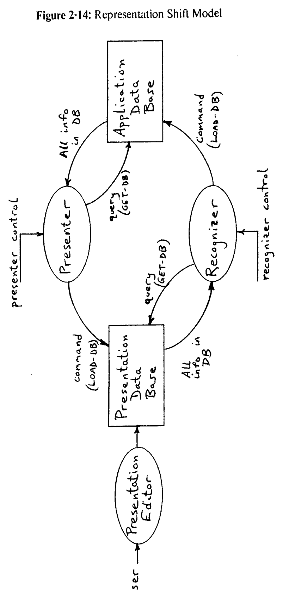

Application Data Base
  (rectangle at top)

Presenter  <-- All info in DB --  Application Data Base
  (oval left)               query (GET-DB) ->

Recognizer  <-- command (LOAD-DB) --  Application Data Base
  (oval right)             

Presentation Data Base
  (rectangle center-bottom)
  command (LOAD-DB) -> Presenter
  All info in DB -> Recognizer
  query (GET-DB) -> Recognizer
  query (GET-DB) -> Presenter

Presentation Editor
  (oval bottom)
  User -> Presentation Editor

presenter control -> Presenter
recognizer control -> Recognizer

command toggles how the recognizer will treat edits of a dependent value (for the mode
when dependent values, not formulas, are displayed). One choice is to treat the edit as an
error and just ignore it. The other choice is to treat the edit as changing that cell to be an
independent cell with that value. (The formula is erased.) In general, there may be
recognizer control inputs for each of the recognizer components.

2.7 The Representation Shift Model and Direct Manipulation

The representation shift model, introduced in chapter one, is a special case of the PPS
model. It is shown in figure 2-14. In the representation shift model, the presentation data
base contains all and only the information in the application data base. As a result, the
presenter and recognizer have simpler, more restricted tasks. The presenter gets a
representation of the entire application data base, converts it, and loads the entire
presentation data base. The recognizer has the opposite operation: the recognizer gets a
representation of the entire presentation data base, converts it, and loads the entire
application data base.

In the representation shift model, the presentation data base must contain all the
information in the application data base. This is equivalent to saying that the entire
application data base be viewed. (And because of this restriction, the converter can simply
load the entire application data base from its translations of the presentation data base.)
This restriction can be inefficient for large data bases or when rapid user interaction with

presentation data bases is slower than the desired interaction time. It also leads to
inconvenient visual clutter; the user cannot view just a relevant portion of the data base.
This is a serious problem for complex data bases. The ability to control the selection of
information to be viewed and the way it is to be viewed can be crucial. However, for small
application data bases, the representation shift model can be advantageous by virtue of its
great simplicity.

Because of the no-formula display mode, PPSCalc is not presenting all the information in
the application data base. (The data base is the collection of spreadsheet cells). PPSCalc is
therefore not simply a representation shift user interface, and must be modeled with the full
PPS model. However, if the display of spreadsheet cells were modified to show both the
formula and the value, PPSCalc could be modeled as a representation shift interface.

Because of the restriction that the presentation data base convey all the information in the
application data base, the representation shift model has another difference from the PPS
model -- the representation shift recognizer need only look at the current state of the
presentation data base, not the sequence of editing operations that produced it. The editing
operations cannot matter: if two editing actions result in the same visual data base state,
they must be equivalent.

<!-- page:052 -->

presentation data bases is slower than the desired interaction time. It also leads to inconvenient visual clutter; the user cannot view just a relevant portion of the data base. This is a serious problem for complex data bases. The ability to control the selection of information to be viewed and the way it is to be viewed can be crucial. However, for small application data bases, the representation shift model can be advantageous by virtue of its great simplicity.

Because of the no-formula display mode, PPSCalc is not presenting all the information in the application data base. (The data base is the collection of spreadsheet cells). PPSCalc is therefore not simply a representation shift user interface, and must be modeled with the full PPS model. However, if the display of spreadsheet cells were modified to show both the formula and the value, PPSCalc could be modeled as a representation shift interface.

Because of the restriction that the presentation data base convey all the information in the application data base, the representation shift model has another difference from the PPS model -- the representation shift recognizer need only look at the current state of the presentation data base, not the sequence of editing operations that produced it. The editing operations cannot matter: if two editing actions result in the same visual data base state, they must be equivalent.

For example, there can be no difference between (1) moving a presentation from one place to another and (2) first deleting that presentation and then creating at the second position a new presentation that looks exactly like the first one. Similarly, there can be no such thing as renaming an object by editing its name. Editing its name must be equivalent to deleting the object and then creating a new one with the second name. In fact renaming really has no meaning for the application data base, since it is produced completely from the recognizer's data. In other words, all the objects are created anew.

For the full PPS model we assume that the presentation data base conveys only a subset of the information in the application data base, often a small subset. The representation shift model can be slightly extended to apply to some cases of subset presentation. When the subset of the application data base is separable from the rest of the application data base, i.e., there are no references into or out of the subset, the presentation data base can show all the information of that part of the application data base. In effect, that subset is being treated as an entire application data base in its own right.

The restriction of the PPS model that produces the representation shift model can be summarized by examining the functions between the presentation and application data bases, as defined by the presenter and recognizer operations. Define the presenter function to be the mapping of presentation data base states from application data base states as produced by the presenter. Similarly, define the recognizer function to be the mapping of application data base states from presentation data base states as produced by the recognizer.

The presenter function must be invertible, so that the presentation data base conveys all the information about the application data base. The recognizer function is an extension of the presenter's inverse. The recognizer generally extends the inverse for the convenience of the user: the user can create any of several variations on the form that the presenter would have chosen. For example, the PPSCalc recognizer allows latitude in positioning of formulas within cell presentations, even though the presenter always aligns the formulas with the left edge of the cell. We can say that there are generally sets of presentation data base states that are equivalent: the presenter produces only one of these states, but the user and the recognizer interpret the others as conveying the same information.

<!-- page:053 -->

i.e., there are no references into or out of the subset, the presentation data base can show all the information of that part of the application data base. In effect, that subset is being treated as an entire application data base in its own right.

The restriction of the PPS model that produces the representation shift model can be summarized by examining the functions between the presentation and application data bases, as defined by the presenter and recognizer operations. Define the presenter function to be the mapping of presentation data base states from application data base states as produced by the presenter. Similarly, define the recognizer function to be the mapping of application data base states from presentation data base states as produced by the recognizer.

The presenter function must be invertible, so that the presentation data base conveys all the information about the application data base. The recognizer function is an extension of the presenter's inverse. The recognizer generally extends the inverse for the convenience of the user: the user can create any of several variations on the form that the presenter would have chosen. For example, the PPSCalc recognizer allows latitude in positioning of formulas within cell presentations, even though the presenter always aligns the formulas with the left edge of the cell. We can say that there are generally sets of presentation data base states that are equivalent: the presenter produces only one of these states, but the user and the recognizer interpret the others as conveying the same information.

In the PPS model, however, the presenter and recognizer functions are of a different nature, because of the need to allow operations on only partial presentations. The major difference is that the domain of the recognizer function is not the range of the presenter function. The presenter maps from application data base to presentation data base. The recognizer, however, maps from sequences of presentation editing commands to sequences of data base commands. Figure 2-15 shows a schematic form of the PPS model that highlights these mappings.

A restriction is placed on the decoupling of the presenter and recognizer functions in the full PPS model. This restriction gives the PPS model a direct manipulation style similar to

<!-- page:054 -->

Figure 2-15: Functional Mapping in the PPS Model

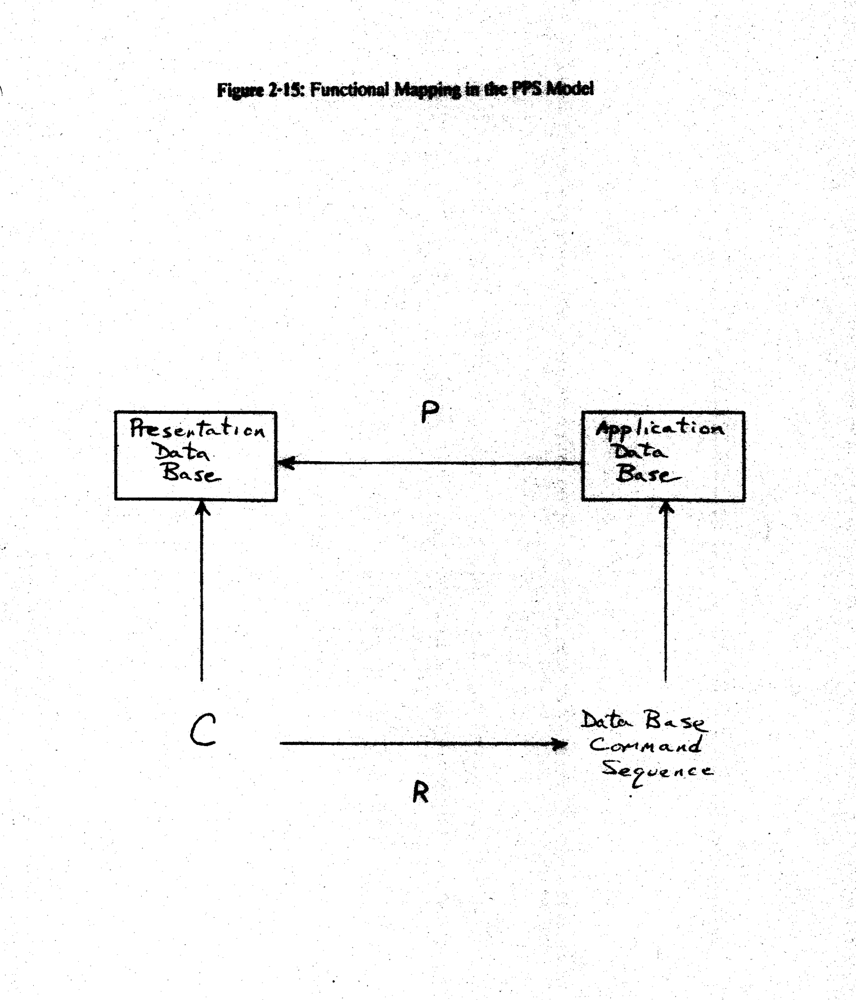

Presentation Data Base  <-- P -->  Application Data Base

C  (vertical arrow up into Presentation Data Base)        (vertical arrow up into Application Data Base)

C  ----------------------------->  Data Base Command Sequence
                         R

<!-- page:055 -->

the style of the representation shift model. The restriction can be stated by expanding the
notion of inverse presenter and recognizer functions, as discussed for the representation
shift model:

Consider sequences of presentation editing commands as functions, mapping one
presentation data base state to another. Similarly, sequences of data base commands map
one application data base state to another. If P is the presenter relation, R is the recognizer
relation, and C is any particular atomic presentation editing command sequence, the
restriction can be stated in the following form (using "*" for function composition and
"== " for equivalence of two presentation data base states due to recognizer tolerance):

C * P  ==  P * R(C)

In other words, the editing commands C acting on a presentation data base created by the
presenter P should result in the same presentation data base as would result from the
presentation of the application data base that results from recognition of those editing
commands.

There are interfaces where the style of recognition is very different from the style of
presentation -- i.e., the above rule is not even approximated. In such an interface the editing
action may directly but temporarily result in a presentation data base state very different
from what the presentation data base will be after recognition and presenter update. This
report does not attempt to argue whether such a user interface style is good or bad, nor does
the restriction on the PPS model eliminate such a user interface from consideration. Rather,
the restriction changes the way the user interface would be modeled -- it cannot be modeled

as a PPS. The techniques discussed in chapter three can be used, however, to model such a
user interface as an extended presentation system. In particular it will be modeled as a
combination of one PPS capturing the presentation and another PPS capturing the
recognition. By modeling the user interface as an extended system, the very different nature
of presentation and recognition is highlighted.

<!-- page:056 -->

Chapter Three

Constructing Larger Presentation System Models

This chapter shows how the primitive presentation system (PPS) model can be extended
to model more complex presentation systems.  Chapter four contains several examples of
complex presentation system models of existing user interfaces.  The basic technique for
extending a presentation system model is to attach an additional presentation system to it,
either replacing or augmenting some part of it.  The resulting presentation system may thus
contain several smaller presentation systems.  The particular extensions discussed in this
chapter are suggested by an examination of the major limitations of the PPS model:

* The user can only make immediate changes to the data base -- there is no
  planning.

* The user can only see the current state of the application data base resulting
  from the commands to change it -- there is no presentation of the commands
  themselves or the differences between states.

* The user can only interact with the presentation editor, presenter, and
  recognizer through primitive signals -- there are no presentation system
  interfaces to these components.

Each of these limitations suggests a particular extension.  The limitations and the
extensions are discussed in the following sections.

3.1 Adding a Planned Data Base

The first major limitation of the PPS model is that it only allows immediate changes to the
application data base.  In the PPS model, as the user edits the presentation, continual
recognition causes the application data base to change accordingly.  This can be
inconvenient if the user would like to see what the result looks like before committing to it.
Immediate change can also be a more serious problem if the application data base changes

the style of the representation shift model.  The restriction can be stated by expanding the
notion of inverse presenter and recognizer functions, as discussed for the representation
shift model:

Consider sequences of presentation editing commands as functions, mapping one
presentation data base state to another.  Similarly, sequences of data base commands map
one application data base state to another.  If P is the presenter relation, R is the recognizer
relation, and C is any particular atomic presentation editing command sequence, the
restriction can be stated in the following form (using "*" for function composition and
"== " for equivalence of two presentation data base states due to recognizer tolerance):

C * P  ==  P * R(C)

In other words, the editing commands C acting on a presentation data base created by the
presenter P should result in the same presentation data base as would result from the
presentation of the application data base that results from recognition of those editing
commands.

There are interfaces where the style of recognition is very different from the style of
presentation -- i.e., the above rule is not even approximated.  In such an interface the editing
action may directly but temporarily result in a presentation data base state very different
from what the presentation data base will be after recognition and presenter update.  This
report does not attempt to argue whether such a user interface style is good or bad, nor does
the restriction on the PPS model eliminate such a user interface from consideration.  Rather,
the restriction changes the way the user interface would be modeled -- it cannot be modeled

are irreversible.  This is often the case when an application program or physical process is
being controlled through the data base.  Therefore, if the presentation system model is to
support the construction of user interfaces where the user can postpone the effects of
commands -- i.e., where the user can plan changes -- the PPS model must be extended.

One method of postponing changes is to add a new, second, data base that is a future (i.e.,
planned) version of the original data base.  This is illustrated in figure 3-1.  The user can edit
the planned version's presentation, separate from the presentation of the actual data base,
and when the planned version looks acceptable, give a "do it" command that causes the
actual data base to be updated.  The "do it" command, like the other commands affecting
the application data base, emanates from the recognizer.  The user may cause this to happen
either by a direct recognizer control signal or by performing some presentation editing
command that is recognized as a "do it."

In general the planned version of the application data base will behave similarly to the
actual data base, ideally reproducing all the active components.  For example, in PPSCalc a
planned data base ideally would include all the recalculation capabilities of the actual data
base.  When this is the case, the user does not lose power or convenience in manipulating
the planned version over what the user would have had manipulating the actual data base.

As with the other extensions discussed in this chapter, this is only an illustration of the
technique of extending a presentation system to achieve some goal.  This extension
technique may be used in combination with other presentation system structures.

For example, figure 3-2 shows a combination of the straightforward PPS model and the
future data base model discussed above.  This combination allows the user to have two
presentations at once, one showing the future version of the data base, the other showing the
current version of the data base.  With two separate presentations and presentation editors,
the user can interact with both, planning some changes and effecting some changes
immediately.

<!-- page:057 -->

are irreversible. This is often the case when an application program or physical process is being controlled through the data base. Therefore, if the presentation system model is to support the construction of user interfaces where the user can postpone the effects of commands -- i.e., where the user can plan changes -- the PPS model must be extended.

One method of postponing changes is to add a new, second, data base that is a future (i.e., planned) version of the original data base. This is illustrated in figure 3-1. The user can edit the planned version's presentation, separate from the presentation of the actual data base, and when the planned version looks acceptable, give a "do it" command that causes the actual data base to be updated. The "do it" command, like the other commands affecting the application data base, emanates from the recognizer. The user may cause this to happen either by a direct recognizer control signal or by performing some presentation editing command that is recognized as a "do it."

In general the planned version of the application data base will behave similarly to the actual data base, ideally reproducing all the active components. For example, in PPSCalc a planned data base ideally would include all the recalculation capabilities of the actual data base. When this is the case, the user does not lose power or convenience in manipulating the planned version over what the user would have had manipulating the actual data base.

As with the other extensions discussed in this chapter, this is only an illustration of the technique of extending a presentation system to achieve some goal. This extension technique may be used in combination with other presentation system structures.

For example, figure 3-2 shows a combination of the straightforward PPS model and the future data base model discussed above. This combination allows the user to have two presentations at once, one showing the future version of the data base, the other showing the current version of the data base. With two separate presentations and presentation editors, the user can interact with both, planning some changes and effecting some changes immediately.

<!-- page:058 -->

Figure 3-1: Planned Data Base Extension

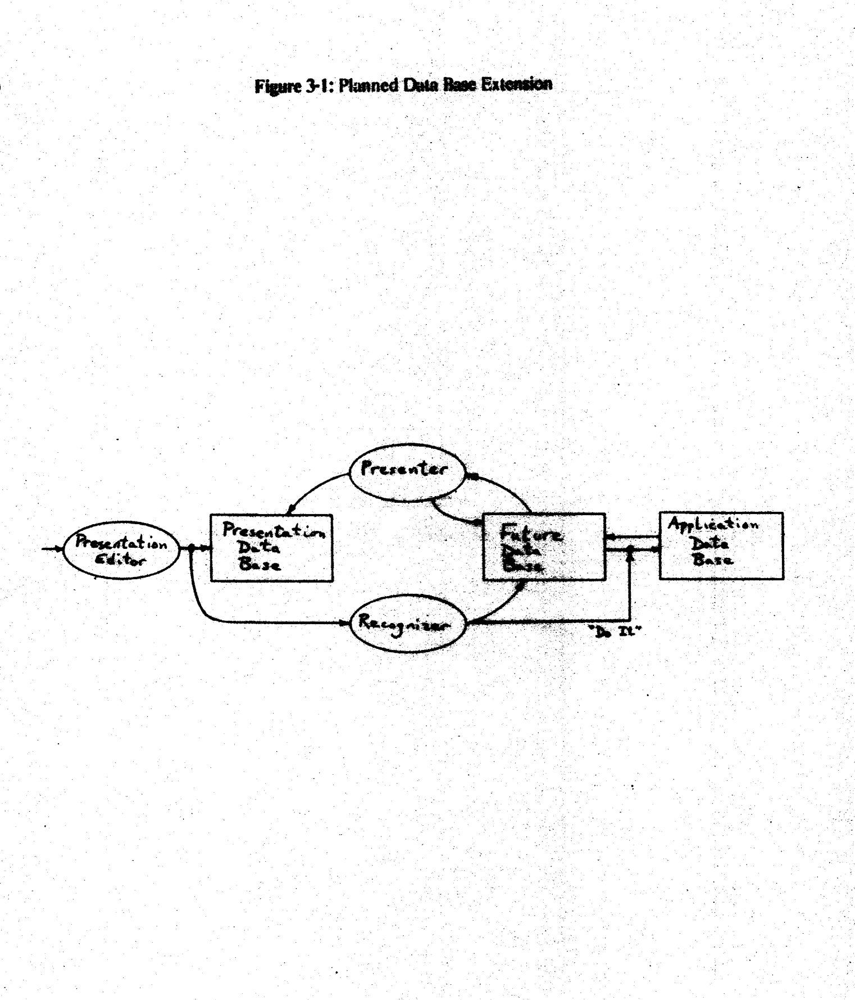

Presentation Editor -> Presentation Data Base

Presentation Data Base -> Presenter

Presenter -> Future Data Base

Future Data Base -> Application Data Base

Presentation Editor --(curved)-> Recognizer

Recognizer -> Future Data Base

Recognizer --"Do It"--> Application Data Base

<!-- page:059 -->

Figure 3-2: Extension with Both Planning and Immediate Changes

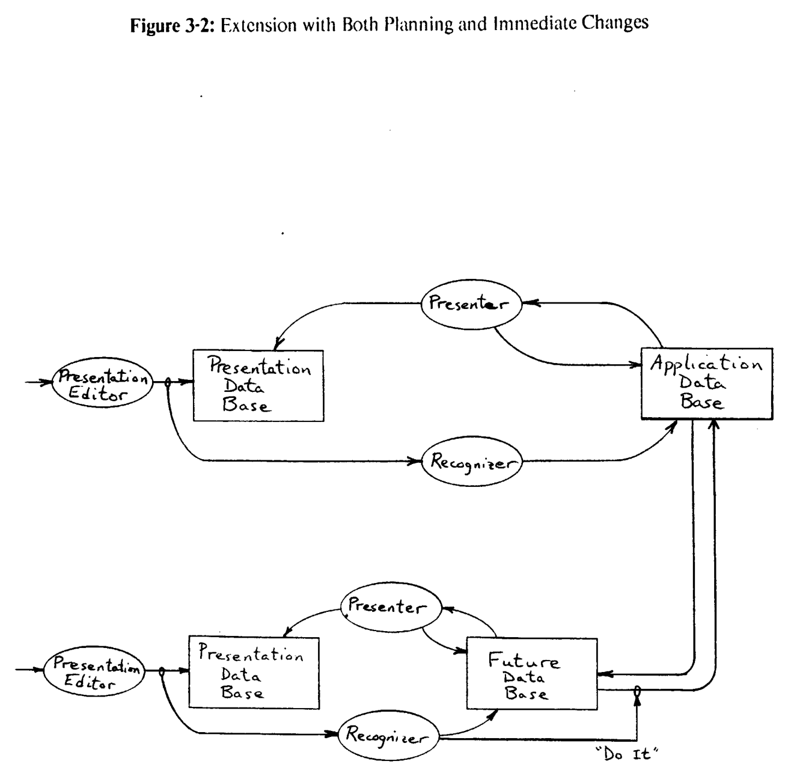

Presenter (top) <-> Application Data Base
Presentation Editor -> Presentation Data Base -> Presenter (top)
Presentation Data Base -> Recognizer -> Application Data Base
Presenter (bottom) -> Future Data Base -> Application Data Base
Presentation Editor -> Presentation Data Base (bottom) -> Recognizer -> "Do It" -> Application Data Base

<!-- page:060 -->

### 3.2 Adding a Data Base of Commands

The second major limitation of the PPS model is that the user cannot see a description of the changes or the commands to effect them presented explicitly. The PPS model offers the user a feeling of direct manipulation of the application data base contents. However, it is sometimes safer or more convenient to see and edit a command or a description of the change to be made. So, although direct manipulation is becoming more and more common and is undeniably useful, a complete model must support the construction of interfaces in which change is described or seen. Some systems may offer a combination of direct manipulation and command editing. Others may offer the ability to see or prescribe the kinds of changes desired -- goals -- without specifying the particular operations needed to achieve these goals.

Instead of adding a planned version of the data base, with content and presentation style mirroring the actual data base, a data base of the plans or commands themselves can be added. In this extension, the planned changes are represented in the new data base explicitly and can be presented in a style different from that of the actual data base.

Figure 3-3 shows an extended presentation system in which the user can interact with the application data base directly, via the PPS at the top of the figure, and also indirectly, by giving commands to the application data base via the PPS at the bottom of the figure. The bottom PPS has a data base containing commands for the application data base above. The user can see and edit these commands presented in the presentation data base in the bottom PPS. When the user gives the "do it" command, these data base commands are passed to the application data base.

Thus this extension also gives the user a planning capability, and is similar in structure to the previous extension in that a new data base has been added as a buffer. The difference is that the data base in this case has commands, whereas in the previous case it was a copy of the application data base.

Figure 3-2: Extension with Both Planning and Immediate Changes

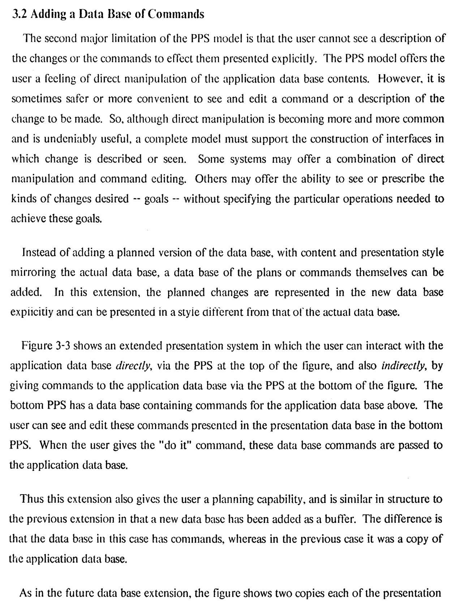

Presentation Editor
Presentation Data Base
Presenter
Application Data Base
Recognizer
Presenter (second)
Presentation Data Base (second)
Future Data Base
"Do It"

Figure 3-3: Command Data Base Extension


Presentation Editor
Presentation Data Base
Presenter
Application Data Base
Recognizer
Presentation Editor (second)
Presentation Data Base (second)
Presenter (second)
Data Base Commands
Recognizer (second)
"Do It"

<!-- page:061 -->

Figure 3-3: Command Data Base Extension

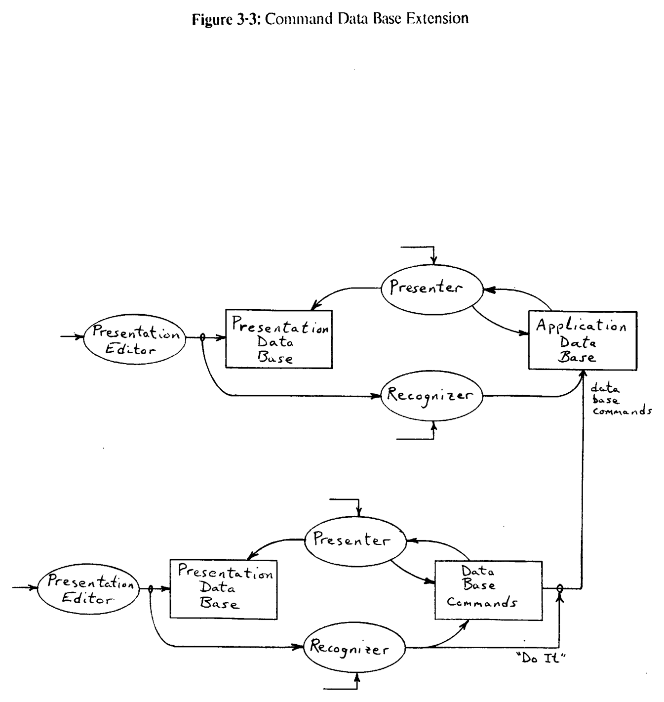

Presentation Editor -> Presentation Data Base -> Presenter -> Application Data Base
Recognicer -> (arrow up) -> Application Data Base [label: data base commands]
Presentation Editor -> Presentation Data Base -> Recognizer -> (arrow up) -> Presenter -> Data Base Commands [label near arrow: "Do It"]
Presentation Data Base
Presenter
Recognizer
Application Data Base
Data Base Commands
"Do It"

<!-- page:062 -->

editor, presentation data base, presenter, and recognizer. Though their general purpose is
the same and they are labeled the same, they are in general different. In this extension this
is especially the case for the presenters and recognizers. The application data base in the top
PPS, and the data base of commands in the bottom PPS, have very different kinds of
information in them. The presentation and recognition styles will therefore in general be
quite different.

3.3 Adding Interfaces to PPS Components

The third major limitation of the PPS model is that the presentation editor, presenter, and
recognizer are not presented. The user controls them through presentation editing
commands, presenter controls, and recognizer controls. There are two aspects to this
problem in the PPS model:

First, these controls are only primitive signals, such as keystrokes. There is no ability to
see the commands the user is typing, edit them, or get help in their use. The only thing
being seen and edited (i.e., presented) is the application data base.

Second, the user must give commands to affect the editor, presenter, and recognizer. The
user cannot directly see the state of those processes, their modes, control variables, etc. As
the user interface becomes more powerful and complex, the user interface components, as
well as the application data base, become important objects to present. The text editor
Emacs, for instance, has nearly fifty options variables in its simplest, initial form. Many
systems have many option variables controlling presenter style, modes, etc.

Instead of primitive signals to control the presentation editor, presenter, and recognizer,
and no ability to present their state, PPS interfaces to these components can be added. This
involves adding a data base for the particular component's state (e.g., a data base of the
presenter's options controlling its visual style) or using the previous technique of adding a
data base for the component's commands.

Figure 3-4 shows one such interface, providing a representation shift interface to the

<!-- page:063 -->

Figure 3-4: Presenter Interface Extension

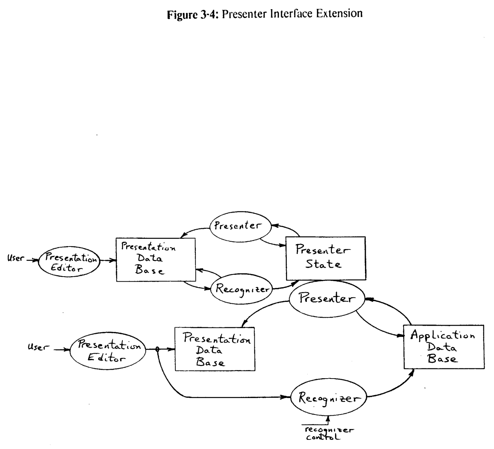

User -> Presentation Editor -> Presentation Data Base
Presentation Data Base -> Recognizer -> Presenter
Presenter <-> Presenter State
Presenter -> Application Data Base

(Second, parallel flow)
User -> Presentation Editor -> Presentation Data Base
Presentation Data Base -> Recognizer
recognizer control (arrow pointing to Recognizer)

Presenter (central oval) with arrows to/from Presenter State and arrow to Application Data Base

Application Data Base (box)

<!-- page:064 -->

presenter. The presenter's state has been expanded into a data base presented by the
representation shift presentation system at the top. As with all the additional presentation
systems in this chapter, there are many possible presentation systems that could be added.
A PPS could have been used instead of the representation shift, for example.

In this extended presentation system the user can interact with the application data base,
via the main presentation system at the bottom. The user can also interact with the
presenter, via the presentation system at the top, which has replaced the original presenter
control input. The user can change the way the presenter behaves by editing the presenter's
state presentation. For instance, this might include changing the amount of detail shown in
the presentation of the application data base. It might include changing how the presenter
shows different kinds of domain information, e.g., whether tables or graphs are used.
Finally, it might include changing what parts of the application data base are being
presented. (Recall that the PPS model allows that the application data base to be only
partially presented.)

Figure 3-5 shows an alternative extension for controlling the presenter. Here, instead of
editing the presenter's state, the user edits commands to the presenter, just as in the
previous section the technique was used to allow the user to give commands to the
application data base. The top presentation system (again a representation shift model, but
as before it could be any kind of presentation system) hooks directly into the presenter
control input to the presenter.

This technique of adding a presentation system to allow the user to interact more
conveniently with the presenter can be applied to the other presentation system components
as well, e.g., to the presentation editor and recognizer.

3.4 Shared Screen Space and Presentation Structure

This section examines three kinds of sharing that can occur in presentation systems. In
general, sharing occurs when some part of a presentation system, e.g., a particular part of the
screen space or a particular presentation, simultaneously fulfils two different roles. There

<!-- page:065 -->

Figure 3-5: Presenter Commands Extension

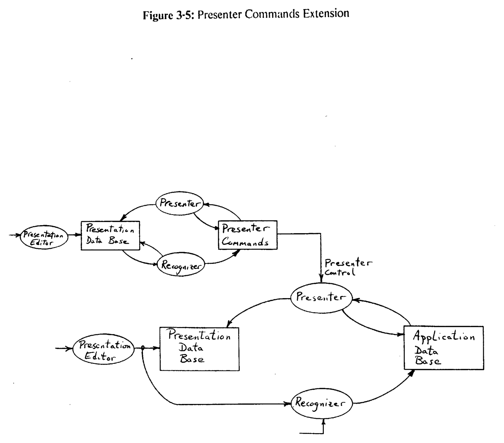

Presentation Editor -> Presentation Data Base
Presentation Data Base <-> Presenter
Presentation Data Base <-> Recognizer
Presenter -> Presenter Commands -> (down arrow) Presenter Control -> Presenter
Presentation Editor -> Presentation Data Base (lower)
Presentation Data Base -> Recognizer (lower)
Recognizer -> Application Data Base
Presenter <-> Application Data Base

presenter. The presenter's state has been expanded into a data base presented by the
representation shift presentation system at the top. As with all the additional presentation
systems in this chapter, there are many possible presentation systems that could be added.
A PPS could have been used instead of the representation shift, for example.

In this extended presentation system the user can interact with the application data base,
via the main presentation system at the bottom. The user can also interact with the
presenter, via the presentation system at the top, which has replaced the original presenter
control input. The user can change the way the presenter behaves by editing the presenter's
state presentation. For instance, this might include changing the amount of detail shown in
the presentation of the application data base. It might include changing how the presenter
shows different kinds of domain information, e.g., whether tables or graphs are used.
Finally, it might include changing what parts of the application data base are being
presented. (Recall that the PPS model allows that the application data base to be only
partially presented.)

<!-- page:066 -->

are tradeoffs between benefits of compactness and costs of ambiguity.

The first kind of sharing is sharing of screen space between two presentation systems, e.g., two PPS components in a larger, extended presentation system. Presentations that conceptually belong to the different presentation systems are often intermingled within the same space. For example, in the Emacs Dired system to be discussed in section 4.1, a directory listing (a presentation in one PPS) is annotated with "D"s, which are presentations of plans to delete files and which belong to a separate, command-planning PPS. This is contrasted with an interface that has two such presentation systems occupying completely separate areas of the screen, e.g., different windows.

The second kind is sharing of one presentation form between two presentation systems. The shared presentation presents two different pieces of information, in the two different application data bases. Consider, for example, a directory listing. An interface could use a directory listing for more than just presenting a directory: it could also use it as a means of controlling the directory listing presenter. The user could trim the directory listing to inform the presenter that certain files should not be included. This editing, and recognition of it, conceptually occurs in a separate PPS. The directory presentation is shared between the two PPSs. In the presenter-control PPS, the directory listing functions as a presentation of the presenter's state.

A third kind is sharing of one presentation between two presented domain objects in one PPS. This occurs when one domain object is presented in order to present another domain object. A typical case is presentation of a file's creation-date property in a directory listing. To present the property, the value of that property is presented, namely, the particular date. (And the process may continue: to present the month property of the date, the particular month is presented.) Thus, a single presentation form (e.g., the text "3/4/83") presents both the creation-date property and the particular date (3/4/83) that satisfies that property.

Sharing of screen space or presentation structure can provide convenience to the user because it results in a compact presentation. Sharing can achieve what might be called visual locality: two presentations of related domain objects are located near each other.

Unfortunately, sharing can also lead to ambiguity, both for the user and for the implementor. The user may not know which editing functions apply to presentations shared between two presentation systems. When screen space is shared, the user may not know what kind of recognition to expect when editing the different presentations. The implementation must also keep the two kinds of presentation distinct, so that the proper editing and recognition happen to each. When presentation structure is shared, the user may not be aware how presentation editor functions are recognized differently by the recognizers in the two presentation systems. The implementation must include a means for selecting the recognizer based on the kind of editing performed. The ambiguity is most severe when the capabilities of the presentation editors overlap. The choice between the two recognizers then must depend on context or user choice.

The designer should identify ambiguities in the proposed presentation system, and decide which ones to resolve. Such a decision must take into account the prospective users, conventions in the style of the interface, the particular tasks to be performed, and the application domain. Sharing might be eliminated. Conventions might be imposed on the kinds of sharing and the methods of user or system resolution.

<!-- page:067 -->

Unfortunately, sharing can also lead to ambiguity, both for the user and for the implementor. The user may not know which editing functions apply to presentations shared between two presentation systems. When screen space is shared, the user may not know what kind of recognition to expect when editing the different presentations. The implementation must also keep the two kinds of presentation distinct, so that the proper editing and recognition happen to each. When presentation structure is shared, the user may not be aware how presentation editor functions are recognized differently by the recognizers in the two presentation systems. The implementation must include a means for selecting the recognizer based on the kind of editing performed. The ambiguity is most severe when the capabilities of the presentation editors overlap. The choice between the two recognizers then must depend on context or user choice.

The designer should identify ambiguities in the proposed presentation system, and decide which ones to resolve. Such a decision must take into account the prospective users, conventions in the style of the interface, the particular tasks to be performed, and the application domain. Sharing might be eliminated. Conventions might be imposed on the kinds of sharing and the methods of user or system resolution.

However, regardless of the outcome of the decision, the designer must consider that there is always ambiguity due to potential sharing. The user cannot tell, merely by viewing the directory listing, whether deleting a line in a directory listing, for example, will mean don't present that file (manipulating the presenter), or whether it will mean delete the file (manipulating the application data base). Ambiguity of presentation structure, unlike ambiguity of shared space, is an inherent possibility of the view. Resolving an ambiguity by eliminating sharing of presentation structure does not make the presentation appear different. (However, another presentation may be introduced nearby to perform the eliminated function.)

Sharing of presentation structure within a PPS, such as arises from presenting a property by presenting its value, is less troublesome. Its ambiguity can be resolved by the recognizer, by deciding which of the possibilities is appropriate for the command being recognized.

For example, if user editing of the creation-date presentation for a file is recognized as a change command, then only the creation-date property fits the recognition -- one cannot change a date. (By changing the property, one is selecting a different date to be the value of the property. The original date value is left unchanged.) This technique is offered by the PSBase system, and so further discussion of this technique appears in section 5.1.

3.5 Concluding Remarks

This chapter has discussed only a few examples of how presentation systems can be constructed by hooking primitive presentation systems together. There are many more possibilities, including combining these extensions and creating new kinds of extensions using similar techniques. (For example, a system might offer cascaded presentation systems, presenting the presentation data base.) In modeling actual user interfaces, the next chapter illustrates several of these possibilities.

<!-- page:068 -->

For example, if user editing of the creation-date presentation for a file is recognized as a change command, then only the creation-date property fits the recognition -- one cannot change a date. (By changing the property, one is selecting a different date to be the value of the property. The original date value is left unchanged.) This technique is offered by the PSBase system, and so further discussion of this technique appears in section 5.1.

3.5 Concluding Remarks

This chapter has discussed only a few examples of how presentation systems can be constructed by hooking primitive presentation systems together. There are many more possibilities, including combining these extensions and creating new kinds of extensions using similar techniques. (For example, a system might offer cascaded presentation systems, presenting the presentation data base.) In modeling actual user interfaces, the next chapter illustrates several of these possibilities.

<!-- page:069 -->

Chapter Four

Describing Presentation Systems

This chapter illustrates the use of the presentation system model as a descriptive tool. The model provides a set of concepts for enumerating and categorizing basic functions and interactions in user interfaces, whether or not those interfaces were designed with this model in mind. The behavior of four different user interfaces will be described in terms of the presentation system model. In each example the focus will be on those presentation system mechanisms that play the most important part in defining the style of interaction.

A secondary aim of this chapter is to offer support for claims of the model's generality, i.e., that the model applies to a wide range of user interfaces. The selection of user interfaces described here has been chosen to show the descriptive process by example. The reader should then be able to apply this process to other interfaces and thereby gain confidence in the model's generality.

The selection thus emphasizes different approaches in user interface techniques. At the same time, an effort was made to choose user interfaces that exemplify different aspects of user interface research and development. Part of that effort was an informal poll of people involved with developing, studying, or just interested in user interfaces. They were asked to name three "exemplary user interfaces." The interfaces used in this chapter all have followers. There were many favorites and strong opinions, but nothing near a consensus except on the Xerox Star [Purvy, Farrell & Klose 83][Smith, Irby, Kimball, Verplank & Harslem 83] and Apple Lisa systems [Lisa 84].

PPSCalc was discussed and modeled in chapter two. Because PPSCalc is a simple version of VisiCalc [Beil 82], VisiCalc has already been treated to some extent. Actually modeling VisiCalc would involve describing extensions to the main PPS. Such extensions will be suggested by those used in modeling the user interfaces of this chapter. To avoid this redundancy, VisiCalc or other spreadsheet programs will not be discussed further.

For example, if user editing of the creation-date presentation for a file is recognized as a change command, then only the creation-date property fits the recognition -- one cannot change a date. (By changing the property, one is selecting a different date to be the value of the property. The original date value is left unchanged.) This technique is offered by the PSBase system, and so further discussion of this technique appears in section 5.1.

3.5 Concluding Remarks

This chapter has discussed only a few examples of how presentation systems can be constructed by hooking primitive presentation systems together. There are many more possibilities, including combining these extensions and creating new kinds of extensions using similar techniques. (For example, a system might offer cascaded presentation systems, presenting the presentation data base.) In modeling actual user interfaces, the next chapter illustrates several of these possibilities.

4.1 Emacs Dired

Dired is a subsystem of the Emacs editor that allows the user to perform several directory operations by manipulation a directory listing. The version of Dired described here is the one in Emacs on the ITS operating system [Stallman 81].

Dired is an extended presentation system, allowing both immediate changes to the application data base (the file system directory) and planned operations. Annotations to the directory's presentation present the planned operations. Dired has two other component presentation systems. One recognizes presentation editing as changing the state of the presenter. The other confirms the user's planned operations by offering an alternative presentation of the planned operations.

Dired Scenario. The following scenario will illustrate the use of Dired. After the scenario, the presentation system model of Dired will be discussed.

The user invokes Dired, initially viewing the full directory listing shown below:

MC    NSR
FREE BLOCKS #0=1666 #1=625 #13=1163 #15=1461 #14=1549 #16=1149
0    BABYL BUGS     26 +486     4/02/84 14:09:26  (4/02/84) .MAIL.
13   BABYL INFO     27 +488     8/31/83 14:37:09  (11/16/83) .MAIL.
L    FIXLIB 209     ==> EMACS1;FIXLIB >              (5/06/83)
13   MAINT BABYL    5 +27      2/18/84 17:01:42  (3/01/84)
1    QUEUE NOTES    2 +83      3/10/84 10:20:13  (3/23/84)
1    TEST VALUES    0 +69      1/17/84 19:20:14  (4/03/84)
1    TMSG 2         1 +34  $   3/28/84 11:03:39  (4/03/84)
1    TMSG 3         1 +20  !   4/03/84 21:53:21  (4/03/84)
1    TMSG 4         1 +248 !   4/03/84 21:57:45  (4/03/84)
1    TMSG 5         2 +94  !   4/03/84 22:14:15  (4/03/84)
1    TMSG 6         2 +86  !   4/03/84 23:34:36  (4/03/84)
L    TS    NSRMAC   ==> NSR;TSNSRM >               (2/24/84)
15   TSNSRM 1320    13 +463     8/19/83 20:44:23  (2/24/84)

The user wishes to restrict attention to those files that might plausibly be deleted or moved to a secondary disk pack. In particular, several files are related to the maintenance of the mail reader Babyl and should definitely not be considered for deletion. Using the

<!-- page:070 -->

redundancy, VisiCalc or other spreadsheet programs will not be discussed further.

4.1 Emacs Dired

Dired is a subsystem of the Emacs editor that allows the user to perform several directory operations by manipulation a directory listing. The version of Dired described here is the one in Emacs on the ITS operating system [Stallman 81].

Dired is an extended presentation system, allowing both immediate changes to the application data base (the file system directory) and planned operations. Annotations to the directory's presentation present the planned operations. Dired has two other component presentation systems. One recognizes presentation editing as changing the state of the presenter. The other confirms the user's planned operations by offering an alternative presentation of the planned operations.

Dired Scenario. The following scenario will illustrate the use of Dired. After the scenario, the presentation system model of Dired will be discussed.

The user invokes Dired, initially viewing the full directory listing shown below:

MC    NSR
FREE BLOCKS #0=1666 #1=625 #13=1163 #15=1461 #14=1549 #16=1149
0    BABYL BUGS     26 +486    4/02/84 14:09:26    (4/02/84) .MAIL.
13   BABYL INFO     27 +488    8/31/83 14:37:09    (11/16/83) .MAIL.
L    FIXLIB 209    ==> EMACS1;FIXLIB >                 (5/06/83)
13   MAINT BABYL   5  +27     2/18/84 17:01:42    (3/01/84)
1    QUEUE NOTES   2  +83     3/10/84 10:20:13    (3/23/84)
1    TEST VALUES   0  +69     1/17/84 19:20:14    (4/03/84)
1    TMSG 2        1  +34 $   3/28/84 11:03:39    (4/03/84)
1    TMSG 3        1  +20 !   4/03/84 21:53:21    (4/03/84)
1    TMSG 4        1 +248 !   4/03/84 21:57:45    (4/03/84)
1    TMSG 5        2 +94 !    4/03/84 22:14:15    (4/03/84)
1    TMSG 6        2 +86 !    4/03/84 23:34:36    (4/03/84)
L    TS    NSRMAC  ==> NSR;TSNSRM >                   (2/24/84)
15   TSNSRM 1320   13 +463    8/19/83 20:44:23    (2/24/84)

The user wishes to restrict attention to those files that might plausibly be deleted or moved to a secondary disk pack. In particular, several files are related to the maintenance of the mail reader Babyl and should definitely not be considered for deletion. Using the Emacs command Delete Matching Lines, lines containing the text "BABYL" are removed.

This does not delete those files -- it only affects the view the user has of the directory, resulting in the trimmed directory listing shown below:

MC    NSR
FREE BLOCKS #0=1666 #1=625 #13=1163 #15=1461 #14=1549 #16=1149
L    FIXLIB 209    ==> EMACS1;FIXLIB >                 (5/06/83)
1    QUEUE NOTES   2  +83     3/10/84 10:20:13    (3/23/84)
1    TEST VALUES   0  +69     1/17/84 19:20:14    (4/03/84)
1    TMSG 2        1  +34 $   3/28/84 11:03:39    (4/03/84)
1    TMSG 3        1  +20 !   4/03/84 21:53:21    (4/03/84)
1    TMSG 4        1 +248 !   4/03/84 21:57:45    (4/03/84)
1    TMSG 5        2 +94 !    4/03/84 22:14:15    (4/03/84)
1    TMSG 6        2 +86 !    4/03/84 23:34:36    (4/03/84)
L    TS    NSRMAC  ==> NSR;TSNSRM >                   (2/24/84)
15   TSNSRM 1320   13 +463    8/19/83 20:44:23    (2/24/84)

Deciding that the file named "QUEUE NOTES" is no longer needed, the user moves the Emacs cursor to that line in the directory and types a "D", marking that file for deletion.

The file marked for deletion is shown by annotating that line in the directory listing with a "D". There are several versions of the "TMSG" file, and using the "H" (Delete Help) command instructs Dired to mark old versions for deletion. The "H" command generally marks all but the two most recent versions. However, in this case the version "TMSG 2" has a property protecting it from automatic deletions or migrations to tape (indicated by the "$" in the listing). Dired will therefore leave that version alone. The resulting directory listing is shown below:

<!-- page:071 -->

Emacs command Delete Matching Lines, lines containing the text "BABYL" are removed.

This does not delete those files -- it only affects the view the user has of the directory,
resulting in the trimmed directory listing shown below:

MC     NSR
FREE  BLOCKS #0=1666  #1=625  #13=1163  #15=1461  #14=1549  #16=1149
 L    FIXLIB 209          ==> EMACS1;FIXLIB  >            (5/06/83)
 1    QUEUE  NOTES        2  +83   3/10/84 10:20:13    (3/23/84)
 1    TEST   VALUES       0  +69   1/17/84 19:20:14    (4/03/84)
 1    TMSG   2           1  +34   $ 3/28/84 11:03:39   (4/03/84)
 1    TMSG   3           1  +20   ! 4/03/84 21:53:21   (4/03/84)
 1    TMSG   4           1  +248  ! 4/03/84 21:57:45   (4/03/84)
 1    TMSG   5           2  +94   ! 4/03/84 22:14:15   (4/03/84)
 1    TMSG   6           2  +86   ! 4/03/84 23:34:36   (4/03/84)
 L    TS    NSRMAC        ==> NSR;TSNSRM  >             (2/24/84)
 15   TSNSRM 1320        13 +463  8/19/83 20:44:23    (2/24/84)

Deciding that the file named "QUEUE NOTES" is no longer needed, the user moves the
Emacs cursor to that line in the directory and types a "D", marking that file for deletion.

The file marked for deletion is shown by annotating that line in the directory listing with a
"D".  There are several versions of the "TMSG" file, and using the "H" (Delete Help)

command instructs Dired to mark old versions for deletion.  The "II" command generally
marks all but the two most recent versions.  However, in this case the version "TMSG 2"

has a property protecting it from automatic deletions or migrations to tape (indicated by the
"$" in the listing).  Dired will therefore leave that version alone.  The resulting directory
listing is shown below:

MC     NSR
FREE  BLOCKS #0=1666  #1=625  #13=1163  #15=1461  #14=1549  #16=1149
 L    FIXLIB 209          ==> EMACS1;FIXLIB  >            (5/06/83)
 D 1  QUEUE  NOTES        2  +83   3/10/84 10:20:13    (3/23/84)
 1    TEST   VALUES       0  +69   1/17/84 19:20:14    (4/03/84)
 1    TMSG   2           1  +34   $ 3/28/84 11:03:39   (4/03/84)
 D 1  TMSG   3           1  +20   ! 4/03/84 21:53:21   (4/03/84)
 D 1  TMSG   4           1  +248  ! 4/03/84 21:57:45   (4/03/84)
 1    TMSG   5           2  +94   ! 4/03/84 22:14:15   (4/03/84)
 1    TMSG   6           2  +86   ! 4/03/84 23:34:36   (4/03/84)
 L    TS    NSRMAC        ==> NSR;TSNSRM  >             (2/24/84)
 15   TSNSRM 1320        13 +463  8/19/83 20:44:23    (2/24/84)

Next, the user moves the file named "TEST  VALUES" from the primary to the
secondary disk pack with the "S" command, changing the line

<!-- page:072 -->

1   TEST   VALUES   0   +69    1/17/84  19:20:14    (4/03/84)

to

13  TEST   VALUES   0   +69    1/17/84  19:20:14    (4/03/84)

The leftmost "1" and "13" in these two lines indicate the disk pack numbers (0 and 1 are
primary packs, 13 is the secondary pack).  The "S" command takes effect immediately,
moving the file to the secondary pack when the "S" is typed.  In this respect, the "S"
command is unlike the "D" and "H" commands, which mark the files for later deletion.

The "$" command changes the property protecting against automatic deletion.  The user
moves the Emacs cursor to the "TMSG 6" line and types "$".  That immediately sets that
property and updates the display, changing the line

1   TMSG   6     2   +86  !  4/03/84  23:34:36    (4/03/84)

to

1   TMSG   6     2   +86  !$ 4/03/84  23:34:36    (4/03/84)

The full directory listing now looks like:

MC   NSR
FREE BLOCKS #0=1666  #1=625  #13=1163  #15=1461  #14=1549  #16=1149
   L   FIXLIB 209        ==>  EMACS1;FIXLIB  >                          (5/06/83)
   D  1  QUEUE  NOTES     2   +83    3/10/84  10:20:13    (3/23/84)
   1   TEST   VALUES     0   +69    1/17/84  19:20:14    (4/03/84)
   1   TMSG   2         1   +34   $ 3/28/84  11:03:39    (4/03/84)
   1   TMSG   3         1   +20   ! 4/03/84  21:53:21    (4/03/84)
   1   TMSG   4         1   +248  ! 4/03/84  21:57:45    (4/03/84)
   1   TMSG   5         2   +94   ! 4/03/84  22:14:15    (4/03/84)
   1   TMSG   6         2   +86   !$ 4/03/84  23:34:36    (4/03/84)
   L   TS   NSRMAC      ==>  NSR;TSNSRM  >                        (2/24/84)
  15   TSNSRM 1320      13  +463    8/19/83  20:44:23    (2/24/84)

The user types a "Q" to indicate that the deletion plan is complete, and is offered the
following alternative display of the deletion plan for confirmation:

Deleting the following files:
    QUEUE  NOTES      ! TMSG  3       ! TMSG  4

Ok?

<!-- page:073 -->

The confirmation shows only the files to be deleted and some of their important
properties. For instance, "!" indicates that a file has not yet been backed up on tape. In this
case, that is all right for "TMSG 3" and "TMSG 4", since those are not the most recent
versions of the file. (If the user had marked the most recent version of a file for deletion, a
">" would indicate that fact.) Typing "YES" causes the plan to be executed and the files are
thereby deleted.

Dired Presentation Model. Figure 4-1 shows the structure of the extended presentation
system model of Dired. It has four component presentation systems, labeled "Presenter
Control," "Directory Listing," "Deletion Planning," and "Confirmation."

Directory Listing PPS. The main PPS presents the directory and recognizes the
immediate commands, such as "S" (move file to secondary pack) and "$" (change property
protecting against automatic deletion). The presentation data base PDB1 comprises the text
that makes up the directory listing. A line of text is a composite presentation presenting a
file or link; the text within the line presents properties of the file, such as the file's name
("QUEUE NOTES"), creation date ("3/10/84 10:20:13") and last-reference date
("3/23/84"). Several of these presentations are in turn composites of smaller
presentations (e.g., "3", "23", and "84" are components of "3/23/84").

The presentation editor PE1 offers the "S" and "$" commands, both of which are
references to the current file presentation within the directory, as well as Emacs commands
for moving the cursor and scrolling text. Recognizer R1 immediately translates the "S"
command into the command to the file system to move the file. Presenter P1 then updates
the directory listing to show the "13" presenting the disk pack. Similarly, the "$" command
is translated by the R1 into the file system command to change the file property. P1 then
changes the directory listing to show the "$" presenting this property.

<!-- page:074 -->

Figure 4-1: Dired Model

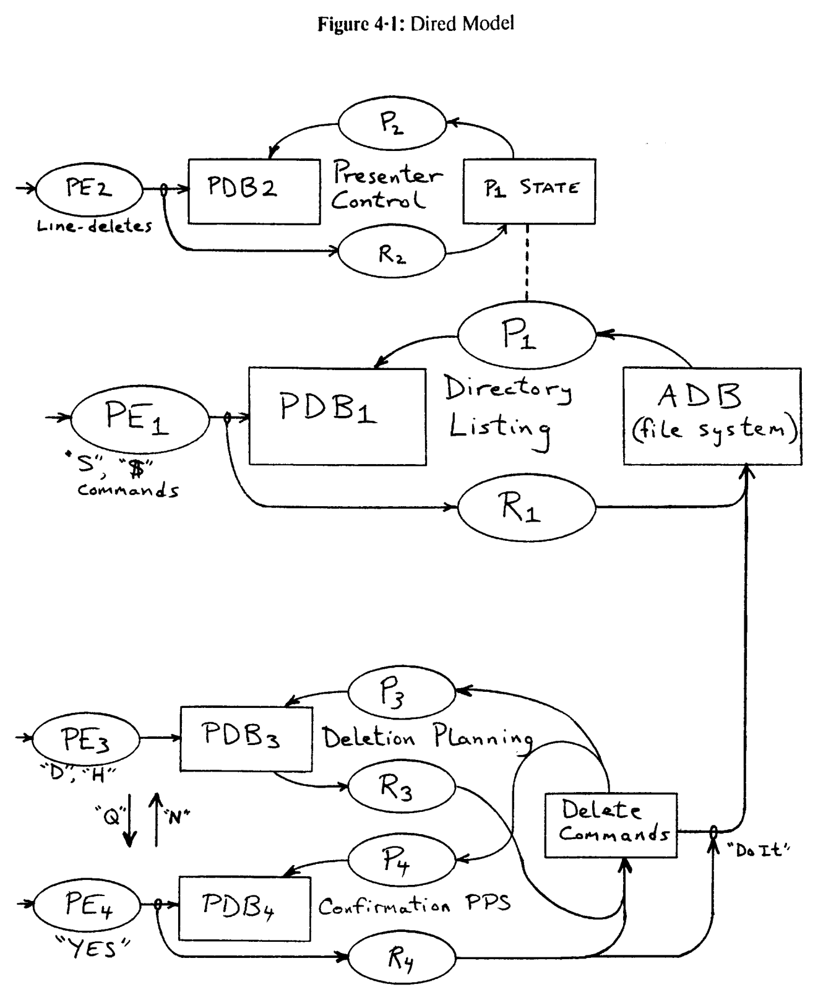

P E2  ->  PDB2  ->  Presenter Control  ->  P1 STATE
            ^                    ^ 
            |                    |
           P2                   (dashed) to P1
Line-deletes            R2  ->  P1 STATE
                            ^
                            |
PE1  ->  PDB1  -- Directory Listing -- P1  ->  ADB (file system)
  "S", "$" commands               ^                ^
                                  \              /
                                   -> R1 ------>

PE3  ->  PDB3  -- Deletion Planning -- P3
  "D", "H"                         ^          \
                                   |           -> Delete Commands -- "Do It" -> ADB (file system)
                            R3 -----/                                ^
                                                                     |
PE4  ->  PDB4  -- Confirmation PPS -- P4  ->  R4
  "YES"                                                         

Delete Commands <-- (from Deletion Planning PPS and Confirmation PPS)
"Do It" -> (execute deletes)

<!-- page:075 -->

involved in both presentation systems.

The extension's presentation editor, PE2, however, is not the same. It does share Emacs cursor movement and scrolling commands, however. The primary editing commands for PE2 are those Emacs commands that delete lines, such as the Delete Matching Lines command mentioned in the scenario above. The recognizer R2 translates these line deletions into changes to the directory presenter P1, informing it that certain files (those files whose presentations were deleted) are no longer to be presented.

Since this extension shares the presentation data base of the directory listing PPS, P2 is an implicit presenter, tied to P1 in that P1's output (the presentation data base) is itself a presentation of P1. In general, the output of a process can serve as a presentation of the state of that process.

Deletion Planning PPS. The third PPS is an extension of the main directory listing PPS using the technique of adding a data base of planned commands. A delete command is presented by an annotation to the directory listing presentation: a "D" placed at the left of the line presenting the file to be deleted. Again there is a close relationship between the presentation data base of the deletion planning PPS, PDB3, and that of the directory listing PPS, PDB1, although the two are not the same in this case. They share some of the same screen space, but the component text presentations are different.

The deletion planning PPS is a representation shift presentation system: the state of the presentation data base conveys all the information about the delete commands. The presentation editor PE3 contains the Dired "D" and "H" commands discussed in the scenario, as well as a wide range of other Emacs editing commands. The user can use "D" or "H" commands to create the annotation presentations. They simply insert "D"

<!-- page:076 -->

the deletion planning presentation system. The job of the confirmation system is to give the
user a different presentation of the planned delete commands, and recognize the "do it"
signal for the deletion planning commands. When the user types "Q" after creating the
plan of deletions, the deletion planning PPS is suspended, and control passes to the
confirmation PPS. (If the user does not confirm the deletion plan, control will pass back to
the deletion planning PPS.) The planned delete commands are presented by presenting the
files to be deleted -- their names and those properties most frequently useful for checking
the plan.

Unlike the other presentation data bases, PDB4 is a completely separate presentation data
base. It has a trivial presentation editor, PE4, which allows the user to type in the
confirmation answer. Recognizer R4 watches for these answers, and signals "do it" if the
answer is "YES". (Other than the "do it," R4 sends no commands to the delete-commands
application data base.)

4.2 Zmacs

Zmacs [Zmacs 84] is the text editor for the MIT Lisp machine [Weinreb, Moon &
Stallman 83]. Zmacs has many capabilities, and a complete model of its presentation system
behavior would be very large. This section will describe the major presentation systems
aspects and sample the rest.

<!-- page:077 -->

Figure 4-2: Zmacs Model

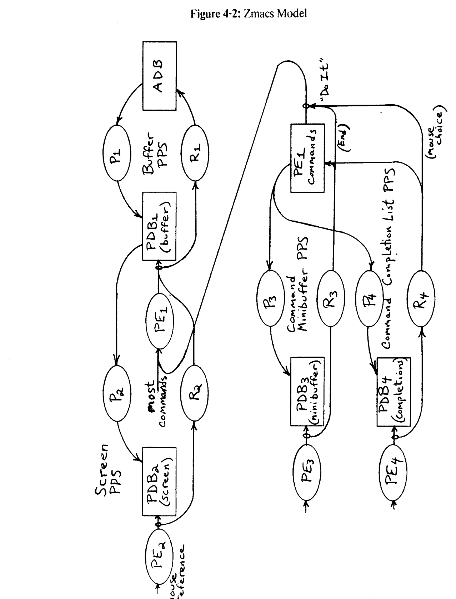

ADB
Buffer PPS
P1
R1
PDB1 (buffer)
most commands
PE1
P2
Screen PPS
PDB2 (screen)
mouse reference
PE3

Command Minibuffer PPS
P3
R3
P4
R4
PDB3 (minibuffer)
PDB4 (completion)
Completion List PPS
PE4

PE1 commands
"Do It"
(End)
(mouse choice)

<!-- page:078 -->

computer anywhere, but they are nevertheless being presented. When the text is a Lisp
program, on the other hand, the application data base is the Lisp machine's computational
environment.

The screen PPS cascades with the buffer PPS, further presenting the buffer as the text
that appears on the screen. Most user interfaces can be modeled with this extra stage, but
often the operation at this level is trivial. For Zmacs, however, it is useful to discuss the
screen PPS, as certain Zmacs commands depend on the distinction of PDB1 (the buffer) and
PDB2 (the screen).

The buffer contains text (a large amount possible -- much more than fits on the screen).
It has an associated current position called point; user-typed text is inserted at point, for
instance. There is sometimes another position called the mark, and the interval between
point and the mark is called the region.

Presenter P2 presents a window of text around point, i.e., a contiguous section of PDB1
text that will fit on the display window. Point is presented by the cursor. The region is
highlighted on the screen, either by underlining or by reverse video. This choice is made by
a user option, i.e., a P2 presenter control. In addition to choosing the window of text P2
must also consider what to do with lines of text that are too wide for the window. In Zmacs
these lines are wrapped, so that they continue on the next screen line, with an exclamation
point to present the fact that wrapping has occurred.

Buffer PPS commands. To a large degree, the operation of a text editor concerns only
PE1 and PDB1, with most user editing going unrecognized until much later. Zmacs is,
however, more than just the combination of PE1 and PDB1 (and the screen PPS) -- there
are several commands whose behavior involves recognizer and presenter action.

<!-- page:079 -->

command signals P1's organizational presenter to perform the filling, updating the
presentation data base to present the ADB paragraph in the filled style. Finally, P2 updates
PDB2, the screen, and the user sees the result.

Similarly, consider the Indent For Lisp command, which indents the current line of a
Lisp expression according to its syntactic structure. Recognition has been proceeding (in
effect) as the user edits, constructing and editing the Lisp object in the Lisp environment
ADB. Up to this point, P1's organizational presenter has followed the user -- i.e., done
nothing to change the text. The Indent For Lisp command signals the organizational
presenter to update the presentation according to the presenter's indenting style. P2 then
updates the screen to reflect the PDB1 changes.

The Mark Thing command sets the region around some presentation at point, the kind of
presentation being determined by exactly where point is. If point is in a word or Lisp
symbol presentation, that presentation is marked. If point is at the start of a Lisp
expression, the whole expression presentation is marked. Recognition of this command
translates into a mark of the object in the ADB followed by presenter update. The PDB1
region is set to present that selected ADB object. This illustrates the need to consider more
than just text as presentation forms -- the region, and also point and mark separately, can
present information in the application data base.

Finally, consider the Evaluate Region and Evaluate Into Buffer commands. Evaluate
Region causes the Lisp expression recognized from the region text (or if there is no region,
then the Lisp definition around point) to be evaluated in the Lisp computational
environment. The value is presented in a small window at the bottom of the screen.
Evaluate Into Buffer takes its text to be recognized from a different area (a minibuffer, to be
discussed below), and after evaluation, presents the resulting Lisp value in PDB1 as text.

Screen PPS commands. Most Zmacs user commands go to PE1, the presentation editor
for the buffer PPS. Commands to the screen PPS components involve the screen
appearance as opposed to the underlying buffer text. Such commands concern mouse
computer anywhere, but they are nevertheless being presented. When the text is a Lisp
program, on the other hand, the application data base is the Lisp machine's computational
environment.

The screen PPS cascades with the buffer PPS, further presenting the buffer as the text
that appears on the screen. Most user interfaces can be modeled with this extra stage, but
often the operation at this level is trivial. For Zmacs, however, it is useful to discuss the
screen PPS, as certain Zmacs commands depend on the distinction of PDB1 (the buffer) and
PDB2 (the screen).

The buffer contains text (a large amount possible -- much more than fits on the screen).
It has an associated current position called point; user-typed text is inserted at point, for
instance. There is sometimes another position called the mark, and the interval between
point and the mark is called the region.

Presenter P2 presents a window of text around point, i.e., a contiguous section of PDB1
text that will fit on the display window. Point is presented by the cursor. The region is
highlighted on the screen, either by underlining or by reverse video. This choice is made by
a user option, i.e., a P2 presenter control. In addition to choosing the window of text P2
must also consider what to do with lines of text that are too wide for the window. In Zmacs
these lines are wrapped, so that they continue on the next screen line, with an exclamation
point to present the fact that wrapping has occurred.

whether lines are wrapped. (For instance, such a command might move the cursor down
one screen line, moving forward in the buffer text line to a point presented on the screen as
directly below.) Window movement and reshaping commands go to the presenter P2.

Consider the PE2 mouse command to move point. The user points to a buffer position
presented on the screen and clicks a mouse button. Recognizer R2 translates the reference
in screen coordinates to a reference to the position within PDB1's text, the position which is
presented by the referenced screen position, and a command to move point to that position.
Presenter P2 then updates the screen so that the cursor presents the new position of point.

Consider also the PE2 mouse command to mark the thing at the mouse position. The
user points to a presentation, e.g., a word or Lisp expression, and clicks a mouse button.
Again R1 must translate a screen coordinate reference into a buffer text position reference
and a command to move point to that position. In addition the reference translation
includes a mark-thing command. That mark-thing command is further recognized, within
the buffer PPS by R1, as described above. Thus, the mouse command to mark a thing
requires action by PE2, R2, R1, P1, and P2.

<!-- page:080 -->

whether lines are wrapped. (For instance, such a command might move the cursor down
one screen line, moving forward in the buffer text line to a point presented on the screen as
directly below.) Window movement and reshaping commands go to the presenter P2.

Consider the PE2 mouse command to move point. The user points to a buffer position
presented on the screen and clicks a mouse button. Recognizer R2 translates the reference
in screen coordinates to a reference to the position within PDB1's text, the position which is
presented by the referenced screen position, and a command to move point to that position.
Presenter P2 then updates the screen so that the cursor presents the new position of point.

Consider also the PE2 mouse command to mark the thing at the mouse position. The
user points to a presentation, e.g., a word or Lisp expression, and clicks a mouse button.
Again R1 must translate a screen coordinate reference into a buffer text position reference
and a command to move point to that position. In addition the reference translation
includes a mark-thing command. That mark-thing command is further recognized, within
the buffer PPS by R1, as described above. Thus, the mouse command to mark a thing
requires action by PE2, R2, R1, P1, and P2.

Command Minibuffer and Completion. The lower half of figure 4-2 shows the model for
the Zmacs extended command minibuffer, by which Zmacs commands can be given by
name. Many Zmacs commands are connected to keys, so that they may be invoked by a
single keystroke. However, all commands may be invoked from the minibuffer, relieving
the user of the need to remember infrequently used keys. Thus, the minibuffer offers a
presentation system to the Zmacs commands. (For simplicity, we will consider only PE1
commands.)

The minibuffer is a two-line buffer at the bottom of the screen and is edited almost
entirely as is the main buffer; i.e., PE3 is almost a duplicate of PE1. PE3 does have some
additional commands, primarily concerning command completion [Zmacs 84]. As the user
constructs the command name, the command name recognizer, R3, attempts to determine
the possible commands that have the user text as a partial string. The user can signal the
command presenter P3 to aid in constructing the command name by filling in more of the
name -- as much as can unambiguously be completed. (E.g., if the user has typed "L Mo",
and the only command whose first word starts with "L" and second word starts with "Mo"
is Lisp Mode, then "L Mo" can be completed to "Lisp Mode".) The user causes the
command to be executed by typing Return; this causes R3 to signal the "do it."

In addition, the user can invoke a command that lists the possible completions of the text
constructed so far. This command triggers the presenter P4 in the command completion list
PPS. It creates a new presentation data base PDB4 on the screen, a window of the
completions. The command minibuffer PPS and the command completion list PPS both
interface to the same application data base of PE1 commands. PE4 allows the user to select
a completion from PDB4 with the mouse. That reference is recognized by R4 as choosing
that particular PE1 command and signalling the "do it."

Other Presentation Aspects of Zmacs. This section will briefly discuss two of the many
other presentation and interaction mechanisms in Zmacs. Most of those not discussed here
are very similar to the ones that are discussed.

<!-- page:081 -->

name -- as much as can unambiguously be completed. (E.g., if the user has typed "L Mo",
and the only command whose first word starts with "L" and second word starts with "Mo"
is Lisp Mode, then "L Mo" can be completed to "Lisp Mode".) The user causes the
command to be executed by typing Return; this causes R3 to signal the "do it."

In addition, the user can invoke a command that lists the possible completions of the text
constructed so far. This command triggers the presenter P4 in the command completion list
PPS. It creates a new presentation data base PDB4 on the screen, a window of the
completions. The command minibuffer PPS and the command completion list PPS both
interface to the same application data base of PE1 commands. PE4 allows the user to select
a completion from PDB4 with the mouse. That reference is recognized by R4 as choosing
that particular PE1 command and signalling the "do it."

Other Presentation Aspects of Zmacs. This section will briefly discuss two of the many
other presentation and interaction mechanisms in Zmacs. Most of those not discussed here
are very similar to the ones that are discussed.

Mode Line. One of the constant features of the Zmacs screen is the mode line, a small
one-line window near the bottom of the screen that presents important information about
the state of Zmacs and the buffer of text being displayed.

For instance, the mode line presents a list of the control modes that affect the action of
presenter P1, recognizer R1, and some of the connections of keystrokes to commands. One
of these is the major mode, which describes the kind of application data base information:
text, lisp programs, etc. There are also a set of minor modes, with more localized effects; an
example is a mode causing lines to be continually filled as they are being typed. The mode
line's text presents these modes, and thus presents the states of PPS components, with labels
such as "Text" and "Fill". The mode line as described thus far would be an example of a
representation shift except that it cannot be directly edited. (For example, one cannot
change the major mode by editing its presentation in the mode line.)

The mode line also contains a presentation of the screen PPS presenter, P2, and PDB2's
whether lines are wrapped. (For instance, such a command might move the cursor down
one screen line, moving forward in the buffer text line to a point presented on the screen as
directly below.) Window movement and reshaping commands go to the presenter P2.

Consider the PE2 mouse command to move point. The user points to a buffer position
presented on the screen and clicks a mouse button. Recognizer R2 translates the reference
in screen coordinates to a reference to the position within PDB1's text, the position which is
presented by the referenced screen position, and a command to move point to that position.
Presenter P2 then updates the screen so that the cursor presents the new position of point.

Consider also the PE2 mouse command to mark the thing at the mouse position. The
user points to a presentation, e.g., a word or Lisp expression, and clicks a mouse button.
Again R1 must translate a screen coordinate reference into a buffer text position reference
and a command to move point to that position. In addition the reference translation
includes a mark-thing command. That mark-thing command is further recognized, within
the buffer PPS by R1, as described above. Thus, the mouse command to mark a thing
requires action by PE2, R2, R1, P1, and P2.

<!-- page:082 -->

relation to PDB1. Small arrows pointing up or down can appear at the right of the mode
line. An upward-pointing arrow, for example, presents the fact that P2 has chosen a
window with more of PDB1 above it.

Scroll Bar. The scroll bar is a small display that appears inside the left edge of the Zmacs
window when the mouse moves to that edge. (See figure 4-3.) The scroll bar consists of a
vertical line segment juxtaposed against the left window border. The line segment, by its
position along the border and its relative size compared with the border, shows the size and
position of the PDB2 window relative to the size of PDB1. In figure 4-3 the PDB2 window
is about one fourth the size of PDB1 and is at about the two thirds position in PDB1.

The line segment presents PDB2; the border line presents PDB1. By presenting PDB2
and its relation to PDB2, the scroll bar is presenting the state of the presenter P2. (In
general, the state of a process can be presented by presenting the state of its inputs and/or
outputs.)

The user can interact through the scroll bar using the mouse. For instance, the PDB2
window can be scrolled by a quarter of its size by making one kind of mouse reference to a
position a quarter of the way down the line segment (PDB2 presentation). Or, the PDB2
window can be repositioned within PDB1 by pointing to the relative position along the
border (PDB1 presentation). The scroll bar thus offers a simple PPS interface to the
presenter of the screen PPS, P2.

4.3 Xerox Star

The Xerox Star [Purvy, Farrell & Klose 83] [Smith, Irby, Kimball, Verplank & Harslem
83] and the Apple Lisa [Lisa 84] systems offer an interface organized around the
manipulation of icons -- pictorial presentations of commands and data. The two systems are
similar in many respects, so only the Xerox Star will be discussed.

<!-- page:083 -->

Figure 4-3: Zmacs Scroll Bar

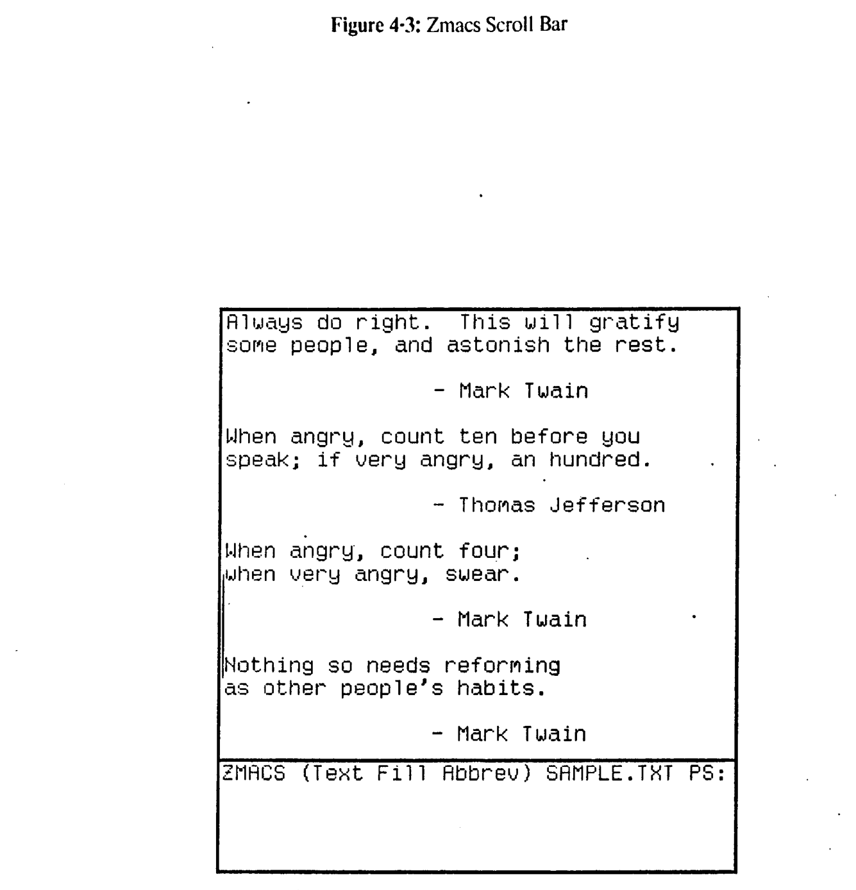

Always do right. This will gratify
some people, and astonish the rest.

        - Mark Twain

When angry, count ten before you
speak; if very angry, an hundred.

        - Thomas Jefferson

When angry, count four;
when very angry, swear.

        - Mark Twain

Nothing so needs reforming
as other people's habits.

        - Mark Twain

ZMACS (Text Fill Abbrev) SAMPLE.TXT PS:

relation to PDB1. Small arrows pointing up or down can appear at the right of the mode
line. An upward-pointing arrow, for example, presents the fact that P2 has chosen a
window with more of PDB1 above it.

Scroll Bar. The scroll bar is a small display that appears inside the left edge of the Zmacs
window when the mouse moves to that edge. (See figure 4-3.) The scroll bar consists of a
vertical line segment juxtaposed against the left window border. The line segment, by its
position along the border and its relative size compared with the border, shows the size and
position of the PDB2 window relative to the size of PDB1. In figure 4-3 the PDB2 window
is about one fourth the size of PDB1 and is at about the two thirds position in PDB1.

The line segment presents PDB2; the border line presents PDB1. By presenting PDB2
and its relation to PDB2, the scroll bar is presenting the state of the presenter P2. (In
general, the state of a process can be presented by presenting the state of its inputs and/or
outputs.)

The user can interact through the scroll bar using the mouse. For instance, the PDB2
window can be scrolled by a quarter of its size by making one kind of mouse reference to a
position a quarter of the way down the line segment (PDB2 presentation). Or, the PDB2
window can be repositioned within PDB1 by pointing to the relative position along the
border (PDB1 presentation). The scroll bar thus offers a simple PPS interface to the
presenter of the screen PPS, P2.

<!-- page:084 -->

documents, in-boxes, out-boxes, and folders. These are depicted on the screen by icons,
small pictures. A document icon looks like a piece of paper with a title on it. An in-box
icon looks like an in-box. Folders contain documents, and their icons look like manila
folders. (Folders are, in effect, sub-directories.) Figure 4-4 shows a sample desktop display.

Also on the screen are icons for more things than would normally appear on a real desk,
such as printers and file-drawers. File-drawer icons look like small file cabinets and indicate
directories on remote file servers.

Interaction involves a mouse and command keys. The user selects something, such as a
document icon, by pointing to it with the mouse and clicking the left mouse button. The
selected icon is highlighted. The user then gives a command that affects the selected icon.
Special keys are provided for several commands.

One important command key is open. It causes the contents of the selected thing to be
displayed. For example, opening a document displays the text of that document. Opening
a folder displays the documents within that folder. Figure 4-5 shows a display after the user
opens the folder Backup.

There are four universal command keys: move, copy, delete, and properties. These
commands can be applied to any Xerox Star object. In its simplest usage the move
command allows the user to reorganize the visual desktop. The user selects the document
icon and gives the move command. Then, as the user moves the mouse, the document icon
follows it. Clicking again releases the icon from the mouse.

Another important use of the move command is to manipulate the document itself, not
just the organization of the visual display. The document is printed by moving the
document icon to a printer icon. The document is moved into a folder by moving its
document icon into the display of the opened folder. A document is moved to a directory
on a remote file server by moving the document icon to the file-drawer icon.

Typing the properties command key produces a property sheet for the selected item.

<!-- page:085 -->

documents, in-boxes, out-boxes, and folders. These are depicted on the screen by icons, small pictures. A document icon looks like a piece of paper with a title on it. An in-box icon looks like an in-box. Folders contain documents, and their icons look like manila folders. (Folders are, in effect, sub-directories.) Figure 4-4 shows a sample desktop display.

Also on the screen are icons for more things than would normally appear on a real desk, such as printers and file-drawers. File-drawer icons look like small file cabinets and indicate directories on remote file servers.

Interaction involves a mouse and command keys. The user selects something, such as a document icon, by pointing to it with the mouse and clicking the left mouse button. The selected icon is highlighted. The user then gives a command that affects the selected icon. Special keys are provided for several commands.

One important command key is open. It causes the contents of the selected thing to be displayed. For example, opening a document displays the text of that document. Opening a folder displays the documents within that folder. Figure 4-5 shows a display after the user opens the folder Backup.

There are four universal command keys: move, copy, delete, and properties. These commands can be applied to any Xerox Star object. In its simplest usage the move command allows the user to reorganize the visual desktop. The user selects the document icon and gives the move command. Then, as the user moves the mouse, the document icon follows it. Clicking again releases the icon from the mouse.

Another important use of the move command is to manipulate the document itself, not just the organization of the visual display. The document is printed by moving the document icon to a printer icon. The document is moved into a folder by moving its document icon into the display of the opened folder. A document is moved to a directory on a remote file server by moving the document icon to the file-drawer icon.

Typing the properties command key produces a property sheet for the selected item.

<!-- page:086 -->

Figure 4-5: Xerox Star -- Opened Folder

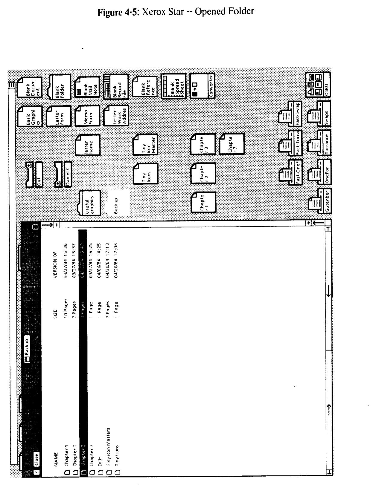

Useful graphics
Backup
Out
Daniel C.
Letter home
Letter form
Memo form
Blank Document
Blank Folder
Blank Mail Note
Blank Record File
Blank Reference
Blank Spreadsheet
Converter
Tiny icons
Tiny Icon Master
Chapter 1
Chapter 2
Chapter 3
Gutenberg
OneFor
Tornance
Fast-OneF
Fast-Torr?
Swaps
OSBU

Figure 4-6 shows the part of the desktop displaying the property sheet for the document named Chapter 7. The property sheet is a table, displaying properties such as the document's name, creation date ("version of:"), and whether to display a cover sheet when the document is opened. (A cover sheet contains fields that help in mailing the document, such as from, to, subject, and an accompanying remark.)

The user may modify the name and show cover sheet properties. Editing the name property is the way one renames a document.

A document or folder is deleted by selecting its icon and then typing the delete command key. (Similarly, a selected section of document text in an opened document is deleted with the same command.) Because deletions are currently not retractable, Xerox Star requires confirmation from the user. A one-line message is displayed at the top of the screen, together with a yes/no choice. The user confirms the deletion by choosing "yes" with the mouse. Figure 4-7 shows the upper part of the screen during a delete of the Backup folder.

Xerox Star Presentation Model. Figure 4-8 shows the presentation model for the part of the Xerox Star system discussed in the previous scenario. The model comprises four PPS components. As in the model for Zmacs, a window-display PPS cascades with the primary PPS.

Desktop PPS. The desktop PPS is the primary PPS. The application data base ADB contains documents, folders, remote file servers, in-boxes, out-boxes, and printers. These are presented by icons and windows in the presentation data base PDB1 (the picture of the desktop). Windows present domain objects, such as documents, by presenting their contents or properties.

<!-- page:087 -->

Figure 4-6 shows the part of the desktop displaying the property sheet for the document
named Chapter 7. The property sheet is a table, displaying properties such as the
document's name, creation date ("version of:"), and whether to display a cover sheet when
the document is opened. (A cover sheet contains fields that help in mailing the document,
such as from, to, subject, and an accompanying remark.)

The user may modify the name and show cover sheet properties. Editing the name
property is the way one renames a document.

A document or folder is deleted by selecting its icon and then typing the delete command
key. (Similarly, a selected section of document text in an opened document is deleted with
the same command.) Because deletions are currently not retractable, Xerox Star requires
confirmation from the user. A one-line message is displayed at the top of the screen,
together with a yes/no choice. The user confirms the deletion by choosing "yes" with the
mouse. Figure 4-7 shows the upper part of the screen during a delete of the Backup folder.

Xerox Star Presentation Model. Figure 4-8 shows the presentation model for the part of
the Xerox Star system discussed in the previous scenario. The model comprises four PPS
components. As in the model for Zmacs, a window-display PPS cascades with the primary
PPS.

Desktop PPS. The desktop PPS is the primary PPS. The application data base ADB
contains documents, folders, remote file servers, in-boxes, out-boxes, and printers. These
are presented by icons and windows in the presentation data base PDB1 (the picture of the
desktop). Windows present domain objects, such as documents, by presenting their
contents or properties.

Icons have little presentation structure, but even icons are not primitive, i.e., they are not
name presentations. Two kinds of presentation structure occur. Icons present the name of
the document, printer, etc., and the appearance of the icon presents the type of the object,
by depicting a stylized typical example.

Figure 4-6: Xerox Star -- Property Sheet

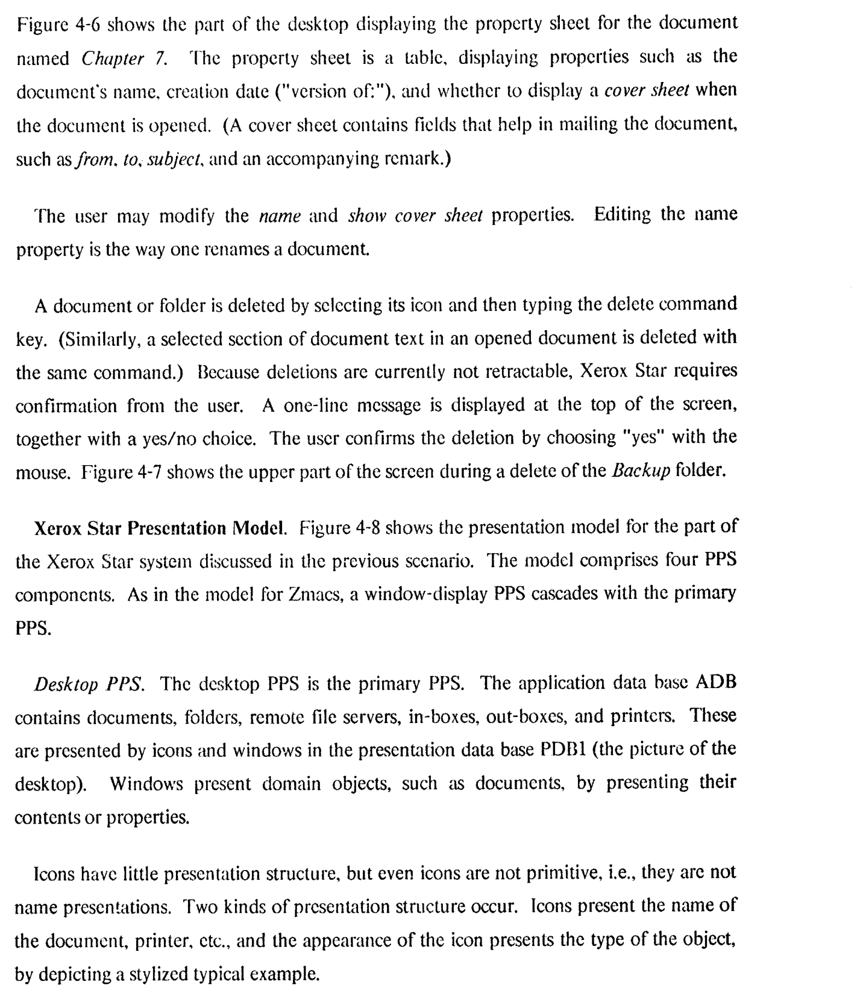

DOCUMENT PROPERTIES

?  Done   Cancel   Defaults

Name    [Chapter 7]

Show    COVER SHEET

Version Of:   03/27/84 16:25    By:    Daniel C. Halbert; OSBU North; Xerox

Size as of Last Paginate:    1

Useful graphics    Tiny icons    Chapter 7

<!-- page:088 -->

Figure 4-6: Xerox Star -- Property Sheet

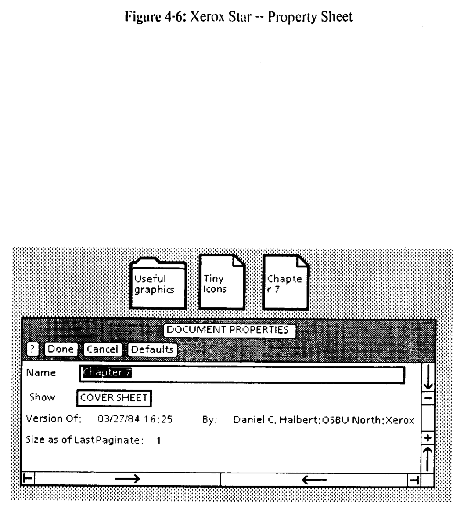

Useful graphics
Tiny Icons
Chapter 7

DOCUMENT PROPERTIES

?  Done  Cancel  Defaults

Name    [Chapter 7]

Show    COVER SHEET

Version Of:    03/27/84 16:25    By:    Daniel C. Halbert:OSBU North; Xerox

Size as of LastPaginate:    1

[horizontal scrollbar with left arrow — right arrow]

<!-- page:089 -->

Figure 4-7: Xerox Star -- Delete Confirmation

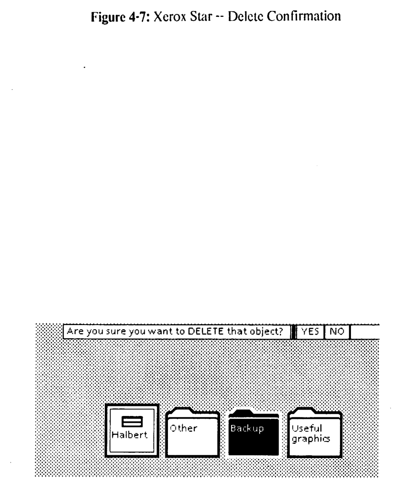

Are you sure you want to DELETE that object?   | YES | NO |

Halbert    Other    Backup    Useful graphics

<!-- page:090 -->

Figure 4-8: Xerox Star Model

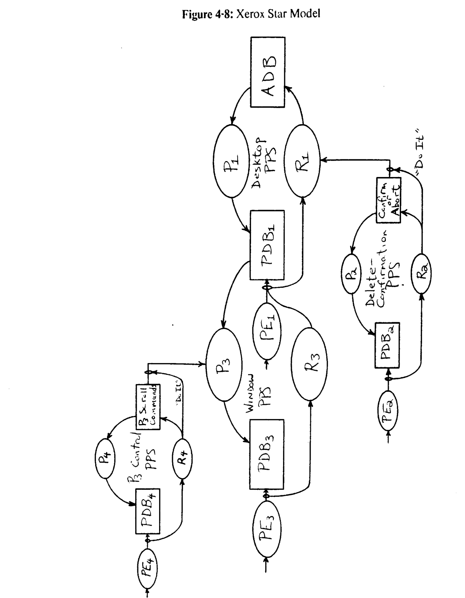

ADB

P1
Desktop PPS
PDB1
PE1

R1

P3
Window PPS
PDB3
PE3

P4
P3 Control PPS
P3 Scroll Commands
PDB4
PE4
R4

P2
Delete-Confirmation PPS
PDB2
PE2
R2

"Do It"
Cancel / Abort

<!-- page:091 -->

Windows are composite presentations with many sub-presentations. Folder windows, for
example, present the collection of documents and sub-folders in the folder by presenting
them as icons within the window.

Consider the move command discussed in the scenario, an operation provided by the
presentation editor PE1. The move may go unrecognized, merely changing the position of
icons on the desktop. However, when a document icon is moved next to a printer icon,
recognizer R1 translates the move into a print command. When a document icon is moved
into a window presenting an opened folder, R1 translates the move into a command to
move the document into that folder. In other words, spatial adjacency to a printer icon
presents the fact that a document is being printed; spatial containment within a folder
window presents the containment of a document within a folder. The user can create these
spatial relations using PE1, and R1 implements the commands to create those presented
conditions.

The delete command in the scenario refers to a selected document icon. Recognizer R1
translates this into a delete-document command, but does not immediately send it to the
application data base. The delete-confirmation PPS is used to allow the user to first confirm
the deletion.

Delete-Confirmation PPS. The application data base of the delete-confirmation PPS
contains two recognizer control commands: a confirmation ("do it") and an abort. These
commands are presented in PDB2 by presenting the delete command in the question and by
presenting the choice between the two commands as a yes/no box.

The user references the yes/no box with the mouse, using presentation editor PE2.
Recognizer R2 translates this into the confirmation or abort command and sends the
command to R1. If confirmed, R1 proceeds to send the delete command to ADB.

Window PPS. Some text and graphical objects in PDB1 are within windows for opened
documents, property sheets, etc. From these PDB1 objects, presenter P3 selects those
objects that will appear in the window. These visible icons and text are the contents of the

<!-- page:092 -->

presentation data base PDB3.

Mouse references to text or icons within the window are made with presentation editor
PE3 and translated into references to the presentation data base PDB1 by recognizer R3.
These are then further recognized by R1 as commands to the application data base.

P3-Control PPS.  The window presenter P3 accepts presenter control commands for
scrolling the window.  Scroll commands are presented by arrows in the margin of the
window, i.e., in presentation data base PDB4, by presenter P4.  The user can point to those
arrows with presentation editor PE4.  Recognizer R4 translates those references into
selection of scroll commands, together with a "do it" causing them to be sent to P3.

4.4 Steamer

Steamer is a prototype system designed to help train operators of U.S. Navy steam
propulsion systems, incorporating color graphics, knowledge-based instruction, and
comprehensive simulation models [Stevens, Roberts & Stead 83] [Stevens & Roberts 83].
Only the user interface aspects of the graphics and its connected simulation model will be
considered here.

Steamer uses a simulation model that consists of about eight thousand state variables,
together with updating functions, which are processed once a second.  (The simulation
proceeds in real-time.)  The user watches an animated schematic view of the simulation.
There are several such views, one of which is shown in figure 4-9.  The schematic is
continually updated, producing an animated view of the system.  Certain elements in the
system can be made to fail (e.g., a valve sticks open), to provide training for emergencies.

The user controls the system by pointing to various parts of the schematic with a mouse
and by using menus.  Pointing to a valve icon changes its state, opening or closing it.
Throttles are set by pointing to the position within them that indicates the new value.  Fluid
levels are changed by pointing to a new level position within the fluid tank icon.  In addition
to pointing, another console displays different menus of operations and choices for

<!-- page:093 -->

Figure 4-9: Sample Steamer Schematic

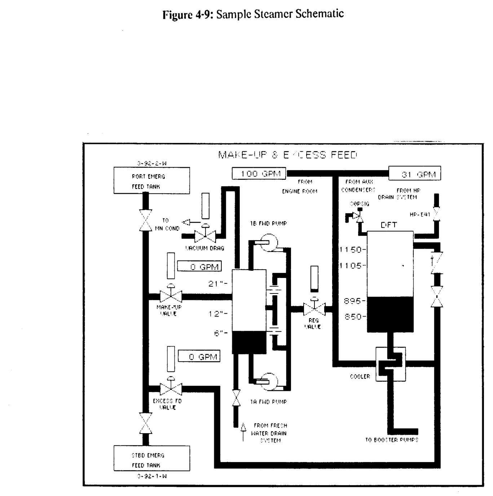

MAKE-UP & EXCESS FEED

100 GPM

31 GPM

PORT EMERG
FEED TANK

TO
AIR COND

VACUUM DRAG

0 GPM

MAKE-UP
VALVE

EXCESS FD
VALVE

STBD EMERG
FEED TANK
3-92-1-W

1B FWD PUMP

1A FWD PUMP

0 GPM

FROM ENGINE ROOM

FROM AUX
CONDENSER

FROM HP
DRAIN SYSTEM

HP-E41

DIFT

1150-
1105-

895-
850-

COOLER

TO BOOSTER PUMPS

FROM FRESH
WATER DRAIN
SYSTEM

3-92-2-W

<!-- page:094 -->

controlling the simulation and choosing displays. Figure 4-10 shows a sample display of the
menu console.

In what follows, two kinds of users will be mentioned, the student and the instructor.
Both use Steamer's schematic editor. The instructor uses the schematic editor to build the
schematic views of the system. The student uses the schematic editor to build controllers for
a process.

The Feedback MiniLab [Forbus 81] is an extension to Steamer designed to teach control
system concepts. For instance, one exercise is to ensure that the temperature of oil in a
sump remains at a specified value. The student builds a controller by selecting graphical
icons of a measurement device, comparator, actuator, etc., and connecting them together on
the screen. Steamer builds the underlying simulation for this device and connects it into the
main simulation model so that the student can study the resulting operation.

Steamer Presentation Model. The heart of the Steamer user interface is the continual
schematic view of the state of the simulation. This view is modeled by the PPS labeled
"Simulation Schematic PPS" in figure 4-11. The application data base ADB1 contains the
set of simulation state variables and various functions of these variables. The presentation
data base PDB1 is the color graphics schematic.

Steamer schematic presentations are constructed from icons, e.g., symbols for valves,
gauges, pipes, etc. Figure 4-12 shows a sample of these icons. These present state variables
or functions of state variables. Each kind of icon presents information in a particular way.
Valve icons are green to present an open valve, red to present a closed valve. Dials have
indicators that point to the presented values. Pipe presentations (rectangular pathways
between other icons) use color map techniques to show animated fluid, with small colored
blocks moving through the pipes. The apparent speed of movement presents the speed of
the fluid, as computed from state variables. The kind of fluid (e.g., steam, water, oil) is
presented by the color of the moving blocks.

<!-- page:095 -->

Figure 4-10: Steamer Menu Console

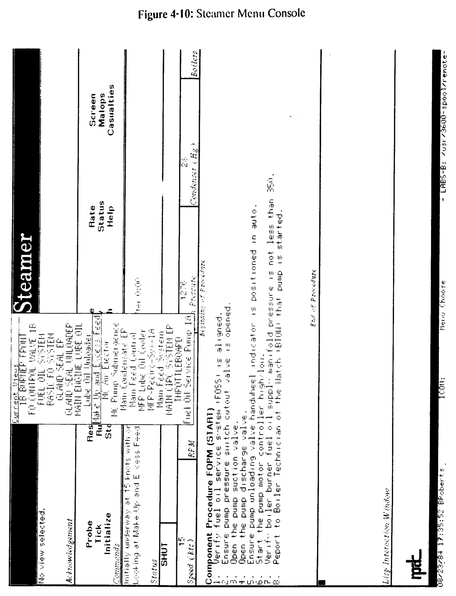

Steamer

No view selected.

Rate
Status
Help

Screen
Malops
Casualties

Probe
Tick
Initialize

SHUT

Component Procedure FOPM (START)

Menu Window

- LARES-8; /usr/psg00/remote

<!-- page:096 -->

Figure 4-11: Steamer Model

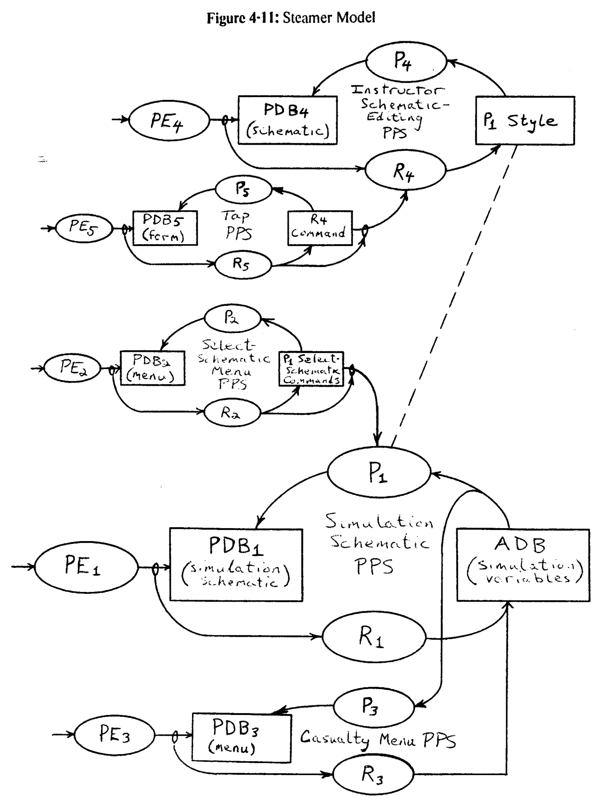

PE4 → PDB4 (schematic) → R4 → P1 Style
P4 (Instructor Schematic-Editing PPS) → PDB4 (schematic)

PE5 → PDB5 (form) → R5
P5 Tap PPS → R4 command → R4

PE2 → PDB2 (menu) → R2
P2 Select-Schematic Menu PPS → P1 Select-Schematic Commands

P1
  Simulation Schematic PPS
  PDB1 (simulation schematic) ← PE1
  R1 → ADB (simulation) variables

PE3 → PDB3 (menu) → R3
P3 Causality Menu PPS

[end of visible diagram transcription]

<!-- page:097 -->

Figure 4-12: Sample of Steamer Icons

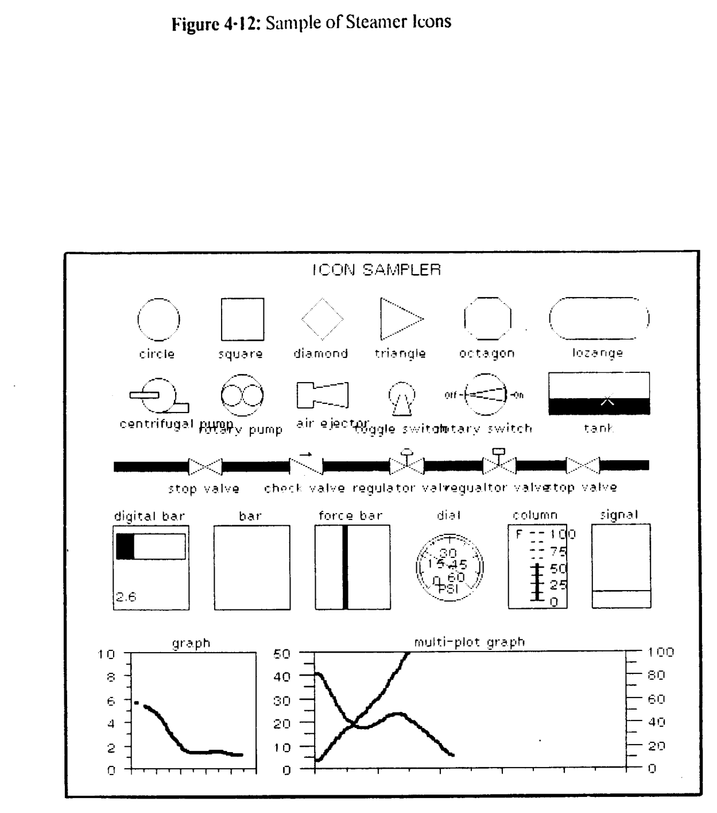

ICON SAMPLER

circle    square    diamond    triangle    octagon    lozange

centrifugal pump    rotary pump    air ejector    toggle switch rotary switch    tank

stop valve    check valve regulator valve regulator valve stop valve

digital bar    bar    force bar    dial    column    signal

2.6

graph    multi-plot graph

<!-- page:098 -->

when the set of state variables is consistent. Thus the user sees an animated presentation of the ongoing process. This is a different situation from the other user interfaces discussed in this chapter.

There are two kinds of animation in this presentation. First is the overall schematic animation just mentioned, produced by continually updating a presentation of a changing process. The other kind of animation, however, is an explicit graphics technique used as a presentation itself -- the presentation of fluid flow within pipes. This animation is produced by graphics routines from a static description of the process, i.e., computed from a single, instantaneous simulation state. (The pipe flow animation continues even when the simulation is halted -- just as other information about that single state is still visible, such as dial readings or valve colors.)

Presentation editor PE1 lets the user interact in the simulation schematic PPS by mouse references. Recognizer R1 interprets these references in many ways, depending on their positions within the different kinds of icons, translating the references into changes to state variables.

Presentation editor PE1 in the Feedback MiniLab also lets the user create, move, connect, and edit icons for the process controller. Recognizer R1 translates these created controller presentations into commands to create the simulation for that controller and connect it to the rest of the Steamer simulation.

Steamer Menus. Steamer has many menus, occupying a second screen. Several of these are modeled in figure 4-11. The select-schematic menu PPS models the menu that lets the user select which schematic to view. This PPS is an interface to the presenter P1, with an application data base of P1 commands to select the various schematics. Presentation data base PDB2 is a menu, a set of text presentations, each naming a schematic. Presentation editor PE2 models the user's selecting a menu item with the mouse. Recognizer R2 then translates that into a choice of the presented select-schematic command and sends it to presenter P1.

Figure 4-12: Sample of Steamer Icons

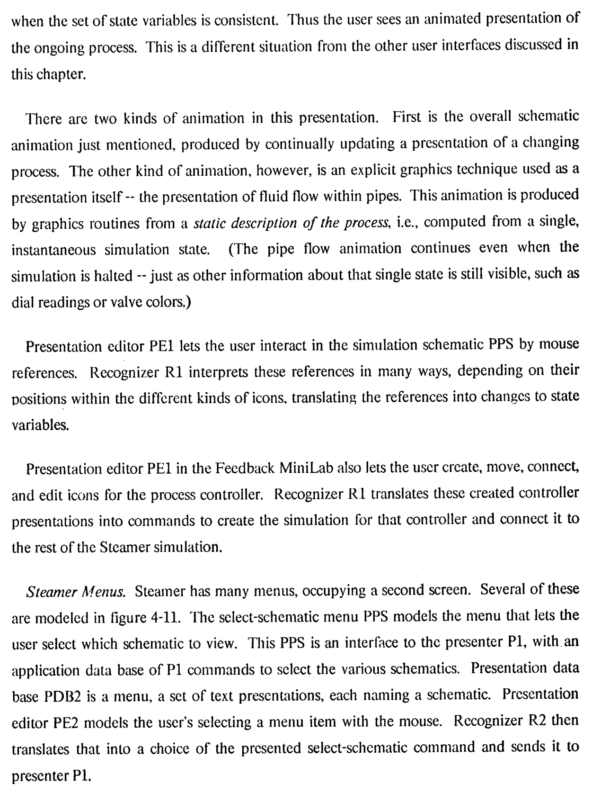

ICON SAMPLER

circle    square    diamond    triangle    octagon    lozange

centrifugal pump    rotary pump    air ejector    toggle switch/ rotary switch    tank

stop valve    check valve    regulator valve    regulator valve    stop valve

digital bar    bar    force bar    dial    column    signal

graph    multi-plot graph

<!-- page:099 -->

The casualty menu PPS is another interface to the main application data base ADB1, the
set of simulation variables.  With this menu, the student or instructor chooses a casualty,
recognized as a command to change some set of variables to simulate the particular device
failure.

Creating Views.  The instructor schematic-editing PPS enables the instructor to build and
alter the main presenter P1's schematic views of the simulation.  The schematic editing
offered by presentation editor PE4 is similar to what the student has when creating a process
controller, except for this PPS the simulation is not being changed.  Instead, the style of
schematic presentations that P1 builds of the simulation is changed or extended.

The PPS labeled "Tap PPS" extends the instructor's interface to the recognizer, R4, of the
schematic editing PPS.  As the instructor builds a schematic presentation for a new view, R4
must be able to determine what simulation variables or functions on them these new icons
will present.  (In Steamer terminology, R4 has the job of establishing taps from the icons to
the state variables.)  Presentation data base PDB6 in the tap PPS offers a form for the
instructor to fill in, e.g., specifying a expression of some state variables.  R4 combines this
information with mouse references to the new icons by PE4 to establish the icon-simulation
specification for the P1 style.

4.5 Summary of Structural Features

This section summarizes the features characterizing the structures of the extended
presentation system models used in this chapter to model the computational behavior of the
different user interfaces.  Although the interfaces discussed appear very different, there are
some strong underlying computational similarities, and the presentation system model
highlights these.  The overall appearance to the user, the use of icons versus menus, etc., is
certainly very important to the success of the interface.  However, these are questions of
interface style: the presentation system model looks below the style to identify common
components and behavior.  The success of the presentation system base concept, as
developed in chapter five, depends on this commonality.

<!-- page:100 -->

The primary structural feature to be discussed is the way in which one PPS is attached to
another. There were several kinds:

PPS to a Presenter.  In Dired, the main presentation data base, the directory listing, is
also used as a presentation of the directory presenter's state.  Editing the directory listing is
recognized as controlling the presenter's state.  Presenter scroll commands are presented by
icons in Xerox Star and the scroll bar in Zmacs.  Steamer has two kinds of presenter
interfaces:  a menu allows selecting schematics, and schematics can be edited by the
instructor to change the schematic style.  The latter capability is similar to Dired's use of the
directory listing.

PPS with Commands.  A PPS with commands to a component in some other PPS allows
planning -- to postpone the action while the action is being specified.  Dired includes an
annotation interface to the main application data base in order to plan delete commands.
The Zmacs minibuffer interface allows the user to compose a presentation editor command.
Star and Steamer include command interfaces to recognizers, the delete confirmation PPS
in Star and the tap PPS in Steamer.

Multiple PPS Interfaces.  An application data base can be presented in two or more
separate PPS interfaces.  In Dired, the deletion planning PPS and the deletion confirmation
PPS present the same data base of delete commands.  In Zmacs, the command minibuffer
PPS and command completion list PPS both present the same data base of presentation
editor commands.  In Steamer, the main (simulation schematic) PPS and the casualty menu
PPS both offer interfaces to the main (simulation) application data base.

The casualty menu PPS is another interface to the main application data base ADB1, the
set of simulation variables.  With this menu, the student or instructor chooses a casualty,
recognized as a command to change some set of variables to simulate the particular device
failure.

Creating Views.  The instructor schematic-editing PPS enables the instructor to build and
alter the main presenter P1's schematic views of the simulation.  The schematic editing
offered by presentation editor PE4 is similar to what the student has when creating a process
controller, except for this PPS the simulation is not being changed.  Instead, the style of
schematic presentations that P1 builds of the simulation is changed or extended.

The PPS labeled "Tap PPS" extends the instructor's interface to the recognizer, R4, of the
schematic editing PPS.  As the instructor builds a schematic presentation for a new view, R4
must be able to determine what simulation variables or functions on them these new icons
will present.  (In Steamer terminology, R4 has the job of establishing taps from the icons to
the state variables.)  Presentation data base PDB6 in the tap PPS offers a form for the
instructor to fill in, e.g., specifying a expression of some state variables.  R4 combines this
information with mouse references to the new icons by PE4 to establish the icon-simulation
specification for the P1 style.

<!-- page:101 -->

systems. Two important examples have occurred in this chapter. First, Dired and Steamer
include a presentation shared between two PPS interfaces, the main presentation data base
(directory listing or schematic) and a PPS interface to the main presenter. By editing the
directory listing or schematic, the user controls the main presenter's presentation style.

Second, in Dired, screen space is shared: directory annotations are intermingled with the
parts of the directory listing. Somewhat simpler, hierarchical space sharing occurs in the
Xerox Star, where windows appear within the overall desktop area, and such things as scroll
icons control the window presenter appear within the windows.

<!-- page:102 -->

Chapter Five

PSBase: A Presentation System Base

A presentation system base is a collection of mechanisms and tools for building user
interfaces whose architecture follows the structure of the presentation system model. A
prototype, called PSBase, has been implemented on the MIT Lisp machine [Weinreb, Moon
& Stallman 83] and will be discussed in this chapter. With a presentation system base, the
job of building good user interfaces becomes much easier. Chapter six illustrates the utility
of PSBase by discussing the implementation of an interface built on top of PSBase.

In certain respects the architecture of PSBase resembles the presentation system model
proposed in chapters two and three. Some of the PSBase modules support particular PPS
components, and in general, domain-independent and style-independent mechanisms are
isolated. This structure in turn encourages good modularity in the user interfaces
constructed. Figure 5-1 shows the fundamental support of PSBase modules for PPS
components. Figure 5-2 shows the overall structure of PSBase, with arrows indicating uses
relations. The reason the PSBase architecture does not exactly resemble the PPS model (see
figure 2-1 on page 29) is due to the different goals of the model and the base. The PPS
model analyzes the activity of a user interface. PSBase is structured to emphasize the
sharing of knowledge; information is not redundantly represented. Also, figure 5-1 shows
only some of the PSBase support: the basic style packages module supports the
construction of combinations of PPS components and PPS extensions.

Each PSBase module will be discussed in a section below. There are three layers in the
structure: The data base mechanisms module at the bottom of the figure is (to a large
extent) a general support package, not specific to user interfaces. The four middle-layer
modules represent general presentation-system support, i.e., tools and mechanisms used to
construct various interface styles. The basic style packages module at the top of the figure
comprises specific components of interface styles that the interface builder may or may not

<!-- page:103 -->

Figure 5-1: PSBase Support of PPS Components

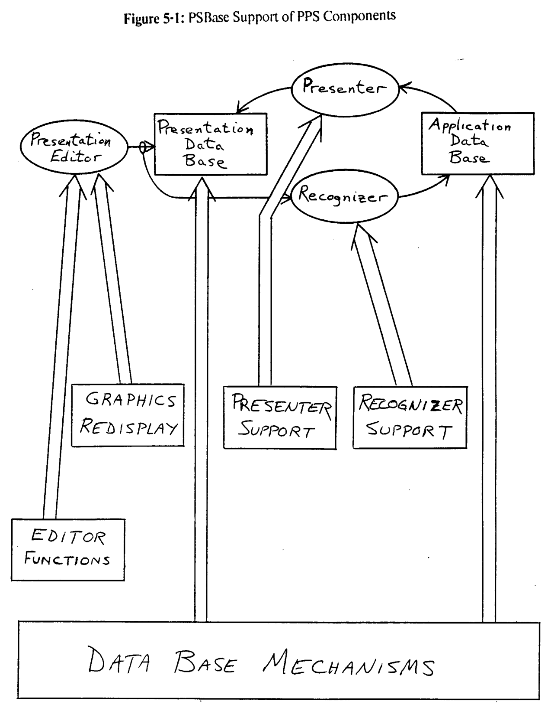

Presenter
Presentation Data Base
Application Data Base
Presentation Editor
Recognizer
GRAPHICS
REDISPLAY
PRESENTER
SUPPORT
RECOGNIZER
SUPPORT
EDITOR
FUNCTIONS
DATA BASE MECHANISMS

<!-- page:104 -->

Figure 5-2: Structure of PSBase

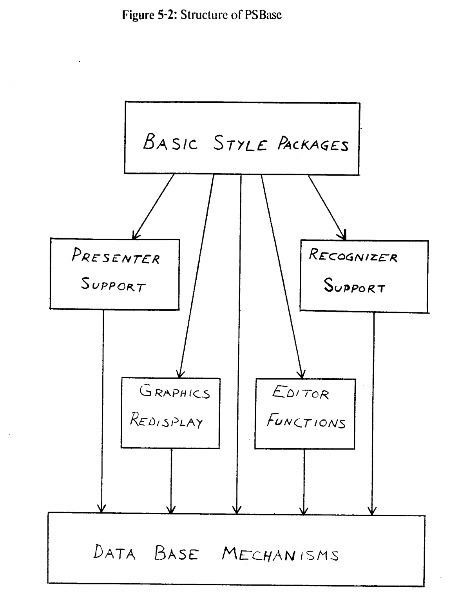

BASIC STYLE PACKAGES

PRESENTER SUPPORT

RECOGNIZER SUPPORT

GRAPHICS REDISPLAY

EDITOR FUNCTIONS

PRESENTER SUPPORT

RECOGNIZER SUPPORT

EDITOR FUNCTIONS

DATA BASE MECHANISMS

<!-- page:105 -->

choose to include. These packages, however, are independent of any particular application
domain.

5.1 Data Base Mechanisms

PSBase includes support for building data bases structured as networks of objects. Much
of this support is provided by the Lisp machine's flavor system for object-oriented
programming. PSBase imposes certain conventions, provides an existing flavor structure for
the descriptions, and provides tools for manipulating and extending the network structure.
The Lisp machine flavor mechanism allows multiple inheritance of classes of objects
(flavors). PSBase extends this slightly to allow limited inheritance and description of
properties of objects (instance variables of flavor instances).

The basic data base mechanism is used for building application data bases (descriptions of
files, directories, mail, and commands, for example) and the presentation data base (various
kinds of presentations, their properties, and their relationships). An important point is that
the presentation and application data bases are linked together, so that in effect they are
both part of a large, uniformly structured data base. Many of the PSBase mechanisms rely
strongly on the fact that the same data base mechanism is used throughout. Because of the
importance of the data base mechanisms, they will be discussed in detail in this section.

One example of the benefits of having a uniform representation technique is that the
presenter's domain collector and other domain-dependent modules can be minimized and
more presentation mechanisms can be shared. The interface builder can experiment and
change the implementation more easily, changing the presentation styles or adding new
presentations, for example. Uniformity facilitates the construction of presenters.

This research did not attempt to build a state-of-the-art knowledge representation system.
However, the data base mechanisms in PSBase are inspired by such systems (e.g., KL-One
and its successors NIKL and KL-Two [Brachman 78] [Brachman & Schmolze 85] and
Omega [Attardi & Simi 81] [Barber 82]), and a full-scale presentation system base may very
well benefit from such a system.

<!-- page:106 -->

An important capability of the data base mechanism is allowing the description of classes
of objects and the relationships between classes -- particularly specialization and the
inheritance of properties of objects of a class. Figure 5-3 shows an example, part of an
application data base network describing files and directories. The application data base
contains both class descriptions and also instances of them.

The style of the figure is based on that used for drawing KL-One networks. Ellipses show
class descriptions; shaded ellipses show instances of classes. Double-stemmed arrows show
the containing class. Small boxes connected to ellipses show properties; these properties are
inherited by more specialized classes. (In addition, as will be seen later in this chapter, other
mechanisms in effect "hang off" of particular classes of the data base, and these also
undergo a sort of inheritance.)

For example, the class file is shown by the ellipse labeled "file"; it is a specialization of
the class (i.e., a kind of) generalized file, which in turn is a specialization of the class
operating system object and domain object. A file link is also a kind of generalized file. The
network shows that generalized files have several properties: directory, pathname, etc. Files
and links inherit these properties.

Each particular file in the application data base would be represented by an instance of
file. One such instance is shown. Its reference date property is shown, linking that file
instance with a particular instance of the class date. The file instance also has several other
properties (directory, path, etc.), linking the file instance to directory, pathname, etc.,
instances, though they have not been shown in this figure.

Single-stemmed arrows from a box shows the value of that property, or for classes, the
type of such a value. Some properties are specified as having a list of values; directories, for
instance, have a property whose value is a list of files. A list property is shown as a box with
a circumscribed circle. (One of the limitations of PSBase is that these type-restriction links
are not fully implemented in the current implementation. They are shown here to better
document the relationships of classes when instantiated. However, PSBase does include a
simplified type restriction mechanism used for certain parts of the data base.)

5.1 Data Base Mechanisms

PSBase includes support for building data bases structured as networks of objects. Much
of this support is provided by the Lisp machine's flavor system for object-oriented
programming. PSBase imposes certain conventions, provides an existing flavor structure for
the descriptions, and provides tools for manipulating and extending the network structure.
The Lisp machine flavor mechanism allows multiple inheritance of classes of objects
(flavors). PSBase extends this slightly to allow limited inheritance and description of
properties of objects (instance variables of flavor instances).

The basic data base mechanism is used for building application data bases (descriptions of
files, directories, mail, and commands, for example) and the presentation data base (various
kinds of presentations, their properties, and their relationships). An important point is that
the presentation and application data bases are linked together, so that in effect they are
both part of a large, uniformly structured data base. Many of the PSBase mechanisms rely
strongly on the fact that the same data base mechanism is used throughout. Because of the
importance of the data base mechanisms, they will be discussed in detail in this section.

<!-- page:107 -->

Figure 5-3: A Class Description Network

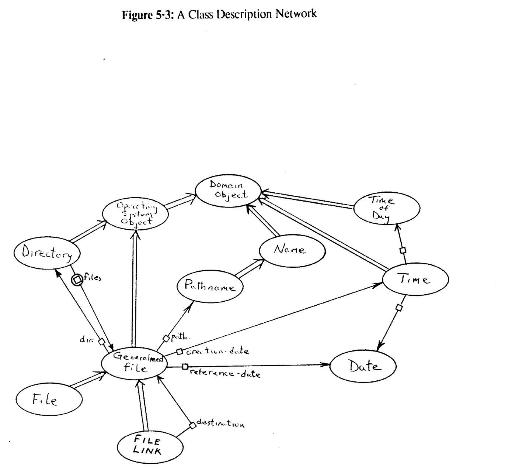

Domain object
Operating system object
Directory
⦿ files
Generalized file
File
FILE LINK
Name
Pathname
Time
Time of Day
Date
creation-date
reference-date
path.
destination

<!-- page:108 -->

PSBase also offers a rudimentary ability to classify properties. This ability is not reflected in these figures, in the interest of clarity. For instance, circles, text, and other presentations typically have properties defining their positions. The description mechanisms allows these properties to be labeled as defining positions. One example of the benefit of such a scheme occurs in the implementation of the presentation editor function that moves presentations: the function can examine the description of the presentation to find its position-defining properties and change them, without any knowledge about the particular kind of presentation.

Presentation Data Base.  PSBase provides a mechanism for building the presentation data base. This includes an already-constructed part of the data base network structure that defines several classes of presentations, inter-presentation relationships, and the properties that connect the presentation data base with the application data base. (As already discussed, they are not really separate data bases, but rather different parts of the same, overall data base network.) Each presentation can have a record of the presented data base object and the presentation style used. Most of the modules in PSBase (presenters, recognizers, graphics redisplay, etc.) depend on the known organization of the presentation data base and on the fact that it is part of the overall, uniform data base structure.

Figure 5-4 shows part of the presentation data base and its relation to the application data base. The main class is presentation. All presentations have a property called presented domain object, which records the domain object being presented. For example, text presentation T1 (an instance of the text presentation class) is shown presenting the file OZ:<NSR>QUEUE.NOTES. This is recorded by T1's presented-domain-object property linking T1 with the file instance.

<!-- page:109 -->

Figure 5-4: Sample Presentation Data Base Structure

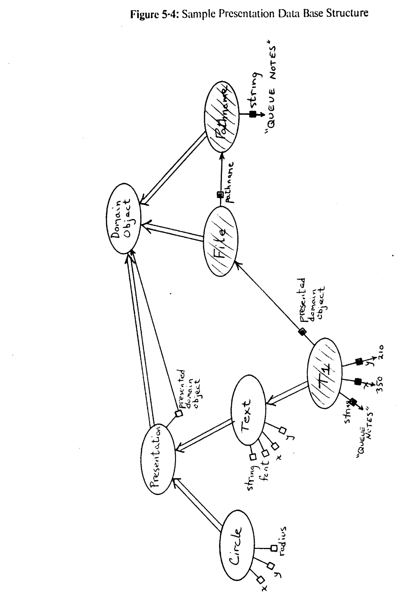

Domain Object
File
Text
Presentation
Circle
string font
x  y
radius
presented-domain-object
"QUEUE NOTES"
string "QUEUE NOTES"
T1
350  210
presented-domain-object

PSBase also offers a rudimentary ability to classify properties. This ability is not reflected in these figures, in the interest of clarity. For instance, circles, text, and other presentations typically have properties defining their positions. The description mechanisms allows these properties to be labeled as defining positions. One example of the benefit of such a scheme occurs in the implementation of the presentation editor function that moves presentations: the function can examine the description of the presentation to find its position-defining properties and change them, without any knowledge about the particular kind of presentation.

Presentation Data Base.  PSBase provides a mechanism for building the presentation data base. This includes an already-constructed part of the data base network structure that defines several classes of presentations, inter-presentation relationships, and the properties that connect the presentation data base with the application data base. (As already discussed, they are not really separate data bases, but rather different parts of the same, overall data base network.) Each presentation can have a record of the presented data base object and the presentation style used.  Most of the modules in PSBase (presenters, recognizers, graphics redisplay, etc.) depend on the known organization of the presentation data base and on the fact that it is part of the overall, uniform data base structure.

Figure 5-4 shows part of the presentation data base and its relation to the application data base. The main class is presentation. All presentations have a property called presented domain object, which records the domain object being presented. For example, text presentation T1 (an instance of the text presentation class) is shown presenting the file OZ:<NSR>QUEUE.NOTES. This is recorded by T1's presented-domain-object property linking T1 with the file instance.

Figure 5-5 illustrates three kinds of inter-presentation relationships supported by the presentation data base network structure. First, composite presentations may be constructed; these have a property whose value is a list of sub-presentations. Second, a connecting arrow joins two presentations; the arrow's end positions (x1, y1, x2, y2) are derived from its end presentations' positions. Third, two presentations may be attached.

<!-- page:110 -->

Figure 5-5: Inter-Presentation Relationships

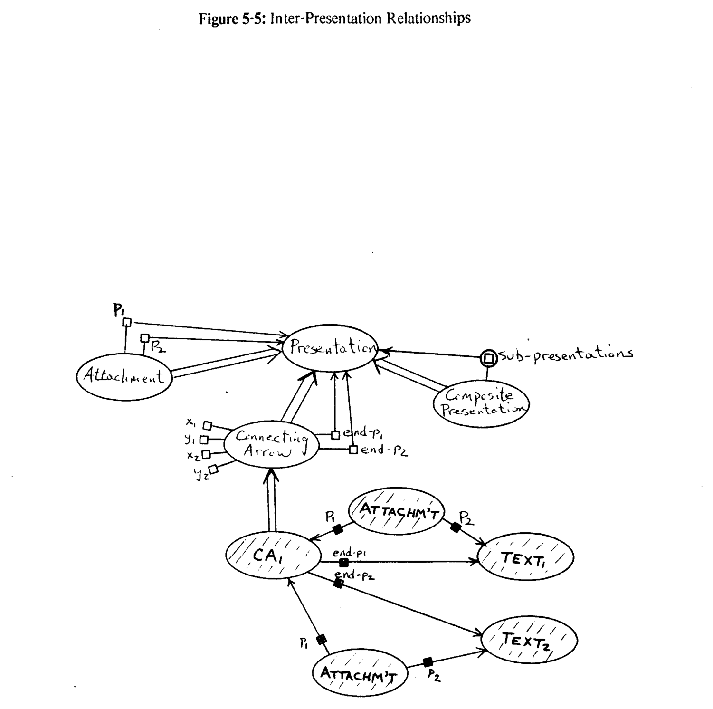

Presentation
  - Attachment
    - p1
    - p2
  - Composite Presentation
    - □ sub-presentations
  - Connecting Arrow
    - x1 □
    - y1 □
    - x2 □
    - y2 □
    - end-p1
    - end-p2
  - CA1
    - end-p1
    - end-p2
  - ATTACHM'T
    - p1 ■
    - p2 ■
  - TEXT1
    - string "font" x □
    - y □
  - TEXT2
  - Circle
    - x □
    - y □
    - radius
  - File
  - Domain Object
  - Polymorphic
    - "QUEUE NOTES"

<!-- page:111 -->

Connecting arrows cause themselves to be attached to their end presentations; in general,
any two presentations may be attached. The attachment relationship is asymmetric and has
the following meaning: p1 attached to p2 implies that p1 is repositioned or deleted whenever
p2 is repositioned or deleted, respectively. In the figure connecting arrow CA1 is shown
connecting Text1 and Text2. If Text1, say, is moved, CA1 will have its end positions
redrived. The arrow will be redrawn, and the arrow will remain connected to the two
pieces of text.

The important fact about this scheme for structuring the presentation data base is that the
general data base mechanism is being used, rather than a representation tailored to
particular kinds of pictures. The presentation data base fits within an overall data base
network with a uniform method of organization.

This has four implications. First, the data base mechanisms can be shared. Second, the
data base mechanism does not limit the kinds of presentations that can be used -- the
network can be extended by the interface builder to add new kinds. Third, ancillary
information about the presentation can be recorded; such information can be useful to
presenters, recognizers, and presentation editing commands that need to make decisions
about the presentation. Fourth, the presentation data base can itself be treated as an
application data base -- it can be presented.

The last of these is important for matching the structure of the implementation to the
structure of the model. One kind of example is the cascaded presentation systems of Zmacs
and Xerox Star as modeled in chapter four.

Command Description Support. PSBase has a mechanism for describing commands in
the data base and connecting these descriptions to the actual Lisp machine functions. User
options (Lisp variables) can also be described, and command documentation can refer to
these variable descriptions. Variable descriptions themselves can have associated
documentation.

The classes of description involved are shown in figure 5-6. The primary kinds of objects

<!-- page:112 -->

Figure 5-6: Command Description Support

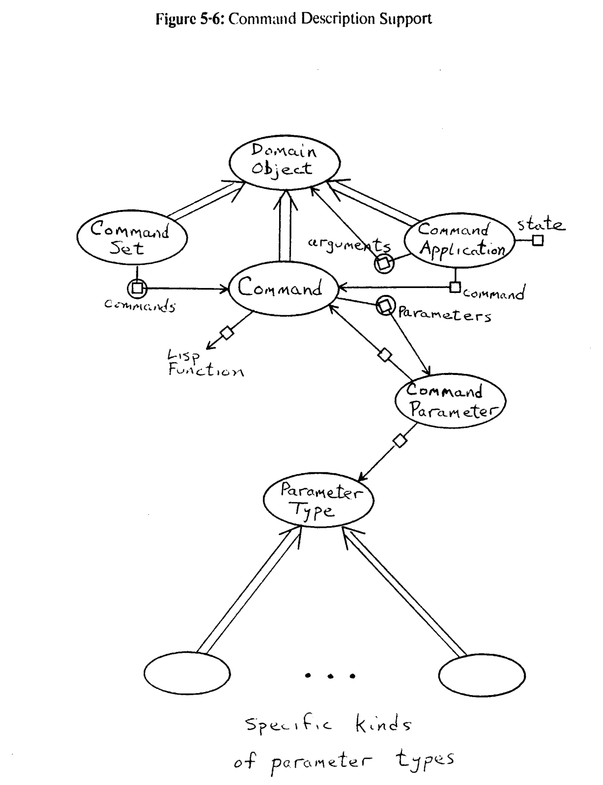

Domain Object

Command Set
  commands

Command
  LISP Function
  arguments
  Parameters

Command Application
  state
  command

Command Parameter

Parameter Type

...
Specific kinds
of parameter types

<!-- page:113 -->

are commands, describing Lisp functions, command sets, describing groups of related
functions, and command applications, describing the invocation of a Lisp function with a list
of arguments. A command application has a state, which specifies whether the function has
not yet been invoked on these arguments, is currently being excecuted, or has completed.
Functions may be invoked by building a command application description and then, using
the Lisp machine's flavor-system message-passing, sending the command application object
an execute message.

In addition to the properties shown in the figure, commands also include properties
specifying the name, documentation, sub-commands, variables used, and the verbs that may
be used to describe the command.

Each command description includes a list of parameter descriptions, which must match
the arguments given to the command application. The command application object checks
its arguments for validity when it is formed. Each command parameter description includes
properties specifying name, documentation, and a description of the type of the argument
required. There are several specializations of command parameter type, one for each kind of
argument that may be supplied to user commands.

For example, one of the Lisp functions printing files takes two arguments: a file and a
printer, which is to say two instances in the application data base, a file instance and a
printer instance. The command instance for this function includes a list of two parameter
descriptions that describe these restrictions: the first parameter specifies the type file, and
the second parameter specifies the type printer. To invoke this function, a command
application instance is created, its argument list containing the particular file and printer
instances. As the command application is formed, the arguments are automatically checked

Execution Monitor. The command description mechanism is extended by automatic
connections to the Lisp environment, for use by the PSBase execution monitor. When a
command instance is created, the Lisp function it corresponds to is automatically modified

Figure 5-6: Command Description Support

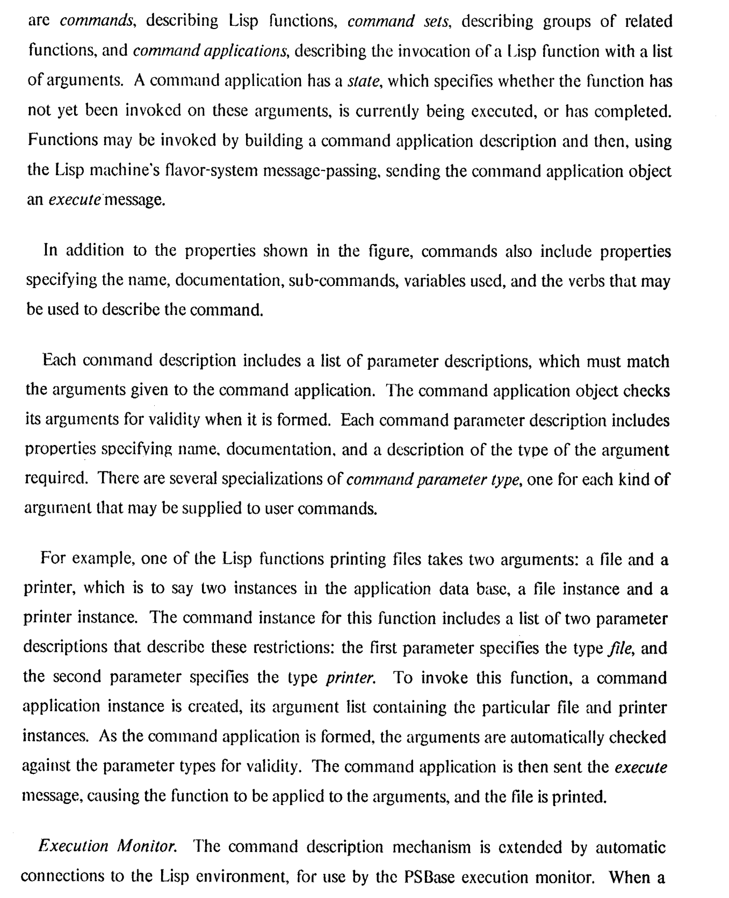

Diagram labels and major relationships:
- Domain Object
- Command Set
  - commands
- Command
  - Lisp Function
  - command
- Command Application
  - arguments
  - state
- Parameters
- Command Parameter
- Parameter Type
- Specific kinds of parameter types

<!-- page:114 -->

so that the execution monitor is notified when the function is invoked and when it returns.

The execution monitor maintains a stack indicating the current execution state in terms of the described procedures. In addition, command application descriptions are placed on the stack while they execute.

Reference Resolution. Presenters and recognizers must often resolve a presentation reference to an instance in the data base of a particular type (or, in general, to an instance that satisfies some predicate). In the simple case, the value of the presentation's presented domain object property is of the correct type and no resolution is needed. For cases when this is not true, PSBase includes a mechanism for finding a related data base instance that is of the correct type.

An example will serve to introduce the three kinds of resolution provided. The user invokes a command that requires a directory as one of its arguments; the user selects a presentation as this argument. In the simple case, the presented domain object property links the presentation to a directory, and the resolution is trivial -- just follow the presented domain object link. Figure 5-7 illustrates this case and the others to be discussed. The dotted arrow indicates the path followed by the resolution mechanism in order to reach the directory instance. (It is the directory instance in all cases that will be returned by the resolution mechanism.)

The first (and most common) kind of resolution applies when the presented domain object is a property, and the property's value is of the desired type. Resolution is to the property's value. In the case illustrated in the second part of figure 5-7, the user has selected a presentation of the directory property of a file.

The second kind of resolution applies only to certain kinds of properties, termed essential properties. These are properties for which the value is, in some sense, equivalent to the object owning the property -- equivalent in terms of its use as a referent. The pathname property of a file is essential -- any name property is. (Specifying which properties are essential is part of the task of defining the application data base class network.) For essential properties, the resolution mechanism walks to the owning object. In the case

<!-- page:115 -->

Figure 5-7: Reference Resolution

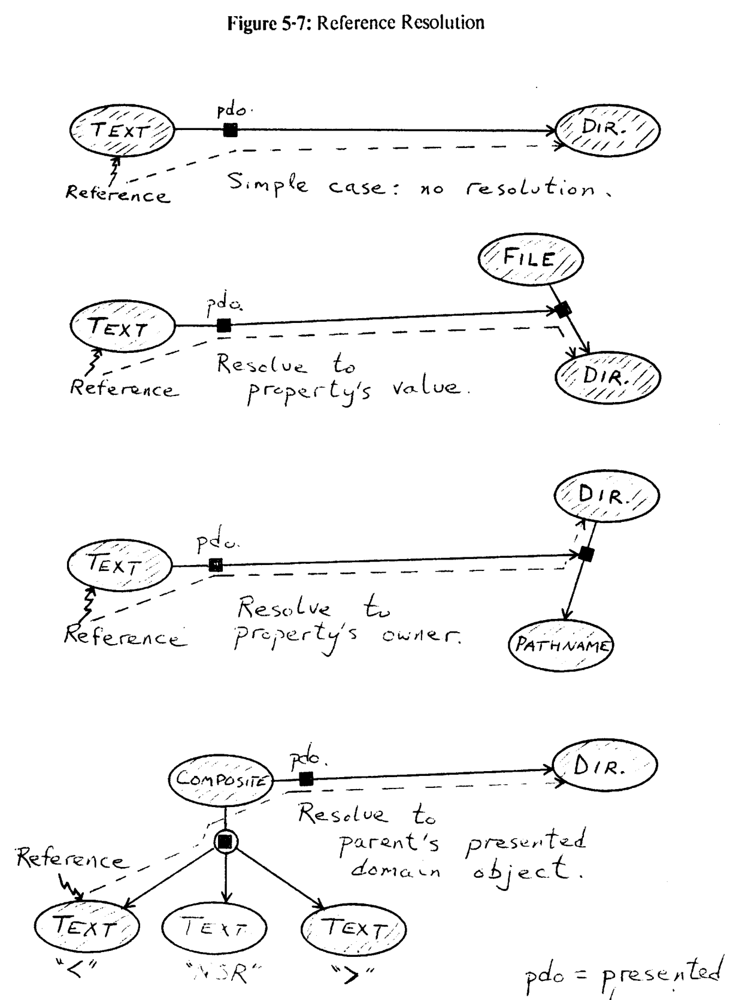

TEXT (oval) → pdo. (square) ———→ DIR. (oval)
Reference (arrow to TEXT)
Simple case: no resolution.

TEXT (oval) → pdo. (square) ———↘ (small filled arrow) FILE (oval)
Reference (dashed arrow from TEXT toward DIR.)
Resolve to property's value. (dashed path toward DIR.)
FILE (oval) — (filled arrow) → DIR. (oval)

TEXT (oval) → pdo. (square) ———↘ (filled arrow) → DIR. (oval)
Reference
Resolve to property's owner.
DIR. (oval) → (filled arrow) → PATHNAME (oval)

COMPOSITE (oval) → pdo. (square) ———→ DIR. (oval)
Reference (dashed arrow from TEXT to central square node)
Resolve to parent's presented domain object.
central square node with three downward arrows to TEXT (oval), TEXT (oval), TEXT (oval)
left TEXT labeled "<"
center TEXT labeled "USR"
right TEXT labeled ">"
pdo = presented domain object

<!-- page:116 -->

Figure 5-7: Reference Resolution

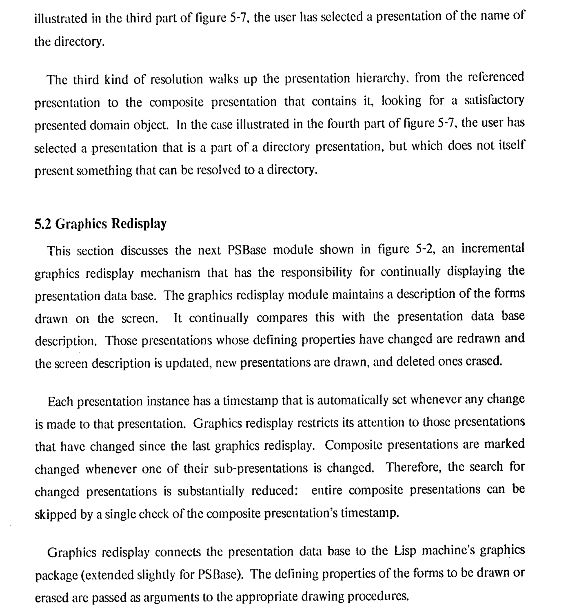

TEXT
pdo.
DIR.
Reference
Simple case: no resolution.

TEXT
pdo.
FILE
DIR.
Reference
Resolve to property's value.

TEXT
pdo.
DIR.
Reference
Resolve to property's owner.
PATHNAME

COMPOSITE
pdo.
DIR.
Reference
Resolve to parent's presented domain object.

TEXT    TEXT    TEXT

pdo = presented
domain
object

<!-- page:117 -->

5.3 Presentation Editor Functions

PSBase offers a set of presentation editing functions that as a whole can be used as a general presentation editor, or the functions can be selectively combined as part of a specific user interface. The presentation editor functions are independent of the data base domain, presenters, recognizers, and their styles. The editor functions also have a history-keeping mechanism that records commands used and the presentations affected. This history is used by some editor functions (e.g., the command to undo a previous erase command) and by other PSBase modules if needed (e.g., a recognizer may need to inspect the editing history).

The presentation editor is a combination of a text editor and a diagram editor. The user can place text at any point on the screen and use Emacs-like commands to edit the text. There are only a few such text-editing commands in PSBase. However, this is due to the limited nature of the project, and not to any inherent limitations. A full-scale presentation system base following this approach would include a much larger editor module. The diagram-editing capabilities in PSBase include the following:

* Creating lines and arrows between two positions or between two presentations
* Creating ellipses, circles, and rectangles
* Creating an ellipse or rectangle around a given presentation, computing the size and position from the presentation
* Moving a presentation to a new position
* Erasing a presentation or undoing an erase
* Attaching or unattaching two presentations and presenting attachments visually
* Aligning one presentation with another, by center or edge positions

5.4 Presenter Support

This section discusses three kinds of presenter support provided by PSBase: first, a data base mechanism for describing certain properties of presentation styles, second, three general semantic presenters that are driven by these style descriptions, and third, some organizational presenters that may be independently combined with the semantic presenters in order to specify a style's layout method.

Presentation Style Descriptions. A presenter has an associated style, which describes how the presentation is structured and related to the presented information. There are four basic classes of style descriptions in the current PSBase implementation:

Primitive presentation styles do not refer to other presentation styles, nor do they describe the structure of the presentation. Instead, they specify a procedure that creates it (a "canned" presenter). One goal of PSBase is to reduce the number of primitive presentation styles that must be written, as they require considerably more effort than do the other styles discussed here.

Graphical presentation styles do not refer to other styles either, but do include a specification of the presentation forms and their properties. These properties may be computed from properties of the presented domain object and from properties of the composite presentation being constructed.

Sequence presentation styles specify how to present sequences of objects in the application data base. For instance, a directory contains a sequence of files, along with other properties of the directory, such as its name and protection. Sequence presentation styles specify a presentation style to use for the element presentations. They also optionally may specify prefix, infix, and suffix presentations to separate the presentations of the elements of the sequence.

Template presentation styles build larger presentation styles out of a fixed number of smaller ones, interspersed with text presentations that do not present any domain information, but merely serve as the template.

<!-- page:118 -->

organizational presenters that may be independently combined with the semantic presenters
in order to specify a style's layout method.

Presentation Style Descriptions. A presenter has an associated style, which describes how
the presentation is structured and related to the presented information. There are four basic
classes of style descriptions in the current PSBase implementation:

Primitive presentation styles do not refer to other presentation styles, nor do they describe
the structure of the presentation. Instead, they specify a procedure that creates it (a
"canned" presenter). One goal of PSBase is to reduce the number of primitive presentation
styles that must be written, as they require considerably more effort than do the other styles
discussed here.

Graphical presentation styles do not refer to other styles either, but do include a
specification of the presentation forms and their properties. These properties may be
computed from properties of the presented domain object and from properties of the
composite presentation being constructed.

Sequence presentation styles specify how to present sequences of objects in the
application data base. For instance, a directory contains a sequence of files, along with
other properties of the directory, such as its name and protection. Sequence presentation
styles specify a presentation style to use for the element presentations. They also optionally
may specify prefix, infix, and suffix presentations to separate the presentations of the
elements of the sequence.

Template presentation styles build larger presentation styles out of a fixed number of
smaller ones, interspersed with text presentations that do not present any domain
information, but merely serve as the template.

<!-- page:119 -->

organizational presenter.  Since domain object classes can be specialized, styles can apply to
a wide variety of objects or to just a specific few.  One can think of presentation styles as
being attached to classes in the data base.  These attachments drive the process of selecting a
suitable presentation style.

For example, PSBase provides a very general presenter, called the phrasal presenter.  This
presenter produces (in most cases) noun phrases for a given domain object.  This style
description for this presenter specifies that it applies to the class domain object, i.e., it applies
to any instance in the data base.  This applicability derives from the fact that the phrasal
presenter can always produce something -- at least something of the form "a" followed by
the name of the domain object class, e.g., "a file".  Furthermore, it takes advantage of the
uniformity of the description mechanism and inspects the properties of the object to see if it
has any property that is a kind of name.  If so, it uses the name, e.g., "the file
OZ:<NSR>QUEUE.NOTES.1".  The phrasal presenter will be more fully discussed below.

On the other hand, another presentation style applies to the specific class time of day,
producing text presentations such as "02:04:46".

The presentation style mechanism supports two major operations, finding a named
presentation style and finding the most specific presentation style applicable for a given
instance in the data base.  Typically, several styles have a matching class, i.e., attach to
classes to which the instance belongs.  The one with the most specific matching class is
chosen.  (E.g., time of day would be preferred over domain object if both match.)  If there are
two or more styles with the same, most-specific class, the default is chosen.  Styles that are
not defaults are invoked specifically by name.  In a larger presentation system base the
comparison could be more involved, taking into account specific properties of the domain
object to be presented.

Style-Driven Semantic Presenters.  PSBase offers three semantic presenters whose

behavior is determined by the kinds of style descriptions described above.  It also provides a
semantic redisplay mechanism that periodically invokes the presenters so that they update
existing presentations.  Examples of the three major kinds of style descriptions will be used

organizational presenters that may be independently combined with the semantic presenters
in order to specify a style's layout method.

Presentation Style Descriptions.  A presenter has an associated style, which describes how
the presentation is structured and related to the presented information.  There are four basic
classes of style descriptions in the current PSBase implementation:

Primitive presentation styles do not refer to other presentation styles, nor do they describe
the structure of the presentation.  Instead, they specify a procedure that creates it (a
"canned" presenter).  One goal of PSBase is to reduce the number of primitive presentation
styles that must be written, as they require considerably more effort than do the other styles
discussed here.

Graphical presentation styles do not refer to other styles either, but do include a
specification of the presentation forms and their properties.  These properties may be
computed from properties of the presented domain object and from properties of the
composite presentation being constructed.

Sequence presentation styles specify how to present sequences of objects in the
application data base.  For instance, a directory contains a sequence of files, along with
other properties of the directory, such as its name and protection.  Sequence presentation
styles specify a presentation style to use for the element presentations.  They also optionally
may specify prefix, infix, and suffix presentations to separate the presentations of the
elements of the sequence.

Template presentation styles build larger presentation styles out of a fixed number of
smaller ones, interspersed with text presentations that do not present any domain
information, but merely serve as the template.

Each kind of style description also specifies a style name, the class of domain object (in

to discuss the action of their associated presenters.

The first example is a simple clock presentation.  The presented domain object is the
current time of day instance in the application data base.  Here, the presentation is a
composite of two sub-presentations, a circle (the face of the clock) and a vector (the hour
hand).  In this simple clock there is no minute hand and there are no text labels on the face.
The following is what the interface builder would write to construct this presentation style
(the small function angle-from-hours-and-minutes, which performs the simple trigonometric
calculations, would also have to be written):

(def-graphics-presentation-style CLOCK TIME-OF-DAY nil t 120
  ((NIL
    (circle-presentation
      :x (relative-to-parent-x 25)
      :y (relative-to-parent-y 25)
      :radius 25))
   (:HOURS
    (vector-presentation
      :length 14
      :angle (angle-from-hours-and-minutes
               (send presented-domain-object ':hours)
               (send presented-domain-object ':minutes))
      :x1 (relative-to-parent-x 25)
      :y1 (relative-to-parent-y 25)))))

<!-- page:120 -->

to discuss the action of their associated presenters.

The first example is a simple clock presentation. The presented domain object is the current time of day instance in the application data base. Here, the presentation is a composite of two sub-presentations, a circle (the face of the clock) and a vector (the hour hand). In this simple clock there is no minute hand and there are no text labels on the face. The following is what the interface builder would write to construct this presentation style (the small function angle-from-hours-and-minutes, which performs the simple trigonometric calculations, would also have to be written):

```
(def-graphics-presentation-style CLOCK TIME-OF-DAY nil t 120
  ((NIL
    (circle-presentation
     :x (relative-to-parent-x 25)
     :y (relative-to-parent-y 25)
     :radius 25))
   (:HOURS
    (vector-presentation
     :length 14
     :angle (angle-from-hours-and-minutes
              (send presented-domain-object ':hours)
              (send presented-domain-object ':minutes))
     :x1 (relative-to-parent-x 25)
     :y1 (relative-to-parent-y 25)))))
```

The first line specifies five general parameters: the style name, the applicable domain object class, a flag specifying whether this is the default style for that class (nil here indicating that it is not the default), and two parameters for semantic redisplay. The first of the two, t, is a flag specifying that this is an active presentation and therefore should be updated periodically. The second, 120, specifies how often it should be updated, every 120 seconds. (This updating will be discussed below.)

Next is a list of presentation specifications. The first one specifies the circle. The nil indicates that the circle does not present any domain information. Then comes a Lisp property list, (circle-presentation ...), specifying that this presentation is a circle and specifying its properties. For instance, the first property specified is the x coordinate of the circle's center. Its value is given by a form to evaluate, which relates the circle's position to the composite's position (which generally is its upper-left corner).

<!-- page:121 -->

Next is the specification of the hour-hand vector. The first item gives the property this
presentation presents, namely, the hours property. The property list for the vector is similar
to the one for the circle, except that it has a more complicated form to specify the angle. In
particular, it has two message-passing forms that access properties of the presented domain
object. (The symbol presented-domain-object will be bound to the composite presentation's
presented domain object.) The first, for example, (send presented-domain-object ':hours),
retrieves the value of the hours property of the presented time of day object.

The following is what the interface builder would write to create a presentation style,
named set-notation, for presenting instances of the object-sequence class:

(def-sequence-presentation-style SET-NOTATION OBJECT-SEQUENCE
                nil nil nil
    "{" " " " }"
    just-name
    :horizontal-layout
    :border-box)

An object-sequence has an elements property containing a list of objects. For example, if
this were a list of objects with the names ONE, TWO, and THREE, the sequence would be
presented in this style as

[ONE, TWO, THREE]

The first five arguments are the same as for the graphical presentation style. (In this case,
the last two nils indicate that the style is not active, i.e., it will not be periodically updated.)

The third line of the definition specifies that there will be prefix ("{"), infix (", ") and
suffix ("}") text presentations. The fourth line, just-name, names the style to use for
presenting the elements. The fifth line, :horizontal-layout, names the organizational
presenter to use, so that in this case the element presentations will be laid out horizontally
(with the infix presentations interspersed). The last line, :border-box, specifies that a
rectangle should be created, fitting around the presentation.

<!-- page:122 -->

presenting objects of the class time:

(def-template-presentation-style  DEFAULT-TIME  TIME  t
  ((:date default-date)
   " "
   (:time-of-day default-time-of-day))
  :horizontal-layout)

The presenter constructed produces composite presentations that look like
"04/15/84 14:22:65".  The name of the presentation style is default-time.  The t after the
name indicates that this is the default style for class time.

The next three lines specify the domain collector and semantic presenter, building the
template and specifying the sub-presentations' presenters.  The domain collector is
described by naming the properties of the time object whose values should be collected. (In
more complicated presenter specifications, this can be a list of properties, "walking" from
one domain object to another, starting from the object being presented.)

The first specification, (:date default-date), causes the date property of the time object to
be presented as the first sub-presentation, using the style default date.

The second specification is a text string containing a single space.  This causes the
composite presentation to contain that text as a constant sub-presentation.  (I.e., it does not
present any domain object -- it is just part of the template.)

The third specification, (:time-of-day default-time-of-day), causes the time of day property
to be presented as the third sub-presentation, using the style default time of day.

The last form specifies the organizational presenter, namely horizontal layout.  This takes
the presentation structure created and positions the three sub-presentations within the
composite presentation, juxtaposed horizontally.

The template below illustrates the use of the property-walking capability that can be used
in presentation styles.  The examples given previously have all specified a direct property of
the presented domain object, e.g., the hours of the time, or the elements of the object-

Next is the specification of the hour-hand vector.  The first item gives the property this
presentation presents, namely, the hours property.  The property list for the vector is similar
to the one for the circle, except that it has a more complicated form to specify the angle.  In
particular, it has two message-passing forms that access properties of the presented domain
object. (The symbol presented-domain-object will be bound to the composite presentation's
presented domain object.)  The first, for example, (send presented-domain-object ':hours),
retrieves the value of the hours property of the presented time of day object.

The following is what the interface builder would write to create a presentation style,
named set-notation, for presenting instances of the object-sequence class:

(def-sequence-presentation-style  SET-NOTATION  OBJECT-SEQUENCE
  nil nil nil
  "{"  " , "  " }"
  just-name
  :horizontal-layout
  :border-box)

An object-sequence has an elements property containing a list of objects.  For example, if
this were a list of objects with the names ONE, TWO, and THREE, the sequence would be
presented in this style as

[ONE, TWO, THREE]

The first five arguments are the same as for the graphical presentation style. (In this case,
the last two nils indicate that the style is not active, i.e., it will not be periodically updated.)

The third line of the definition specifies that there will be prefix ("{"), infix (", "), and
suffix ("}") text presentations.  The fourth line, just-name, names the style to use for
presenting the elements.  The fifth line, :horizontal-layout, names the organizational

presenter to use, so that in this case the element presentations will be laid out horizontally
(with the infix presentations interspersed).  The last line, :border-box, specifies that a
rectangle should be created, fitting around the presentation.

<!-- page:123 -->

sequence. However, in general it is necessary to specify a property path, a list of properties
to follow, starting from the presented domain object.

Here, a presenter is created for the class user-at-host, and the style is named
RFC733-User-At-Host. ("RFC733" is the name of a network protocol, which includes this
format for specifying recipients.) This produces a form of electronic mail address, such as:
"Norman S. Rafferty <NSR at MIT-OZ>". Figure 5-8 shows a sample section of the data
base network.

```
(def-template-presentation-style  USER-AT-HOST
                                 RFC733-USER-AT-HOST
                                 nil

  (((:user :personal-name) default-name)
   " <"
   (:self simple-atword-user-at-host)
   ">")
  :horizontal-layout)
```

The specification (((:user :personal-name) default-name) tells the domain collector to walk
from the user at host object to its user and from there to the user's personal name. The
result is presented in the default name style; for the example in the figure, it is the string
"Norman S. Rafferty". The :self "property" in the second domain collector specification
means that the user at host itself is to be presented, rather than one of its properties. Thus,
the composite presentation, which presents the user at host, will have a sub-presentation that
also presents that user at host, though in a simpler style: "NSR at MIT-OZ".

Organizational Presenters. PSBase provides four general organizational presenters, and

these may be combined with any of the semantic presenters by the style description. Each
organizational presenter positions the sub-presentations of a composite presentation
according to a specific layout method.

The first has already been mentioned above: the horizontal organizational presenter
positions the sub-presentations in a horizontal line, each presentation juxtaposed against the
right edge of the previous one. This organizational presenter, as well as the others, takes
advantage of a facility provided by the presentation data base mechanism: each
presentation can be asked for its extent, a specification of the upper-left and lower-right

<!-- page:124 -->

Figure 5-8: Result of a Presentation Style

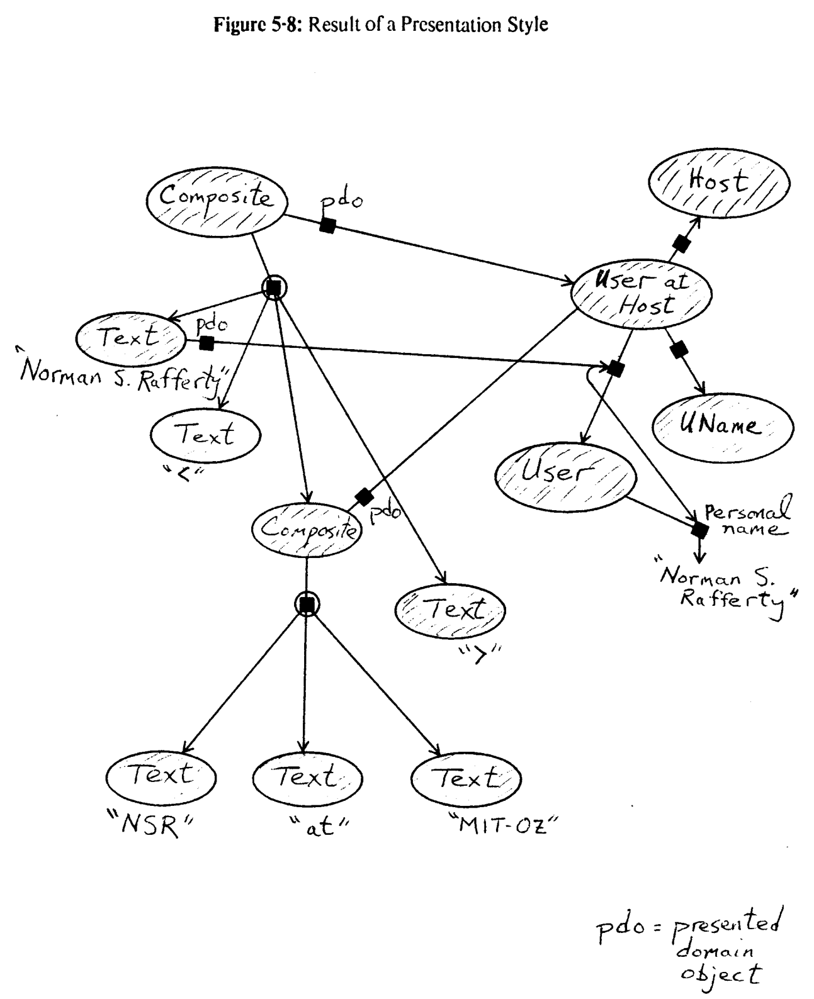

Composite
pdo (on line from Composite toward User at Host)

Text
"Norman S. Rafferty"

Text
"<"

Composite
pdo (on line from lower Composite toward junction)

User at Host (oval)
Host (small oval linked to User at Host)
UName (oval linked to User at Host)
User (oval linked from User at Host)
Personal name
"Norman S. Rafferty"

Text
">"

Diamond/junction nodes connecting Composite, Text, and User at Host (with arrows between components and small black square markers on some links labeled "pdo")

Three lower Text ovals (children)
Text  "NSR"
Text  "at"
Text  "MIT-OZ"

pdo = presented domain object

<!-- page:125 -->

corners of a rectangle that would enclose the presentation.  In addition, the presentation
editor mechanism offers a general facility for moving presentations.  Using these
capabilities, the organizational presenter does not need to consider the particular kind of
presentation: the presentations are moved so that their extent boxes are juxtaposed.  Note
that the extent box technique works as well for sub-presentations which are themselves
composites of further sub-presentations: the entire composite has an extent computed from
those of its sub-presentations.

Similar to the horizontal layout presenter is the vertical layout presenter.  It juxtaposes
sub-presentations vertically, again using the extent boxes as a guide.

The third organizational presenter uses a tabular layout method.  The composite
presentation is assumed to have sub-presentations which will be the rows of a table.  These
row presentations will be laid out vertically.  Furthermore, each row presentation is itself a
composite (in general), whose sub-presentations are the elements of the row.  These element
presentations are positioned so that those presenting the same kind of property are aligned
under each other.  For example, in a directory listing, those presentations presenting file-
length properties appear aligned under each other.

The fourth organizational presenter is a paragraph filler, positioning the sub-
presentations (generally single-word text presentations) within a rectangular area.

The PSBase graphics presentation style descriptions do not use standard organizational
presenters.  Instead, the styles define their own layout in the style description itself by
explicitly positioning the component presentations.

Semantic Redisplay.  Each presentation style specifies whether presentations created in
that style will be active, i.e., whether it is to be periodically updated, and if so, how often it is
to be updated.  Thus, for example, an active sequence presentation will be updated to reflect
changes in the elements or in the order of the elements of the presented sequence.  Or, for
the clock example given above, the properties of the vector presentation (the hour hand)
will be recomputed from the presented current-time-of-day object.

<!-- page:126 -->

Each time an active presentation is created, a semantic redisplay task is created for it and added to a list of all current semantic redisplay tasks. Each task specifies the presentation, its presentation style, and the next time that the presentation should be updated.

A background process manages these semantic redisplay tasks. When a task's semantic redisplay time has arrived, the presenter for its presentation style is invoked on the presentation. This invocation is similar to, but slightly different from, that for creating the presentation in the first place. Here, emphasis is on retaining presentations that can be re-used and avoiding computation for presentations that do not present anything. After updating the presentation, the presentation style's organizational presenter is invoked again to adjust the presentation's layout.

5.5 Recognizer Support

PSBase provides two kinds of support for recognizer control: First is a mechanism that records the presentations on which a particular recognition depends. The dependency mechanism allows some recognition to be retracted if changes occur in the presentations that recognition was based upon. Second is a recognizer-invocation mechanism.

PSBase divides recognizers into three kinds, differing in how and when they are invoked.

Continual recognizers have the effect of acting continually as the user gives commands.

General recognizers are invoked on demand, by particular commands. Invocation of general recognizers is slower than for continual recognizers, and the invocation involves consideration of a larger portion of the presentation data base. PSBase offers two invocation mechanisms, one for continual and one for general recognizers. The remaining recognizers are invoked specifically by other recognizers, to perform particular sub-tasks in the recognition process.

Recognition Dependencies. Each recognition depends on a set of presentations. For example, section 4.1 described the Emacs Dired style of annotations to a directory listing: the user places a "D" by files to mark them for later deletion. Recognition of a "D" (as a plan to delete a particular file) depends on two presentations: the "D" and the file

corners of a rectangle that would enclose the presentation. In addition, the presentation editor mechanism offers a general facility for moving presentations. Using these capabilities, the organizational presenter does not need to consider the particular kind of presentation: the presentations are moved so that their extent boxes are juxtaposed. Note that the extent box technique works as well for sub-presentations which are themselves composites of further sub-presentations: the entire composite has an extent computed from those of its sub-presentations.

Similar to the horizontal layout presenter is the vertical layout presenter. It juxtaposes sub-presentations vertically, again using the extent boxes as a guide.

The third organizational presenter uses a tabular layout method. The composite presentation is assumed to have sub-presentations which will be the rows of a table. These row presentations will be laid out vertically. Furthermore, each row presentation is itself a composite (in general), whose sub-presentations are the elements of the row. These element presentations are positioned so that those presenting the same kind of property are aligned under each other. For example, in a directory listing, those presentations presenting file-length properties appear aligned under each other.

The fourth organizational presenter is a paragraph filler, positioning the sub-presentations (generally single-word text presentations) within a rectangular area.

The PSBase graphics presentation style descriptions do not use standard organizational presenters. Instead, the styles define their own layout in the style description itself by explicitly positioning the component presentations.

Semantic Redisplay. Each presentation style specifies whether presentations created in that style will be active, i.e., whether it is to be periodically updated, and if so, how often it is to be updated. Thus, for example, an active sequence presentation will be updated to reflect changes in the elements or in the order of the elements of the presented sequence. Or, for the clock example given above, the properties of the vector presentation (the hour hand)

presentation. If the user moves that "D" to a different line, however, its original recognition must be retracted and new recognition performed -- it now presents a plan to delete a different file.

The PSBase recognition dependency mechanism allows recognizers to record the presentations on which they depended, together with the actions necessary to retract that recognition. Recognizers specify this information as they build the application data base commands.

Invocation of Continual Recognizers. The interface builder specifies a list of continual recognizers. Each is invoked immediately after each keystroke or mouse command.

Each continual recognizer has two phases. First, it quickly decides whether it is in fact applicable to the command that the user just gave. Second, if applicable, it triggers and performs whatever recognition is necessary.

<!-- page:127 -->

presentation. If the user moves that "D" to a different line, however, its original recognition must be retracted and new recognition performed -- it now presents a plan to delete a different file.

The PSBase recognition dependency mechanism allows recognizers to record the presentations on which they depended, together with the actions necessary to retract that recognition. Recognizers specify this information as they build the application data base commands.

Invocation of Continual Recognizers. The interface builder specifies a list of continual recognizers. Each is invoked immediately after each keystroke or mouse command.

Each continual recognizer has two phases. First, it quickly decides whether it is in fact applicable to the command that the user just gave. Second, if applicable, it triggers and performs whatever recognition is necessary.

The recognizer has access to the presentation editing history entry for the command just completed. It also has access to the list of recognizers triggered so far, if any. The latter allows the recognizer to trigger dependent on whether or not others did. The presentation editing history entry specifies what kind of editing function was performed and which presentations were affected by it. This information allows the recognizer to quickly determine whether it is applicable, without performing a search of the presentation data base. If the recognizer triggers, it too creates an entry in the presentation editing history, specifying that a recognition was performed, its kind, and the presentations it affected.

Currently, the mechanism for invoking continual recognizers does not use the recognition dependency mechanism, because of efficiency reasons and because the continual

Invocation of General Recognizers. A second kind of recognizer invocation mechanism is

<!-- page:128 -->

recognizers and a small, given set of presentations (those affected by the latest presentation
editing function), invocation of general recognizers involves searching the presentation data
base and a larger set of potential recognizers.

PSBase supports two kinds of general recognizers. Both are invoked upon a particular
presentation, though they may (and typically will) examine other presentations and related
domain information in the data base. The first kind of general recognizer interprets user
edits to presentations that were created by presenters. These recognizers are typically
simple, taking advantage of the existing links from the presentation to the presented domain
object. For example, one such recognizer might interpret a change in text presenting the
reference date property of a file. This recognizer simply parses the text, creates a new date
instance, and changes the value of the file property. Note that it does not need to decide
between recognition as a date and as something else -- it already knows that it should be a
date presentation from the presenter-recorded information, namely, the presented domain
object property that links it to the file's reference date property.

The second kind of general recognizer is invoked upon presentations for which there is no
presented domain object link, i.e., presentations whose meaning is unknown. This kind of
recognizer must determine the kind of recognition to be performed.

Both kinds of general recognizers are attached to classes of presentations in the
presentation data base. For example, the parser for a file's reference date property would be
attached to the text presentation class.

The invocation mechanism begins by scanning the edit history, determining which
presentations have changed since the last recognition. Any recognition that depended on
those changed presentations is retracted if possible. This has the effect of allowing the user
to make changes in a plan (such as the Dired plan of deletions): the effect is incremental
recognition of the changes, but no specific recognizers for incremental changes need to be
provided.

Second, all presentations that had been created by presenters, but edited by the user
presentation. If the user moves that "D" to a different line, however, its original recognition
must be retracted and new recognition performed -- it now presents a plan to delete a
different file.

The PSBase recognition dependency mechanism allows recognizers to record the
presentations on which they depended, together with the actions necessary to retract that
recognition. Recognizers specify this information as they build the application data base
commands.

Invocation of Continual Recognizers. The interface builder specifies a list of continual
recognizers. Each is invoked immediately after each keystroke or mouse command.

Each continual recognizer has two phases. First, it quickly decides whether it is in fact
applicable to the command that the user just gave. Second, if applicable, it triggers and
performs whatever recognition is necessary.

The recognizer has access to the presentation editing history entry for the command just
completed. It also has access to the list of recognizers triggered so far, if any. The latter
allows the recognizer to trigger dependent on whether or not others did. The presentation
editing history entry specifies what kind of editing function was performed and which
presentations were affected by it. This information allows the recognizer to quickly
determine whether it is applicable, without performing a search of the presentation data
base. If the recognizer triggers, it too creates an entry in the presentation editing history,
specifying that a recognition was performed, its kind, and the presentations it affected.

<!-- page:129 -->

(since the previous general recognition), are collected. For each of these presentations, a
general recognizer (of the first kind discussed above) is invoked. Selection of this recognizer
is based on the class of the presentation and the kind of property (such as reference date).

Third, recognition is performed on all presentations with no presented domain object
property value, i.e., those presentations that are unrecognized. (Note that some
presentations may have been previously recognized, but are now unrecognized because of
recognition retraction.) These recognizers are also invoked based on the class of the
presentations they are to recognize.

5.6 Basic Style Packages

PSBase offers a supply of presenters, recognizers, and combinations that the user
interface builder may choose to use as components in a user interface. In a sense, one such
component has already been mentioned: the presentation editor functions, taken as a
whole.

Presenters. Three presenters are provided, for presenting command sets as menus, for
presenting the execution monitor's current state by highlighting the current command, and
for presenting any domain object by a noun phrase. Like the other components described
here, these are all independent of any particular application domain. (This is not strictly
true, as the first two deal with the domain of commands; however, that domain, like the
domain of presentations, is universal in that it is always included in any user interface.)

Command Menus. This component is very simple, consisting of a few style descriptions.
Since a command set is a specialization of object-sequence, where the elements property is a
list of command descriptions, a sequence presentation style can be used. The following is
the description for a vertical command menu style. (The style definition for horizontal
menus is similar.)

(def-sequence-presentation-style VERTICAL-COMMAND-MENU
    COMMAND-SET t
    nil nil               ; Not active.
    nil nil nil           ; No prefix, infixes, or suffix.
    just-name
    :vertical-layout :border-box fonts:cptfontb)

Execution State Presenter. PSBase provides a simple presenter for the execution monitor
discussed on page 111. The presenter is invoked whenever the execution monitor places a
command or command application instance on its stack, i.e., when the command is
executed. The presenter examines the presentation data base to determine whether the
command or command application is being presented. If it finds a presentation, it
highlights it.

For example, when the user invokes the erase presentation editing command, the
execution state presenter might find the command presented in a menu of editor
commands. Whether the user invoked the command by referencing that item in the menu
or by typing the delete key, the menu item is highlighted to present the current state.

There are other possibilities. Consider the following scenario: A command's
documentation is currently being presented. The documentation comprises three
paragraphs, each presenting a step in the command. As that command executes, the
execution state presenter will highlight the three paragraphs in sequence. (The presentation
of the documentation is not strictly a presentation of the command. The presenter will still
consider the documentation presentation as a suitable reference, using a special version of
the mechanism for resolving references to essential properties discussed in section 5.1.)

Phrasal Presenter. The phrasal presenter produces a phrase describing a domain object,
in most cases a noun phrase such as "the file OZ:<NSR>LOGIN.CMD.4", "a plan to delete
the    file   OZ:<NSR>DEMO.TXT.1",   or    "the    reference    date    of    the    file
OZ:<NSR>QUEUE.NOTES.1, Friday, March 23, 1984".

The presentations have composite presentation structure that follows the semantic and
grammatical structure. The user can therefore reference part of the phrase to indicate a

<!-- page:130 -->

(def-sequence-presentation-style VERTICAL-COMMAND-MENU
    COMMAND-SET t

    nil nil                  ; Not active.
    nil nil nil              ; No prefix, infixes, or suffix.
    just-name
    :vertical-layout :border-box fonts:cptfontb)

Execution State Presenter. PSBase provides a simple presenter for the execution monitor
discussed on page 111. The presenter is invoked whenever the execution monitor places a
command or command application instance on its stack, i.e., when the command is
executed. The presenter examines the presentation data base to determine whether the
command or command application is being presented. If it finds a presentation, it
highlights it.

For example, when the user invokes the erase presentation editing command, the
execution state presenter might find the command presented in a menu of editor
commands. Whether the user invoked the command by referencing that item in the menu
or by typing the delete key, the menu item is highlighted to present the current state.

There are other possibilities. Consider the following scenario: A command's
documentation is currently being presented. The documentation comprises three
paragraphs, each presenting a step in the command. As that command executes, the
execution state presenter will highlight the three paragraphs in sequence. (The presentation
of the documentation is not strictly a presentation of the command. The presenter will still

Phrasal Presenter. The phrasal presenter produces a phrase describing a domain object,
in most cases a noun phrase such as "the file OZ:<NSR>LOGIN.CMD.4", "a plan to delete
the     file     OZ:<NSR>DEMO.TXT.1", or    "the    reference    date    of    the    file
OZ:<NSR>QUEUE.NOTES.1, Friday, March 23, 1984".

The presentations have composite presentation structure that follows the semantic and
grammatical structure. The user can therefore reference part of the phrase to indicate a

<!-- page:131 -->

domain object other than the one presented by the entire phrase. For example, given the
reference-date presentation mentioned above, the user could reference just the sub-phrase
"the file OZ:<NSR>QUEUE.NOTES.1" and therefore indicate the file, instead of its
reference-date property. Similarly, the user could reference just the date.

The interface builder provides a set of dictionary entries, templates used by the phrasal
presenter. The phrasal presenter and its dictionary entries are simple in comparison with
those developed in natural language systems (e.g., [McDonald 83]). They should, however,
give an idea how natural language presenters would fit into a more powerful presentation
system base, and the scheme used here is quite useful as it is.

In essence, the dictionary entry hangs off a class node in the data base network. The most
specific entry for a given instance is chosen. This section illustrates the phrasal presenter by
showing a sample entry for the class of date instances. Each date instance has four
properties: day of month, month, year, and day of week. The dictionary entry for date refers
to dictionary entries for the values of these properties.

The entry is written as the :phrasal-presenter-dictionary-entry method for the Lisp flavor
date, the flavor implementing the date class in the data base. The Lisp details below can be
largely ignored, since the definition is simply a template. The template has slots that are
filled in by evaluating Lisp expressions; these slots are indicated by commas. The values
filling the slots may be other filled-in dictionary entries. The result is a grammatically
structured tree of text. The tree is annotated with the domain objects being presented.

The following is the dictionary entry as the builder would write it, to produce text such as

"Thursday, August 9, 1984."

<!-- page:132 -->

```lisp
(defmethod (DATE :PHRASAL-PRESENTER-DICTIONARY-ENTRY) ()
  '(:SAY ,self
    (:FURTHER-INFO
      (:SAY-PROPERTY (,self :DAY-OF-WEEK)
        ,(phrasal-presenter-dictionary-entry day-of-week))
      (:SAY-PROPERTY (,self :MONTH)
        ,(phrasal-presenter-dictionary-entry month))
      (:SAY-PROPERTY (,self :DAY-OF-MONTH)
        ,(phrasal-presenter-dictionary-entry day-of-month))
      ","
      (:SAY-PROPERTY (,self :YEAR)
        ,(phrasal-presenter-dictionary-entry year))))
```

The tree produced has the following items:

* An identifying symbol, :say

* The presented domain object -- the date instance, since self will be bound to it

* A sub-tree, flagged as carrying non-restrictive further information, that accesses the dictionary entry for the day of week property, labeled as presenting the day of week property

* A sub-tree that accesses the dictionary entry for the month property

* A sub-tree that accesses the dictionary entry for the day of month, similarly labeled as a property presentation

* Some template text, a comma

* A sub-tree that accesses the dictionary entry for the year property

The sub-trees invoke other phrasal dictionary entries. For the case of "Thursday, August 9, 1984.", the sub-tree entries would produce, respectively, the text "Thursday", "August", "9", and "1984". (These are single words; in general, the sub-trees might themselves specify more complex phrases.)

The general phrasal semantic presenter takes this specification tree and produces a composite presentation structure. Figure 5-9 illustrates the resulting presentation structure and its relation to the data base network. Some very simple anaphora processing is performed if possible (not possible here). Commas are added around the non-restrictive domain object other than the one presented by the entire phrase. For example, given the reference-date presentation mentioned above, the user could reference just the sub-phrase "the file OZ:<NSR>QUEUE.NOTES.1" and therefore indicate the file, instead of its reference-date property. Similarly, the user could reference just the date.

The interface builder provides a set of dictionary entries, templates used by the phrasal presenter. The phrasal presenter and its dictionary entries are simple in comparison with those developed in natural language systems (e.g., [McDonald 83]). They should, however, give an idea how natural language presenters would fit into a more powerful presentation system base, and the scheme used here is quite useful as it is.

In essence, the dictionary entry hangs off a class node in the data base network. The most specific entry for a given instance is chosen. This section illustrates the phrasal presenter by showing a sample entry for the class of date instances. Each date instance has four properties: day of month, month, year, and day of week. The dictionary entry for date refers to dictionary entries for the values of these properties.

The entry is written as the :phrasal-presenter-dictionary-entry method for the Lisp flavor date, the flavor implementing the date class in the data base. The Lisp details below can be largely ignored, since the definition is simply a template. The template has slots that are filled in by evaluating Lisp expressions; these slots are indicated by commas. The values filling the slots may be other filled-in dictionary entries. The result is a grammatically structured tree of text. The tree is annotated with the domain objects being presented.

The following is the dictionary entry as the builder would write it, to produce text such as "Thursday, August 9, 1984."

<!-- page:133 -->

Figure 5-9: Result of Phrasal Presenter

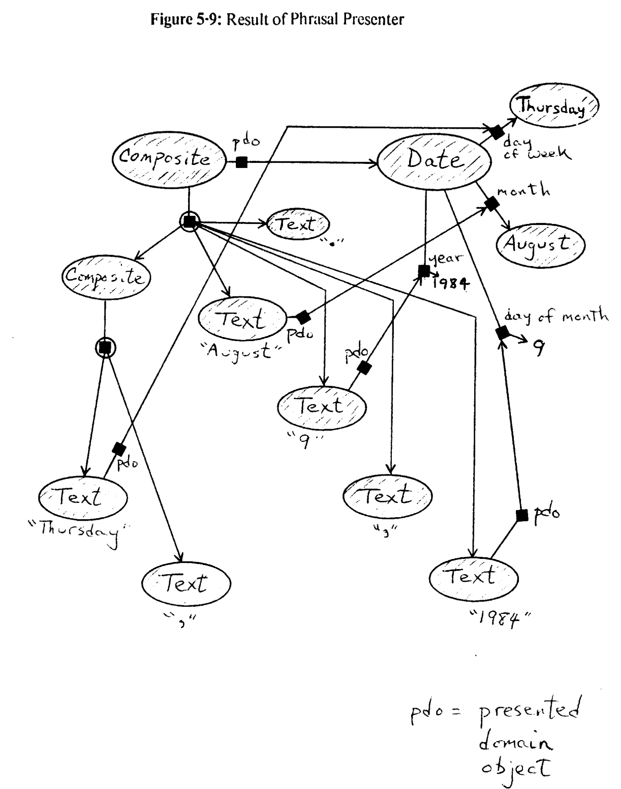

Composite
pdo
Date
Thursday
day
of week
month
August
year
1984
day of month
9
Text
"August"
pdo
Text
"9"
Text
"Thursday"
Text
"3"
Text
"1984"
pdo = presented
domain
object

```lisp
(defmethod (DATE :PHRASAL-PRESENTER-DICTIONARY-ENTRY) ()
  '(:SAY ,self
     (:FURTHER-INFO
        (:SAY-PROPERTY (,self :DAY-OF-WEEK)
           ,(phrasal-presenter-dictionary-entry day-of-week)))
        (:SAY-PROPERTY (,self :MONTH)
           ,(phrasal-presenter-dictionary-entry month))
        (:SAY-PROPERTY (,self :DAY-OF-MONTH)
           ,(phrasal-presenter-dictionary-entry day-of-month))
        ","
        (:SAY-PROPERTY (,self :YEAR)
           ,(phrasal-presenter-dictionary-entry year))))
```

The tree produced has the following items:

* An identifying symbol, :say

* The presented domain object -- the date instance, since self will be bound to it

* A sub-tree, flagged as carrying non-restrictive further information, that accesses the dictionary entry for the day of week property, labeled as presenting the day of week property

* A sub-tree that accesses the dictionary entry for the month property

* A sub-tree that accesses the dictionary entry for the day of month, similarly labeled as a property presentation

* Some template text, a comma

* A sub-tree that accesses the dictionary entry for the year property

The sub-trees invoke other phrasal dictionary entries. For the case of "Thursday, August
9, 1984.", the sub-tree entries would produce, respectively, the text "Thursday", "August",
"9", and "1984". (These are single words; in general, the sub-trees might themselves specify
more complex phrases.)

The general phrasal semantic presenter takes this specification tree and produces a
composite presentation structure. Figure 5-9 illustrates the resulting presentation structure
and its relation to the data base network. Some very simple anaphora processing is
performed if possible (not possible here). Commas are added around the non-restrictive

further-info structures. The first letter is capitalized, and a period is added at the end. The
presenter can optionally be invoked to produce a briefer presentation, in which case it
ignores the sub-trees marked as further information.

Recognizers. The next two sub-sections describe particular recognizers and recognizer
frameworks that PSBase provides, for recognizing presentation editor commands from
sketches and for recognizing commands from the movement of presentations.

Curve Recognizers. Presentation editor commands may be invoked in two general ways,
by primitive command signals (such as keystrokes or mouse clicks) and by recognition.
Section 4.2 showed examples of Zmacs editor commands invoked by recognition: the user
can type command names or select commands from a menu.

PSBase offers another kind of extension to the presentation editor: recognition of
presentation editor commands by "sketching curves". Figure 5-10 shows the screen's
display as the user "sketches" an arrow from the ellipse to the rectangle. The user sketches
by moving the mouse, holding a mouse button down until the curve has been completed.
The curve is displayed as a set of dots while the user is drawing it. When the button is
released, an immediate recognizer interprets the creation of this curve as a presentation
editor command, in this case a command to connect the ellipse to the rectangle by an arrow.
Figure 5-11 shows the result.

<!-- page:134 -->

further-info structures. The first letter is capitalized, and a period is added at the end. The presenter can optionally be invoked to produce a briefer presentation, in which case it ignores the sub-trees marked as further information.

Recognizers. The next two sub-sections describe particular recognizers and recognizer frameworks that PSBase provides, for recognizing presentation editor commands from sketches and for recognizing commands from the movement of presentations.

Curve Recognizers. Presentation editor commands may be invoked in two general ways, by primitive command signals (such as keystrokes or mouse clicks) and by recognition. Section 4.2 showed examples of Zmacs editor commands invoked by recognition: the user can type command names or select commands from a menu.

PSBase offers another kind of extension to the presentation editor: recognition of presentation editor commands by "sketching curves". Figure 5-10 shows the screen's display as the user "sketches" an arrow from the ellipse to the rectangle. The user sketches by moving the mouse, holding a mouse button down until the curve has been completed. The curve is displayed as a set of dots while the user is drawing it. When the button is released, an immediate recognizer interprets the creation of this curve as a presentation editor command, in this case a command to connect the ellipse to the rectangle by an arrow. Figure 5-11 shows the result.

Note that these sketched curves are not just recognized as presentations, e.g., not just an arrow. They are recognized as presentation editor commands. This has two advantages. First, the user can understand the semantics of the recognition, since the results are just as if the user had invoked the editor command directly (assuming that the interface provides the user with that editor command). Second, recognition can be more powerful -- it can do more than just create a presentation. For example, one could write a curve recognizer that interpreted a sketched line through a presentation as a command to delete that presentation.

The curve recognizers are, in a simple sense, a series of rules. (This is not a complex rule-based system -- there is no iteration over the set of rules, for instance. Also, these rules

Figure 5-9: Result of Phrasal Presenter

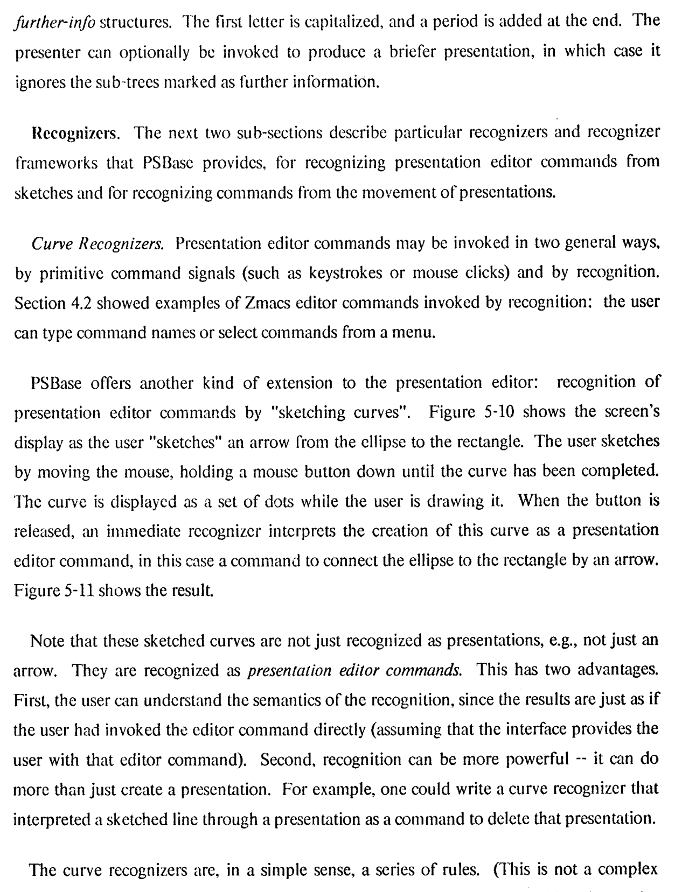

Composite        ->  pdo  ->  Date
                                 ->  Thursday (day of week)
                                 ->  August (month)
                                 ->  1984 (year)
                                 ->  9 (day of month)

Text ("August")
Text ("9")
Text ("Thursday")
Text ("3")
Text ("1984")

pdo = presented
domain
object

<!-- page:135 -->

Figure 5-10: Before Curve Rcecognition

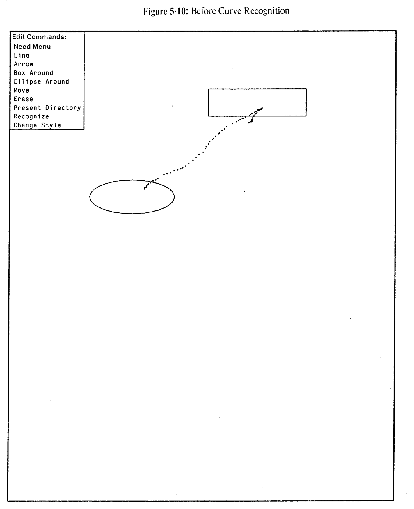

Edit Commands:
Need Menu
Line
Arrow
Box Around
Ellipse Around
Move
Erase
Present Directory
Recognize
Change Style

<!-- page:136 -->

Figure 5-11: After Curve Recognition

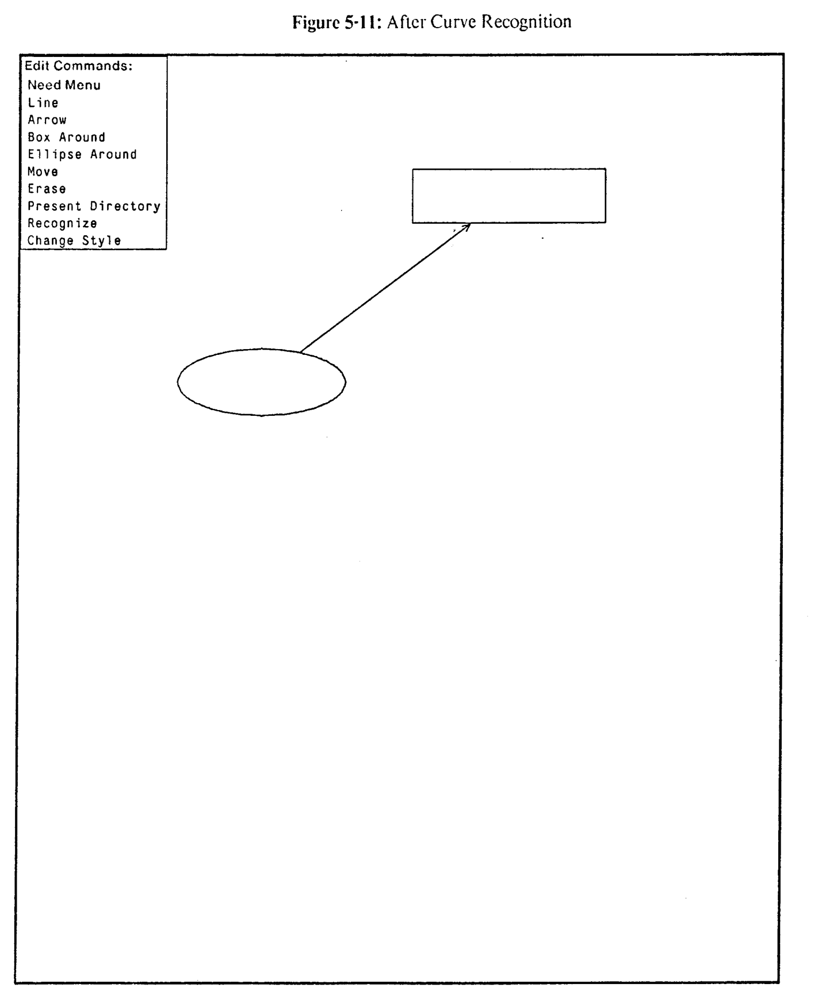

Edit Commands:
Need Menu
Line
Arrow
Box Around
Ellipse Around
Move
Erase
Present Directory
Recognize
Change Style

(ellipse) ----arrow----> (rectangle)

<!-- page:137 -->

do not have declarative patterns, but instead are implemented by special procedures.) The rules are simple, and the success of the recognizers, is due to four, inter-related facts. First, there are few possibilities to distinguish. These will be listed below. Second, the recognition is fast enough to be usually preferred over other ways of invoking the same commands. Third, the user can see the result and change it if the recognizers were mistaken. Fourth, the recognizers are able to use the presentation data base to great advantage. A discussion of the curve recognition rules will clarify the last point.

There are three functions that examine only the list of positions defining the curve. (These functions do not examine the presentation data base.) They are largely responsible for determining the kind of presentation the curve appears most like: line, arrow, circle, ellipse, or rectangle. The first function determines whether the curve is open or closed. The second determines, for open curves, whether there are arrowheads at one or both ends. The third produces a ranked match to a circle, ellipse, and rectangle, specifying the defining parameters (e.g., center and radius for a circle).

These functions are not necessarily always invoked -- they are invoked by the rules, depending on the presentation data base structure. As these determinations are made, a description of the curve is built up and can be used by later rules. The current set of rules first invokes the function to determine whether the curve is open or closed. If open, a rule asks whether the end positions lie within presentations; if so, the curve is an object of class connecting thing (line or arrow). If open, another rule determines whether there are arrowheads, and extends the description to distinguish between line, single-headed arrow, or two-heading arrow. Finally, if open and connecting, a rule examines whether the ends can be "pulled out", i.e., whether there is a surrounding ellipse or box. If so, the line or arrow will be connected to that outer form.

If the curve is closed, a rule asks whether the curve encloses a presentation. If so, the recognized command will be ellipse around or rectangle around. The type is determined either by the style of the diagram (e.g., only ellipses surround text) or by the rule that classifies closed curves. In the latter case, the default parameters for the form are ignored; the command will compute these from the circumscribed presentation.

There are a few other rules, which deal with particular styles of diagrams. These rules produce editor commands to create particular patterns of presentations.

Move Recognizer Mechanism. PSBase offers a framework for implementing continual recognizers that interpret movement of presentations as commands, in the style of, for example, the Xerox Star and Apple Lisa systems. Section 4.3 illustrated some kinds of move recognition; for example, moving a document presentation to a printer presentation is recognized as a command to print that document.

A move recognition driver (or just driver when the context is clear) is a predefined continual recognizer; it provides the first phase of a continual recognizer, checking for applicability. It checks for a move command and, if so, determines the presentation being moved and the (possibly several) presentations to which it has been moved. It then matches these possible candidates against a set of patterns that attach to the data base network.

<!-- page:138 -->

the command will compute these from the circumscribed presentation.

There are a few other rules, which deal with particular styles of diagrams. These rules
produce editor commands to create particular patterns of presentations.

Move Recognizer Mechanism.  PSBase offers a framework for implementing continual
recognizers that interpret movement of presentations as commands, in the style of, for
example, the Xerox Star and Apple Lisa systems. Section 4.3 illustrated some kinds of move
recognition; for example, moving a document presentation to a printer presentation is
recognized as a command to print that document.

A move recognition driver (or just driver when the context is clear) is a predefined
continual recognizer; it provides the first phase of a continual recognizer, checking for
applicability. It checks for a move command and, if so, determines the presentation being
moved and the (possibly several) presentations to which it has been moved. It then matches
these possible candidates against a set of patterns that attach to the data base network.

Each pattern has an associated second-phase recognizer, which is invoked if that is the
pattern that matches. (In this implementation there is no consideration of multiple matches
-- the first entry whose pattern matches is used.) It is this associated recognizer that
performs the actual recognition of the move as a data base command. This division of the
recognition process follows the division described in section 2.6: the driver is the
organizational recognizer, and the selected recognizer is the semantic recognizer.

A sample definition of one of these pattern-to-recognizer associations is the following, the
one for recognizing movement of document icons to printer icons:

(def-move-recognition-rule move-document-to-printer
  (:overlap (file    (document-icon))
            (printer (printer-icon)))
  :recognize-printer-movement)

The second and third lines specify the pattern, which consists of three parts. The first part
specifies the kind of overlap between the presentation being moved and the candidate
destination presentation. This can be, in order of increasing restrictiveness, near, overlap, or

<!-- page:139 -->

within. This relation is determined from the presentations' extent boxes.

The next two elements of the pattern specify the class of presented domain object and the presentation styles. This entry specifies that the presentation being moved must present a file in the document-icon style. (Each presentation has properties connecting it to both the presented domain object and the presentation style used to create the presentation.) The entry also specifies that the destination presentation must present a printer in the printer-icon style.

The fourth line specifies the recognizer that will create a command application for printing the file.

Combinations. The next three sections describe modules that combine presenters and recognizers into larger control structures.

Mouse-Tracking Reference. This module provides a mouse-based reference and documentation facility. A simple fast recognizer continually watches the movement of the mouse and determines whether the mouse cursor is within any presentation. This check is made using the presentations' extent boxes; in the case of more than one presentation containing the mouse, the one with the smallest extent_box is selected. The presentation data base records this choice.

At the same time, the current choice is presented by being highlighted on the screen. Thus, as the user moves the mouse, the highlighting continually shows what presentation contains the mouse cursor.

In addition, about once every second (i.e., at a rate considerably slower than the operation of the tracking recognizer and presenter just described), a documentation line at the bottom of the screen is updated. It presents the current choice by using the phrasal presenter, described earlier. This can help to disambiguate some cases where the highlighting box alone would be insufficient. It can also be helpful in providing documentation about the presentation style -- e.g., to find out that a particular number in a directory listing is the

the command will compute these from the circumscribed presentation.

There are a few other rules, which deal with particular styles of diagrams. These rules produce editor commands to create particular patterns of presentations.

Move Recognizer Mechanism. PSBase offers a framework for implementing continual recognizers that interpret movement of presentations as commands, in the style of, for example, the Xerox Star and Apple Lisa systems. Section 4.3 illustrated some kinds of move recognition; for example, moving a document presentation to a printer presentation is recognized as a command to print that document.

A move recognition driver (or just driver when the context is clear) is a predefined continual recognizer; it provides the first phase of a continual recognizer, checking for applicability. It checks for a move command and, if so, determines the presentation being moved and the (possibly several) presentations to which it has been moved. It then matches these possible candidates against a set of patterns that attach to the data base network.

<!-- page:140 -->

length of a file. No presentation structure is created for the documentation line -- the result is simply a text string -- though the anaphora and other processing is performed. Further-
information sub-trees are eliminated if the resulting string is too long.

An additional reference mechanism is provided that allows the user to move the selection choice up and down the hierarchy of presentations, e.g., moving from a text presentation in a directory listing up to the row presenting a file or to the entire directory presentation. Again, this choice is reflected by the highlighting and phrasal presenters automatically: these commands affect the presentation data base's record of the current choice, which is continually and automatically presented by them.

Open/Close Mechanism. Like the move recognition driver discussed above, this mechanism provides a general framework for implementing opening and closing of domain objects, like that used in the Xerox Star and Apple Lisa styles (see section 4.3). In those systems, opening a document icon, for example, causes the text of the file to be displayed.

Opening and closing domain objects can be thought of as changing presentation styles. The interface builder specifies links between the domain object class and the opened and closed presentation styles. The following specification is typical:

(def-open-close-presentation-style file-document
  file
  document-icon
  text-file-contents
  fonts:cptfont)

This specifies that for instances of class file the document icon style will be used for the closed presentation and the text file contents style for the opened presentation. The default font for the opened style is also specified.

The open command is given a presentation as an argument and a position. It finds the entry for the presentation, based on the presented domain object, and invokes the presenter for the opened presentation style specified by the entry. The presenter creates the opened presentation at the given position. The original presentation is erased but remembered as a property of the opened presentation. This allows the original presentation to be redrawn

<!-- page:141 -->

when the opened presentation is later closed, if possible, for efficiency and so that its
original position is restored.

The decisions to erase and record the original presentation are a matter of style and are
easily changed. This style attempts, by having only one presentation of a domain object at a
time, to give a feeling of directness -- that the visual presentation is the domain object, and
opening is a "physical" act. However, this always-erase rule is probably too simple: there
are probably certain kinds of presentations, e.g., icons, that do seem "to be" their presented
domain objects, while others, e.g., phrasal presentations, may merely "talk about" them.

Earlier it was mentioned that opening and closing can be considered to be a matter of
changing presentation styles. However, there is another consideration that must generally
be made: signalling the application data base that more detail is needed from the outside
world or that it is time to save such detail. This issue is raised when the application data
base is a model of some outside world. An opened presentation typically involves
presenting much more domain information than a closed presentation. (For example, a
document icon may only be labeled with the file name, while an opened presentation
contains the file's text.)

Therefore, the open command also sends a message to the presented domain object to be
sure that its contents are fully described and updated. For a file, this may involve getting
the file's text. Each class of domain object can provide its own method for handling this
message, or inherit a more general one. The default method is to do nothing.

Closing an object requires two actions in addition to the presentation style change. First,
recognition of editing changes to the open presentation must be performed. Thus, in
general, the user may have changed some of the parts of the opened presentation, and these
changes are reflected in changes to the presented domain object's contents in some way.
Second, the domain object is sent a message to save its contents. For a file, this involves
saving the file's text. Again, the inherited default is to do nothing.

Top-Level Control Structures. PSBase provides two alternative control structures that
length of a file. No presentation structure is created for the documentation line -- the result
is simply a text string -- though the anaphora and other processing is performed. Further-
information sub-trees are eliminated if the resulting string is too long.

An additional reference mechanism is provided that allows the user to move the selection
choice up and down the hierarchy of presentations, e.g., moving from a text presentation in
a directory listing up to the row presenting a file or to the entire directory presentation.
Again, this choice is reflected by the highlighting and phrasal presenters automatically:
these commands affect the presentation data base's record of the current choice, which is
continually and automatically presented by them.

Open/Close Mechanism. Like the move recognition driver discussed above, this
mechanism provides a general framework for implementing opening and closing of domain
objects, like that used in the Xerox Star and Apple Lisa styles (see section 4.3). In those
systems, opening a document icon, for example, causes the text of the file to be displayed.

Opening and closing domain objects can be thought of as changing presentation styles.
The interface builder specifies links between the domain object class and the opened and
closed presentation styles. The following specification is typical:

(def-open-close-presentation-style file-document
  file
  document-icon
  text-file-contents
  fonts:cptfont)

This specifies that for instances of class file the document icon style will be used for the
closed presentation and the text file contents style for the opened presentation. The default
font for the opened style is also specified.

The open command is given a presentation as an argument and a position. It finds the
entry for the presentation, based on the presented domain object, and invokes the presenter
for the opened presentation style specified by the entry. The presenter creates the opened
presentation at the given position. The original presentation is erased but remembered as a
property of the opened presentation. This allows the original presentation to be redrawn
processes command signals (keystrokes and mouse clicks), invoke immediate and other
recognizers, and cause graphics redisplay to be performed. They differ primarily in the
method of command invocation and command argument selection. In the first top-level
style, the user first specifies a command, then selects its arguments; in the second style, the
user selects the arguments first, then specifies the command.

The first style has the benefit of the command's description while selecting the arguments
for the command. The parameter descriptions have control of the selection, prompting the
user with the parameter name and documentation, and checking that the argument selected
is of the proper type. For example, if the parameter specifies that a file must be selected, it
will immediately reject any selection that is not a file, letting the user make the selection
again. Though the style as provided does not do this, it would be a relatively simple matter
to tailor the mouse-tracking mechanism so that only presentations of the correct type would
be sensitive to selection, i.e., only those being highlighted as the mouse moved across them.

<!-- page:142 -->

processes command signals (keystrokes and mouse clicks), invoke immediate and other
recognizers, and cause graphics redisplay to be performed.  They differ primarily in the
method of command invocation and command argument selection.  In the first top-level
style, the user first specifies a command, then selects its arguments; in the second style, the
user selects the arguments first, then specifies the command.

The first style has the benefit of the command's description while selecting the arguments
for the command.  The parameter descriptions have control of the selection, prompting the
user with the parameter name and documentation, and checking that the argument selected
is of the proper type.  For example, if the parameter specifies that a file must be selected, it
will immediately reject any selection that is not a file, letting the user make the selection
again.  Though the style as provided does not do this, it would be a relatively simple matter
to tailor the mouse-tracking mechanism so that only presentations of the correct type would
be sensitive to selection, i.e., only those being highlighted as the mouse moved across them.

The second style collects selected arguments, presenting them by keeping them
highlighted until the command is chosen, and then when a command presentation is
selected, creates a command application for it, letting the command application check that
the arguments are of the proper type.

Each style allows two kinds of mouse clicks to be made:  a left-button click selects a
presentation or its presented domain object, and a right-button click selects a position.  In
the second style, positions are highlighted with a small circle-cross mark.

Both styles select commands (as opposed to their arguments) similarly.  If the user types a
key, that key is translated into a command, using a standard dispatch table.  On the other
hand, when the user selects a presentation, the top level checks whether its presented
domain object can be resolved to a command -- i.e., a simple command recognition is
performed.  This is, for example, what happens when the user selects an item in a command
menu.

when the opened presentation is later closed, if possible, for efficiency and so that its
original position is restored.

The decisions to erase and record the original presentation are a matter of style and are
easily changed.  This style attempts, by having only one presentation of a domain object at a
time, to give a feeling of directness -- that the visual presentation is the domain object, and
opening is a "physical" act.  However, this always-erase rule is probably too simple:  there
are probably certain kinds of presentations, e.g., icons, that do seem "to be" their presented
domain objects, while others, e.g., phrasal presentations, may merely "talk about" them.

Earlier it was mentioned that opening and closing can be considered to be a matter of
changing presentation styles.  However, there is another consideration that must generally
be made:  signalling the application data base that more detail is needed from the outside
world or that it is time to save such detail.  This issue is raised when the application data
base is a model of some outside world.  An opened presentation typically involves
presenting much more domain information than a closed presentation.  (For example, a
document icon may only be labeled with the file name, while an opened presentation
contains the file's text.)

Therefore, the open command also sends a message to the presented domain object to be
sure that its contents are fully described and updated.  For a file, this may involve getting
the file's text.  Each class of domain object can provide its own method for handling this
message, or inherit a more general one.  The default method is to do nothing.

application is executed.  In this case, however, the command application already supplies
the arguments.

After each selection, whether argument or command, immediate recognizers are invoked,
and graphics redisplay is performed if there is no typeahead to process.  In addition, the
second top-level style executes any command applications that have been accumulated, by
recognizers such as move recognizers.  On the other hand, the first style allows command
applications to be accumulated without, in general, immediate execution.  This is the case
when those command applications are presented, as just mentioned above.  Section
4.1 illustrated such "plan presentations" in Emacs Dired.

5.7 Summary

This chapter opened with some general comments about the benefits of a presentation
system base, and in particular, PSBase.  Summarizing these briefly:  The structure of PSBase
is based on the structure of the general presentation system model.  This is the source of
much generality and modularity, in both PSBase and the interfaces built on top of it.  In
particular, domain-independent and style-independent parts can be identified and provided
in the base.  Furthermore, most of the modules in PSBase rely heavily on the uniformity of
the data base network, which is used to implement both the presentation data base and the
application data base.

<!-- page:143 -->

application is executed.  In this case, however, the command application already supplies
the arguments.

After each selection, whether argument or command, immediate recognizers are invoked,
and graphics redisplay is performed if there is no typeahead to process.  In addition, the
second top-level style executes any command applications that have been accumulated, by
recognizers such as move recognizers.  On the other hand, the first style allows command
applications to be accumulated without, in general, immediate execution.  This is the case
when those command applications are presented, as just mentioned above.  Section
4.1 illustrated such "plan presentations" in Emacs Dired.

5.7 Summary

This chapter opened with some general comments about the benefits of a presentation
system base, and in particular, PSBase.  Summarizing these briefly: The structure of PSBase
is based on the structure of the general presentation system model.  This is the source of
much generality and modularity, in both PSBase and the interfaces built on top of it.  In
particular, domain-independent and style-independent parts can be identified and provided
in the base.  Furthermore, most of the modules in PSBase rely heavily on the uniformity of
the data base network, which is used to implement both the presentation data base and the
application data base.

<!-- page:144 -->

Chapter Six

Constructing Presentation Systems

This chapter illustrates the utility of the presentation system base, PSBase, by discussing three user interfaces constructed on top of the base. The interfaces differ in style, but share the same purpose, to provide an interface to the Tops-20 operating system top level [Tops20 80], as does the Exec, Tops-20's normal top level. The sections below will describe how these interfaces are constructed, emphasizing how much of the PSBase mechanism is shared between them and how relatively little needs to be written by the interface builder. (Throughout this chapter, the term user refers to the user of the constructed interface. The term interface builder or just builder refers to the person who constructs the interface using the PSBase tools and mechanisms.)

6.1 The User's View of the Three Interfaces

The sections below will briefly illustrate the three interfaces by discussing scenarios in which the user views directories, files, mail, and user information; edits some of these; prints and deletes files; and sends messages. Each scenario has the same fictitious user, Norman S. Rafferty, whose login name is NSR. The host computer is MIT-OZ. The discussion will be accompanied by diagrams showing the screen at various points during the scenarios. In order to save space, not all steps in the scenarios will be shown.

<!-- page:145 -->

interface to the file system only. This is not an inherent limitation, but instead reflects the fact that the current implementation of PSBase offers less support for building the annotation interface than for building the others.

It is not the intention of this report to argue that these particular interface styles are ideal or even good as implemented here. The styles represent three different, important classes of styles. The important point is how these interfaces can be designed, constructed, and changed more easily given a presentation system base on which to construct them.

Icon-Style Interface. The initial screen display of the icon-style interface scenario is shown in figure 6-1. At the top left is a clock, updated every minute. Below it are icons for an in-box (received mail), out-box (for sending mail), two printers (the Dover laser printer and a line printer), and a campfire (used for deleting files). Across the top are icons showing the users currently logged in. (One of the user figures is not in his chair. This indicates that the user has not typed anything within the last twenty minutes and is perhaps away from the terminal.) The user display is updated every few minutes. Below the users are three folder icons, presenting NSR's three directories, NSR, NSR.R, and NSR.R.T. (These happen to be hierarchically nested directories, the directories owned by this user, though any set of directories can be displayed.)

The user opens the NSR.R.T folder: First, the folder icon is selected, by pointing to it with the mouse and pressing a mouse button. While selected, the icon is displayed in reverse video. The mouse is used to select a position for the opened presentation. The user types a special open command key. The folder icon disappears and a new display showing the contents of the directory appears at the selected position, as shown in figure 6-2. This display shows the files in the directory, as a set of document icons, the full directory name, and disk space information. The "6/20221" indicates that this directory uses 6 disk blocks, and 20221 disk blocks remain free.

<!-- page:146 -->

Figure 6-1: Icon-Style Interface

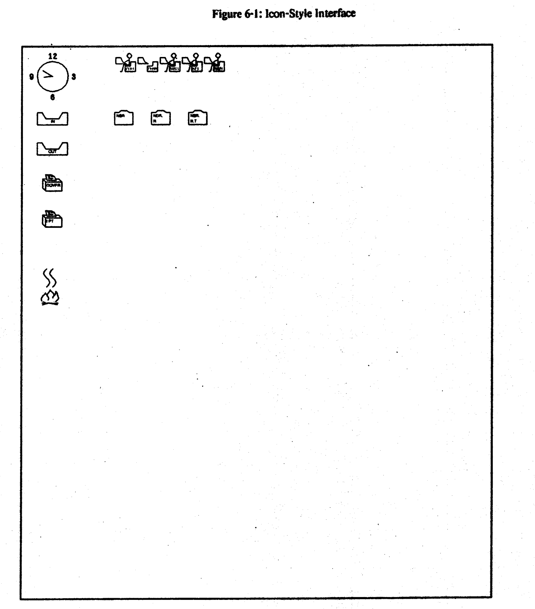

Clock (with 12, 3, 6, 9)
User icons across the top showing users currently logged in
Folder icons: NSR, NSR.R, NSR.R.T
Left-side icons: IN (in-box), OUT (out-box)
Printer icons (two printers — the Dover laser printer and a line printer)
Campfire icon (used for deleting files)

<!-- page:147 -->

Figure 6-2: Icon-Style Interface

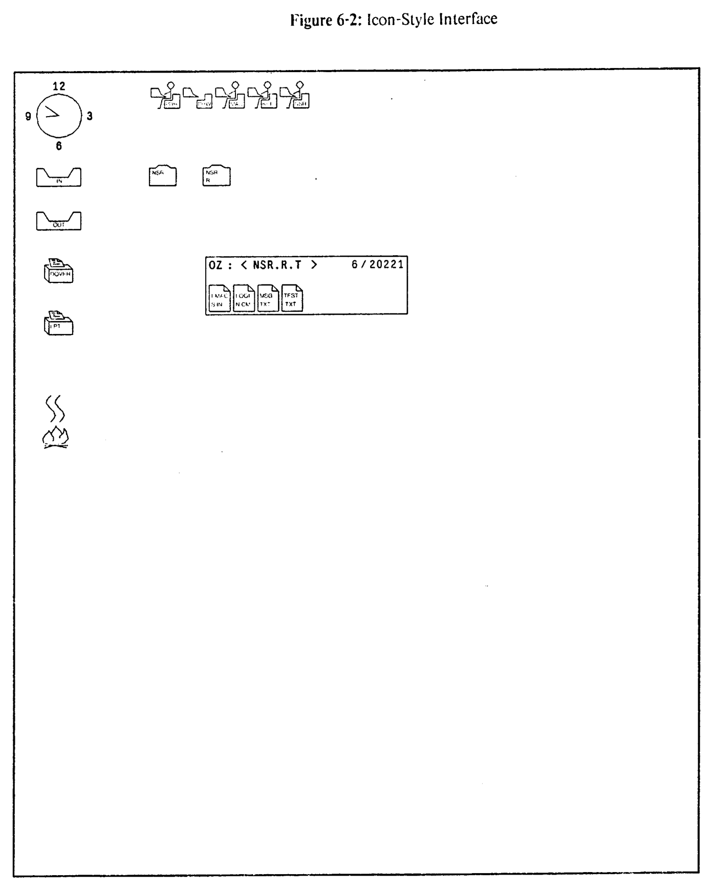

12  3  6  9

IN

OUT

OZ : < NSR.R.T >    6 / 20221

<!-- page:148 -->

Next, the user opens the file MSG.TXT. The process is the same as before: the document icon is selected, a position is selected, and the open command key is typed. Figure 6-3 shows the screen at this point. The MSG.TXT icon no longer appears in the directory display, since it has been brought out to the desktop area and opened. When closed, it will retake its place in the directory display as a document icon.

Figure 6-3 also shows a change in the logged-in user display: the set of users has changed.

The user edits the text of the MSG.TXT file. A position within the text is selected, and the set edit point command key is typed. A text-editing cursor appears at that place in the text. Editing takes place by using simple Emacs-like command keys. For instance, typing letters inserts them, and typing certain control-characters moves the cursor or deletes characters.

The user also edits the To field (i.e., destination specification) at the top of the opened file display. This indicates the user who will receive this file if it is mailed (put in the out-box). This editing is performed in the same manner as the text editing just discussed. The result, shown in figure 6-4, is that the user ECD at MIT-OZ will receive a copy of this file when mailed.

The user now closes MSG.TXT, by selecting it and typing the close command key. The opened file display disappears, and the document icon reappears in the opened directory.

Next, the file TEST.TXT is printed. The document icon is selected, a position at the Dover icon is selected, and the move command key is typed. The print icon is highlighted to show that the print command has been understood and is underway. (The background process sends a request is made to the host computer to print the file.) The highlighting is then turned off, and the document icon is positioned adjacent to the printer icon. See figure 6-5.

After printing, the user deletes the file by moving the TEST.TXT document icon to the

<!-- page:149 -->

Next, the user opens the file MSG.TXT. The process is the same as before: the document icon is selected, a position is selected, and the open command key is typed. Figure 6-3 shows the screen at this point. The MSG.TXT icon no longer appears in the directory display, since it has been brought out to the desktop area and opened. When closed, it will retake its place in the directory display as a document icon.

Figure 6-3 also shows a change in the logged-in user display: the set of users has changed.

The user edits the text of the MSG.TXT file. A position within the text is selected, and the set edit point command key is typed. A text-editing cursor appears at that place in the text. Editing takes place by using simple Emacs-like command keys. For instance, typing letters inserts them, and typing certain control-characters moves the cursor or deletes characters.

The user also edits the To field (i.e., destination specification) at the top of the opened file display. This indicates the user who will receive this file if it is mailed (put in the out-box). This editing is performed in the same manner as the text editing just discussed. The result, shown in figure 6-4, is that the user ECD at MIT-OZ will receive a copy of this file when mailed.

The user now closes MSG.TXT, by selecting it and typing the close command key. The opened file display disappears, and the document icon reappears in the opened directory.

<!-- page:150 -->

Figure 6-4: Icon-Style Interface

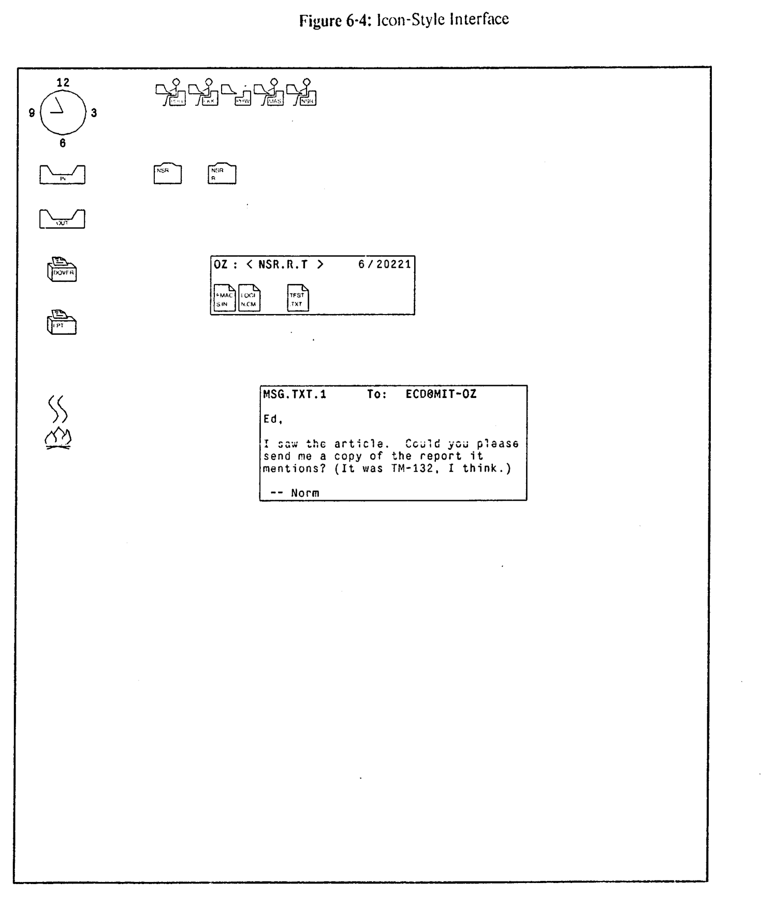

12  3
9      6

IN

OUT

OZ : < NSR.R.T >      6/20221

FMAC
S IN    LOGI
       N.CM    MSG.
               TXT

MSG.TXT.1     To:   ECD@MIT-OZ

Ed,

I saw the article. Could you please
send me a copy of the report it
mentions? (It was TM-132, I think.)

-- Norm

<!-- page:151 -->

Figure 6-5: Icon-Style Interface

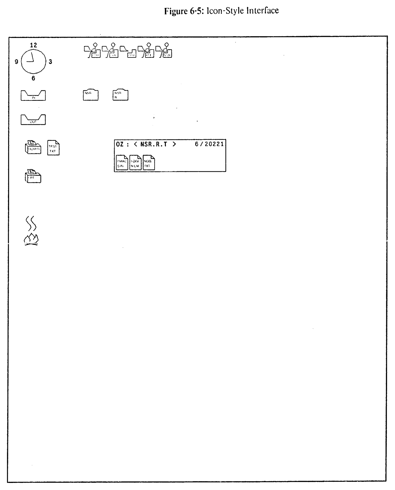

12   3   9   6

IN

OUT

DOVFR
.TXT

.PT

OZ : < NSR.R.T >       6/20221

[FMAC
 SIN]   [LOCI
 N,CM]   [TFST
 .TXT]

MSG.TXT.1    To:  ECD8MIT-OZ

Ed,

I saw the article. Could you please
send me a copy of the report it
mentions? (It was TM-132, I think.)

-- Norm

<!-- page:152 -->

campfire. The campfire is highlighted as the file is deleted. The highlighting is then turned
off and the document icon disappears.

The user moves the MSG.TXT document icon out of the directory to the desktop, i.e., the
open part of the screen. The user now closes the directory; the original folder icon is
displayed, instead of the opened directory display. See figure 6-6.

Mail is viewed by opening the in-box icon. This opened presentation shows the messages
in the mail file as summary lines, shown in figure 6-7. A summary line can be opened,
showing the text of the message. This process is similar to that for viewing directories and
files.

The user can send the contents of a file in two ways. First, he can move the document
icon to one of the user icons at the top of the screen. This causes the text of the message to
appear as a message on that user's terminal. Second, the document icon can be moved to
the out-box. The user takes the latter action, moving the MSG.TXT document icon to the
out-box, causing the contents of the file to be mailed to the user ECD.

Finally, the user opens the NSR icon representing himself, displaying information about

<!-- page:153 -->

Figure 6-6: Icon-Style Interface

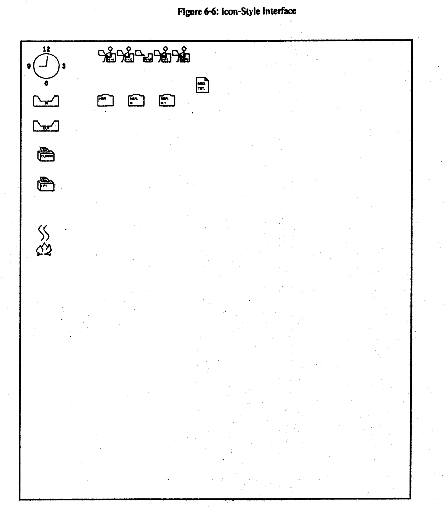

12  3  9  6
MSG. TXT.
NSR
NSR R
NSR R.T
IN
OUT
campfire

<!-- page:154 -->

Figure 6-7: Icon-Style Interface

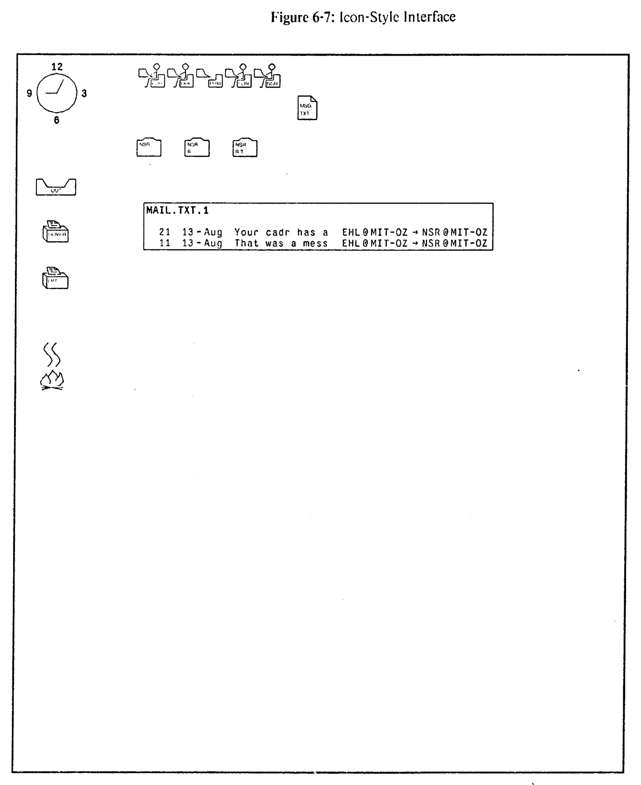

12  9  3  6

MSG
TXT

NSR

NSR
R

NSR
R. T.

MAIL.TXT.1

21  13-Aug  Your cadr has a  EHL@MIT-OZ -> NSR@MIT-OZ
11  13-Aug  That was a mess  EHL@MIT-OZ -> NSR@MIT-OZ

IN

OUT

DUVFR

PT

<!-- page:155 -->

Figure 6-8: Icon-Style Interface

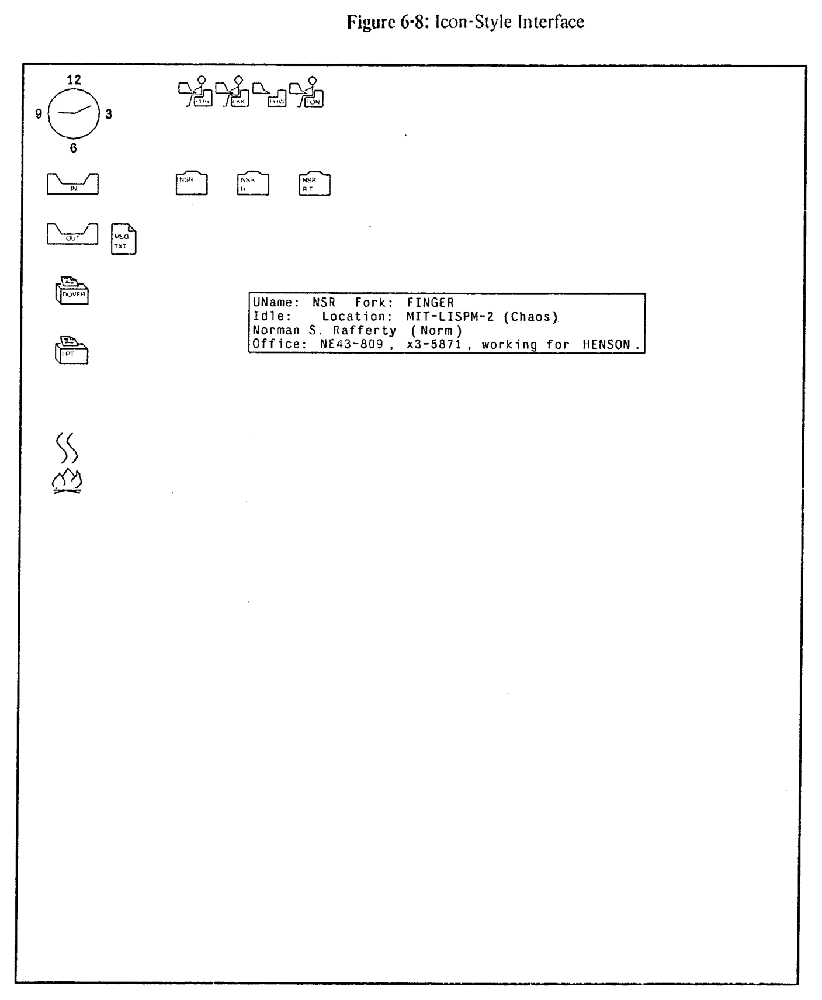

12
9    3
6

IN

OUT

MSG
TXT

NUVFR

PT

UName: NSR   Fork: FINGER
Idle:    Location: MIT-LISPM-2 (Chaos)
Norman S. Rafferty  (Norm)
Office: NE43-809, x3-5871, working for HENSON.

<!-- page:156 -->

Menu-Style Interface. Figure 6-9 shows the initial screen display at the start of the scenario for the menu-style interface. Across the top is a display of current information about the status of the host computer: the time, the time-sharing load, and the number of jobs. (The time-sharing load on Tops-20 is represented by three load averages, the first specifying the load at the current time, the second, the average load over the past 5 minutes, and the third, the average load over the past 15 minutes.) This display is updated every few minutes.

Two command menus are displayed below the host information. The top menu contains commands for choosing what to present and for updating the host's information from user editing of the presentations. (The latter is the perform changes command.) The bottom menu contains presentation editor commands. These commands are invoked by command keys in the icon-style interface.

The scenario starts with the user invoking the present directory command (the result of which is shown in figure 6-10): The user first points to the menu item and selects it by pressing a mouse button. A small window appears at the bottom of the screen, requesting that the user type the directory's pathname. The user types the pathname "<NSR.R.T>" (and can edit it using the text-editing commands). When the user types the End key, the small window disappears, and the user is prompted for the next argument, the position for the directory presentation. The interface displays these prompts (for domain object, presentation, and position selection) briefly, in a line at the bottom of the screen (not shown in these pictures), by specifying the kind of command argument expected. Here, the prompt is "Position". The user selects a position with the mouse, and the directory is displayed as shown in figure 6-10. While the command is being executed, i.e., until the directory display appears, the present directory item in the menu is highlighted by reverse video.

The directory display is accompanied by a menu of commands that view, delete, and print files. The user invokes the present file command from that menu, and then selects (as an argument to the command), the MSG.TXT file. This selection can be done by pointing to

<!-- page:157 -->

Figure 6-9: Menu-Style Interface

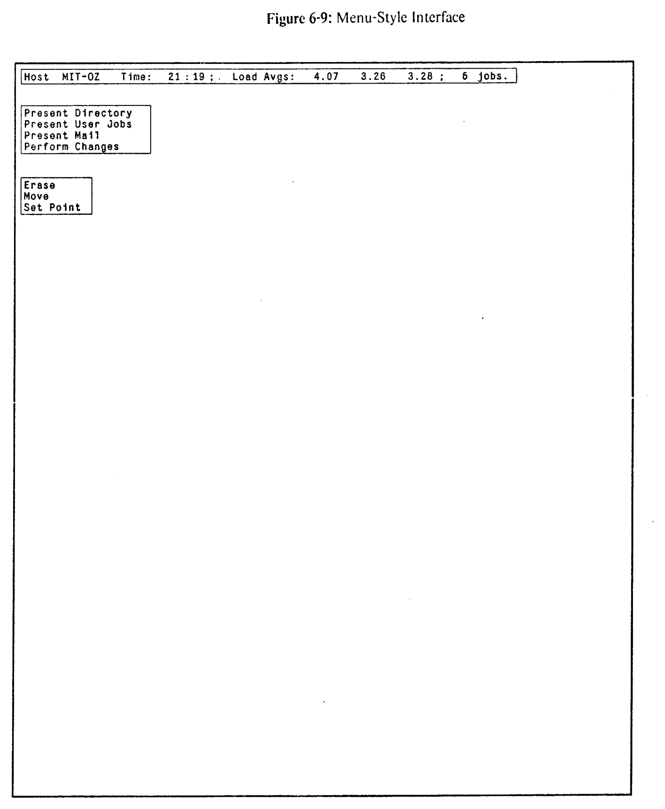

Host  MIT-OZ    Time:   21 : 19 ;   Load Avgs:   4.07   3.26   3.28 ;   6 jobs.

Present Directory
Present User Jobs
Present Mail
Perform Changes

Erase
Move
Set Point

Menu-Style Interface.  Figure 6-9 shows the initial screen display at the start of the
scenario for the menu-style interface.  Across the top is a display of current information
about the status of the host computer:  the time, the time-sharing load, and the number of
jobs.  (The time-sharing load on Tops-20 is represented by three load averages, the first
specifying the load at the current time, the second, the average load over the past 5 minutes,
and the third, the average load over the past 15 minutes.)  This display is updated every few
minutes.

Two command menus are displayed below the host information.  The top menu contains
commands for choosing what to present and for updating the host's information from user
editing of the presentations.  (The latter is the perform changes command.)  The bottom
menu contains presentation editor commands.  These commands are invoked by command
keys in the icon-style interface.

The scenario starts with the user invoking the present directory command (the result of
which is shown in figure 6-10):  The user first points to the menu item and selects it by
pressing a mouse button.  A small window appears at the bottom of the screen, requesting
that the user type the directory's pathname.  The user types the pathname "<NSR.R.T>"
(and can edit it using the text-editing commands).  When the user types the End key, the
small window disappears, and the user is prompted for the next argument, the position for
the directory presentation.  The interface displays these prompts (for domain object,
presentation, and position selection) briefly, in a line at the bottom of the screen (not shown
in these pictures), by specifying the kind of command argument expected.  Here, the
prompt is "Position".  The user selects a position with the mouse, and the directory is
displayed as shown in figure 6-10.  While the command is being executed, i.e., until the
directory display appears, the present directory item in the menu is highlighted by reverse
video.

<!-- page:158 -->

Figure 6-10: Menu-Style Interface

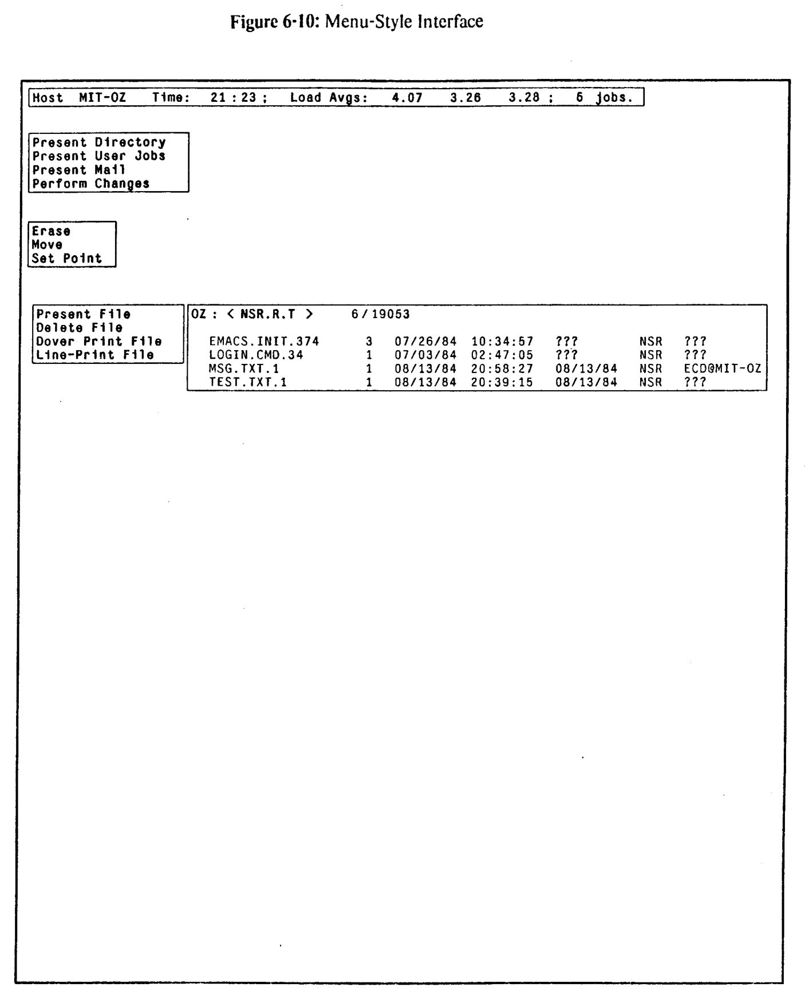

Host  MIT-OZ   Time:  21:23 ;  Load Avgs:  4.07   3.26   3.28 ;   6 jobs.

Present Directory
Present User Jobs
Present Mail
Perform Changes

Erase
Move
Set Point

Present File
Delete File
Dover Print File
Line-Print File

OZ : < NSR.R.T >        6/19053

EMACS.INIT.374    3   07/26/84  10:34:57   ???   NSR   ???
LOGIN.CMD.34      1   07/03/84  02:47:05   ???   NSR   ???
MSG.TXT.1         1   08/13/84  20:58:27   08/13/84   NSR   ECD@MIT-OZ
TEST.TXT.1        1   08/13/84  20:39:15   08/13/84   NSR   ???

<!-- page:159 -->

just the text presenting the name of the file, "MSG.TXT", the entire file row, or even the
presentations of the file's properties (such as the "1" presenting the file length). The user
also selects a position for the file display.

The user at this point can edit the file and its To field, just as in the icon-style scenario.
See figure 6-11.

The user prints the file LOGIN.CMD by selecting Dover Print File and the file entry in
the directory. (Note that if the user wished to print MSG.TXT at this point, he could either
select its entry in the directory or select the file display.) As before, while the command
executes, its item in the menu is highlighted.

The user next deletes LOGIN.CMD. Now, in addition to the highlighting of the delete
command menu item, the LOGIN.CMD line is removed from the display, as shown in
figure 6-12.

The user now erases the directory listing. (This is not a delete command -- it just removes
the directory display from view.)

A display of the current user jobs is next displayed, illustrated in figure 6-13. From left to
right, the fields in this display are: login name, user name, current job, and terminal
information. The terminal information starts, in some cases, with the time the terminal has
been idle (1:17 for one user, 1 minute for another here) and follows with the terminal
location. The user can get the identification of these fields by pointing to them with the
mouse: the documentation line at the bottom of the screen (not shown here) shows a phrase
identifying the field. For example, pointing to the text "MIT-LISPM-2 (Chaos)", the user
sees "the location of the terminal of the user NSR, Norman S. Rafferty". The user edits this
field to add more information, changing it to "LM2: 7th floor". He makes this change take
effect by invoking the perform changes command from the menu at the top left. See figure
6-14.

The user next erases the user display and invokes present mail, resulting in the display

<!-- page:160 -->

Figure 6-11: Menu-Style Interface

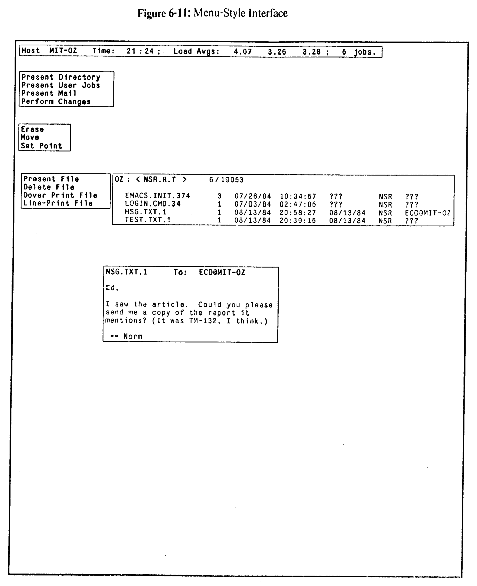

Host MIT-OZ    Time:  21:24 ;   Load Avgs:   4.07   3.26   3.28 ;   6  jobs.

Present Directory
Present User Jobs
Present Mail
Perform Changes

Erase
Move
Set Point

Present File        OZ : < NSR.R.T >        6/19053
Delete File
Dover Print File    EMACS.INIT.374    3    07/26/84   10:34:57   ???    NSR   ???
Line-Print File     MSG.TXT.1         1    08/13/84   20:58:27   08/13/84 NSR  ECD@MIT-OZ
                    TEST.TXT.1        1    08/13/84   20:39:15   08/13/84 NSR   ???

MSG.TXT.1        To:  ECD@MIT-OZ

Ed,

I saw the article.  Could you please
send me a copy of the report it
mentions? (It was TM-132, I think.)

-- Norm

just the text presenting the name of the file, "MSG.TXT", the entire file row, or even the
presentations of the file's properties (such as the "1" presenting the file length). The user
also selects a position for the file display.

The user at this point can edit the file and its To field, just as in the icon-style scenario.
See figure 6-11.

The user prints the file LOGIN.CMD by selecting Dover Print File and the file entry in
the directory. (Note that if the user wished to print MSG.TXT at this point, he could either
select its entry in the directory or select the file display.)  As before, while the command
executes, its item in the menu is highlighted.

The user next deletes LOGIN.CMD.  Now, in addition to the highlighting of the delete
command menu item, the LOGIN.CMD line is removed from the display, as shown in
figure 6-12.

<!-- page:161 -->

Figure 6-12: Menu-Style Interface

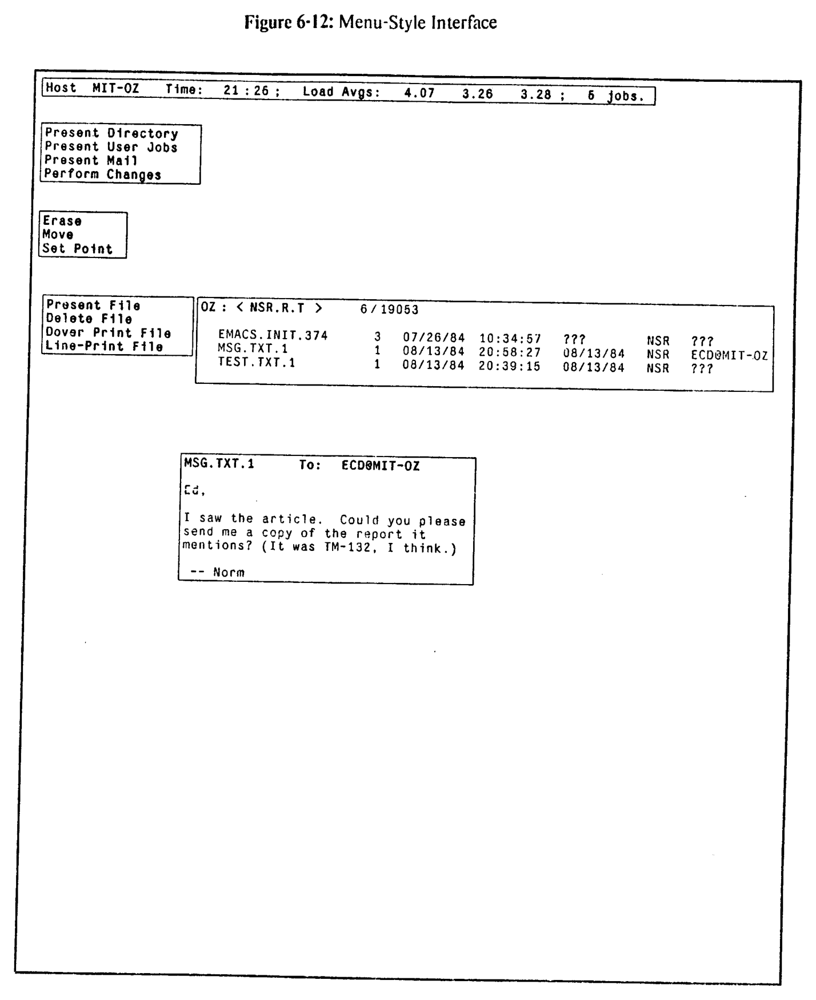

Host  MIT-OZ    Time:  21 : 26 ;    Load Avgs:    4.07   3.26   3.28 ;   6  jobs.

Present Directory
Present User Jobs
Present Mail
Perform Changes

Erase
Move
Set Point

Present File
Delete File
Dover Print File
Line-Print File

OZ : < NSR.R.T >        6/19053

EMACS.INIT.374      3   07/26/84   10:34:57    ???    NSR   ???
MSG.TXT.1           1   08/13/84   20:58:27            08/13/84   NSR   ECD@MIT-OZ
TEST.TXT.1          1   08/13/84   20:39:15            08/13/84   NSR   ???

MSG.TXT.1        To:   ECD@MIT-OZ

Ed,

I saw the article.  Could you please send me a copy of the report it
mentions? (It was TM-132, I think.)

-- Norm

<!-- page:162 -->

Figure 6-13: Menu-Style Interface

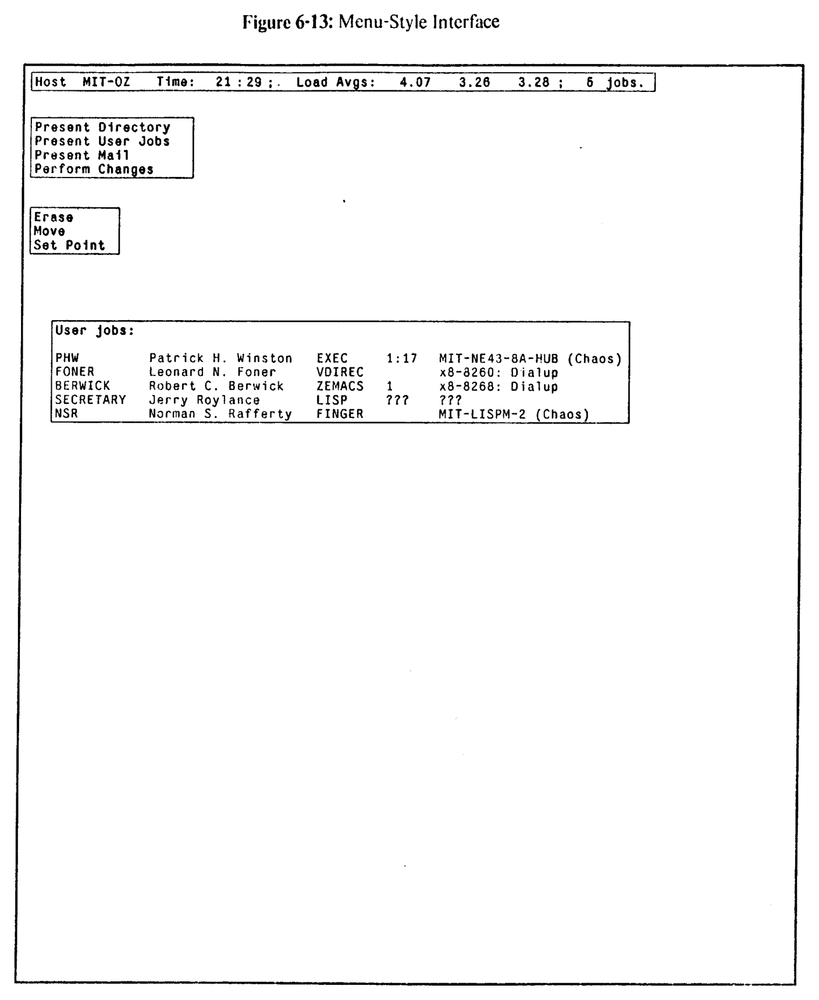

Host  MIT-OZ    Time:   21 : 29 ;   Load Avgs:   4.07    3.26    3.28 ;   6 jobs.

Present Directory
Present User Jobs
Present Mail
Perform Changes

Erase
Move
Set Point

User jobs:

PHW       Patrick H. Winston    EXEC      1:17    MIT-NE43-8A-HUB (Chaos)
FONER     Leonard N. Foner      VDIREC            x8-8260: Dialup
BERWICK   Robert C. Berwick     ZEMACS     1      x8-8268: Dialup
SECRETARY Jerry Roylance        LISP       ???    ???
NSR       Norman S. Rafferty    FINGER           MIT-LISPM-2 (Chaos)

<!-- page:163 -->

Figure 6-14: Menu-Style Interface

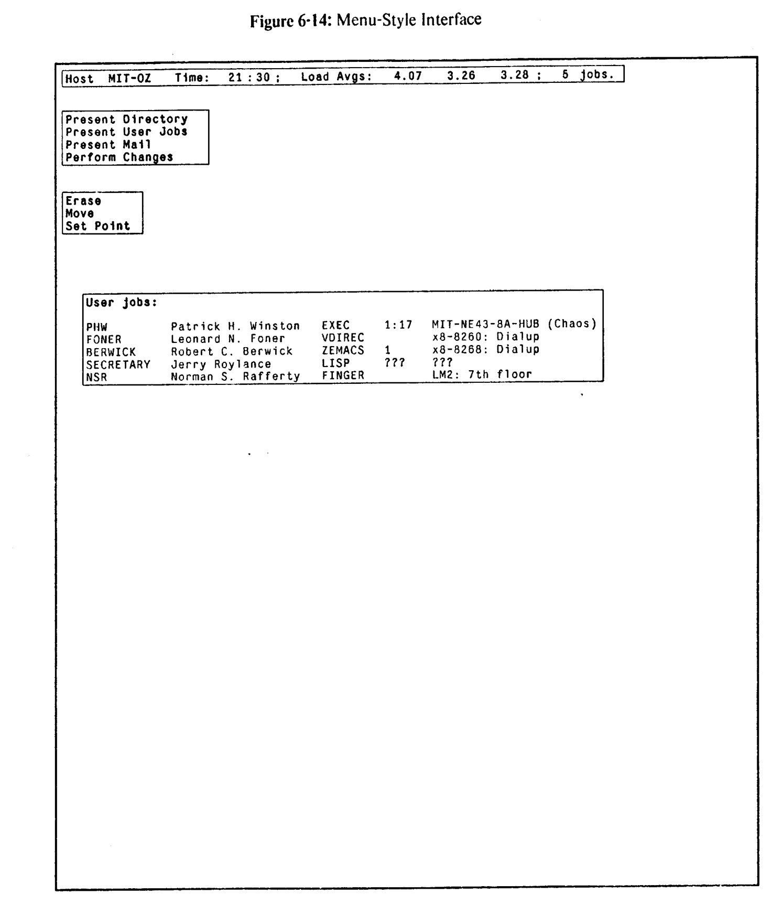

```
[ Host  MIT-OZ   Time:  21:30 ;   Load Avgs:   4.07   3.26   3.28 ;   5 jobs. ]

+--------------------------------+
| Present Directory              |
| Present User Jobs              |
| Present Mail                   |
| Perform Changes                |
+--------------------------------+

+--------+
| Erase  |
| Move   |
| Set Point |
+--------+

User jobs:

PHW        Patrick H. Winston   EXEC    1:17   MIT-NE43-8A-HUB (Chaos)
FONER      Leonard N. Foner     VDIR EC         x8-8260: Dialup
BERWICK    Robert C. Berwick    ZEMACS  1       x8-8268: Dialup
SECRETARY  Jerry Roylance       LISP    ???     ???
NSR        Norman S. Rafferty   FINGER  LM2: 7th floor
```

<!-- page:164 -->

shown in figure 6-15. The mail summary display is accompanied by a menu of commands

for viewing messages or sending the contents of files as messages. The user can mail or

qsend (i.e., send to a terminal, so the recipient sees the message quickly) by selecting the

command, the MSG.TXT file, and then a user. There are a number of ways of selecting the

recipient user, because there can be a number of user presentations displayed: in the To of

a file display, in a display of user jobs, and in message summary lines.

<!-- page:165 -->

Figure 6-15: Menu-Style Interface

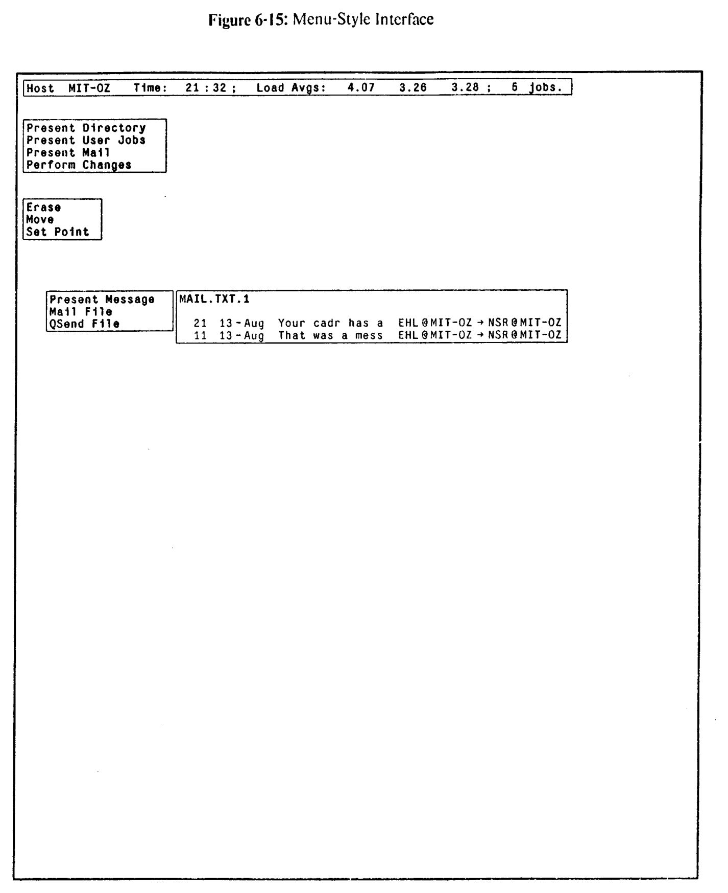

Host  MIT-OZ    Time:  21:32 ;   Load Avgs:   4.07   3.26   3.28 ;   6 jobs.

Present Directory
Present User Jobs
Present Mail
Perform Changes

Erase
Move
Set Point

Present Message
Mail File
QSend File

MAIL.TXT.1

21  13-Aug  Your cadr has a  EHL@MIT-OZ -> NSR@MIT-OZ
11  13-Aug  That was a mess  EHL@MIT-OZ -> NSR@MIT-OZ

<!-- page:166 -->

Annotation-Style Interface. The initial screen display for the annotation-style interface is very similar to that for the menu-style interface. A new command, recognize, appears in the top menu, and the presentation editor menu has been expanded to include commands for drawing lines and arrows. In addition, the interface offers the user the curve-recognition facility for creating lines and arrows. This expanded menu reflects the larger role the presentation editor plays in this style of interface: the user creates graphical annotations to presentations displayed by the system. See the upper left portion of figure 6-16.

The user starts by presenting the directory <NSR.R.T>. As with the menu-style interface, the user selects the menu item and is prompted for pathname and position. The directory display in this interface, however, does not include an associated menu of commands.

The user first decides to correct some information in the directory, namely, that the author of the file EMACS.INIT.374, currently NSR, really should be EAK. To do this, the user invokes the set point command to place the text-editing cursor in an area above the display and then types the text "CHANGE". The text "EAK" is created nearby in a similar manner. The user then connects "CHANGE" to the author presentation by a line, and connects "CHANGE" to "EAK" by an arrow. The result is shown in 6-16.

To check that the system will correctly understand this annotation command, the user invokes the recognize command. Up to this point, the text, line, and arrow created by the user had not been recognized by the interface. The recognize command specifically invokes the annotation recognizer. The menu item is highlighted while the recognition is being performed. The user then checks the result of the recognition by pointing to the text "CHANGE". The documentation line now displays "a plan to change the author of the file OZ:<NSR.R.T>EMACS.INIT.374, NSR, to EAK." This change has not yet been made -- the user has only had the system confirm the meaning of the planned command.

Figure 6-15: Menu-Style Interface

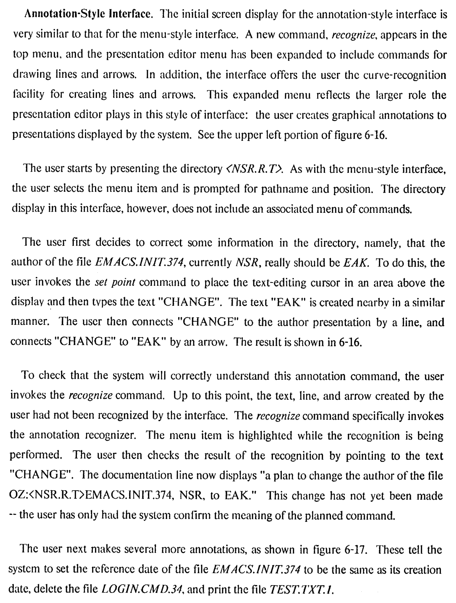

Host  MIT-OZ   Time:  21:32 ;   Load Avgs:  4.07   3.26   3.28 ;   6 jobs.

Present Directory
Present User Jobs
Present Mail
Perform Changes

Erase
Move
Set Point

Present Message
Mail File
QSend File            MAIL.TXT.1
                      21  13-Aug  Your cadr has a  EHL@MIT-OZ -> NSR@MIT-OZ
                      11  13-Aug  That was a mess  EHL@MIT-OZ -> NSR@MIT-OZ

<!-- page:167 -->

Figure 6-16: Annotation-Style Interface

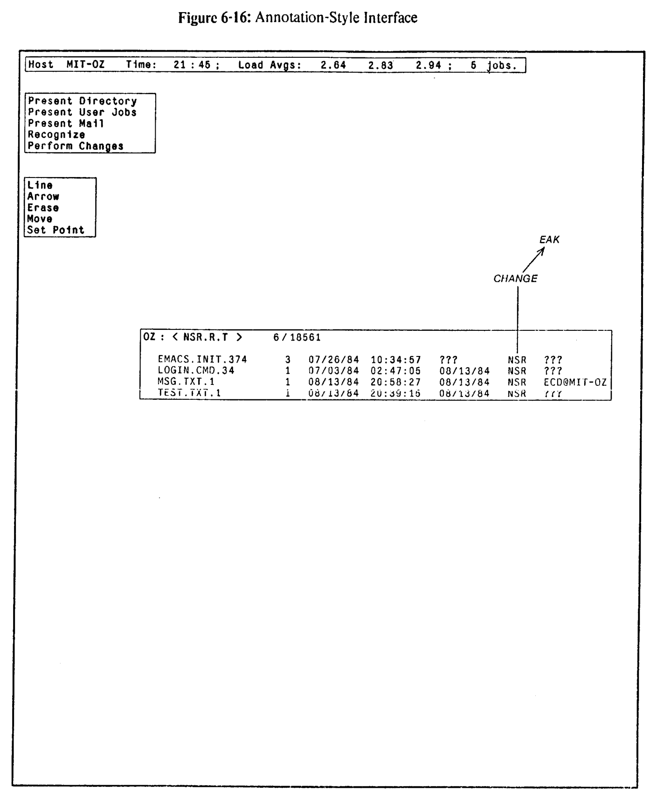

Host  MIT-OZ    Time:   21:45 ;   Load Avgs:   2.64   2.83   2.94 ;   5  jobs.

Present Directory
Present User Jobs
Present Mail
Recognize
Perform Changes

Line
Arrow
Erase
Move
Set Point

EAK (label by arrow)
CHANGE (label near vertical connector)
CHANGE (label on connecting line)

OZ : < NSR.R.T >        6/18561

EMACS.INIT.374     3    07/26/84   10:34:57    ???    NSR    ???
LOGIN.CMD.34       1    07/03/84   02:47:05    08/13/84    NSR    ???
MSG.TXT.1          1    08/13/84   20:58:27    08/13/84    NSR    ECD@MIT-OZ
TEST.TXT.1         1    08/13/84   20:39:15    08/13/84    NSR    ??? 

DELETE  ---> (arrow pointing to LOGIN.CMD.34)
LINE-PRINT  ---> (arrow pointing to TEST.TXT.1)

<!-- page:168 -->

Figure 6-17: Annotation-Style Interface

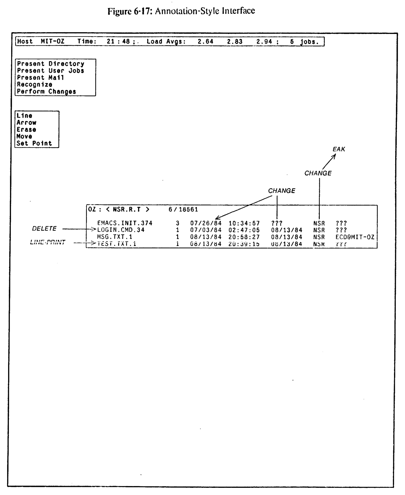

Host  MIT-OZ    Time:   21:48 ;   Load Avgs:   2.64   2.83   2.94 ;   5  jobs.

Present Directory
Present User Jobs
Present Mail
Recognize
Perform Changes

Line
Arrow
Erase
Move
Set Point

DELETE  --->

LINE-PRINT  --->

OZ : < NSR.R.T >       6/18561

  EMACS.INIT.374     3   07/26/84   10:34:57    ???   NSR   ???
> LOGIN.CMD.34       1   07/03/84   02:47:05    08/13/84   NSR   ???
  MSG.TXT.1          1   08/13/84   20:58:27    08/13/84   NSR   ECD@MIT-OZ
  TEST.TXT.1         1   08/13/84   20:39:15    08/13/84   NSR   ???

CHANGE  (arrow pointing to file list)
CHANGE  (vertical annotation line up from listing)
EAK  (arrow pointing upward)

<!-- page:169 -->

The user now tells the system to perform these commands, by invoking the perform
changes command. The command's menu item is highlighted. The first thing the interface
must do is recognize the new annotations, so the recognize command is automatically
invoked by the interface. The user sees that this is taking place: the recognize menu item is
now highlighted. After recognition, the commands are executed one by one. As with the
highlighting of the recognize command, the user sees the progress of the perform changes
command: the annotation commands are highlighted while they are being executed.

When the annotation commands have all been performed, the display is updated in two
ways. First, the line in the directory presenting the file LOGIN.CMD.34 is removed, since
the file has been deleted. Second, the annotation verbs are changed to past tense. The
resulting display is shown in figure 6-18.

6.2 Common Implementation Details

The basic order of development of the user interface was as follows:

* Create application data base network and a background process to connect it
  with the operating system.

* Define some initial presentation styles so that further development can be tested
  with them (e.g., icons).

* Enable selected PSBase basic style packages, especially top-level control
  structure, edit functions, and the mouse-tracking reference mechanism.

* Define and describe commands and command sets, select menu presentation
  styles.

* Specify move recognition and open/close rules.

* Write recognizers as needed (move recognizers, direct-edit recognizers).

* Define and change presentation styles as desired.

Common Implementation. Certain parts of the user interface implementation are shared
between all three of the styles. These parts, once constructed, are invariant under further

<!-- page:170 -->

Figure 6-18: Annotation-Style Interface

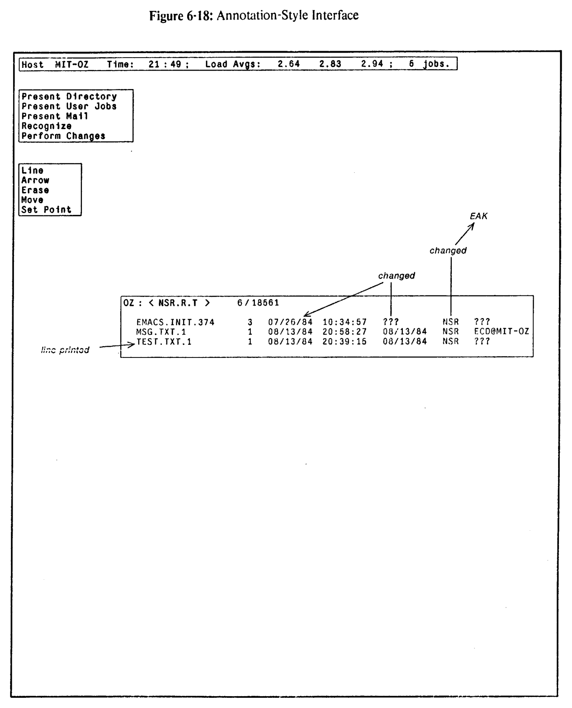

Host  MIT-OZ    Time:  21:49 ;   Load Avgs:   2.64   2.83   2.94 ;   6 jobs.

Present Directory
Present User Jobs
Present Mail
Recognize
Perform Changes

Line
Arrow
Erase
Move
Set Point

OZ : < NSR.R.T >       6/18561

EMACS.INIT.374      3   07/26/84   10:34:57    ???    NSR    ???
MSG.TXT.1           1   08/13/84   20:58:27    08/13/84    NSR    ECD@MIT-OZ
TEST.TXT.1          1   08/13/84   20:39:15    08/13/84    NSR    ???

line printed
changed
changed
EAK

The user now tells the system to perform these commands, by invoking the perform
changes command. The command's menu item is highlighted. The first thing the interface
must do is recognize the new annotations, so the recognize command is automatically
invoked by the interface. The user sees that this is taking place: the recognize menu item is
now highlighted. After recognition, the commands are executed one by one. As with the
highlighting of the recognize command, the user sees the progress of the perform changes
command: the annotation commands are highlighted while they are being executed.

When the annotation commands have all been performed, the display is updated in two
ways. First, the line in the directory presenting the file LOGIN.CMD.34 is removed, since
the file has been deleted. Second, the annotation verbs are changed to past tense. The
resulting display is shown in figure 6-18.

6.2 Common Implementation Details

The basic order of development of the user interface was as follows:

* Create application data base network and a background process to connect it
  with the operating system.

* Define some initial presentation styles so that further development can be tested
  with them (e.g., icons).

* Enable selected PSBase basic style packages, especially top-level control
  structure, edit functions, and the mouse-tracking reference mechanism.

* Define and describe commands and command sets, select menu presentation
  styles.

* Specify move recognition and open/close rules.

* Write recognizers as needed (move recognizers, direct-edit recognizers).

* Define and change presentation styles as desired.

<!-- page:171 -->

development and experimentation with interface styles.

The most important of these parts is the application data base, whose development will be
discussed separately in the following sub-section. The application data base models the
operating system, and at first it seems redundant. Yet it is well worth the modest effort to
construct it: The uniformity of the data base network is vital to the utility of the PSBase
mechanisms. In future systems, applications may be built from the first with this kind of
data base, completely relieving the interface builder from this work. (The benefits of a
uniform data base mechanism in modeling the application are not limited to the
mechanisms of the user interface.) A sub-section below discusses the continual updating of
the application data base in more detail.

A number of simple parsers are provided as part of the general recognizer mechanism
that recognizes user edits of property presentations. These are called direct edits and are
also discussed in detail in a sub-section below.

Finally, all the styles share a number of PSBase components. Since these components are
simply selected and enabled, requiring almost no work on the part of the interface builder,
the components that appear in the three style implementations will be listed here:

* The two top-level control structures (argument-first for the icon-style
  implementation; command-first for the menu-style and annotation-style
  implementations)

* The command execution presenter (for highlighting commands as they execute)

* The mouse-tracking/reference mechanism

* Vertical command menu presentation styles (for the menu-style and annotation-
  style implementations)

* Presentation editor functions: all styles include move, set text cursor position,
  and text-editing commands; menu style adds erase; annotation style adds line
  and arrow

* Curve recognizers for the annotation style.

<!-- page:172 -->

The Application Data Base.  Like PSBase, this interface is implemented on the MIT Lisp
machine.  The Lisp machine acts as the user's terminal; the Lisp machine communicates
with the host computer via network connections.  The user of the interface, however, does
not need to be aware of these connections.

The large scale structure of this system is shown in figure 6-19.  The application data base
models the current state of relevant parts of the host computer, using the uniform data base
mechanism provided by PSBase.  A background process maintains the application data base
by periodically polling the host computer, getting information about the users currently
logged in, the time-sharing load, the contents of relevant directories, and the contents of the
user's mail file ("in box").

Some host information is retrieved or saved upon demand, rather than by regular polling.
For instance, when the user opens a document icon, the presented file instance in the
application data base receives a make-contents message; the file instance must expand its
description to include the text contents of the file.  At this point, therefore, the file is read
into the Lisp machine from the host computer.  Similarly, when the file instance receives a
save-contents message, the text of the file is written back to the host computer.

Recognizers for Direct Editing.  Three instances of direct editing of a presentation occur
in the icon-style interface scenario: editing of the file text, the file destination field, and
fields in the user information display.  All such direct editing is handled in the same
manner.  The PSBase recognizer control structure finds those presentations created by
presenters and edited by the user.  For each of these, it invokes a specific recognizer to
handle that kind of presentation; currently, only text presentations have such a recognizer.
This recognizer, still part of the general mechanism, checks for a parser specifically for the
kind of presented domain object and invokes it.

The interface builder must therefore provide such parsers for those kinds of application
data base instances that are specific to this interface.  The following are two sample parsers.
Note that both are specified not by the class of domain object, but by the property name.
Text presentations that are directly edited are presentations of properties (since they are

<!-- page:173 -->

Figure 6-19: Application Data Base Management

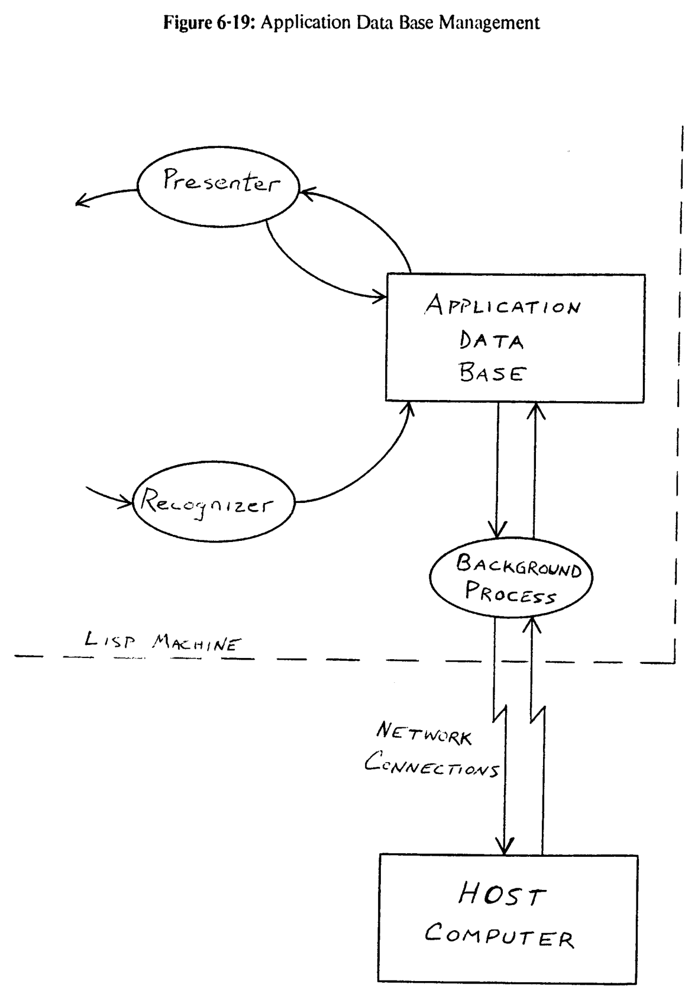

Presenter
-> (arrow) to APPLICATION
               DATA
               BASE (rectangle)
Recognizer
-> (arrow) to APPLICATION
               DATA
               BASE (rectangle)
APPLICATION
DATA
BASE (rectangle)
<- (arrow) from Background
               Process (oval)
Background
Process (oval)
<-> (vertical arrows) Network Connections
HOST
COMPUTER (rectangle)

LISP MACHINE (label near dashed line)

<!-- page:174 -->

parts of a larger style).  This approach is clearly limited; for instance, even if based on the
property name, the specification really should include the kind of owning object or the kind
of property value, since property name alone may be ambiguous.

(defmethod (TEXT-PRESENTATION
            :PARSE-WORK-PHONE-PRESENTED-DOMAIN-OBJECT) ()
  string)

(defmethod (TEXT-PRESENTATION
            :PARSE-REFERENCE-DATE-PRESENTED-DOMAIN-OBJECT) ()
  (make-instance 'date
    ':universal-time (time:parse-universal-time string
                         0 nil nil)))

The first parser simply returns the string of the text presentation as the string to use for
the value of the presented domain object's property.  In fact, most of the parsers for these
interfaces have such trivial parsers, since most of these properties have string values.  Here,
for example, the user instance in the application data base has a work phone property; its
value is not a data base instance, but is simply a string.

However, once the parser for the location property has been created, both presentation
styles immediately offer the user the ability to edit this field.

6.3 Icon-Style Interface Implementation

This section and the following two describe the implementation of the interfaces just
described, building on PSBase.  The icon-style interface implementation consists of five
major parts: presentation style descriptions, open/close mechanism, move recognition,
recognizers for direct editing, and simple use of various PSBase components.

Presentation Style Descriptions.  In general, the icon-style interface uses a graphical
presentation style to define the icons, and template and sequence presentation styles to
define the opened presentations.  Examples of these styles' specifications will be given
below.

The icon style descriptions are simple, though somewhat verbose (as each line, circle,
rectangle, etc., must be specified by listing its properties).  These descriptions are easily
generated, though one would expect a full-scale presentation system base to provide more
tools for creating icons by editing pictures.  (Whether the pictures are constructed from
lines, circles, etc., as here, or from bitmap, or a combination, is an independent issue.  The
non-bitmap approach used here was chosen because it used existing PSBase facilities.)

The presentation style description for the document icon is shown below:

<!-- page:175 -->

However, once the parser for the location property has been created, both presentation
styles immediately offer the user the ability to edit this field.

6.3 Icon-Style Interface Implementation

This section and the following two describe the implementation of the interfaces just
described, building on PSBase. The icon-style interface implementation consists of five
major parts: presentation style descriptions, open/close mechanism, move recognition,
recognizers for direct editing, and simple use of various PSBase components.

Presentation Style Descriptions. In general, the icon-style interface uses a graphical
presentation style to define the icons, and template and sequence presentation styles to
define the opened presentations. Examples of these styles' specifications will be given
below.

The icon style descriptions are simple, though somewhat verbose (as each line, circle,
rectangle, etc., must be specified by listing its properties). These descriptions are easily
generated, though one would expect a full-scale presentation system base to provide more
tools for creating icons by editing pictures. (Whether the pictures are constructed from
lines, circles, etc., as here, or from bitmap, or a combination, is an independent issue. The
non-bitmap approach used here was chosen because it used existing PSBase facilities.)

The presentation style description for the document icon is shown below:

(defmethod (TEXT-PRESENTATION
           :PARSE-WORK-PHONE-PRESENTED-DOMAIN-OBJECT) ()
  string)

(defmethod (TEXT-PRESENTATION
           :PARSE-REFERENCE-DATE-PRESENTED-DOMAIN-OBJECT) ()
  (make-instance 'date
    ':universal-time (time:parse-universal-time string
                     0 nil nil)))

The first parser simply returns the string of the text presentation as the string to use for
the value of the presented domain object's property. In fact, most of the parsers for these
interfaces have such trivial parsers, since most of these properties have string values. Here,
for example, the user instance in the application data base has a work phone property; its
value is not a data base instance, but is simply a string.

(def-graphics-presentation-style DOCUMENT-ICON FILE nil
                                 nil nil
  ((nil
    (LINE-PRESENTATION               ; Top
      :x1 (relative-to-parent-x 0)
      :y1 (relative-to-parent-y 0)
      :x2 (relative-to-parent-x 16)
      :y2 (relative-to-parent-y 0)))
   (nil
    (LINE-PRESENTATION               ; Left
      :x1 (relative-to-parent-x 0)
      :y1 (relative-to-parent-y 0)
      :x2 (relative-to-parent-x 0)
      :y2 (relative-to-parent-y 30)))
   ...
   ((:PATHNAME :STRING-FOR-EDITOR)
    (TEXT-PRESENTATION
      :x (relative-to-parent-x 2)
      :y (relative-to-parent-y 9)
      :font 'fonts:h16
      :mouse-trackable-p ':no-track
      :string (substring-or-null-string
               (send presented-domain-object ':component-walk
                     '(:pathname :string-for-editor))
               0 4)))
   ((:PATHNAME :STRING-FOR-EDITOR)
    (TEXT-PRESENTATION
      :x (relative-to-parent-x 2)
      :y (relative-to-parent-y 19)
      :font 'fonts:h16
      :mouse-trackable-p ':no-track
      :string (substring-or-null-string
               (send presented-domain-object ':component-walk
                     '(:pathname :string-for-editor))
               4 8))))
  nil)

Just as with the example shown in section 5.4, the first two lines of this style description
specify the name, document-icon, the application data base class to which it applies, file, and
flags specifying here that it is not the default style for files, nor is it an active presentation.
The first presentation description in the following list specifies the line across the top of the
icon. The nil that starts the specification indicates that this line alone does not present
anything. The description for the line down the left side of the icon is similar, as are the five
line descriptions that have been elided.

The style description ends with entries for the two lines of text presenting the file name.

<!-- page:176 -->

(def-graphics-presentation-style DOCUMENT-ICON FILE nil
        nil nil

    ((nil
        (LINE-PRESENTATION                ; Top
         :x1 (relative-to-parent-x 0)
         :y1 (relative-to-parent-y 0)
         :x2 (relative-to-parent-x 16)
         :y2 (relative-to-parent-y 0)))
     (nil
        (LINE-PRESENTATION                ; Left
         :x1 (relative-to-parent-x 0)
         :y1 (relative-to-parent-y 0)
         :x2 (relative-to-parent-x 0)
         :y2 (relative-to-parent-y 30)))
    ...
    ((:PATHNAME :STRING-FOR-EDITOR)
     (TEXT-PRESENTATION
      :x (relative-to-parent-x 2)
      :y (relative-to-parent-y 9)
      :font 'fonts:hl6
      :mouse-trackable-p ':no-track
      :string (substring-or-null-string
               (send presented-domain-object ':component-walk
                     '(:pathname :string-for-editor))
               0 4)))
    ((:PATHNAME :STRING-FOR-EDITOR)
     (TEXT-PRESENTATION
      :x (relative-to-parent-x 2)
      :y (relative-to-parent-y 19)
      :font 'fonts:hl6
      :mouse-trackable-p ':no-track
      :string (substring-or-null-string
               (send presented-domain-object ':component-walk
                     '(:pathname :string-for-editor))
               4 8))))
nil)

Just as with the example shown in section 5.4, the first two lines of this style description

specify the name, document-icon, the application data base class to which it applies, file, and

flags specifying here that it is not the default style for files, nor is it an active presentation.

The first presentation description in the following list specifies the line across the top of the

icon. The nil that starts the specification indicates that this line alone does not present

anything. The description for the line down the left side of the icon is similar, as are the five

line descriptions that have been elided.

The style description ends with entries for the two lines of text presenting the file name.

<!-- page:177 -->

Each starts with a specification of the presented domain object, (:pathname
:string-for-editor). This means that the text is computed from the string-for-editor property
of the file's pathname. (A pathname has several string properties, specifying different ways
of writing the pathname.) The strings for the two text presentations are computed by forms
that extract the first four letters for the first line, and the second four for the second line.

The text presentation entries also specify mouse-trackable-p properties. A :no-track value
informs the mouse-tracking mechanism that these text presentations should not be mouse-
sensitive. The intent of the style is that an icon be an atomic unit, and therefore no smaller
part of it should be mouse-sensitive. By default these presentations would be mouse-
sensitive, since they present something. The lines, on the other hand, would not be mouse-
sensitive by default.

The following are representative of style descriptions for opened presentations, using
template and sequence presentation styles. There are three primary styles here: a template
style for the directory label and disk usage line, a sequence style for the row of document
icons, and a template style that combines the label and row styles.

The following is the template for the directory header. This style is also used by the other
directory styles, those used in the other two interfaces.

(def-template-presentation-style    TOPS20-DIRECTORY-HEADER
    DIRECTORY     nil
    ((:self   tops20-directory-name  fonts:cptfontb)
      "     " 
      (:disk-space-used active-text)
      "//"
      (:free-disk-space active-text))
    :horizontal-layout
    nil)

Two other styles are referred to by this template. The tops20-directory-name style simply
presents the directory's host and name in a text template of colon and brackets, e.g.,
"OZ: <NSR>". The active-text style is a simple graphical presentation style that defines a
text presentation whose string is the same as that it presents, and which is specified as being
active, updated every minute. Unlike most graphical presentation styles, it only specifies

(def-graphics-presentation-style DOCUMENT-ICON FILE nil
    nil nil
    ((nil
        (LINE-PRESENTATION            ; Top
            :x1 (relative-to-parent-x 0)
            :y1 (relative-to-parent-y 0)
            :x2 (relative-to-parent-x 16)
            :y2 (relative-to-parent-y 0)))
     (nil
        (LINE-PRESENTATION            ; Left
            :x1 (relative-to-parent-x 0)
            :y1 (relative-to-parent-y 0)
            :x2 (relative-to-parent-x 0)
            :y2 (relative-to-parent-y 30)))
     ...
     ((:PATHNAME :STRING-FOR-EDITOR)
        (TEXT-PRESENTATION
            :x (relative-to-parent-x 2)
            :y (relative-to-parent-y 9)
            :font 'fonts:h16
            :mouse-trackable-p ':no-track
            :string (substring-or-null-string
                        (send presented-domain-object ':component-walk
                            '(:pathname :string-for-editor))
                        0 4))))
     ((:PATHNAME :STRING-FOR-EDITOR)
        (TEXT-PRESENTATION
            :x (relative-to-parent-x 2)
            :y (relative-to-parent-y 19)
            :font 'fonts:h16
            :mouse-trackable-p ':no-track
            :string (substring-or-null-string
                        (send presented-domain-object ':component-walk
                            '(:pathname :string-for-editor))
                        4 8))))
    nil)

Just as with the example shown in section 5.4, the first two lines of this style description
specify the name, document-icon, the application data base class to which it applies, file, and
flags specifying here that it is not the default style for files, nor is it an active presentation.
The first presentation description in the following list specifies the line across the top of the
icon. The nil that starts the specification indicates that this line alone does not present
anything. The description for the line down the left side of the icon is similar, as are the five
line descriptions that have been elided.

The style description ends with entries for the two lines of text presenting the file name,
one presentation, the text presentation. The reason for having it is simply to specify its
active nature.

The following is the presentation style description for the row of document icons in the
directory display:

(def-sequence-presentation-style
    ICON-DIRECTORY-FILE-GROUP-STYLE
    (LIST-PROPERTY DIRECTORY :FILES FILE)
    nil t 999999
    nil nil nil
    document-icon
    :horizontal-layout)

The third line of this description, (list-property ...), specifies the property of the directory
being presented, namely, the files property, and the kind of objects in the list, namely, file
instances. The fourth line specifies that this is not the default style for such properties, and
that, while it is an active presentation, it should not (in effect) be periodically updated -- it
will instead be updated automatically whenever the directory instance in the application
data base is changed.

This sequence has no prefix, infix, or suffix presentations (fifth line). The style used to
present the elements of the files list is document-icon. The document icons will be
positioned in a horizontal row.

<!-- page:178 -->

one presentation, the text presentation. The reason for having it is simply to specify its
active nature.

The following is the presentation style description for the row of document icons in the
directory display:

(def-sequence-presentation-style
        ICON-DIRECTORY-FILE-GROUP-STYLE
        (LIST-PROPERTY DIRECTORY :FILES FILE)
        nil t 999999

        nil nil nil
        document-icon
        :horizontal-layout)

The third line of this description, (list-property ...), specifies the property of the directory
being presented, namely, the files property, and the kind of objects in the list, namely, file
instances. The fourth line specifies that this is not the default style for such properties, and
that, while it is an active presentation, it should not (in effect) be periodically updated -- it
will instead be updated automatically whenever the directory instance in the application
data base is changed.

This sequence has no prefix, infix, or suffix presentations (fifth line). The style used to
present the elements of the files list is document-icon. The document icons will be
positioned in a horizontal row.

Finally, the following is the template style description that composes the above two styles
into the overall opened-directory style:

(def-template-presentation-style
        TOPS20-DIRECTORY-ICON-LISTING-STYLE   DIRECTORY    nil
        ((:self tops20-directory-header)
         ""
         (:files icon-directory-file-group-style))
        :vertical-layout
        :border-box)

The third line of this template specifies that the directory (self) will be presented both by
the whole composite and by the header line. The null string in the fourth line effectively
produces a blank line separating the header from the document row. And, as mentioned
previously, the files property of the directory, a list of files, will be presented in the style

Each starts with a specification of the presented domain object, (:pathname
:string-for-editor). This means that the text is computed from the string-for-editor property
of the file's pathname. (A pathname has several string properties, specifying different ways
of writing the pathname.) The strings for the two text presentations are computed by forms
that extract the first four letters for the first line, and the second four for the second line.

The text presentation entries also specify mouse-trackable-p properties. A :no-track value
informs the mouse-tracking mechanism that these text presentations should not be mouse-
sensitive. The intent of the style is that an icon be an atomic unit, and therefore no smaller
part of it should be mouse-sensitive. By default these presentations would be mouse-
sensitive, since they present something. The lines, on the other hand, would not be mouse-
sensitive by default.

The following are representative of style descriptions for opened presentations, using
template and sequence presentation styles. There are three primary styles here: a template
style for the directory label and disk usage line. a sequence style for the row of document
icons, and a template style that combines the label and row styles.

<!-- page:179 -->

which lines them up as a row of document icons. The header, blank line, and document row are laid out vertically, and a border box is placed around the entire directory presentation.

Opening, Closing. The PSBase mechanism for opening and closing presentations is driven by a set of specifications linking domain object classes and the presentation styles for their opened and closed presentations. These are easily provided; the following is one of these specifications (there are four others, all similar):

```
(def-open-close-presentation-style message-open-close
    message
    message-summary
    full-message
    fonts:cptfont)
```

Move Recognition. Chapter five described the general move recognition mechanism provided by PSBase. To use this mechanism, the interface builder must provide the move recognition rules and some small semantic recognizers to handle the recognition, once the general organizational recognizer has determined that it applies. The following specifies the move recognition rule used for recognizing movement of a document icon to a directory (either a folder icon or an opened directory display) as a command to move the file to that directory (there are four other similar rules specified for the interface):

```
(def-move-recognition-rule move-document-to-directory
    (:overlap (file (document-icon))
              (directory (folder-icon
                          tops20-directory-icon-listing)))
    :recognize-file-directory-movement)
```

The semantic recognizers for move recognition are all very similar. The following is a sample:

```
(defmethod (PRESENTATION :RECOGNIZE-MAIL-FILE-MOVEMENT)
    (out-box-presentation edit-history-entry)
  (let* ((file (send self ':resolve-presented-domain-object
                     #'typep 'file))
         (command-application
           (make-command-application
             (intern-command 'send-file-as-mail-1)
             (list file))))
    (send command-application ':execute)
    (send self ':move-next-to-presentation
          out-box-presentation edit-history-entry ':right)))
```

The recognizer is invoked by sending a recognize-mail-file-movement message to the presentation being moved, the document icon. It is given the out-box icon as one of its arguments. The first binding form in the let* resolves the presented domain object to a file instance. The second binding form creates the command application, specifying the send-file-as-mail-1 command and an argument list with the file as the single argument.

The body of the let* executes the command application (the general PSBase command execution presenter will take care of the highlighting automatically) and ends by moving the document icon to a standard position to the right of the out-box.

The other move recognizers are about this simple. Unfortunately, some need to specify highlighting themselves because of inadequacies in the general command execution presenter. (Specifically, the presenter looks for presentations of the command or the command application. However, moving a document to a printer does not involve a command presentation -- the printer icon presents a printer, not a command. The out-box, on the other hand, presents the mail command. Perhaps the command execution presenter could be improved to handle such cases. In any case, the highlighting is a simple matter to specify.)

<!-- page:180 -->

This recognizer is invoked by sending a recognize-mail-file-movement message to the presentation being moved, the document icon. It is given the out-box icon as one of its arguments. The first binding form in the let* resolves the presented domain object to a file instance. The second binding form creates the command application, specifying the send-file-as-mail-1 command and an argument list with the file as the single argument.

The body of the let* executes the command application (the general PSBase command execution presenter will take care of the highlighting automatically) and ends by moving the document icon to a standard position to the right of the out-box.

The other move recognizers are about this simple. Unfortunately, some need to specify highlighting themselves because of inadequacies in the general command execution presenter. (Specifically, the presenter looks for presentations of the command or the command application. However, moving a document to a printer does not involve a command presentation -- the printer icon presents a printer, not a command. The out-box, on the other hand, presents the mail command. Perhaps the command execution presenter could be improved to handle such cases. In any case, the highlighting is a simple matter to specify.)

6.4 Menu-Style Interface Implementation

The implementation of the menu-style interface consists primarily of presentation style descriptions. For example, the host information at the top of the screen is produced by the following template style:

(def-template-presentation-style HOST-INFO HOST nil
  ("Host "
   (:name nil)
   "  Time: "
   (:current-time digital-clock-no-border)
   ";  "
   (:load-averages host-info-load-averages)
   ";  "
   (:number-of-jobs nil)
   " jobs.")
  :horizontal-layout :border-box)

<!-- page:181 -->

This style is similar to the other template styles discussed. One distinguishing feature here is the presentation style specified for the name and number of jobs properties: nil indicates that the data base network should be searched for the best applicable default style. The two other sub-styles named are straightforward templates.

Implementing displays with associated menus has two parts: specifying the relevant command .set in the application data base and defining the presentation styles. The directory presentation will be used here as an example.

The directory presentation and menu combination is a template-style composite presentation, and as a whole it presents the directory. It has two sub-presentations, the menu and the directory display. These must, by the nature of PSBase template presentation styles, present properties of the directory (or the directory itself again -- the directory display falls into the latter category.) Thus, the interface builder must be sure that a command set is defined, consisting of the relevant commands (present file, delete file, etc.), and that this command set serves as the value of some property of the directory to be presented. Since all directories will share the same command set, this is a property of the entire class, inherited by each directory instance.

This is implemented in the current PSBase data base mechanism by defining a method for directory. (All properties are accessed by the message passing. Some properties are defined by the contents of slots in the instances; but the Lisp machine message-passing system automatically creates methods to retrieve these as well. Thus, the property accessing is uniform.) This method is shown below:

(defmethod (DIRECTORY :FILE-COMMAND-SET) ()
    *short-file-command-set*)

This defines the file command set property for directories. It returns the command set instance in the data base network that the variable *short-file-command-set* is bound to. That variable and the command set instance in turn are created from the following specification:

<!-- page:182 -->

```
(defvar *SHORT-FILE-COMMAND-SET*
  (make-command-set-from-spec
    '(present-file
      delete-file
      dover-print-file
      line-print-file)))
```

This specification defines a command set instance by simply listing the names of the commands to be included.  These commands are defined individually elsewhere.  (They may be included in several different command sets.  The PSBase command description mechanism interns command instances in the data base network based on their Lisp function specifications.)  For example, the command description for the present-file command is written as follows:

```
(def-command PRESENT-FILE
  :arglist ((parameter :select :domain-object
                      :domain-object-type file
                      :presentation-type t)
            (parameter :select :position)))
```

The interface builder must also write the functions for the presentation commands that appear in these menus.  The definition of the present-file function is as follows:

```
(defun PRESENT-FILE (file-instance position)
  (send file-instance ':make-contents)
  (present file-instance
           (position-x position) (position-y position)
           nil
           'text-file-contents))
```

This function (like the open mechanism discussed in chapter five) first ensures that the file instance includes the current contents (the text of the file).  The file is then presented: the present function is a general one that takes as arguments the application data base object (the file instance) to be presented, the position for the presentation, the default font (none specified here), and the name of the presentation style to use (text-file-contents).  Since these present-... functions all tend to have this same structure, there is potential for converting this task of writing functions to simply describing the action, as is done with open/close mechanism.

Some of the presentation styles were shared with the icon-style interface.  (In the icon-style interface these were all used as opened presentations.)  These shared styles are, first,

This style is similar to the other template styles discussed.  One distinguishing feature here is the presentation style specified for the name and number of jobs properties: nil indicates that the data base network should be searched for the best applicable default style.  The two other sub-styles named are straightforward templates.

Implementing displays with associated menus has two parts: specifying the relevant command set in the application data base and defining the presentation styles.  The directory presentation will be used here as an example.

The directory presentation and menu combination is a template-style composite presentation, and as a whole it presents the directory.  It has two sub-presentations, the menu and the directory display.  These must, by the nature of PSBase template presentation styles, present properties of the directory (or the directory itself again -- the directory display falls into the latter category.)  Thus, the interface builder must be sure that a command set is defined, consisting of the relevant commands (present file, delete file, etc.), and that this command set serves as the value of some property of the directory to be presented.  Since all directories will share the same command set, this is a property of the entire class, inherited by each directory instance.

<!-- page:183 -->

the presentation of files showing pathname, destination, and text contents; second, the
presentation of the mail file by showing message summary lines; and third, the presentation
of the text of messages.

The recognition of direct edits is exactly the same as in the icon-style interface. In fact, no
additional work was done at all here, since all the parsers for the properties had already
been defined.

6.5 Annotation-Style Interface Implementation

The annotation-style interface uses the same presentation styles as the menu-style
interface, differing only in the choice of the command sets and top level presentation style
for the directory. (In the annotation-style interface the top-level directory presentation is
just the directory listing, without the associated menu.)

The command execution presenter provides the facility whereby the annotation verbs are
changed to past tense (in addition to providing the command highlighting). The annotation
recognizer only needs to record the presentation style (namely, the annotation presentation
style) in the annotation presentation instance. The command execution presenter checks
the command presentation (which it has been highlighting) for being of that style; if so, the
verb is changed to past tense.

The bulk of the effort was devoted to writing the annotation recognizer. Unlike the other
mechanisms discussed in these interface implementations, the annotation recognizer is fairly
large and is both style-specific and domain-specific. It did not prove very difficult to
modify at various times, as parts of the structure seem almost descriptive. However, a better
approach for future development would be to abstract a general PSBase mechanism driven
by a set of interface-specific annotation descriptions. This seems to be plausible, judging
from the final structure of the programs.

Recognition of the annotations works by matching structural patterns against the
presentation data base structure and checking presented domain objects of eligible

<!-- page:184 -->

presentations. For example, consider the case of an arrow connecting the text "delete" with
a presentation of a file. The recognizer starts by checking that the text presentation is a
command verb. Its job is now to verify that this is indeed a presentation of a delete
command application and to determine its arguments.

The organizational recognizer collects lines and arrows attached to the text presentation
and collects the presentations at the other ends; here, only one arrow is collected.

The semantic recognizer part checks that the presentation at the other end of the arrow
matches (by reference resolution if necessary) something that can be deleted. In this case,
the domain object is a file, and the command application can be created, with the file as its
single argument.

Even though the annotation recognizer is a fairly large and complex, hand-written
program, compared with the other interface-specific parts of the project, the annotation
recognizer still benefits from PSBase support. Its recognition task is simplified by having a
structured presentation data base: it does not have to do any work to find arrows and lines
connected to the verb text. And because the presentation data base records presented
domain objects for the rich structure created by the directory presenter, recognition is an
incremental task -- only the annotations to the directory need be recognized, and the
recognizer can easily check that presentations at the ends of delete arrows present files, or
those at the end of change lines present properties that may be changed, for instance.

These checks are aided too by the PSBase reference resolution mechanism: whether the
presentation at the end of the change arrow presents a date, a time-and-date, a property
whose value is one of those, etc., is immaterial -- when the recognizer checks a change-
reference-date annotation, it need only ask the resolution mechanism to check for a date
instance.

Part of the previous two points, and a more general benefit as well, is the fact that the
application data base is constructed from a uniform data base mechanism.

<!-- page:185 -->

And finally, the larger, interactive nature of the interface benefits from the general PSBase recognition dependency and retraction mechanism. The annotation recognizer does not need to consider changes in the annotation structure from a previously recognized state -- any such changes cause the previous recognition to be retracted automatically. The recognizer only needs to consider the recognition from an unrecognized state and to inform the dependency mechanism of the presentations on which the recognition depends and how to retract the recognition it specifies.

6.6 Other Style Possibilities

Combinations. These interfaces do not have to be (and were not in this project) constructed separately. The interface builder can develop them together, combining them at various times, experimenting with combinations of presentation styles in order to develop a desired overall style, and so on. One command that PSBase provides in this regard is the change presentation style command. The command is given a presentation as its argument. The set of all presentation styles applicable to the presentation's presented domain object is collected. The user selects one of the applicable styles from a menu, and the presentation is replaced with a new one, of the same domain object, in the selected style. Thus, the builder or user can be offered control over the way the objects in the application data base are presented.

Planning. In the interfaces developed here, only the annotation-style included planning -- the separation of accumulation and recognition of commands from their execution. The other styles appear to inherently be more of a direct manipulation style of interface. However, one can imagine developing extensions of those styles, adding features of the annotation style to add planning.

The user could create arrows between presentations in the icon-style interface to present a planned move -- and therefore a planned command using the move recognizer. For instance, the user could draw an arrow from a document icon to a printer icon. This could be recognized as a plan to print that file. The user could see this recognition documented,

presentations. For example, consider the case of an arrow connecting the text "delete" with a presentation of a file. The recognizer starts by checking that the text presentation is a command verb. Its job is now to verify that this is indeed a presentation of a delete command application and to determine its arguments.

The organizational recognizer collects lines and arrows attached to the text presentation and collects the presentations at the other ends; here, only one arrow is collected.

The semantic recognizer part checks that the presentation at the other end of the arrow matches (by reference resolution if necessary) something that can be deleted. In this case, the domain object is a file, and the command application can be created, with the file as its single argument.

Even though the annotation recognizer is a fairly large and complex, hand-written program, compared with the other interface-specific parts of the project, the annotation recognizer still benefits from PSBase support. Its recognition task is simplified by having a structured presentation data base: it does not have to do any work to find arrows and lines connected to the verb text. And because the presentation data base records presented domain objects for the rich structure created by the directory presenter, recognition is an incremental task -- only the annotations to the directory need be recognized, and the recognizer can easily check that presentations at the ends of delete arrows present files, or those at the end of change lines present properties that may be changed, for instance.

These checks are aided too by the PSBase reference resolution mechanism: whether the presentation at the end of the change arrow presents a date, a time-and-date, a property whose value is one of those, etc., is immaterial -- when the recognizer checks a change-reference-date annotation, it need only ask the resolution mechanism to check for a date instance.

Part of the previous two points, and a more general benefit as well, is the fact that the application data base is constructed from a uniform data base mechanism.

Similarly, some commands could be planned by drawing arrows in the menu-style interface, an arrow from the delete file menu item to a file presentation, for example. Some menu commands might require more than one input, which would require a somewhat more complicated visual style to distinguish and group the different inputs to a planned command application.

6.7 Summary

This chapter has described the construction of a user interface on top of the PSBase system described in chapter five. Three alternative styles were implemented. The implementation comprised two major phases:

The first phase was style-independent, primarily the creation of the application data base (and the background process that periodically updates the application data base). Other style-independent work is the writing of the simple direct-edit recognizers.

The second phase (for the icon-style and menu-style interfaces, at least) primarily consisted in using the PSBase-provided tools for defining and describing presentation styles, commands, command sets, move recognition rules, and presentation styles for opened and closed domain objects. These definitions have been illustrated in this chapter, and each is small and can be quickly and independently written. The examples given in this chapter are representative: the others are of about the same difficulty and size. The annotation-style interface required significant additional work in writing its recognizer. An improved PSBase would reduce this work to the scale of the other styles: the builder would simply write a few simple descriptions of the annotation style.

<!-- page:186 -->

as in the annotation-style interface, and accumulate a set of move-arrow plans before giving the command to execute them.

Similarly, some commands could be planned by drawing arrows in the menu-style interface, an arrow from the delete file menu item to a file presentation, for example. Some menu commands might require more than one input, which would require a somewhat more complicated visual style to distinguish and group the different inputs to a planned command application.

6.7 Summary

This chapter has described the construction of a user interface on top of the PSBase system described in chapter five. Three alternative styles were implemented. The implementation comprised two major phases:

The first phase was style-independent, primarily the creation of the application data base (and the background process that periodically updates the application data base). Other style-independent work is the writing of the simple direct-edit recognizers.

The second phase (for the icon-style and menu-style interfaces, at least) primarily consisted in using the PSBase-provided tools for defining and describing presentation styles, commands, command sets, move recognition rules, and presentation styles for opened and closed domain objects. These definitions have been illustrated in this chapter, and each is small and can be quickly and independently written. The examples given in this chapter are representative: the others are of about the same difficulty and size. The annotation-style interface required significant additional work in writing its recognizer. An improved PSBase would reduce this work to the scale of the other styles: the builder would simply write a few simple descriptions of the annotation style.

In other words, once the style-independent work has been completed, implementing a particular style is generally a matter of writing a relatively few small pieces using PSBase tools and choosing some standard PSBase components. This project has demonstrated that even the small number of features provided by PSBase, a prototype presentation system base, covers a substantial amount of ground, enhanced by the ability to combine mechanisms in an independent manner.

<!-- page:187 -->

even the small number of features provided by PSBase, a prototype presentation system
base, covers a substantial amount of ground, enhanced by the ability to combine
mechanisms in an independent manner.

Some rough statistics on the project reported here may help to support the claims about
the ease and speed with which interfaces can be built on top of a presentation system base.
(This discussion primarily covers just the icon-style and menu-style interfaces, since the
annotation-style interface was developed together with PSBase at an earlier stage.) Of the
roughly thirty days spent on the project, more than half were devoted to further work on
PSBase itself. About five or six days were devoted to creating the application data base, the
background management process, and the other common parts of the implementation. The
background process took most of the time, more than anticipated, partly due to the
problems of getting information from a distant host via communication network
connections. (A few days involved determining the network scheme best suited for this
experiment.)

About seven days were required to build the icon-style and menu-style interfaces (and the
parts of the annotation-style interface that had not yet been completed -- the parts other
than the annotation recognizer). This includes time spent at the end changing styles to
experiment with the look of things.

Thus, six days were required for style-independent work and seven days for the style-
specific work on the three different style implementations. An interesting note is that, while
many interface builders will be constructing only one interface, some builders will want to
experiment with different styles. This project illustrates how the experimentation process is
helped too: the style-independent work, nearly half the effort here, is done just once.

Another statistic is the number of presentation styles. At the project's end there were
about 80 styles defined. Several of the PSBase tools evolved during the project, and this
number would be less if the presentation styles were defined from scratch now -- the
number might be closer to 50 or 60. This chapter and chapter five have shown seven of
these. These numbers, in any case, are not very large, and the definitions are simplified by

as in the annotation-style interface, and accumulate a set of move-arrow plans before giving
the command to execute them.

Similarly, some commands could be planned by drawing arrows in the menu-style
interface, an arrow from the delete file menu item to a file presentation, for example. Some
menu commands might require more than one input, which would require a somewhat
more complicated visual style to distinguish and group the different inputs to a planned
command application.

6.7 Summary

This chapter has described the construction of a user interface on top of the PSBase
system described in chapter five. Three alternative styles were implemented. The
implementation comprised two major phases:

The first phase was style-independent, primarily the creation of the application data base
(and the background process that periodically updates the application data base). Other
style-independent work is the writing of the simple direct-edit recognizers.

The second phase (for the icon-style and menu-style interfaces, at least) primarily
consisted in using the PSBase-provided tools for defining and describing presentation styles,
commands, command sets, move recognition rules, and presentation styles for opened and
closed domain objects. These definitions have been illustrated in this chapter, and each is
small and can be quickly and independently written. The examples given in this chapter are
representative: the others are of about the same difficulty and size. The annotation-style
interface required significant additional work in writing its recognizer. An improved
PSBase would reduce this work to the scale of the other styles: the builder would simply
write a few simple descriptions of the annotation style.

In other words, once the style-independent work has been completed, implementing a
particular style is generally a matter of writing a relatively few small pieces using PSBase
tools and choosing some standard PSBase components. This project has demonstrated that

the fact that they do not have complex interactions. (They have few interactions, in fact
-- merely the static inclusion of one style within another.)

Similarly, though only one move recognition rule and one open/close rule have been
included here (and one of each in the previous chapter), there are only about five others in
each category. The total in both categories is no more than a page of definitions.

The characteristics and statistics discussed lend credence to claims that a presentation
system base greatly eases and speeds the development of a user interface. These are not
flawless arguments, unfortunately. First, this has only been one project. It benefits in
generality by including different styles, but there are a few categories that have not been
included; one such is command completion [Tops20 80] [Zmacs 84] (and see section 4.2,
page 78). Second, the project is a demonstration, not a user interface that will really be
used. It lacks many features that would be required. The intent was to pick a representative
sample of these features and to attempt to at least mimic styles and characteristics that are
used in good-quality user interfaces. However, one cannot say that a good-quality,
production user interface has yet been constructed on a presentation system base. More
work needs to be done, to build more substantial presentation system bases and to discover
just what benefits they can provide.

<!-- page:188 -->

the fact that they do not have complex interactions. (They have few interactions, in fact
-- merely the static inclusion of one style within another.)

Similarly, though only one move recognition rule and one open/close rule have been
included here (and one of each in the previous chapter), there are only about five others in
each category. The total in both categories is no more than a page of definitions.

The characteristics and statistics discussed lend credence to claims that a presentation
system base greatly eases and speeds the development of a user interface. These are not
flawless arguments, unfortunately. First, this has only been one project. It benefits in
generality by including different styles, but there are a few categories that have not been
included; one such is command completion [Tops20 80] [Zmacs 84] (and see section 4.2,
page 78). Second, the project is a demonstration, not a user interface that will really be
used. It lacks many features that would be required. The intent was to pick a representative
sample of these features and to attempt to at least mimic styles and characteristics that are
used in good-quality user interfaces. However, one cannot say that a good-quality,
production user interface has yet been constructed on a presentation system base. More
work needs to be done, to build more substantial presentation system bases and to discover
just what benefits they can provide.

even the small number of features provided by PSBase, a prototype presentation system
base, covers a substantial amount of ground, enhanced by the ability to combine
mechanisms in an independent manner.

Some rough statistics on the project reported here may help to support the claims about
the ease and speed with which interfaces can be built on top of a presentation system base.
(This discussion primarily covers just the icon-style and menu-style interfaces, since the
annotation-style interface was developed together with PSBase at an earlier stage.) Of the
roughly thirty days spent on the project, more than half were devoted to further work on
PSBase itself. About five or six days were devoted to creating the application data base, the
background management process, and the other common parts of the implementation. The
background process took most of the time, more than anticipated, partly due to the
problems of getting information from a distant host via communication network
connections. (A few days involved determining the network scheme best suited for this
experiment.)

<!-- page:189 -->

Chapter Seven

Areas for Further Research

This report discusses presentation based user interfaces in two major phases: first, discussion of the presentation system model and its use in describing existing user interfaces; and second, discussion of PSBase, the prototype presentation system base for building user interfaces. Each area can be further studied; both the model and PSBase have the character of a framework and need to be fleshed out.

The presentation system model could be developed further, its structure refined. More general parameters could be identified, kinds of presenter and recognizer control, for instance, or general ambiguities in recognizer action.

There is currently human factors research into what user interfaces should do for particular user groups, for instance, what properties they should have, what the structure of dialogs should be, and what error messages should say. However, there needs to be more work done from the opposite end, determining what user interfaces can do -- what the range of possible styles is. In terms of the definition of styles as patterns of presentation system parameters, the possible fundamental structures for these patterns should be determined, thus defining broad classes of styles.

7.1 PSBase Limitations

PSBase has several limitations. PSBase is a prototype, not a full-scale production system. Several parts of its implementation are patchy or somewhat inconsistent, resulting from the evolution of its design and the pressure of time. It provides examples of various features that a presentation system should have, enough in fact to build the interface discussed in the next chapter. However, more features in each category need to be provided, the existing mechanisms need to be improved, especially in order to better match the structure of the

<!-- page:190 -->

presentation system model, and various mechanisms could benefit from being unified.

More Features Offered. Although this chapter has not fully enumerated all the features offered in each major category, most of the features have been illustrated. The following lists what would be required for a full-scale presentation system base:

* More kinds of presentations, presentation relations
* More presentation editor functions
* More curve recognizers
* More command argument parameter types
* More (and cleverer) organizational presenters
* More presenters
* More recognizers, recognizer drivers

Better Mechanisms. In addition to providing more each kind of feature or mechanism, those that have been provided could be improved, by being made more general, more

<!-- page:191 -->

Unified Mechanisms. Two major kinds of unification needs to be achieved in PSBase mechanisms. First is the invocation of continual and general recognizers. The distinction between the two kinds of recognizers does not seem to be an inherent one, nor is it a sharp distinction even in the current implementation. Perhaps there could be a single recognizer invocation mechanism.

Second, the various presentation style descriptions should be unified into a single language for describing presentation styles. The three kinds of descriptions shown in section 5.4, for defining graphical, sequence, and template presentation styles, are very similar. Making a single description language that merges the capabilities of these three kinds of defining forms should not be difficult.

Beyond that, however, the description of presentation style might be interpreted by more than just a presenter. Perhaps it could be interpreted by a recognizer as well. This would then ensure that many presenters and recognizers would be inverses, allowing the interface builder to provide greater uniformity in the interface style, between the presentation style used for output (constructed by presenters) and the presentation style used for input (recognized from user constructions).

presentation system model, and various mechanisms could benefit from being unified.

More Features Offered. Although this chapter has not fully enumerated all the features offered in each major category, most of the features have been illustrated. The following lists what would be required for a full-scale presentation system base:

* More kinds of presentations, presentation relations

* More presentation editor functions

* More curve recognizers

* More command argument parameter types

* More (and cleverer) organizational presenters

* More presenters

* More recognizers, recognizer drivers

<!-- page:192 -->

References

[Attardi & Simi 81]
  Attardi, G., and Simi, M.
  Semantics of Inheritance and Attributions in the Description System Omega.
  In Proceedings of IJCAI 81. IJCAI, Vancouver, B.C., Canada, August, 1981.

[Barber 82]
  Barber, G.
  Office Semantics.
  PhD thesis, Massachusetts Institute of Technology, February, 1982.

[Beil 82]
  Beil, D.H.
  The VisiCalc Book.
  Reston Publishing Co., Inc., Reston, VA, 1982.

[Bleser & Foley 82]
  Bleser, T. and Foley, J. D.
  Towards Specifying and Evaluating the Human Factors of User-Computer
    Interfaces.
  In Human Factors in Computer Systems, pages 309-314. ACM, March, 1982.

[Brachman 78]
  Brachman, R. J.
  A Structural Paradigm for Representing Knowledge.
  Report 3605, Bolt Beranek and Newman, Inc., May, 1978.

[Brachman & Schmolze 85]
  Brachman, R.J., and Schmolze, J.G.
  An Overview of the KL-ONE Knowledge Representation System.
  Cognitive Science, 1985.
  To appear.

[Brown 82]
  Brown, J. W.
  Controlling the Complexity of Menu Networks.
  Communications of the ACM 25(7):412-418, July, 1982.

[Brown & Sedgewick 84a]
  Brown, M. H. and Sedgewick, R.
  A System for Algorithm Animation.
  Technical Report CS-84-01, Brown University, January, 1984.

<!-- page:193 -->

[Brown & Sedgewick 84b]  
Brown, M. H. and Sedgewick, R.  
Techniques for Algorithm Animation.  
Technical Report CS-84-02, Brown University, January, 1984.

[Brown & Sedgewick 84c]  
Brown, M. H. and Sedgewick, R.  
Progress Report: Brown University Instructional computing Laboratory.  
In 15th Annual Technical Symposium on Computer Science Education (ACM SIGCSE). ACM, February, 1984.  
Also available as Brown University Technical Report No. CS-83-28

[CCA 79]  
Program Visualization Concept Paper.  
Computer Corporation of America.  
Cambridge, MA

[diSessa 85]  
diSessa, A.  
A Principled Design for an Integrated Computational Environment.  
Human-Computer Interaction 1(1), January, 1985.  
To appear.

[Donelson 78]  
Donelson, W.  
Spatial Management of Data.  
ACM, Atlanta, GA, 1978.

[Foley & Van Dam 82]  
Foley, J. D. and Van Dam, A.  
Fundamentals of Interactive Computer Graphics.  
Addison-Wesley, Reading, MA, 1982.

[Forbus 81]  
Forbus, K. D.  
An Interactive Laboratory for Teaching Control System Concepts.  
Report 4752, Bolt Beranek and Newman, Inc., September, 1981.

[Friedell 83]  
Friedell, M.  
Automatic Graphics Environment Synthesis.  
Technical Report CCA-83-03, Computer Corporation of America, 1983.

<!-- page:194 -->

[Gnanamgari 81]  
Gnanamgari, S.  
Information Presentation through Default Displays.  
Computer and Information Sciences technical report 81-05-02, University of  
Pennsylvania, 1981.

[Hayes 84]  
Hayes, P. J.  
Executable Interface Definitions Using Form-Based Interface Abstractions.  
In H. R. Hartson, editor, Advances in Computer-Human Interaction. Ablex, New  
Jersey, 1984.

[Herot 80]  
Herot, C. F.  
Spatial Management of Data.  
ACM Transactions on Database Systems 5(4):493-513, December, 1980.

[Jacob 82]  
Jacob, R. J. K.  
Using Formal Specifications in the Design of a Human-Computer Interface.  
In Human Factors in Computer Systems, pages 315-321. ACM, March, 1982.

[Kaczmarek, Mark & Wilczynski 83]  
Kaczmarek, T., Mark, W., and Wilczynski, D.  
The CUE Project.  
In SoftFair -- Software Development: Tools, Techniques, and Alternatives, pages  
383-389. IEEE, July, 1983.

[Lieberman 83]  
Lieberman, H.  
Designing Interactive Systems from the User's Viewpoint.  
In P. Degano and E. Sandewall, editors, Integrated Interactive Computer Systems,  
pages 45-59. North-Holland, Amsterdam, 1983.

[Lieberman 84]  
Lieberman, H.  
Seeing What Your Programs Are Doing.  
International Journal of Man-Machine Studies, July, 1984.

[Lisa 84]  
Apple Lisa reference manual.  
1984.

<!-- page:195 -->

[Mark 81]  
Mark, W.  
Representation and Inference in the Consul System.  
In Proceedings of IJCAI 81, pages 375-381. IJCAI, Vancouver, B.C., Canada,  
August, 1981.

[McDonald 83]  
McDonald, David D.  
Natural Language Generation as a Computational Problem: an introduction.  
In Brady & Berwick, editors, Computational Models of Discourse, pages 209-264.  
MIT Press, 1983.

[Newman & Sproull 79]  
Newman, W. M. and Sproull, R. F.  
Principles of Interactive Computer Graphics, 2nd edition.  
McGraw-Hill, New York, 1979.

[Purvy, Farrell & Klose 83]  
Purvy, R., Farrell, J., and Klose, P.  
The Design of Star's Records Processing: Data Processing for the Noncomputer  
Professional.  
ACM Transactions on Database Systems 1(1):3, January, 1983.

[Reisner 81]  
Reisner, P.  
Formal Grammar and Human Factors Design of an Interactive Graphics System.  
IEEE Transactions on Software Engineering SE-7(2):229-240, March, 1981.

[Reisner 82]  
Reisner, P.  
Further Developments Toward Using Formal Grammar as a Design Tool.  
In Human Factors in Computer Systems, pages 304-308. ACM, March, 1982.

[Shneiderman 80]  
Shneiderman, B.  
Software Psychology: Human Factors in Computer and Information Systems.  
Little, Brown, and Co., Boston, MA, 1980.

[Shneiderman 83]  
Shneiderman, B.  
Direct Manipulation: A Step Beyond Programming.  
IEEE Computer, August, 1983.

<!-- page:196 -->

[Shneiderman & Mayer 79]  
Shneiderman, B., Mayer, R.  
Syntactic/Semantic Interactions in Programmer Behavior: A Model and  
Experimental Results.  
International Journal of Computer and Information Sciences 8(3):219-239, 1979.

[Smith, Irby, Kimball, Verplank & Harslem 83]  
Smith, D.C., Irby, C., Kimball, R., Verplank, B., and Harslem, E.  
Designing the Star User Interface.  
In P. Degano and E. Sandewall, editors, Integrated Interactive Computer Systems,  
pages 297-313. North-Holland, Amsterdam, 1983.

[Stallman 81]  
Stallman, R. M.  
EMACS Manual for ITS Users.  
AI Memo 554, Massachusetts Institute of Technology Artificial Intelligence  
Laboratory, April, 1981.  
Now only available as report AD-A093-186 from the National Technical Information  
Service, U.S. Dept. of Commerce, Reports Division, 5285 Port Royal Road,  
Springfield, Virginia 22161.

[Stevens & Roberts 83]  
Stevens, A., and Roberts, B.  
Quantitative and Qualitative Simulation in Computer Based Training.  
Journal of Computer-Based Instruction 10(1,2):16-19, summer, 1983.

[Stevens, Roberts & Stead 83]  
Stevens, A., Roberts, B., and Stead, L.  
The Use of a Sophisticated Graphics Interface in Computer-Assisted Instruction.  
IEEE Computer Graphics and Applications :25-31, March/April, 1983.

[Tops20 80]  
TOPS-20 User's Guide.  
Digital Equipment Corporation, Marlboro, MA, 1980.  
Order no. AA-4179C-TM. Sections 2.2-2.4 discuss command completion.

[Weinreb, Moon & Stallman 83]  
Weinreb, D. L., Moon, D. A., and Stallman, R. M.  
Lisp Machine Manual.  
Fifth edition, Massachusetts Institute of Technology Artificial Intelligence  
Laboratory, Cambridge, MA, 1983.

[Mark 81]  
Mark, W.  
Representation and Inference in the Consul System.  
In Proceedings of IJCAI 81, pages 375-381. IJCAI, Vancouver, B.C., Canada,  
August, 1981.

[McDonald 83]  
McDonald, David D.  
Natural Language Generation as a Computational Problem: an introduction.  
In Brady & Berwick, editors, Computational Models of Discourse, pages 209-264.  
MIT Press, 1983.

[Newman & Sproull 79]  
Newman, W. M. and Sproull, R. F.  
Principles of Interactive Computer Graphics, 2nd edition.  
McGraw-Hill, New York, 1979.

[Purvy, Farrell & Klose 83]  
Purvy, R., Farrell, J., and Klose, P.  
The Design of Star's Records Processing: Data Processing for the Noncomputer  
Professional.  
ACM Transactions on Database Systems 1(1):3, January, 1983.

[Reisner 81]  
Reisner, P.  
Formal Grammar and Human Factors Design of an Interactive Graphics System.  
IEEE Transactions on Software Engineering SE-7(2):229-240, March, 1981.

[Reisner 82]  
Reisner, P.  
Further Developments Toward Using Formal Grammar as a Design Tool.  
In Human Factors in Computer Systems, pages 304-308. ACM, March, 1982.

[Shneiderman 80]  
Shneiderman, B.  
Software Psychology: Human Factors in Computer and Information Systems.  
Little, Brown, and Co., Boston, MA, 1980.

[Shneiderman 83]  
Shneiderman, B.  
Direct Manipulation: A Step Beyond Programming.  
IEEE Computer, August, 1983.

[Zdybel, Gibbons, Greenfeld & Yonke 81]  
Zdybel, F., Gibbons, J., Greenfeld, N. & Yonke, M.  
Application of Symbolic Processing to Command and Control: An Advanced  
Information Presentation System.  
Report 4752, Bolt Beranek and Newman, Inc., August, 1981.

[Zdybel, Greenfeld, Yonke & Gibbons 81]  
Zdybel, F., Greenfeld, N., Yonke, M. & Gibbons, J.  
An Information Presentation System.  
In Proceedings of IJCAI 81. IJCAI, Vancouver, B.C., Canada, August, 1981.

[Zloof 82]  
Zloof, M. M.  
Office-by-Example: A Business Language that Unifies Data and Word Processing  
and Electronic Mail.  
IBM Systems Journal 21(3):272-304, 1982.

[Zloof & de Jong 77]  
Zloof, M. M. and de Jong, S. P.  
The System for Business Automation (SBA): Programming Language.  
Communications of the ACM 20(6), June, 1977.

[Zmacs 84]  
Zmacs Manual.  
Symbolics Inc., Cambridge, MA, 1984.

<!-- page:197 -->

[Zdybel, Gibbons, Greenfeld & Yonke 81]  
Zdybel, F., Gibbons, J., Greenfeld, N. & Yonke, M.  
Application of Symbolic Processing to Command and Control: An Advanced  
Information Presentation System.  
Report 4752, Bolt Beranek and Newman, Inc., August, 1981.

[Zdybel, Greenfeld, Yonke & Gibbons 81]  
Zdybel, F., Greenfeld, N., Yonke, M. & Gibbons, J.  
An Information Presentation System.  
In Proceedings of IJCAI 81. IJCAI, Vancouver, B.C., Canada, August, 1981.

[Zloof 82]  
Zloof, M. M.  
Office-by-Example: A Business Language that Unifies Data and Word Processing  
and Electronic Mail.  
IBM Systems Journal 21(3):272-304, 1982.

[Zloof & de Jong 77]  
Zloof, M. M. and de Jong, S. P.  
The System for Business Automation (SBA): Programming Language.  
Communications of the ACM 20(6), June, 1977.

[Zmacs 84]  
Zmacs Manual.  
Symbolics Inc., Cambridge, MA, 1984.

<!-- page:198 -->

This blank page was inserted to preserve pagination.

<!-- page:199 -->

CS-TR Scanning Project
Document Control Form

Date: 11 /25/ 96

Report # AI-TR-794

Each of the following should be identified by a checkmark:
Originating Department:

☒ Artificial Intellegence Laboratory (AI)
☐ Laboratory for Computer Science (LCS)

Document Type:

☒ Technical Report (TR)    ☐ Technical Memo (TM)
☐ Other:_____________________

Document Information    Number of pages: 195 (802- images)
Not to include DOD forms, printer instructions, etc... original pages only.

Originals are:
☒ Single-sided or
☐ Double-sided

Intended to be printed as :
☐ Single-sided or

☒ Double-sided

Print type:
☐ Typewriter    ☐ Offset Press    ☐ Laser Print
☐ InkJet Printer ☐ Unknown       ☐ Other:__________________

Check each if included with document:

☒ DOD Form (2)    ☐ Funding Agent Form    ☒ Cover Page
☐ Spine           ☐ Printers Notes          ☐ Photo negatives
☐ Other: ___________________________

Page Data:

Blank Pages (by page number): _______________________

Photographs/Tonal Material (by page number): _______________________

Other (note description/page number).

Description :          Page Number:

IMAGE MAP (1-195) 1-195
(196-202) SCAN CONTROL, COVER, DOD (2), TRCTS (3)

Scanning Agent Signoff:

Date Received: 1 /25/96    Date Scanned: 1 /30/96    Date Returned: 2 /1/96

Scanning Agent Signature: Michael W. Cook

Rev 9/94 DS/LCS Document Control Form cstform.vsd

<!-- page:200 -->

Block 20 cont.

between an "application data base" and a "presentation data base", the symbolic
screen description containing presentations. A "presenter" continually updates
the the presentation data base from the application data base. The user manipulates
presentations with a "presentation editor". A "recognizer" translates the user's
presentation manipulation into application data base commands. The primitive
presentation system can be extended to model more complex systems by attaching
additional presentation systems. In order to illustrate the model's generality
and descriptive capabilities, extended model structures for several existing
user interfaces are discussed.

The base provides support for building the application and presentation data
bases, linked together into a single, uniform network, graphics to continuously
display it, and editing functions. A variety of tools and mechanisms help
create and control presenters and recognizers. To demonstrate the base's utility,
three interfaces to an operating system were constructed, embodying different
styles: icon, menu, and graphical annotation.

<!-- page:201 -->

Block 20 cont.

between an "application data base" and a "presentation data base", the symbolic screen description containing presentations. A "presenter" continually updates the the presentation data base from the application data base. The user manipulates presentations with a "presentation editor". A "recognizer" translates the user's presentation manipulation into application data base commands. The primitive presentation system can be extended to model more complex systems by attaching additional presentation systems. In order to illustrate the model's generality and descriptive capabilities, extended model structures for several existing user interfaces are discussed.

The base provides support for building the application and presentation data bases, linked together into a single, uniform network, graphics to continuously display it, and editing functions. A variety of tools and mechanisms help create and control presenters and recognizers. To demonstrate the base's utility, three interfaces to an operating system were constructed, embodying different styles: icon, menu, and graphical annotation.

<!-- page:202 -->

Scanning Agent Identification Target

Scanning of this document was supported in part by
the Corporation for National Research Initiatives,
using funds from the Advanced Research Projects
Agency of the United states Government under
Grant: MDA972-92-J1029.

The scanning agent for this project was the
Document Services department of the M.I.T
Libraries. Technical support for this project was
also provided by the M.I.T. Laboratory for
Computer Sciences.

Scanned

Date: 1/30/1996

M.I.T. Libraries
Document Services
