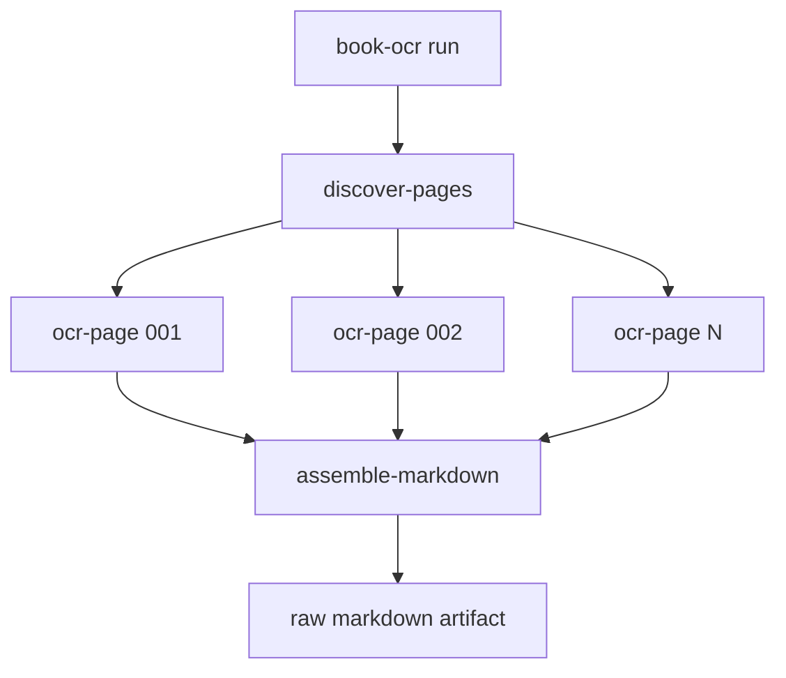
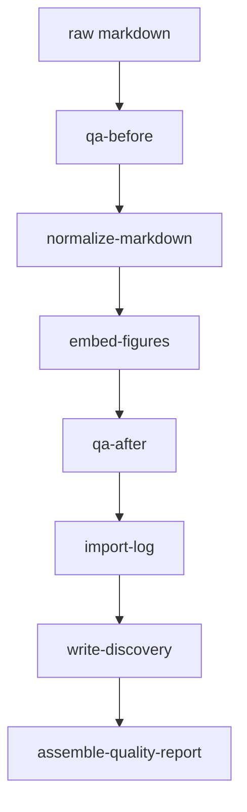
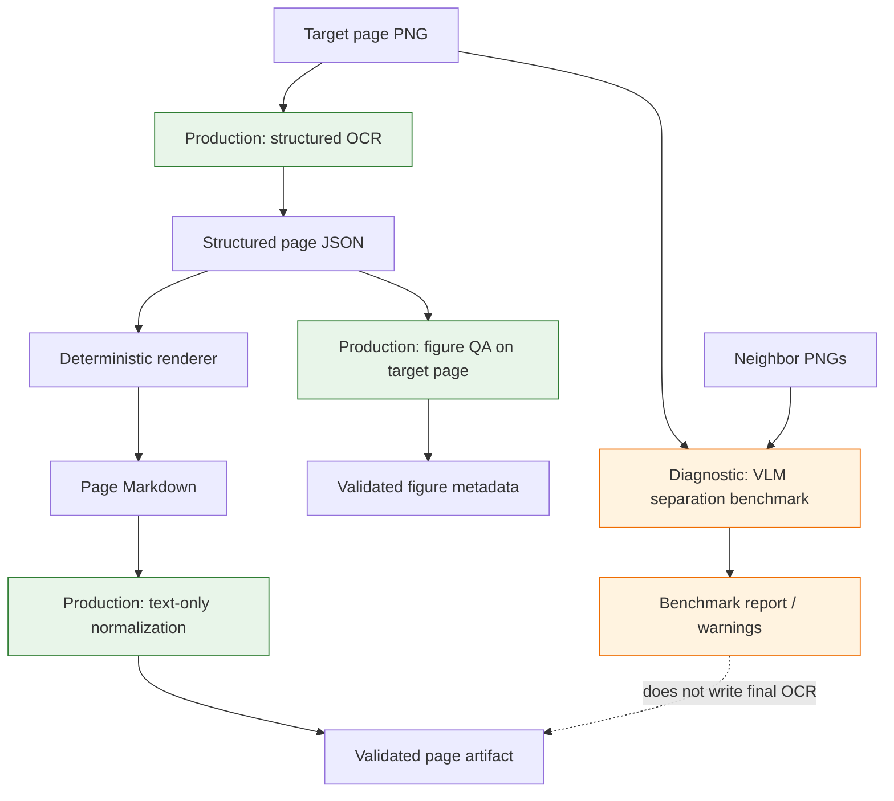
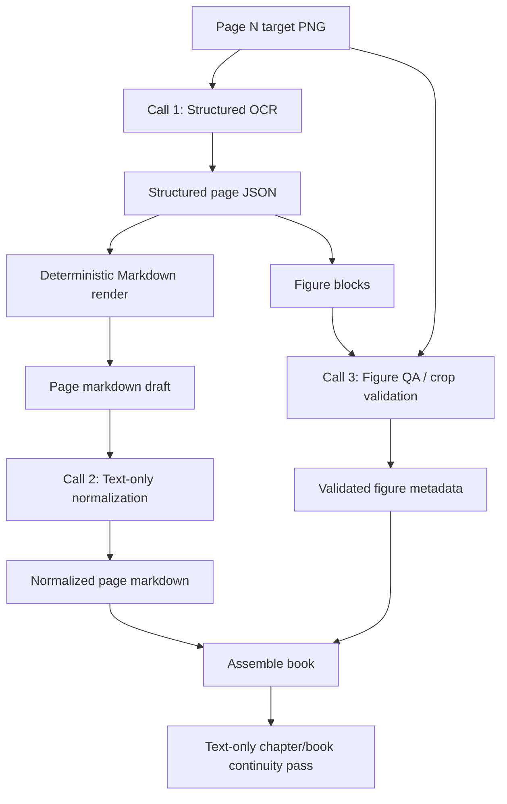
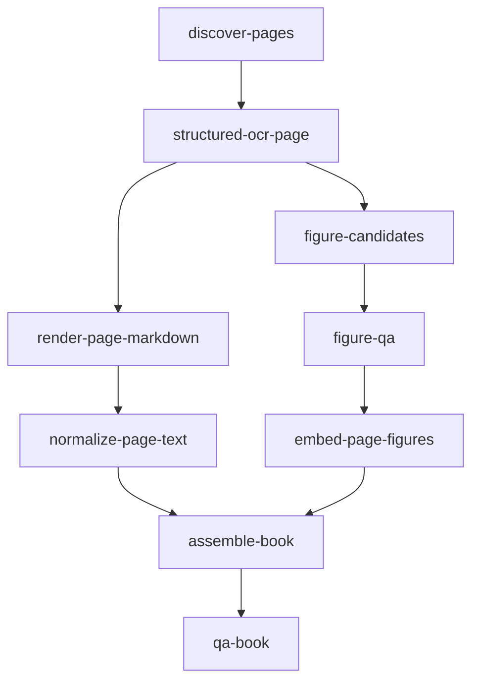

# Structured Book OCR Pipeline Redesign and Implementation Guide

## Executive Summary

The current Book OCR application can convert a full book, but the last full-book run exposed a serious quality problem: the OCR call used neighboring page PNG images as context, and the model sometimes transcribed or copied content from those neighboring images into the target page. The result was a complete 202-page artifact, but it was not a reliable final OCR artifact. It contained duplicate adjacent figure captions, false figure markers, inconsistent markdown style, and diagram contents rendered as ad-hoc ASCII/text even when a figure crop existed.

The next pipeline should separate the concerns that were previously combined into one freeform OCR prompt. The primary page OCR call should see only the target page PNG. It should return structured OCR blocks rather than final Markdown. A deterministic renderer should turn structured blocks into house-style Markdown. Follow-up calls may use Geppetto turns with growing history, but that history should be text/JSON/markdown from previous work, not neighboring page images. Figure validation should be its own target-page-image call using figure metadata, and cross-page continuity should be a later text-only pass.

The project already has the important building blocks:

- `book-ocr` now owns OCR application code.
- `scraper` provides the workflow runtime and artifact/projection infrastructure.
- Geppetto provides the canonical `turns.Turn` and block model.
- Pinocchio provides profile resolution and a durable SQLite turn store through `chatstore.SQLiteTurnStore`.
- The current quality workers already perform page-count QA, normalization, figure marker embedding, sidecars, and discovery/profile-patch output.

This guide explains the current system, what failed, what should replace it, and how an intern should implement the redesigned pipeline step by step.

## Problem Statement

The full-book run completed mechanically, but several invariants were lost.

### Observed regression

The latest full conversion artifacts live under:

```text
/home/manuel/workspaces/2026-05-20/book-ocr/2026-05-20--book-ocr/ttmp/2026/05/25/BOOK-OCR-FULL-001--convert-full-presentation-based-user-interfaces-book/experiments/001-full-book-v5-mini
```

Primary outputs:

```text
outputs/01-full-book-raw.md
outputs/quality-pass/02-normalized.md
outputs/quality-pass/03-embedded-figures.md
outputs/quality-pass/figures/
```

The run produced:

```text
raw markdown:              202 page markers
normalized markdown:       202 page markers
embedded-figures markdown: 202 page markers
embedded figure links:     75
figure crops:              75
```

However, the artifact is inconsistent. The biggest concrete symptom is that adjacent pages sometimes repeat the same figure caption and figure marker. Example duplicate captions found in the full raw OCR:

```text
[12, 13] Figure 1-1: A Rudimentary User Interface
[31, 32] Figure 2-2: PPSCalc -- Formula Display
[31, 32] Figure 2-3: PPSCalc -- Value Display
[42, 43] Figure 2-9: Presenter Parts
[59, 60] Figure 3-2: Extension with Both Planning and Immediate Changes
[60, 61] Figure 3-3: Command Data Base Extension
[87, 88] Figure 4-6: Xerox Star -- Property Sheet
[97, 98] Figure 4-12: Sample of Steamer Icons
[112, 113] Figure 5-6: Command Description Support
[115, 116] Figure 5-7: Reference Resolution
[133, 134] Figure 5-9: Result of Phrasal Presenter
[165, 166] Figure 6-15: Menu-Style Interface
```

A vision spot check confirmed one representative false extraction:

- `page_012_figure_01.png` is mostly prose, not the figure.
- `page_013_figure_01.png` is the actual Figure 1-1 diagram.

The false crop happened because page 12 mentioned Figure 1-1 in prose, while the context image for page 13 was available to the model. The model emitted a figure marker on page 12 even though the figure was not physically on page 12.

### Root cause

The current `--context-window` implementation passes neighboring page PNGs into the same OCR inference call as the target page. The current prompt says the first image is the target page and additional images are context only, but the model is still allowed to see their visual content. Vision models are not reliable at obeying a hard boundary between “target image” and “context image” when asked to produce one transcription.

The current image packaging code is in:

```text
/home/manuel/workspaces/2026-05-20/book-ocr/2026-05-20--book-ocr/internal/ocrmvp/geppetto_ocr.go
```

The relevant behavior is `multimodalImages`, which appends target image bytes first and then appends context page image bytes:

```go
images := []map[string]any{{
    "media_type": mediaTypeFromPath(input.ImagePath),
    "content":    append([]byte(nil), targetImageBytes...),
    "detail":     "high",
    "role":       "target",
    "page":       input.PageNumber,
}}
for _, ctxImage := range append(append([]PageContextImage(nil), input.ContextBefore...), input.ContextAfter...) {
    body, err := os.ReadFile(ctxImage.ImagePath)
    // ... append previous/next image bytes ...
}
```

The current prompt does include a context policy, but the policy is not sufficient:

```text
The first image is always the target page. Any additional images are previous/next context pages.
If surrounding context images are provided, use them only to maintain continuity...
Do not transcribe text that appears only on a context page.
```

The model sometimes violated this policy.

### Secondary causes

The full-book OCR also suffers from freeform Markdown generation. The current prompt asks the model to directly produce clean Markdown. That means the model decides, page by page, how to represent headings, paragraphs, lists, tables, captions, figures, and diagrams. Even with a detailed prompt, style drift is expected over 202 independent inferences.

The prompt also currently asks the model to transcribe visible diagram labels after emitting `[FIGURE: ...]`:

```text
After the marker, transcribe visible diagram labels and major relationships in readable plain text.
```

That rule made sense for provenance, but it creates a downstream artifact where the image crop and an inconsistent ASCII/text diagram transcription both appear. For final reading output, the crop should usually replace the diagram transcription; the transcription should be stored as structured metadata or debug text, not necessarily rendered inline.

## Goals

The redesigned system should provide the following properties.

- **Target-page isolation:** primary OCR for page N sees only page N's image.
- **Consistent Markdown:** the model produces structured blocks; Go code renders Markdown deterministically.
- **Durable inference history:** every OCR, normalization, figure-QA, and continuity call is persisted in a turn store for replay/debugging.
- **Safe continuity:** continuity uses previous structured OCR/markdown summaries, not neighboring images.
- **Explicit figure lifecycle:** figure detection, crop extraction, crop validation, and rendered links are separate stages.
- **Workflow resumability:** long book runs can retry failed pages and resume queued work without local SQL repairs.
- **QA before publishing:** duplicate captions, false figure crops, adjacent-page bleed, page marker counts, and style drift are automatically flagged.

## Non-Goals

This ticket does not require replacing the entire workflow runtime. `scraper/pkg/workflow` remains the orchestration mechanism. This ticket also does not require implementing a new turn database from scratch; Pinocchio already has a suitable durable turn store.

This ticket should not reintroduce OCR packages into `scraper`. OCR remains in `2026-05-20--book-ocr`.

## Current System Map

### Repositories

```text
/home/manuel/workspaces/2026-05-20/book-ocr/scraper
  Generic workflow/job runtime. Should not contain OCR application packages.

/home/manuel/workspaces/2026-05-20/book-ocr/2026-05-20--book-ocr
  Book OCR application. Owns OCR workflows, quality workers, profiles, prompts, figures, and experiments.

/home/manuel/code/wesen/go-go-golems/geppetto
  Provider-agnostic inference and turn/block model.

/home/manuel/code/wesen/go-go-golems/pinocchio
  Profile registry, CLI profile resolution, chat/turn persistence, web/chat tooling.
```

### Current Book OCR packages

```text
cmd/book-ocr/main.go
  CLI entry point. Provides run/status/pages/retry/resume/cancel/quality-pass.

internal/ocrmvp
  Current page OCR workflow. Discovers pages, calls OCR client, assembles markdown.

internal/ocrquality
  Current quality pass. QA, normalization, log import, figure embedding, discovery, report assembly.

internal/bookprofile
  Book profile/discovery/patch model.
```

Important current files:

```text
/home/manuel/workspaces/2026-05-20/book-ocr/2026-05-20--book-ocr/internal/ocrmvp/types.go
/home/manuel/workspaces/2026-05-20/book-ocr/2026-05-20--book-ocr/internal/ocrmvp/geppetto_ocr.go
/home/manuel/workspaces/2026-05-20/book-ocr/2026-05-20--book-ocr/internal/ocrmvp/prompt.go
/home/manuel/workspaces/2026-05-20/book-ocr/2026-05-20--book-ocr/internal/ocrquality/figures.go
/home/manuel/workspaces/2026-05-20/book-ocr/2026-05-20--book-ocr/cmd/book-ocr/main.go
```

### Current OCR workflow

The current page workflow is conceptually:



Each `ocr-page` step receives `PageOCRInput`:

```go
type PageOCRInput struct {
    BookID            string
    PageNumber        int
    ImagePath         string
    Profile           string
    ProfileRegistries []string
    PromptVersion     string
    ContextBefore     []PageContextImage
    ContextAfter      []PageContextImage
    DryRun            bool
}
```

The current `GeppettoOCRClient.OCRPage` resolves the Pinocchio profile, builds a Geppetto engine, creates a `turns.Turn`, appends a system block, appends a single user multimodal block containing the page prompt and images, and then calls `eng.RunInference(ctx, turn)`.

### Current quality workflow

The current quality pass is conceptually:



The figure embedding worker scans Markdown for `[FIGURE: ...]` markers, crops the corresponding page image with an ink-band heuristic, writes:

- `figures/page_NNN_figure_MM.png`
- `figures/page_NNN_figure_MM.json`
- `figures/page_NNN_figure_MM.debug.png`

Then it replaces the marker with a Markdown image link.

This worker assumes the marker belongs to the same physical page as the page marker in the Markdown. The context-image bleed broke that assumption.

## Existing Geppetto and Pinocchio APIs to Reuse

### Geppetto turns

Geppetto's conversation model is documented at:

```text
/home/manuel/code/wesen/go-go-golems/geppetto/pkg/doc/topics/08-turns.md
```

Core concepts:

```text
Run / session
  Turn / one inference cycle
    Block / atomic system, user, assistant, tool, reasoning, or multimodal content
```

Important package:

```go
import "github.com/go-go-golems/geppetto/pkg/turns"
```

Common helpers already used by Book OCR:

```go
turn := &turns.Turn{}
turns.AppendBlock(turn, turns.NewSystemTextBlock(systemPrompt))
turns.AppendBlock(turn, turns.NewUserMultimodalBlock(userPrompt, images))
updated, err := eng.RunInference(ctx, turn)
```

The redesigned pipeline should keep using `turns.Turn`, but it should create multiple smaller turns per page instead of one freeform OCR turn that performs OCR, layout normalization, figure signaling, and style decisions all at once.

### Pinocchio turn persistence

Pinocchio already has the durable turn store needed for inference replay/debugging:

```go
import chatstore "github.com/go-go-golems/pinocchio/pkg/persistence/chatstore"
```

Important files:

```text
/home/manuel/code/wesen/go-go-golems/pinocchio/pkg/persistence/chatstore/turn_store.go
/home/manuel/code/wesen/go-go-golems/pinocchio/pkg/persistence/chatstore/turn_store_sqlite.go
/home/manuel/code/wesen/go-go-golems/pinocchio/pkg/cmds/chat_persistence.go
/home/manuel/code/wesen/go-go-golems/pinocchio/pkg/cmds/cmdlayers/helpers.go
```

The store interface is:

```go
type TurnStore interface {
    Save(ctx context.Context, convID, sessionID, turnID, phase string, createdAtMs int64, payload string, opts TurnSaveOptions) error
    List(ctx context.Context, q TurnQuery) ([]TurnSnapshot, error)
    LoadLatestTurn(ctx context.Context, convID, phase string) (*TurnSnapshot, error)
    Close() error
}
```

SQLite store constructor:

```go
dsn, err := chatstore.SQLiteTurnDSNForFile(path)
store, err := chatstore.NewSQLiteTurnStore(dsn)
```

Pinocchio's CLI helpers expose the relevant flags:

```text
--turns-dsn  SQLite DSN for durable turn snapshots
--turns-db   SQLite DB file path for durable turn snapshots
```

Book OCR should add equivalent flags and store each inference turn.


## Benchmark Evidence Update: What the VLM Separation Runs Changed

After this redesign guide was first written, Book OCR gained a dedicated `vlm-separation` benchmark. The benchmark does not replace the redesign; it sharpens it. It showed that the original full-book failure should be treated as a page-boundary validation problem, not only as a prompt problem.

The benchmark tested pages that previously showed duplicated adjacent figure captions in the full-book artifact. It ran four scenarios over a 16-page risky preset:

```text
target-only
single-block-target-first
multi-block-labeled
target-plus-text-context
```

The final combined report used a main run plus two retry runs:

```text
/tmp/book-ocr-vlm-separation-live-risky-pages
/tmp/book-ocr-vlm-separation-live-risky-pages-retry-43-mbl-2
/tmp/book-ocr-vlm-separation-live-risky-pages-retry-88-text
```

The report command combined those runs into 64 logical page/scenario cells:

```text
Raw trials: 66
Logical trials: 64
Duplicate logical cells: 2
Retry replacements selected: 2
Successful logical trials: 64
Parseable logical trials: 64
Suspected bleed: 0
Forbidden hits: 0
Average target-only score: 0.992
```

The important result is not that image-context prompting is now production-safe. The important result is narrower: with the tested model, pages, scenarios, parser repair, and oracles, the benchmark did not reproduce forbidden adjacent-caption copying. That means the original failure is not an inevitable outcome of every multi-image prompt. It also means we need better validation gates, because a single full-book run can still fail even when a targeted benchmark does not reproduce the failure.

### Revised interpretation of context images

The original redesign rule was simple: never use neighboring PNGs in primary OCR. That remains the production rule. The benchmark adds a second rule:

```text
Neighboring page images may be used only in diagnostic benchmark calls or explicit QA experiments, never as the source of final page text.
```

The distinction matters. A diagnostic call can compare layouts, identify failure modes, or validate a hypothesis. It can write benchmark artifacts and warnings. It cannot write final page Markdown directly. The final page transcription must come from a target-page-only primary OCR call, followed by deterministic rendering and text-only normalization.

### Revised validation model

The benchmark also clarifies the validation model. A low OCR score can mean several different things:

| Failure class | Evidence | Pipeline reaction |
|---|---|---|
| Context bleed | Forbidden neighboring caption or phrase appears on the target page. | Block publication; require page-level review or rerun target-only. |
| Coverage miss | Expected target anchors are missing, but no forbidden content appears. | Warn; inspect OCR fidelity or oracle quality. |
| Provider/schema failure | Missing response, parse failure, or schema repair anomaly. | Retry or rescore; do not treat as OCR content evidence. |
| Figure false positive | Page references a figure but figure QA cannot find the figure on that page. | Reject figure block or convert to prose reference. |

This classification should be carried into the structured pipeline. The pipeline should not expose a single vague `quality_failed` status when it can report the specific class of failure.

### Revised acceptance criteria

The structured pipeline should now include benchmark-derived gates:

```text
1. Primary OCR input turn contains exactly one target page image.
2. Structured page JSON contains page-local blocks only.
3. Figure blocks with captions duplicated on adjacent pages require target-page figure QA.
4. Adjacent duplicate captions are warnings unless both pages visibly contain the caption/figure.
5. Forbidden-caption oracles can be generated for known risky pairs and run as deterministic QA.
6. Report artifacts must distinguish bleed, coverage miss, parse repair, and provider failure.
```

These criteria are more useful than a single instruction such as “do not copy context.” They create observable artifacts that can be tested.

## Redesign Revision: Benchmark-Informed Pipeline Shape

The benchmark suggests a clearer separation between production stages and diagnostic stages.



The production path has a strict write boundary. Only target-page-only OCR and target-page figure QA can produce page content. Diagnostic benchmarks can influence warnings, policy, and follow-up tasks, but they do not directly overwrite page text.

### New package implication

The existing benchmark code should not be folded into `internal/ocrpipeline` as a normal OCR stage. Keep it as a sibling package:

```text
internal/ocrpipeline/      production structured OCR pipeline
internal/vlmseparation/    diagnostic benchmark and reporting package
internal/ocrquality/       deterministic QA and figure embedding helpers
```

`internal/ocrpipeline` may import deterministic QA helpers, but it should not depend on live benchmark execution. The dependency direction should be:

```text
ocrpipeline -> ocrquality helpers
vlmseparation -> shared page/oracle/report helpers where useful
```

If common types emerge, move them into a small package such as:

```text
internal/ocrvalidation
```

Do not make production OCR depend on a benchmark command package just to reuse one phrase-matching helper.

### New implementation slice

The recommended next implementation PR should change slightly. Instead of starting with only renderer and turn storage, add validation types early:

```text
internal/ocrpipeline/types.go          StructuredPageOCR and OCRBlock
internal/ocrpipeline/renderer.go       deterministic Markdown renderer
internal/ocrpipeline/session.go        Pinocchio turn persistence wrapper
internal/ocrvalidation/oracle.go       expected/forbidden anchors
internal/ocrvalidation/adjacent.go     adjacent caption checks
internal/ocrvalidation/report.go       validation warning summary types
```

The first PR should still avoid live OCR. It should prove the data contracts, renderer, turn persistence, and deterministic validation gates with fixtures.

## Proposed Solution

Replace the current single-call page OCR with a chained, turn-persisted page pipeline.

### High-level pipeline



### Principle 1: target page image only in primary OCR

Primary OCR must never include neighboring PNG images. If page N needs context, provide only text context from already accepted previous results:

- rolling style summary,
- previous page structured JSON,
- previous page rendered Markdown,
- glossary/book profile terms,
- known list/table style for the current section.

Do not include:

- previous page PNG,
- next page PNG,
- full chapter page images.

### Principle 2: structured OCR before Markdown

The first call should return JSON with typed blocks:

```go
type StructuredPageOCR struct {
    BookID       string     `json:"book_id"`
    PageNumber   int        `json:"page_number"`
    PageType     string     `json:"page_type"`
    Blocks       []OCRBlock `json:"blocks"`
    Warnings     []string   `json:"warnings,omitempty"`
}

type OCRBlock struct {
    ID          string       `json:"id"`
    Type        string       `json:"type"` // heading, paragraph, list, table, figure, footnote, page_footer, blank
    Text        string       `json:"text,omitempty"`
    Level       int          `json:"level,omitempty"`
    Items       []ListItem   `json:"items,omitempty"`
    Table       *TableBlock  `json:"table,omitempty"`
    Caption     string       `json:"caption,omitempty"`
    Description string       `json:"description,omitempty"`
    DiagramText []string     `json:"diagram_text,omitempty"`
    SourceNotes []string     `json:"source_notes,omitempty"`
}
```

A figure page should produce a figure block, not an arbitrary Markdown marker plus arbitrary diagram text:

```json
{
  "id": "p013-b001",
  "type": "figure",
  "caption": "Figure 1-1: A Rudimentary User Interface",
  "description": "Diagram showing users, transducers, and an application data base.",
  "diagram_text": [
    "User",
    "Application Data Base",
    "queries",
    "observables",
    "commands"
  ]
}
```

The final reader-facing Markdown renderer can choose whether to include `diagram_text`. For most final artifacts, it should render the image link and omit the ad-hoc diagram transcription, while preserving `diagram_text` in JSON sidecars or debug output.

### Principle 3: deterministic rendering

Markdown should be rendered by Go code from structured blocks. This removes most style drift.

Example renderer pseudocode:

```go
func RenderPage(page StructuredPageOCR, figures FigureIndex) string {
    var out strings.Builder
    fmt.Fprintf(&out, "<!-- page:%03d -->\n\n", page.PageNumber)

    for _, block := range page.Blocks {
        switch block.Type {
        case "heading":
            fmt.Fprintf(&out, "%s %s\n\n", strings.Repeat("#", clampHeading(block.Level)), block.Text)
        case "paragraph":
            out.WriteString(WrapParagraph(block.Text, 88))
            out.WriteString("\n\n")
        case "list":
            out.WriteString(RenderList(block.Items))
            out.WriteString("\n")
        case "table":
            out.WriteString(RenderTable(block.Table))
            out.WriteString("\n")
        case "figure":
            if ref, ok := figures.RefFor(page.PageNumber, block.ID); ok {
                fmt.Fprintf(&out, "%s\n\n\n\n", block.Caption, block.Description, ref)
            } else {
                fmt.Fprintf(&out, "%s\n\n[FIGURE: %s]\n\n", block.Caption, block.Description)
            }
        case "blank":
            out.WriteString("[BLANK PAGE]\n\n")
        case "page_footer":
            // Usually omit from final markdown.
        }
    }

    return strings.TrimRight(out.String(), "\n") + "\n"
}
```

### Principle 4: chained calls within a page session

Use one Geppetto/Pinocchio persisted session per page pipeline. The page session contains multiple inference turns:

```text
convID:    book-ocr:report-794:run-2026-05-25-v2
sessionID: page:013
turnID:    page:013:01-structured-ocr
turnID:    page:013:02-normalize
turnID:    page:013:03-figure-qa
```

For chapter/book-wide passes, use separate sessions:

```text
sessionID: chapter:01:continuity
sessionID: book:global-continuity
```

This scoping gives enough history for page-level chained work without creating one enormous book-wide session.

### Principle 5: text-only continuity

Continuity should be applied after page OCR, using only text/JSON/Markdown:

```text
structured OCR page N
previous page rendered markdown
rolling style summary
book profile vocabulary
```

The continuity pass should not include page images. If a separate visual comparison is needed, run it as a diagnostic worker that cannot write final OCR text without a QA decision.

## Proposed Inference Chain

### Call 1: Structured OCR

Input:

- system prompt: structured OCR contract,
- target page PNG only,
- book profile vocabulary,
- page number and book ID,
- optional text-only rolling style summary.

Output:

- strict JSON `StructuredPageOCR`.

Prompt requirements:

- Transcribe only the attached target page image.
- Do not output Markdown.
- Do not infer content from prior text.
- Use block types from the schema.
- For figures, output a figure block with caption and description.
- Store diagram labels in `diagram_text`; do not render ASCII diagrams.

### Call 2: Normalization / style pass

Input:

- structured OCR JSON for page N,
- previous page accepted Markdown text,
- next page accepted Markdown only if it is already available and marked as context,
- house style rules.

Output:

- normalized structured blocks or normalized Markdown draft.

Recommended output: normalized structured blocks. If the model outputs Markdown directly, the deterministic renderer loses some control.

Purpose:

- smooth paragraph wrapping,
- normalize heading levels,
- normalize table/list style,
- preserve historical terms such as `data base`, `PSBase`, `PPSCalc`, `Dired`, `Zmacs`, `Steamer`,
- avoid moving content across page boundaries.

### Call 3: Figure QA / crop validation

Input:

- target page PNG,
- figure blocks for that page,
- deterministic crop candidate metadata from Go code.

Output:

- JSON verdict per figure block:
  - `is_actual_figure`,
  - `caption_visible`,
  - `crop_contains_figure_not_prose`,
  - `suggested_crop_rect`,
  - `warnings`.

This call may use the image because its job is explicitly visual QA on the target page. It must not transcribe prose.

### Optional Call 4: Cross-page continuity

Input:

- assembled chapter/book Markdown,
- structured page metadata,
- list of QA warnings.

Output:

- patch or structured edit suggestions, not direct overwrite.

Purpose:

- consistent heading style,
- consistent list/table style,
- detect duplicated adjacent captions,
- detect repeated page fragments,
- flag continuity problems.

This pass is text-only.

## Turn Store Design

### Use existing Pinocchio store

Book OCR should add CLI/runtime options:

```text
--turns-dsn string
--turns-db string
--turns-phase-prefix string optional, default empty
```

Use `--turns-dsn` when supplied. Otherwise derive a SQLite DSN from `--turns-db` using `chatstore.SQLiteTurnDSNForFile`.

Default location for a run:

```text
<work-dir>/turns.db
```

### Identifiers

Use stable, queryable IDs:

```go
func BookRunConvID(bookID, runID string) string {
    return fmt.Sprintf("book-ocr:%s:%s", bookID, runID)
}

func PageSessionID(page int) string {
    return fmt.Sprintf("page:%03d", page)
}

func PageTurnID(page int, index int, name string) string {
    return fmt.Sprintf("page:%03d:%02d-%s", page, index, name)
}
```

Example rows:

```text
conv_id                               session_id  turn_id                         phase
book-ocr:report-794:run-v2            page:013    page:013:01-structured-ocr      final
book-ocr:report-794:run-v2            page:013    page:013:02-normalize           final
book-ocr:report-794:run-v2            page:013    page:013:03-figure-qa           final
book-ocr:report-794:run-v2            chapter:01  chapter:01:01-continuity        final
```

### Store wrapper pseudocode

```go
type OCRTurnStore struct {
    store  chatstore.TurnStore
    convID string
}

func OpenOCRTurnStore(turnsDSN, turnsDB, workDir, convID string) (*OCRTurnStore, func(), error) {
    if strings.TrimSpace(turnsDSN) == "" && strings.TrimSpace(turnsDB) == "" {
        turnsDB = filepath.Join(workDir, "turns.db")
    }

    dsn := strings.TrimSpace(turnsDSN)
    if dsn == "" {
        var err error
        dsn, err = chatstore.SQLiteTurnDSNForFile(turnsDB)
        if err != nil {
            return nil, nil, err
        }
    }

    store, err := chatstore.NewSQLiteTurnStore(dsn)
    if err != nil {
        return nil, nil, err
    }

    return &OCRTurnStore{store: store, convID: convID}, func() { _ = store.Close() }, nil
}

func (s *OCRTurnStore) Save(ctx context.Context, sessionID, turnID, phase string, t *turns.Turn) error {
    payload, err := serde.ToYAML(t, serde.Options{})
    if err != nil {
        return err
    }

    runtimeKey := ""
    if v, ok, err := turns.KeyTurnMetaRuntime.Get(t.Metadata); err == nil && ok {
        runtimeKey = fmt.Sprint(v)
    }

    inferenceID := ""
    if v, ok, err := turns.KeyTurnMetaInferenceID.Get(t.Metadata); err == nil && ok {
        inferenceID = v
    }

    return s.store.Save(ctx, s.convID, sessionID, turnID, phase, time.Now().UnixMilli(), string(payload), chatstore.TurnSaveOptions{
        RuntimeKey:  runtimeKey,
        InferenceID: inferenceID,
    })
}
```

### Persist phases

At minimum, save:

```text
phase=input   before inference, useful for replaying exact prompt/image context
phase=final   after inference, including assistant blocks and inference metadata
phase=parse-error optional, when model output could not be parsed
phase=qa      optional, after validation/repair
```

If cost/storage matters, make phase saving configurable:

```text
--turn-save-phases input,final,parse-error
```

## Proposed Package Layout

Create new packages without immediately deleting old packages. Migrate the CLI behind new flags/subcommands first, then deprecate old paths.

```text
internal/ocrpipeline/
  types.go                structured block schemas
  renderer.go             deterministic markdown renderer
  session.go              OCRSessionManager and turn store wrapper
  structured_ocr.go       call 1: target-page-only structured OCR
  normalize.go            call 2: text-only normalization
  figure_qa.go            call 3: target-page figure QA
  continuity.go           optional text-only chapter/book continuity pass
  prompts.go              structured prompt contracts
  qa.go                   deterministic QA gates
  package.go              workflow package registration

internal/ocrmvp/
  existing package, kept temporarily for comparison and migration

internal/ocrquality/
  existing quality workers; refactor figure worker to consume structured figure metadata
```

Longer-term rename target:

```text
internal/pageocr      instead of internal/ocrmvp
internal/quality      instead of internal/ocrquality
internal/bookprofile  unchanged
```

## Data Contracts

### Structured page OCR

```go
type StructuredPageOCR struct {
    SchemaVersion string     `json:"schema_version"`
    BookID        string     `json:"book_id"`
    PageNumber    int        `json:"page_number"`
    PageType      PageType   `json:"page_type"`
    Blocks        []OCRBlock `json:"blocks"`
    Warnings      []Warning  `json:"warnings,omitempty"`
}

type PageType string

const (
    PageTypeBlank          PageType = "blank"
    PageTypeTitle          PageType = "title"
    PageTypeFrontMatter    PageType = "front_matter"
    PageTypeTOC            PageType = "table_of_contents"
    PageTypeTOF            PageType = "table_of_figures"
    PageTypeBody           PageType = "body"
    PageTypeFigure         PageType = "figure"
    PageTypeTable          PageType = "table"
    PageTypeBibliography   PageType = "bibliography"
)
```

### OCR block

```go
type OCRBlock struct {
    ID          string       `json:"id"`
    Type        BlockType    `json:"type"`
    Text        string       `json:"text,omitempty"`
    Level       int          `json:"level,omitempty"`
    Items       []ListItem   `json:"items,omitempty"`
    Table       *TableBlock  `json:"table,omitempty"`
    Caption     string       `json:"caption,omitempty"`
    Description string       `json:"description,omitempty"`
    DiagramText []string     `json:"diagram_text,omitempty"`
    Confidence  string       `json:"confidence,omitempty"`
    Warnings    []Warning    `json:"warnings,omitempty"`
}

type BlockType string

const (
    BlockHeading    BlockType = "heading"
    BlockParagraph  BlockType = "paragraph"
    BlockList       BlockType = "list"
    BlockTable      BlockType = "table"
    BlockFigure     BlockType = "figure"
    BlockFootnote   BlockType = "footnote"
    BlockPageFooter BlockType = "page_footer"
    BlockBlank      BlockType = "blank"
)
```

### Figure QA result

```go
type FigureQAResult struct {
    PageNumber int              `json:"page_number"`
    Figures    []FigureQAVerdict `json:"figures"`
    Warnings   []Warning        `json:"warnings,omitempty"`
}

type FigureQAVerdict struct {
    BlockID               string   `json:"block_id"`
    Caption               string   `json:"caption"`
    IsActualFigure         bool     `json:"is_actual_figure"`
    CaptionVisible         bool     `json:"caption_visible"`
    CropContainsFigure     bool     `json:"crop_contains_figure_not_prose"`
    SuggestedCropRect      CropRect `json:"suggested_crop_rect,omitempty"`
    RejectReason           string   `json:"reject_reason,omitempty"`
    Warnings               []string `json:"warnings,omitempty"`
}
```

## Workflow Design

### Page structured pipeline workflow



Each page should produce artifacts:

```text
pages/page_013/01-structured.json
pages/page_013/02-rendered.md
pages/page_013/03-normalized.json or .md
pages/page_013/04-figure-qa.json
pages/page_013/figures/page_013_figure_01.png
pages/page_013/figures/page_013_figure_01.json
pages/page_013/turns.db row references
```

### Workflows and queues

Use `scraper/pkg/workflow` queues to keep live model calls controlled:

```text
ocr-control       discover/assemble/QA bookkeeping
ocr-vision        structured OCR + figure QA calls
ocr-text          normalization + continuity text-only calls
ocr-assemble      markdown assembly
```

Suggested queue config:

```go
Queues: map[model.QueueKey]workflow.QueueConfig{
    "ocr-control":  {MaxWorkers: 1},
    "ocr-vision":   {MaxWorkers: 1}, // start conservative; images are expensive and bleed-prone
    "ocr-text":     {MaxWorkers: 2},
    "ocr-assemble": {MaxWorkers: 1},
}
```

## CLI Design

Add a new subcommand while keeping the current one for comparison:

```text
book-ocr structured-run \
  --book-id report-794 \
  --image-dir /path/to/pages \
  --work-dir /tmp/book-ocr-structured \
  --turns-db /tmp/book-ocr-structured/turns.db \
  --profile gpt-5-mini-low \
  --profile-registries /tmp/book-ocr-hq-001/profiles-clean.yaml \
  --start-page 1 \
  --end-page 202 \
  --max-vision-workers 1 \
  --max-text-workers 2
```

Add inspection commands:

```text
book-ocr turns list --work-dir DIR --book-id BOOK_ID --page 13
book-ocr turns show --work-dir DIR --turn-id page:013:01-structured-ocr
book-ocr qa duplicate-captions --markdown PATH
book-ocr qa context-bleed --structured-dir DIR
```

If possible, reuse Pinocchio's `chatstore.TurnStore.List` rather than writing direct SQL inspection first.

## Prompt Design

### Structured OCR system prompt

```text
You are a structured OCR engine.

You will receive exactly one target page image. Extract only content visibly present on that target page image.
Return strict JSON matching the provided schema. Do not return Markdown. Do not explain your work.

Do not copy text from prior OCR context unless it is visible on the target page. Prior context is for terminology and style only.

For figures and diagrams:
- Create a block with type "figure".
- Preserve the visible caption in "caption".
- Put a concise visual summary in "description".
- Put important internal labels in "diagram_text".
- Do not render diagrams as ASCII art.

For page footers/running page numbers:
- Use a "page_footer" block only if needed for provenance.
- The final renderer normally omits page_footer blocks.
```

### Normalization prompt

```text
You normalize structured OCR blocks for one page.

Inputs:
- current page structured OCR JSON,
- previous accepted page markdown as text-only context,
- book style rules.

Rules:
- Do not add content that is absent from the current page structured OCR.
- Do not move text across page boundaries.
- Preserve historical spelling and technical vocabulary.
- Return structured JSON in the same schema.
- Normalize block ordering, heading levels, list/table style, and paragraph wrapping hints only.
```

### Figure QA prompt

```text
You validate figure blocks against one target page image.

You will receive:
- one target page image,
- JSON figure blocks detected for that same page,
- deterministic crop candidates.

Do not OCR prose. Do not summarize the whole page.
For each figure block, decide whether the target image actually contains that figure.
Reject markers that correspond only to prose references to a figure on another page.
Return JSON verdicts only.
```

## QA Gates

The redesigned system should fail or warn before publishing if any of these checks trigger.

### Page count QA

Already present in `internal/ocrquality/qa.go`. Keep it.

Rules:

- expected pages equals observed page markers,
- no missing page numbers,
- no duplicate page markers.

### Adjacent duplicate figure captions

New check:

```go
func DetectAdjacentDuplicateFigureCaptions(pages []PageMarkdown) []Warning {
    captionPages := map[string][]int{}
    for _, page := range pages {
        for _, cap := range ExtractFigureCaptions(page.Markdown) {
            captionPages[NormalizeCaption(cap)] = append(captionPages[NormalizeCaption(cap)], page.Number)
        }
    }
    var warnings []Warning
    for caption, pages := range captionPages {
        sort.Ints(pages)
        for i := 1; i < len(pages); i++ {
            if pages[i] == pages[i-1]+1 {
                warnings = append(warnings, Warning{
                    Code: "adjacent_duplicate_figure_caption",
                    Message: fmt.Sprintf("%q appears on adjacent pages %03d and %03d", caption, pages[i-1], pages[i]),
                })
            }
        }
    }
    return warnings
}
```

### False figure crop QA

New check:

- if a figure crop has more long prose lines than diagram/ink blocks, warn,
- if the caption appears only in prose and not near a diagram, warn,
- if figure QA says `crop_contains_figure_not_prose=false`, reject the image link.

### Diagram text suppression QA

New check:

- if final embedded Markdown has `` followed by many short arrow/box/label lines, warn,
- optionally move those lines into `figure.sidecar.json` instead of rendering them.

### Similarity-to-neighbor QA

New check:

```go
func NeighborSimilarityWarnings(pages []PageMarkdown) []Warning {
    for i := 1; i < len(pages); i++ {
        sim := ShingleSimilarity(pages[i-1].Text, pages[i].Text)
        if sim > 0.35 && !IsExpectedContinuation(pages[i-1], pages[i]) {
            warn(...)
        }
    }
}
```

This detects context bleed and duplicated paragraphs.

## Implementation Plan

### Phase 1: Ticket and reference baseline

- Preserve this guide.
- Link current source files and artifacts.
- Upload to reMarkable.
- Do not change OCR behavior yet.

### Phase 2: Add turn persistence plumbing

Files to change:

```text
cmd/book-ocr/main.go
internal/ocrpipeline/session.go
internal/ocrpipeline/session_test.go
```

Work:

- Add `--turns-db` and `--turns-dsn` to new structured commands.
- Add `OCRTurnStore` wrapper around `chatstore.TurnStore`.
- Save `input` and `final` phases for fake/dry-run clients in tests.
- Ensure turn IDs include page number and phase.

Validation:

```bash
go test ./internal/ocrpipeline ./cmd/book-ocr -count=1
sqlite3 /tmp/.../turns.db '.tables'
sqlite3 /tmp/.../turns.db 'select conv_id, session_id, turn_id, phase from turn_block_membership limit 20;'
```

### Phase 3: Structured OCR types and renderer

Files:

```text
internal/ocrpipeline/types.go
internal/ocrpipeline/renderer.go
internal/ocrpipeline/renderer_test.go
```

Work:

- Define `StructuredPageOCR`, `OCRBlock`, `TableBlock`, `ListItem`, `FigureBlock` data contracts.
- Implement deterministic Markdown renderer.
- Add golden tests for title page, body page, figure page, table page, table-of-figures page, blank page.

Validation:

```bash
go test ./internal/ocrpipeline -run Renderer -count=1
```

### Phase 4: Target-page-only structured OCR client

Files:

```text
internal/ocrpipeline/structured_ocr.go
internal/ocrpipeline/prompts.go
internal/ocrpipeline/client.go
```

Work:

- Build a Geppetto turn with one target page image only.
- Resolve profile through `profilebootstrap` as today.
- Persist input/final/error turns.
- Parse strict JSON.
- Store raw response and parse errors.

Important rule:

```go
// Do not append ContextBefore/ContextAfter image bytes here.
images := []map[string]any{targetImageOnly(input.ImagePath, imageBytes)}
```

Validation:

- dry-run structured client test,
- optional live one-page test,
- verify turns DB contains page session rows.

### Phase 5: Text-only normalization

Files:

```text
internal/ocrpipeline/normalize.go
internal/ocrpipeline/prompts.go
```

Work:

- Provide previous accepted Markdown and rolling style summary as text blocks.
- Do not include images.
- Return normalized structured JSON if possible.
- Persist turns.

Validation:

- fake tests for page style consistency,
- live two-page smoke test without image context.

### Phase 6: Figure QA and crop validation

Files:

```text
internal/ocrpipeline/figure_qa.go
internal/ocrquality/figures.go
```

Work:

- Generate deterministic crop candidates.
- Call figure QA with target page PNG + figure block metadata.
- Reject false markers before embedding.
- Move diagram text to sidecar/debug metadata by default.

Validation:

- page 12/13 regression test: page 12 must not produce Figure 1-1 image link; page 13 must.
- duplicate caption fixture test.

### Phase 7: Structured workflow package

Files:

```text
internal/ocrpipeline/package.go
cmd/book-ocr/main.go
```

Work:

- Add workflow package registration.
- Add `book-ocr structured-run`.
- Emit artifacts per page and assembled final book.
- Keep current `book-ocr run` for comparison until structured pipeline is validated.

Validation:

```bash
go run ./cmd/book-ocr structured-run --dry-run ...
go test ./... -count=1
```

### Phase 8: Full-book rerun and acceptance gates

Run:

```bash
go run ./cmd/book-ocr structured-run \
  --book-id report-794-structured-v1 \
  --image-dir /home/manuel/code/wesen/claw-stuff/output/books/presentation-based-uis/pages \
  --work-dir /tmp/book-ocr-report794-structured-v1 \
  --turns-db /tmp/book-ocr-report794-structured-v1/turns.db \
  --profile gpt-5-mini-low \
  --profile-registries /tmp/book-ocr-hq-001/profiles-clean.yaml \
  --start-page 1 \
  --end-page 202 \
  --max-vision-workers 1 \
  --max-text-workers 2
```

Acceptance criteria:

- 202 page markers.
- No adjacent duplicate figure captions unless physically justified and documented.
- Page 12 does not embed Figure 1-1.
- Page 13 embeds Figure 1-1.
- No neighboring page image inputs in primary OCR turns.
- Turns DB can show input/final turns for sampled pages.
- Final Markdown style is deterministic and renderer-generated.

## API Reference Summary

### Book OCR current APIs

```go
// internal/ocrmvp/types.go
type RunInput struct {
    BookID            string
    ImageDir          string
    PageGlob          string
    StartPage         int
    EndPage           int
    Profile           string
    ProfileRegistries []string
    PromptVersion     string
    ContextWindow     int
    DryRun            bool
}

type OCRClient interface {
    OCRPage(ctx context.Context, input PageOCRInput, imageBytes []byte) (OCRTextResult, error)
}
```

### Geppetto APIs

```go
// github.com/go-go-golems/geppetto/pkg/turns
turn := &turns.Turn{}
turns.AppendBlock(turn, turns.NewSystemTextBlock(prompt))
turns.AppendBlock(turn, turns.NewUserTextBlock(text))
turns.AppendBlock(turn, turns.NewUserMultimodalBlock(text, images))

updated, err := eng.RunInference(ctx, turn)
```

### Pinocchio profile resolution

```go
parsed, err := profilebootstrap.NewCLISelectionValues(profilebootstrap.CLISelectionInput{
    Profile:           input.Profile,
    ProfileRegistries: input.ProfileRegistries,
})
resolved, err := profilebootstrap.ResolveCLIEngineSettings(ctx, parsed)
eng, err := profilebootstrap.NewEngineFromResolvedCLIEngineSettings(resolved)
```

### Pinocchio turn persistence

```go
dsn, err := chatstore.SQLiteTurnDSNForFile(path)
store, err := chatstore.NewSQLiteTurnStore(dsn)
err = store.Save(ctx, convID, sessionID, turnID, phase, time.Now().UnixMilli(), payloadYAML, chatstore.TurnSaveOptions{
    RuntimeKey:  runtimeKey,
    InferenceID: inferenceID,
})
```

## Debugging Playbook

### Inspect a stored turn DB

```bash
sqlite3 /tmp/book-ocr-report794-structured-v1/turns.db '.tables'
sqlite3 /tmp/book-ocr-report794-structured-v1/turns.db \
  "select conv_id, session_id, turn_id, runtime_key, inference_id, updated_at_ms from turns order by updated_at_ms desc limit 20;"
```

### Check whether primary OCR included context images

Inspect the `input` phase turn payload. It should contain exactly one user image block for the target page. If it contains images for neighboring pages, the run is invalid for final OCR.

### Check duplicate captions

```bash
grep -n '^Figure [0-9]-[0-9]:' final.md | sort
```

Then run the structured QA command once implemented:

```bash
book-ocr qa duplicate-captions --markdown final.md
```

### Check page 12/13 regression

Expected:

```text
page 012: prose references Figure 1-1, no image link for Figure 1-1
page 013: Figure 1-1 caption and image link
```

If page 12 embeds `page_012_figure_01.png`, the pipeline still has a false-marker problem.

## Risks and Mitigations

### Risk: Structured JSON reduces OCR fidelity

Mitigation: store raw response, structured JSON, rendered Markdown, and original image. Golden tests should check that paragraphs, footnotes, captions, and tables survive rendering.

### Risk: More calls increase cost and runtime

Mitigation: make normalization and figure QA configurable. Start with structured OCR + deterministic renderer as mandatory. Add figure QA only for pages with figure blocks. Add continuity only per chapter or when QA flags issues.

### Risk: Turn DB grows large

Mitigation: store target image references in block metadata rather than embedding duplicate image bytes where possible. If provider request requires bytes, keep a phase policy: `input,final,error` for development; `final,error` for production.

### Risk: Provider structured output support varies

Mitigation: initially ask for JSON and parse strictly. If provider-native JSON schema support is wired through Geppetto, enable it with the typed structured-output key. Always validate with Go schema parsing.

### Risk: Workflow resume still has edge cases

Mitigation: add first-class operator support for requeueing canceled downstream ops after dependency repair. The full-book run required a local SQL repair for `assemble-markdown`; that should not be repeated manually.

## Open Questions

- Should final reader-facing Markdown omit `diagram_text` entirely, or include it under collapsible/debug sections?
- Should normalization return structured JSON or Markdown? Structured JSON is preferred, but Markdown is faster to prototype.
- Should `turns-db` default to `<work-dir>/turns.db` for all runs, or only when explicitly requested?
- Should the old `ocrmvp` package be renamed before or after the structured pipeline is implemented?
- Should figure QA be VLM-backed for every figure, or only for suspicious crops?

## Recommended First PR

The first implementation PR should be small and testable, but it should now include deterministic validation types in addition to rendering and turn persistence:

1. Add `internal/ocrpipeline/types.go` with `StructuredPageOCR`, `OCRBlock`, warnings, and figure block contracts.
2. Add `internal/ocrpipeline/renderer.go` with deterministic Markdown rendering.
3. Add golden renderer tests for body, figure, table, blank, and table-of-figures pages.
4. Add `internal/ocrpipeline/session.go` wrapping `chatstore.TurnStore`.
5. Add tests proving `input` and `final` turns are saved under the desired conv/session/turn IDs.
6. Add `internal/ocrvalidation` with deterministic adjacent-caption and expected/forbidden-anchor checks.
7. Add fixtures for the Report 794 page 12/13 and 115/116 regressions:
   - page 12 may reference Figure 1-1 in prose but must not produce a Figure 1-1 figure block;
   - page 13 may produce the Figure 1-1 figure block;
   - page 116 may reference Figure 5-7 in prose but must not produce a Figure 5-7 figure block.

Do not start with live OCR. The first PR should establish deterministic contracts, persistence, rendering, and validation gates. A live structured OCR client should come only after those tests exist.

## File Reference Index

Current Book OCR code:

```text
/home/manuel/workspaces/2026-05-20/book-ocr/2026-05-20--book-ocr/cmd/book-ocr/main.go
/home/manuel/workspaces/2026-05-20/book-ocr/2026-05-20--book-ocr/internal/ocrmvp/types.go
/home/manuel/workspaces/2026-05-20/book-ocr/2026-05-20--book-ocr/internal/ocrmvp/geppetto_ocr.go
/home/manuel/workspaces/2026-05-20/book-ocr/2026-05-20--book-ocr/internal/ocrmvp/prompt.go
/home/manuel/workspaces/2026-05-20/book-ocr/2026-05-20--book-ocr/internal/ocrquality/figures.go
/home/manuel/workspaces/2026-05-20/book-ocr/2026-05-20--book-ocr/internal/ocrquality/qa.go
/home/manuel/workspaces/2026-05-20/book-ocr/2026-05-20--book-ocr/internal/bookprofile/profile.go
```

Workflow/runtime code:

```text
/home/manuel/workspaces/2026-05-20/book-ocr/scraper/pkg/workflow
/home/manuel/workspaces/2026-05-20/book-ocr/scraper/pkg/services/engineview/workflow_mutation_service.go
```

Geppetto and Pinocchio references:

```text
/home/manuel/code/wesen/go-go-golems/geppetto/pkg/doc/topics/08-turns.md
/home/manuel/code/wesen/go-go-golems/geppetto/pkg/turns
/home/manuel/code/wesen/go-go-golems/pinocchio/pkg/persistence/chatstore/turn_store.go
/home/manuel/code/wesen/go-go-golems/pinocchio/pkg/persistence/chatstore/turn_store_sqlite.go
/home/manuel/code/wesen/go-go-golems/pinocchio/pkg/cmds/chat_persistence.go
/home/manuel/code/wesen/go-go-golems/pinocchio/pkg/cmds/cmdlayers/helpers.go
```

Problem artifacts:

```text
/home/manuel/workspaces/2026-05-20/book-ocr/2026-05-20--book-ocr/ttmp/2026/05/25/BOOK-OCR-FULL-001--convert-full-presentation-based-user-interfaces-book/experiments/001-full-book-v5-mini/outputs/01-full-book-raw.md
/home/manuel/workspaces/2026-05-20/book-ocr/2026-05-20--book-ocr/ttmp/2026/05/25/BOOK-OCR-FULL-001--convert-full-presentation-based-user-interfaces-book/experiments/001-full-book-v5-mini/outputs/quality-pass/03-embedded-figures.md
```
