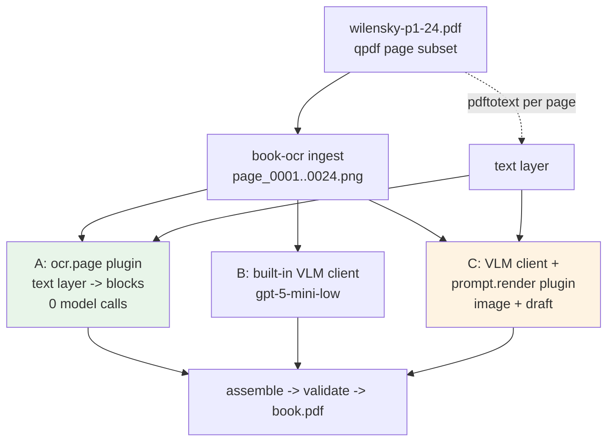

# Wilensky pilot analysis, text-layer plugin design, and implementation guide

## Executive Summary

This ticket ran the first genuinely different book through book-ocr: Robert Wilensky's *Planning and Understanding* (1983), as a 200-page Internet Archive digitization whose PDF carries a hidden OCR text layer. The pilot did three things at once. It validated the productization claim that a new book needs no Go changes; it exercised the plugin seams built earlier the same day with a real, useful plugin rather than a test fixture; and it evaluated a strategy unavailable to the May pipeline — leveraging an existing text layer instead of paying a vision model to re-read pages it can already read.

Three strategies processed the first 24 pages end to end, each completing 24/24 pages with zero validation warnings and a rendered PDF:

| Variant | Strategy | Model calls | Mechanism |
|---|---|---|---|
| A `textlayer` | PDF text layer only | **0** | `ocr.page` plugin: pdftotext → deterministic cleanup → structured blocks |
| B `vlm` | pure vision model | 24 (gpt-5-mini-low) | the May approach, unchanged |
| C `hybrid` | draft correction | 24 (gpt-5-mini-low) | `prompt.render` plugin embeds the cleaned text layer as a draft the model corrects against the image |

The headline result: **on prose pages, the free text-layer variant is byte-for-byte competitive with the vision model** (pages 17–19 and 23 differ by under 2% in rendered size, with matching content), while the text layer loses on *structure* (it over-detects headings and cannot see tables or figures). The hybrid variant surfaced the most valuable defect of the day: a `prompt.render` plugin replaces the built-in prompt's detailed block contract, the host appends only a compact contract that names block types but not field shapes, and the model promptly invented a `"lines": [...]` field the tolerant decoder does not accept — producing empty headings that no validation caught. Five findings (W1–W5) close the report, each with a concrete fix.

## Problem Statement and Scope

Three questions, in priority order:

1. Does the profile-plus-plugins architecture actually absorb a new book with zero code changes? (Yes — the only repository change this pilot motivated is follow-up work on gaps it exposed; the pilot itself lives entirely in this ticket's `scripts/`.)
2. Is an embedded PDF text layer worth leveraging, and through which seam? (Yes, decisively, through `ocr.page` for prose-dominant books; the hybrid `prompt.render` route needs a host fix first.)
3. What breaks first when real-world scan data hits the pipeline? (Markdown-unsafe characters in plugin output, and schema drift when plugins own the prompt.)

Scope: the first 24 PDF pages (cover through the start of chapter 1), three strategies, and the analysis. Out of scope: the remaining 176 pages (the run script takes a page range), figure-bearing chapters, and the host-side fixes themselves, which are specified here but belong in the main productization ticket.

## Part I — The Source Document, Analyzed

### Provenance and structure

The PDF is an Internet Archive digitization ("Digitized by the Internet Archive", producer "LuraDocument PDF v2.53", 2012) of the 1983 Addison-Wesley book. It has 200 pages at 412×635 points. Each page is a scanned image with an invisible OCR text overlay in a single non-embedded Courier font — the standard IA output shape: the *image* is the page; the *text layer* is machine-generated OCR aligned under it, extractable with `pdftotext`.

### Text-layer quality

Sampling establishes both the value and the defect classes:

- **Prose pages are nearly clean.** Page 18 (preface) extracts as complete, correctly-ordered sentences with proper paragraph breaks. This is the asset the pilot exploits.
- **Recognition defects exist and have signatures.** The scan's OCR emits a literal backslash for an unrecognized letter v (`reser\ed` for "reserved") — two instances in 24 pages. Stray punctuation-only lines (`- . ,`) appear where the scanner picked up noise. Running headers (`PLANNING AND UNDERSTANDING`, chapter titles) and folio numbers are interleaved with content.
- **All layout structure is absent.** The text layer has no notion of headings versus body, no table geometry, and nothing for figures. Line flow occasionally breaks mid-sentence (`for a number` / `of reasons` split across extraction lines on page 45).

The strategic conclusion follows directly: the text layer is a high-quality *transcription draft* and a zero-cost *prose source*, but structure must come from somewhere else — heuristics (variant A), a vision model (variant B), or both (variant C).

## Part II — What an Intern Needs of the Host System

The pilot uses book-ocr as a black box with three extension surfaces; the deep documentation lives in the companion tickets (BOOK-OCR-PRODUCT-001 design docs 01 and 02). The short form:

- **The structured pipeline.** `book-ocr structured-run` executes a durable workflow: discover pages → one OCR step per page (parallel, retried) → assemble → validate, persisting every intermediate artifact under `pages/page_NNN/01…06` and all state in `engine.db`. The OCR step's contract: exactly one target page image goes in; `structured-ocr/v1` JSON (typed blocks: heading, paragraph, list, table, code, figure, footnote, page_footer, blank) comes out; Go renders Markdown deterministically.
- **Plugin seams.** External processes speaking NDJSON over stdio (devctl plugin protocol v2) can take over strategies at named seams. This pilot uses two: `ocr.page` (replace page OCR entirely — the host still parses, repairs, gates the page number, renders, and writes artifacts) and `prompt.render` (replace the prompt the built-in vision client sends — the host appends a non-negotiable contract naming the schema version, required root fields, valid block types, and page identity). Bindings come from `--plugin seam=path` flags or a book profile's `plugins:` section.
- **Onboarding commands.** `book-ocr ingest` rasterizes a PDF to `page_NNNN.png` at 300 dpi; `report` summarizes a run from its projection and turn store. Both were used here as-is.

Key API anchors for this pilot: `internal/plugin/ops.go` (op schemas `ocr.page/v1`, `prompt.render/v1`), `internal/ocrpipeline/prompts.go` (`StructuredOCRSchemaContract` — the appended contract at the center of finding W3), `internal/ocrpipeline/structured_ocr.go` (`ParseStructuredOCRResponse` and the tolerant `OCRBlock` decoder relevant to W3's fix), and `cmd/book-ocr/main.go` (`ParseSeamBinding`, relevant to W5).

## Part III — Pilot Design

### The three strategies



**Variant A** answers: how far does the free source get us? The plugin implements `ocr.page`: extract the page's text layer, apply deterministic cleanup, and emit blocks. It never touches a model, so its marginal cost per book is zero and it runs at pdftotext speed.

**Variant B** is the control: the unmodified May pipeline on a book it was never tuned for, with a generic policy (no profile lexicon, no Lisp assumptions — the run uses the built-in defaults, which for this front-matter range produce no book-specific artifacts).

**Variant C** tests the hypothesis that the model does better *correcting* than *transcribing*: the plugin implements `prompt.render`, embedding the cleaned text layer in the user prompt as an explicitly untrusted draft, with the page image remaining the source of truth. Cost equals variant B (same model calls); the bet is on accuracy and on preserved structure.

All three respect the pipeline's invariants by construction. Variant A supplies structured JSON like any client; the host's page-number gate, repair pass, renderer, and artifact writes run unchanged. Variant C changes only prompt *text* — the single-image rule is untouched because the draft is text, not a neighboring image, and the May context-bleed findings concerned images specifically.

### The plugin, in detail

One Python file (`scripts/textlayer_plugin.py`, ~170 lines) serves both seams, parameterized by `--pdf`. Its cleanup pipeline is the substance:

```text
extract_page_text(n):   pdftotext -f n -l n -layout <pdf> -

clean_lines(raw):
    replace "\" with "v"        # IA OCR emits \ for unrecognized 'v' (W2);
                                # also a pandoc-safety sanitizer
    drop lines matching ^[\W\d]*$   # scanner noise ("- . ,") and bare folios

to_blocks(raw, page):           # ocr.page mode
    paragraphs split on blank lines
    de-hyphenate "word- word" joins across line breaks
    short (<70 chars) ALL-CAPS or numbered lines -> heading blocks
    everything else -> paragraph blocks

draft_text(raw):                # prompt.render mode
    cleaned lines joined verbatim; no structural guessing —
    structure is the model's job in this mode
```

The `prompt.render` output frames the draft with explicit trust instructions: the draft "is usually accurate for prose but may contain recognition errors … and contains no layout structure. Use the page IMAGE as the source of truth." The host appends its schema contract after this text.

Error handling follows the protocol: any Python exception becomes a clean `E_RUNTIME` response with `retryable: false` in the details, which the host's retry-hint classification turns into a permanent step failure rather than three pointless retries.

One operational note (finding W5): the `--plugin seam=path` CLI flag carries no plugin arguments — argument support exists only in profile `plugins:` entries (`args:`). The run script therefore generates a two-line wrapper that bakes in `--pdf`.

## Part IV — Results

### Completion and cost

All three variants: 24/24 pages succeeded, zero validation warnings, `assembled.md` and `book.pdf` produced. Variant A used zero model calls; B and C each persisted 24 turns (one per page) against `gpt-5-mini-low`.

### Aggregate comparison

| Variant | assembled.md bytes | headings | blank pages |
|---|---|---|---|
| textlayer | 24,251 | 102 | 7 |
| vlm | 22,929 | 30 | 7 |
| hybrid | 19,944 | 33 | 12 |

### Per-page rendered bytes (selected)

| Page | Content | textlayer | vlm | hybrid |
|---|---|---|---|---|
| 002 | title page | 1,783 | 1,790 | **30** |
| 010 | copyright | 943 | 938 | **393** |
| 014 | contents | 1,915 | 1,295 | 1,323 |
| 017–019 | preface prose | 2,238 / 3,067 / 2,903 | 2,239 / 3,060 / 2,897 | 2,238 / 3,059 / 2,921 |
| 023–024 | chapter 1 body | 2,108 / 3,005 | 2,116 / 2,692 | 2,095 / 2,655 |

Two patterns carry the analysis. On **prose pages, all three variants converge to within a few bytes** — the same paragraphs, the same content, independent of whether a model was involved. On **structured pages, the variants diverge**: the text layer over-produces headings (102 versus ~30 — its ALL-CAPS heuristic fires on table-of-contents rows and title-page lines), and the hybrid *collapses* on exactly the pages where the draft is least prose-like (title page rendered as three empty headings, copyright page truncated).

### The hybrid failure, diagnosed

The hybrid's page 2 raw response contains heading blocks of the form `{"type": "heading", "lines": ["PLANNING AND", "UNDERSTANDING"]}` — a field name (`lines`) that does not exist in the schema. The tolerant decoder ignores unknown fields, so the blocks parsed as headings with empty text and rendered as bare `#` lines; per-page validation has no "empty heading" rule, so the defect reached the assembled book silently.

The causal chain matters more than the instance. The built-in prompt teaches field shapes by exhaustive instruction and a worked example. A `prompt.render` plugin replaces all of that, and the host's appended `StructuredOCRSchemaContract` (`prompts.go`) names the valid block *types* but not their *fields*. A model given structure-free draft text plus a thin contract improvised a plausible shape. Nothing in the chain — decoder, page validation, run validation — pushed back.

## Part V — Findings and Fixes

**W1 — The text layer is a competitive free strategy for prose.** For prose-dominant scanned books with IA-quality text layers, `ocr.page=textlayer` produces model-equivalent body text at zero cost. Fix/action: none needed; promote the plugin from ticket script to `examples/plugins/` and document the strategy. The economic implication for any metered product is direct: a text-layer pass costs nothing and can drive a "pay only for pages that need vision" routing via `page.classify` (route pages whose text-layer block count or character count is anomalous to the VLM strategy).

**W2 — Plugin text can break the PDF render.** The first variant-A run failed at the Pandoc step: the text layer's literal backslash (`reser\ed`) reached `assembled.md` and XeLaTeX read it as a control sequence. The plugin now sanitizes (backslash → v, which is also the correct character for this scan's OCR), but the host defect stands: **the deterministic renderer does not escape Markdown/LaTeX-active characters in block text**, so any client — plugin or model — can emit text that kills the PDF step two stages later. Fix: escape or neutralize backslashes (and audit `#`, `|`, backtick handling) in `renderer.go`'s paragraph/heading paths, with golden fixtures for each; classify `structured_pdf_render_failed` as permanent rather than retryable (it retried once, pointlessly, before failing the run).

**W3 — The host contract is too thin for prompt.render experiments.** Specified fix, two halves. (a) Extend `StructuredOCRSchemaContract` to include field shapes per block type — one line each (`heading: {text, level}`, `table: {table: {headers, rows}}`, …) and one worked example block; this keeps the guarantee "a prompt experiment cannot break the schema" honest. (b) Teach the tolerant `OCRBlock` decoder to accept a `lines: []string` alias for `text` (joined with newlines), matching the existing tolerances for `diagram_text` and bare-string list items — the decoder's job is precisely to absorb plausible model improvisations. Add an "empty heading/paragraph text" warning to `ValidateStructuredPage` so silent variants of this class surface in `06-validation.json`.

**W4 — Heading heuristics belong in the profile.** Variant A's 102 headings come from its ALL-CAPS-line rule firing on contents rows. The cleanup heuristics (heading patterns, noise patterns, header/folio suppression) are exactly the kind of per-book policy the profile system was built for; a `wilensky.profile.yaml` should carry them as plugin `args:`/`env:`, and the plugin should read them rather than hard-coding regexes. This is also the honest framing of variant A's limits: it is a *prose* strategy; contents/table/figure pages should route elsewhere (see W1's classify note).

**W5 — CLI plugin bindings cannot carry arguments.** `--plugin seam=path` parses only a path (`ParseSeamBinding`, `cmd/book-ocr/main.go`); profile bindings support `args:` but ad-hoc experimentation shouldn't require a wrapper script. Fix: accept `--plugin 'seam=path arg1 arg2'` by splitting the value shell-style, or (simpler) document the wrapper pattern and treat profiles as the real interface — decide in the main ticket.

## Part VI — Reproduction Guide

```bash
# 1. Subset the source (once):
qpdf "<full wilensky pdf>" --pages . 1-24 -- /tmp/wilensky-pilot/wilensky-p1-24.pdf

# 2. Run any or all variants (A is free; B and C call gpt-5-mini-low 24x each):
ttmp/2026/07/03/BOOK-OCR-WILENSKY-PILOT-001*/scripts/01-run-pilot.sh A
ttmp/2026/07/03/BOOK-OCR-WILENSKY-PILOT-001*/scripts/01-run-pilot.sh all

# 3. Compare:
ttmp/2026/07/03/BOOK-OCR-WILENSKY-PILOT-001*/scripts/02-compare-variants.sh

# Outputs per variant: /tmp/wilensky-pilot/run-<name>/{assembled.md, book.pdf,
#   validation-report.json, pages/page_NNN/01..06, engine.db, turns.db}
```

Extending to the full book is a page-range change in the script (`--pages . 1-200` for the subset, `--end-page 200` for the run) plus attention to chapters with figures, which this range barely samples.

## Decision Records

### Decision: Leverage the text layer through ocr.page and prompt.render, not response.parse

- **Context:** The text layer could plausibly enter at three seams: as a full OCR strategy (`ocr.page`), as prompt context (`prompt.render`), or as a parsing aid (`response.parse`).
- **Options considered:** All three; `response.parse` was rejected early.
- **Decision:** Implement `ocr.page` (variant A) and `prompt.render` (variant C) in one plugin.
- **Rationale:** `response.parse` operates on the model's raw output, where the text layer offers nothing — the layer is an alternative *source*, not an alternative *decoder*. `ocr.page` isolates the layer's standalone value; `prompt.render` tests its value as model context. Running both against the same pages with the pure-VLM control gives a three-way comparison from one plugin file.
- **Consequences:** The pilot doubles as the first real exercise of two seams built the same day; the hybrid's failure (W3) was only discoverable because `prompt.render` was actually tried.
- **Status:** accepted

### Decision: Sanitize the backslash in the plugin now, specify the host fix separately

- **Context:** The backslash defect (W2) could be fixed in the plugin (scoped to this scan) or in the renderer (systemic), and the pilot needed to complete.
- **Options considered:** Plugin-only; host-only; both.
- **Decision:** Plugin repair immediately (backslash → v, which is the correct character for this scan's OCR signature); host-side escaping specified as a finding for the main ticket rather than patched ad hoc mid-pilot.
- **Rationale:** The plugin fix is also a *correction* (it restores the right letter), so it belongs in the text-layer cleanup regardless. The renderer change deserves golden fixtures and its own review, not a hurried patch inside a pilot.
- **Consequences:** The pipeline remains one hostile character away from a failed PDF until W2's host fix lands; tracked in BOOK-OCR-PRODUCT-001.
- **Status:** accepted

## Risks and Open Questions

- The 24-page range is front-matter-heavy: one contents sequence, no tables, no figures, no code. The structure-handling comparison (where variant B should dominate) is undersampled; chapter ranges with story diagrams (the book has them) are the necessary next sample.
- Variant C's verdict is provisional: it failed on schema drift (W3), not on the draft-correction idea itself. Re-running C after the contract fix is required before concluding anything about hybrid accuracy.
- pdftotext page numbering assumes the ingested subset maps 1:1 to text-layer pages; books where ingest skips or reorders pages need the plugin to consult the ingest manifest instead.
- Cost accounting remains count-based (24 turns), not token-based — the known gap from the credits analysis; this pilot would have been the first consumer of per-page token numbers.

## References

- Source: `~/Downloads/Planning and understanding … (Wilensky, Robert …).pdf` (200 pages, IA/LuraDocument 2012); subset at `/tmp/wilensky-pilot/wilensky-p1-24.pdf` (sha256 in `/tmp/wilensky-pilot/pages/ingest-manifest.json`).
- This ticket: `scripts/textlayer_plugin.py` (the plugin), `scripts/01-run-pilot.sh` (three-variant runner), `scripts/02-compare-variants.sh` (comparison), `reference/01-pilot-diary.md`.
- Host anchors: `internal/plugin/ops.go` (op schemas), `internal/ocrpipeline/prompts.go` (`StructuredOCRSchemaContract`, W3a), `internal/ocrpipeline/types.go` (tolerant `OCRBlock` decoder, W3b), `internal/ocrpipeline/renderer.go` (escaping gap, W2), `cmd/book-ocr/main.go` (`ParseSeamBinding`, W5).
- Companion documents: BOOK-OCR-PRODUCT-001 design docs 01 (productization) and 02 (plugin seams); WORKFLOW-RUNTIME-HARDENING-001 (runtime items).
- Run artifacts: `/tmp/wilensky-pilot/run-{textlayer,vlm,hybrid}/`.
