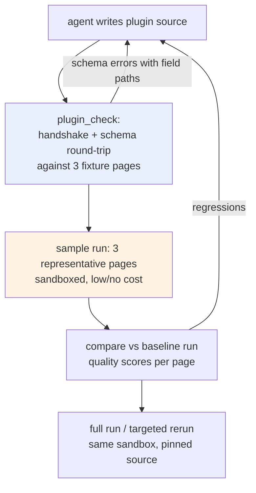

# User-facing hardening and the agent-first product design

## Executive Summary

The Wilensky pilot was operated end to end by an LLM agent driving the CLI — which makes it a field study of exactly the product mode this document designs for. Every friction the operator hit is a friction any driver, human or agent, will hit: errors surfaced as raw workflow log lines with the actual cause buried two layers down; a deterministic PDF failure was retried; a quality defect (empty headings from schema drift) shipped with *zero validation warnings*; binding a plugin with arguments required hand-writing a wrapper script; comparing two runs required hand-writing a comparison harness; and every command's output was prose meant for eyes, not structure meant for programs.

The report is in two parts. **Part I** turns each observed friction into a user-facing fix, ordered by how badly the pilot was bitten: honest quality signals (a free text-layer cross-check would have caught the silent failure), actionable errors, workspace-centric defaults, a first-class `compare` command, and progress/cost reporting. **Part II** designs the agent-first mode: a machine-readable surface (JSON output mode graduating to an MCP toolset), a per-run manifest that gives a driver one entry point into all artifacts, machine-readable op schemas with hard boundary validation, and — the centerpiece — a loop where the LLM driver *writes its own plugins* which the product executes under a sandbox with pinned provenance. The plugin protocol chosen earlier (NDJSON over stdio, process-isolated, language-agnostic, capability handshake) turns out to be almost exactly the right substrate for executing untrusted agent code; what is missing is the sandbox, the schema discoverability, and the fast feedback harness.

## Part I — User-Facing Hardening, From Observed Frictions

Each item names the pilot moment that motivates it. The ordering is by severity of the observed failure, not by implementation cost.

### 1. Quality signals must be trustworthy (the silent W3 failure)

The hybrid run reported `warning_count: 0` while its title page rendered as three empty headings. A user reading the validation report would have shipped a broken book. Three fixes, in increasing power:

- **Content sanity warnings.** `ValidateStructuredPage` gains rules for empty heading/paragraph text, pages whose block count collapsed relative to the raw response size, and headings with no body between them. These are cheap and catch the drift class the pilot hit.
- **The text layer as a free validation oracle.** For any PDF-sourced book, the embedded text layer provides an independent transcription of every page. A validator that computes word-overlap between the rendered page and `pdftotext` output flags exactly the pages where OCR diverged from a known-good draft — the hybrid's page 2 (30 rendered bytes versus a 1,700-byte text layer) would have scored near zero. This inverts the pilot's plugin: the same extraction that served as an OCR *strategy* serves as a *cross-check* on every other strategy, at zero model cost. It slots into the existing `validate.page` seam or ships built-in for ingested PDFs.
- **Score, don't just warn.** The report and projection should carry a per-page confidence signal (overlap ratio, block-count sanity, warning count) so "review these five pages first" is a query, not a manual audit.

### 2. Errors must state cause and remedy (the Pandoc failure)

The first variant-A failure surfaced as a zerolog line — `error_code=structured_pdf_render_failed retryable=true` — while the actual cause (`! Undefined control sequence. l.161 All rights reser\ed`) was only recoverable by re-running pandoc by hand. Worse, the step retried once: render failures are deterministic, and the retry burned time to reach the same failure. Fixes:

- Error objects, not log lines: every terminal failure carries the failing artifact path, the underlying tool's first error line, and a remediation hint ("a character in assembled.md is LaTeX-active; see pages listed in …"). The workflow error type already has `Details`; the CLI and report must surface them.
- `structured_pdf_render_failed` becomes Permanent (one-line change, already noted in finding W2).
- The renderer escapes LaTeX/Markdown-active characters in text blocks so this failure class disappears for well-formed structured JSON entirely (W2's host fix).

### 3. The workspace is the unit, not the flag pile

The pilot's run command carried nine flags, and its artifacts landed in `/tmp` paths the operator had to remember. `init` already creates a workspace with a drafted profile; the missing halves are:

- `structured-run` (and `report`, `rerun`) default their flags from the workspace: profile path, image dir, work dir, expected pages all discoverable from `<workspace>/<book>.profile.yaml` and the ingest manifest. The command line for the second run of a book should be `book-ocr run` from inside the workspace.
- The profile carries run defaults (`max_workers`, `render_pdf`, `embed_figures`) so a book's operational shape travels with it — the same argument that moved prompt policy into the profile.

### 4. `compare` is a product command (the hand-written harness)

Evaluating strategies required writing `02-compare-variants.sh` by hand: aggregate byte counts, structural counts, per-page byte tables. Every experimentation loop — which is the product's core loop — needs this. `book-ocr compare <work-dir-a> <work-dir-b>` should emit the same table plus per-page diffs of `05-rendered.md`, flagged by the quality signals from item 1. With JSON output (Part II) this becomes the agent's evaluation function.

### 5. Progress and cost that mean something

The run prints `status=running processed=1 succeeded=0 failed=0` on a poll loop — no page identity, no rate, no spend. The projection already has per-page status; the loop should render "18/24 pages, 2 running (p019, p022), 0 failed, ~40s remaining" and, once token usage lands in the ledger (the credits-analysis prerequisite), a running cost figure. This is the same data the review UI needs; building the text version first de-risks it.

### 6. Plugin ergonomics (the wrapper script)

`--plugin ocr.page=path` cannot carry arguments (finding W5); the pilot generated a two-line wrapper. Accept shell-style words in the binding value (`--plugin 'ocr.page=./textlayer.py --pdf book.pdf'`) and keep profiles as the durable form. Additionally, `ingest` should accept a page range (`--first/--last`) so pilots do not need a qpdf pre-step.

## Part II — The Agent-First Product

### The framing, from evidence

This pilot was already agent-operated: an LLM read the PDF's metadata, chose strategies, wrote the plugin, ran the pipeline, diagnosed failures from raw artifacts, and wrote the comparison harness. Everything that slowed that loop down is the agent-first backlog. The design goal is not to add an "AI feature" to the product; it is to make the product legible and safe for a driver that reads structure, acts on errors, and can write code.

An agent driver changes three assumptions:

1. **Output is parsed, not read.** Prose tables and log lines force the driver to re-derive structure. Every command needs a JSON mode with a stable schema.
2. **Errors are handled, not reported upward.** A driver retries, repairs, or reroutes based on the error object. Cause-and-remedy errors (Part I item 2) stop being polish and become the control-flow substrate.
3. **The driver can create executors.** The plugin seams stop being an expert feature and become the primary extension surface — including plugins the driver writes for a specific book, mid-run.

### The surface: JSON mode first, MCP toolset second

- **Phase 1: `--output json` on every command.** `run` emits progress events as JSON lines and a terminal result object; `report`, `pages`, `compare`, `status` emit documents. Exit codes become meaningful (0 success, distinct codes for input errors versus run failures versus infrastructure). This is cheap because the underlying data is already structured (projections, results, manifests) — the CLI currently *destructures* it into prose.
- **Phase 2: an MCP server wrapping the same operations** — `ingest`, `init`, `run`, `status`, `pages`, `artifact_get`, `rerun_pages`, `compare`, `plugin_check`, `plugin_bind` — so any agent runtime can drive the product without shell plumbing. The MCP layer must stay a thin wrapper over the JSON CLI: one implementation of each operation, two transports.
- **The driver guide ships as a document, not code.** Agents are configured with instructions; the product should publish a canonical "driver guide" (the operational playbook: the run loop, the artifact map, the repair loop, the plugin loop) exactly as it publishes a README for humans. The pilot's design docs are the first draft of this guide.

### The run manifest: one entry point per run

A driver currently learns a run's shape by listing directories. Every run should write `manifest.json` at its root:

```jsonc
{
  "manifest_version": "run-manifest/v1",
  "book_id": "wilensky-hybrid",
  "run_id": "book-ocr/structured-…",
  "status": "succeeded",
  "policy": { "profile": "…", "plugins": [{ "id": "textlayer", "seams": ["prompt.render"],
               "source_sha256": "…" }] },
  "pages": [ { "n": 2, "status": "succeeded", "rendered_bytes": 30,
               "quality": { "textlayer_overlap": 0.02, "warnings": 1 },
               "artifacts": { "structured": "pages/page_002/04-structured.json", "…": "…" } } ],
  "outputs": { "assembled": "assembled.md", "pdf": "book.pdf",
               "validation": "validation-report.json" },
  "usage": { "model_calls": 24, "tokens": null }
}
```

The manifest is derived (projection + results), so it can be regenerated; but writing it at assemble time means a driver needs exactly one read to plan its next action — including spotting page 2's 0.02 overlap score without opening anything else.

### Agent-written plugins: the loop

The pilot's plugin took four iterations to get right (argument passing, the backslash, heading heuristics, and the hybrid contract drift). An agent authoring a plugin needs that loop to be fast, cheap, and safe:



- **`plugin_check`** (new command/tool): spawn the plugin, validate the handshake against the claimed seams, then round-trip each claimed op against fixture inputs and validate the outputs against the op's JSON Schema — reporting violations with field paths (`blocks[0].lines: unknown field; did you mean text?`). This is the W3 lesson institutionalized: agents improvise field shapes exactly like models do, so the boundary must validate hard and answer with repairable errors. The check needs no book and no credits; it is the agent's compiler.
- **Machine-readable op schemas.** `book-ocr plugins schema ocr.page` emits the JSON Schema for `ocr.page/v1` (and the others). The same schemas drive `plugin_check`, the fattened prompt contract (W3a), and the driver guide. One source of truth, three consumers.
- **Sample-first execution.** A new plugin binding runs against a 3-page representative sample (the classify seam or the manifest's quality data can pick pages: one prose, one structured, one figure-bearing) before the driver may bind it to a full run. In a credits product the sample tier is free or near-free; it is also where the sandbox reports resource usage so limits can be set intelligently.

### Executing untrusted code: the sandbox and provenance model

Agent-written plugins are untrusted code executed on product infrastructure. The stdio protocol is the right substrate — plugins are separate processes with a line-delimited contract, no shared memory, and a kill-safe process group — but process separation is not a security boundary. The design:

- **Confinement.** Plugins run under a sandbox (bubblewrap/nsjail class on Linux: new user/mount/net namespaces): no network by default, a read-only view containing exactly the page images, the source PDF, and the plugin's own directory, a single writable scratch directory, explicit env (no inheritance), and CPU/memory/wall-time limits per call enforced by the existing host-side deadlines plus rlimits. The host already passes file *paths* over the protocol; under confinement those paths must be the bind-mounted views, which is a small change to how the manager constructs plugin working directories.
- **Provenance pinning.** At bind time the host copies the plugin source into the run workspace and records its sha256 in the run manifest and in each page's provenance. Reruns execute the *pinned copy*, not the live file — an agent editing its plugin mid-run cannot silently change what a rerun means. (The pilot's wrapper-script pattern breaks this today; pinning subsumes it.)
- **Approval gates as policy.** First execution of a never-seen source hash can require human approval (or a budget ceiling) depending on deployment: personal CLI defaults to no gate; hosted agent-first mode defaults to sample-tier-only until approved. The gate is a policy knob on the same pinning machinery, not a separate system.
- **What stays host-side is unchanged.** The invariant rule from the seams design carries over verbatim and is the reason this is tractable at all: an agent plugin can only supply strategy outputs; the host's schema validation, page-number gate, artifact writes, and retry classification bound the blast radius of arbitrary plugin behavior to "wrong content on pages you can inspect and rerun".

### Decision: JSON CLI before MCP, both before a bespoke agent API

- **Context:** Agent-first needs a machine surface; candidates are JSON output on the existing CLI, an MCP server, or a purpose-built HTTP API.
- **Options considered:** Each alone; CLI-JSON then MCP wrapper; HTTP-first.
- **Decision:** `--output json` across the CLI first; MCP server as a thin wrapper second; no bespoke API.
- **Rationale:** The CLI already fronts all operations and is testable in CI without a server; JSON mode is mostly *not destroying* structure the projections already hold. MCP inherits every operation for free once the JSON contracts exist and is the lingua franca of agent runtimes. A bespoke API would duplicate the eventual hosted-service surface prematurely.
- **Consequences:** JSON schemas become compatibility surfaces and need versioning discipline from day one (`run-manifest/v1`, op schemas). The MCP server is deferred until the JSON mode has proven the contracts.
- **Status:** proposed

### Decision: Sandbox by default for agent-authored plugins, opt-out for local operator plugins

- **Context:** Sandboxing adds setup cost and Linux-specificity; the personal-CLI user running their own scripts does not need protection from themselves.
- **Options considered:** Always sandbox; never sandbox (trust model stays "local operator"); sandbox as a per-binding property defaulting by origin.
- **Decision:** Per-binding property: bindings marked agent-authored (or arriving via the MCP surface) are sandboxed and pinned; operator bindings from local profiles default to unsandboxed with pinning still on.
- **Rationale:** The threat model differs by origin, not by seam. Pinning is cheap and valuable for everyone (reproducible reruns); confinement is mandatory only where the author is not the operator.
- **Consequences:** The manager needs an origin field per binding and a sandbox launcher; the hosted product later flips the default to always-on.
- **Status:** proposed

## Sequencing

1. **Quality signals + error objects** (Part I items 1–2): they gate trust for both audiences, and the text-layer oracle is small.
2. **JSON output mode + run manifest**: the agent surface, and the data layer the review UI needs anyway.
3. **`compare` + workspace defaults + plugin arg parsing** (Part I items 3, 4, 6).
4. **Plugin authoring loop**: op JSON Schemas → `plugin_check` → sample-first runs.
5. **Sandbox + pinning**, then the MCP wrapper — at which point "an LLM drives the whole book pipeline and writes its own strategies" is a supported workflow rather than what this pilot did: possible, but held together by an agent writing wrapper scripts.

## References

- Evidence base: this ticket's design doc 01 (findings W1–W5), `reference/01-pilot-diary.md` (the frictions as they occurred), `scripts/` (the artifacts a driver had to hand-build: wrapper, comparison harness).
- Host anchors: `internal/ocrpipeline/structured_ocr.go` (`ValidateStructuredPage`, item 1), `internal/plugin/manager.go` (binding origin, pinning, sandbox launcher), `internal/plugin/ops.go` (op schemas to externalize), `cmd/book-ocr/phase3.go` (`report`/manifest data), `internal/ocrpipeline/workflow_projection.go` (per-page data the manifest and progress UX read).
- Companions: BOOK-OCR-PRODUCT-001 design doc 01 (Phase 4 review UI — consumes the same manifest), design doc 02 (seam invariants that make sandboxed agent plugins boundable), and the credits-MVP analysis (usage capture feeds `manifest.usage`).
